# DLP Lab - Data Loss Prevention

## Lab Overview

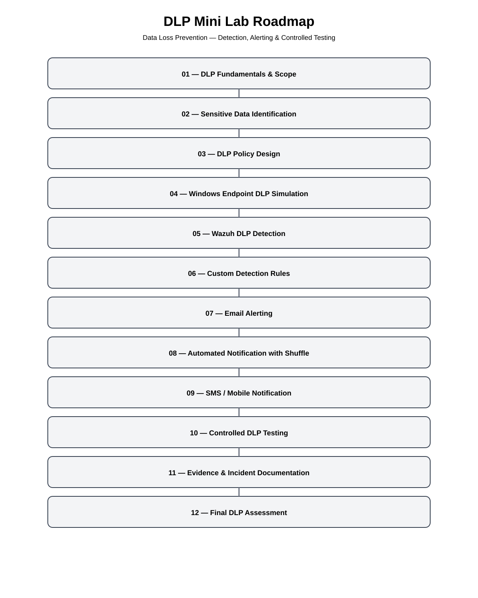


## DLP Roadmap

- [01 - DLP Fundamentals & Scope](#dlp-fundamentals--scope)
- [02 - Sensitive Data Identification](#sensitive-data-identification)
- [03 - DLP Policy Design](#dlp-policy-design)
- [04 - Windows Endpoint DLP Simulation](#windows-endpoint-dlp-simulation)
- [05 - Wazuh DLP Detection](#wazuh-dlp-detection)
- [06 - Custom Detection Rules](#custom-detection-rules)
- [07 - Email Alerting](#email-alerting)
- [08 - Automated Notification with Shuffle](#automated-notification-with-shuffle)
- [09 - SMS / Mobile Notification](#sms--mobile-notification)
- [10 - Controlled DLP Testing](#controlled-dlp-testing)
- [11 - Evidence & Incident Documentation](#evidence--incident-documentation)
- [12 - Final DLP Assessment](#final-dlp-assessment)

---


## DLP Fundamentals & Scope

### Objectives

The objective of this lab was to build a practical understanding of Data Loss Prevention concepts and implement a controlled DLP environment using endpoint monitoring, security detection and automated notification.

The lab focused on:

- Sensitive data identification
- Endpoint DLP controls
- Data classification
- Removable storage monitoring
- Clipboard monitoring
- SIEM-based detection
- Automated security notifications
- Controlled data-loss scenarios
- Evidence collection and incident documentation

### Scope

The laboratory environment was designed as a controlled security testing environment using synthetic sensitive data.

The primary components were:

- ManageEngine DataSecurity Plus
- Wazuh
- Shuffle
- Windows 11
- Windows Server / Active Directory
- Ubuntu Server
- Postfix
- Gmail

The objective was not to reproduce every capability of an enterprise DLP platform, but to validate representative DLP, detection and response workflows in a controlled environment.

### DLP Data Classification

Synthetic test data was classified using DataSecurity Plus.

The main classification used during controlled testing was:

```text
Restricted
```

A synthetic test file was used:

```text
DLP-USB-Restricted-Test.txt
```

### DLP Threat Scenarios

The lab considered several potential data-loss scenarios:

- Email exfiltration
- USB / removable media
- Clipboard copy
- Cloud storage
- Web upload
- Printing
- SMB / network shares
- External storage
- Compressed files
- File renaming and extension manipulation
- Repeated exfiltration attempts

Not every scenario was implemented because some controls or external services were not available in the laboratory environment.

[Back to Roadmap](#dlp-roadmap)

---


## Sensitive Data Identification

### Test Data

Synthetic data was used throughout the laboratory to avoid exposing real personal or confidential information.

Example:

```text
DLP_USB_TEST
Name: Ana Test
DNI: 12345678X
Email: ana.test@example.local
```

The main test file was:

```text
DLP-USB-Restricted-Test.txt
```

### Sensitive Data Categories

The laboratory focused on representative sensitive-data concepts including:

- Personally identifiable information
- Identity information
- Email addresses
- Synthetic user information
- Sensitive files requiring controlled handling

### Detection Patterns

The DLP environment was designed to identify sensitive information through:

- Data classification
- DLP policies
- Endpoint activity monitoring
- Custom detection rules
- SIEM event analysis

[Back to Roadmap](#dlp-roadmap)

---


## DLP Policy Design

### Policy Objectives

The DLP policies were designed to provide controlled monitoring of potentially sensitive data transfers.

The main objectives were:

- Identify sensitive data
- Monitor data movement
- Detect removable-media activity
- Monitor clipboard file-copy activity
- Generate security events
- Provide evidence for investigation

### Policy Rules

The laboratory included controls for:

- Sensitive data classification
- Removable storage activity
- USB file operations
- Clipboard file-copy activity
- DLP alert conditions

### Detection Conditions

One of the USB alert profiles used the following conditions:

```text
Action              -> File Paste
File Classification -> Restricted
USB Event           -> True
```

These conditions were used to evaluate whether a sensitive file transfer to removable storage would generate an alert.

Depending on the control being tested, possible responses included:

- Audit
- Allow
- Block
- Email notification
- SIEM detection
- Automated notification

[Back to Roadmap](#dlp-roadmap)

---


## Windows Endpoint DLP Simulation

### Endpoint Configuration

The Windows endpoint used for testing was:

```text
WIN11-CLIENT01
```

The endpoint was monitored by DataSecurity Plus and Wazuh.

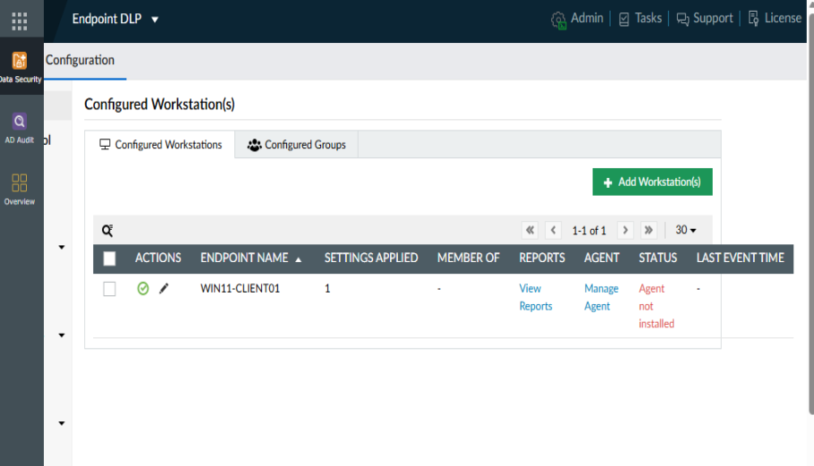

### Test Environment

The Windows endpoint was used to perform controlled DLP activities using synthetic test data.

Testing included:

- USB file transfers
- File classification
- Clipboard file copies
- Endpoint activity monitoring

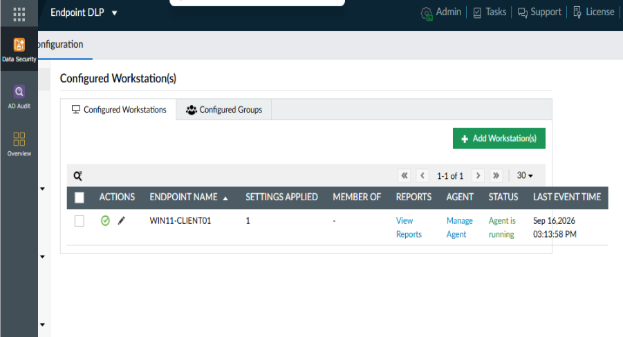

### Initial Validation

Initial validation confirmed that:

- The endpoint was communicating with the DLP platform.
- Synthetic files could be classified.
- USB activity was being audited.
- Clipboard file-copy activity was being recorded.

[Back to Roadmap](#dlp-roadmap)

---


## Wazuh DLP Detection

### Endpoint Monitoring

Wazuh was deployed as the SIEM and detection layer.

The Windows endpoint was connected to the Wazuh manager and generated security events that could be investigated through the Wazuh platform.

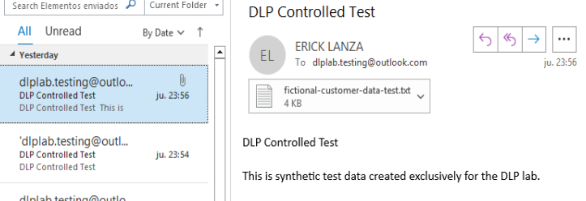

### File Activity

DLP-related Windows activity was collected and investigated through Wazuh.

This provided an additional detection layer alongside DataSecurity Plus.

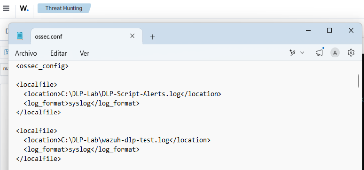

### USB Activity

USB-related DLP events were investigated during controlled testing.

The lab demonstrated the difference between:

```text
Endpoint DLP auditing
```

and:

```text
SIEM-based detection
```

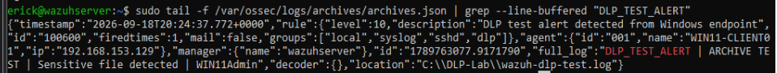

### Security Events

Wazuh successfully received DLP-related Windows events.

The events were used to validate custom DLP detection logic and support the automated notification workflow.

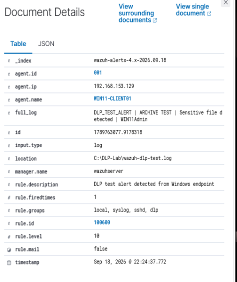

[Back to Roadmap](#dlp-roadmap)

---


## Custom Detection Rules

### Detection Logic

A custom Wazuh rule was created to identify synthetic DLP-sensitive-data events.

The detection logic searched for:

```text
DLP_SENSITIVE_DATA
```

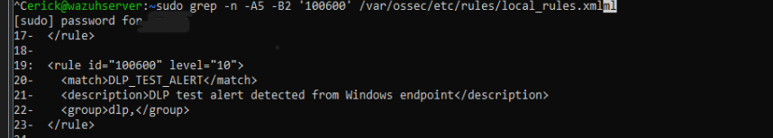

### Custom Rules

The main custom rule was:

```xml
<rule id="100601" level="12">
  <match>DLP_SENSITIVE_DATA</match>
  <field name="win.eventdata.data">DLP_SENSITIVE_DATA</field>
  <description>DLP sensitive data exposure detected on Windows endpoint</description>
  <group>dlp,sensitive_data,</group>
</rule>
```

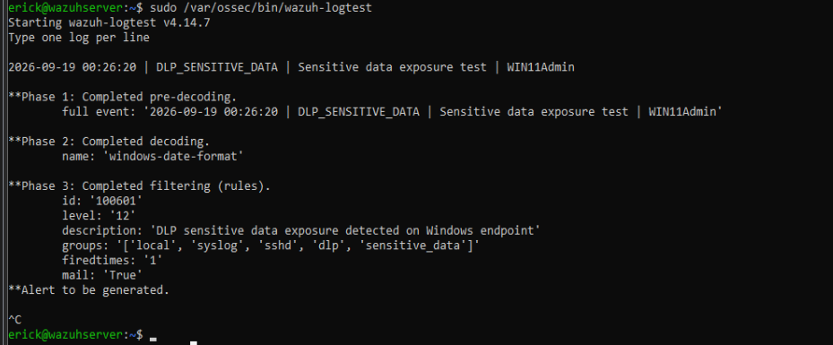

### Alert Validation

The rule was successfully validated using Wazuh Logtest.

Validation confirmed:

```text
Rule ID: 100601
Level: 12
Group: dlp,sensitive_data
```

The live processing path did not produce the expected automatic `100601` alert notification during testing, although the DLP event was present in Wazuh archives and the rule matched successfully in Logtest.

This difference between rule validation and live alert generation was documented as a technical limitation.

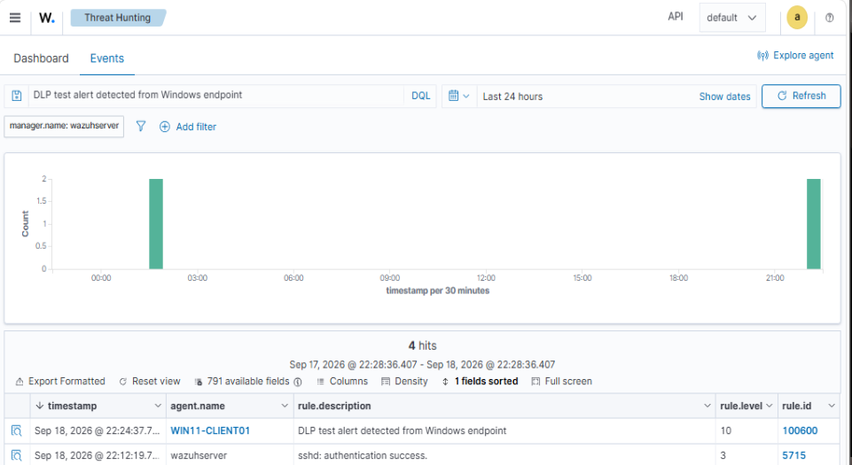

[Back to Roadmap](#dlp-roadmap)

---


## Email Alerting

### Email Alert Configuration

Postfix was configured on the Wazuh server as an internal SMTP relay.

DataSecurity Plus was also configured to use the SMTP service for notification testing.

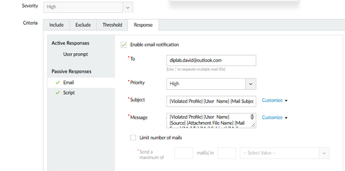

### DLP Alert Workflow

The intended notification architecture was:

```text
DLP Event
    v
Wazuh
    v
Detection
    v
Notification
    v
Email
```

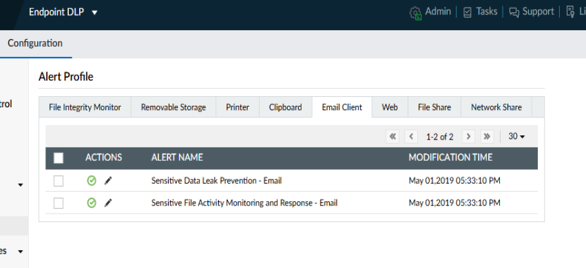

### Alert Validation

The SMTP infrastructure was successfully validated.

DataSecurity Plus successfully sent test messages through the configured mail server.

The expected automatic Wazuh `100601` email alert was not produced during live processing, despite successful rule validation with Wazuh Logtest and confirmed event ingestion.

This was documented as a technical limitation rather than treated as a successful automatic alert.

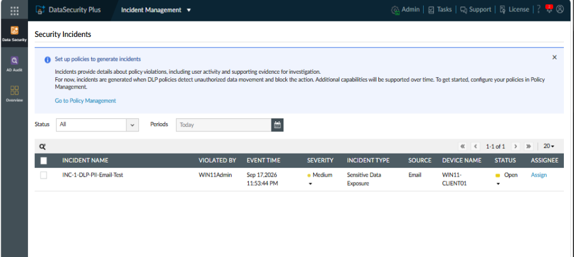

[Back to Roadmap](#dlp-roadmap)

---


## Automated Notification with Shuffle

### Shuffle Integration

Shuffle was deployed on a dedicated Ubuntu Server VM.

The workflow was created as:

```text
DLP Sensitive Data Notification
```

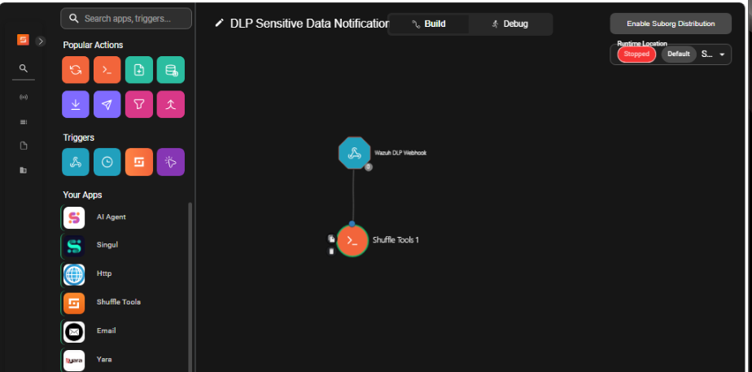

### Automation Workflow

The final workflow was:

```text
Wazuh DLP Webhook
        v
Shuffle Tools
        v
Execute Python
        v
Postfix SMTP Relay
        v
Gmail
```

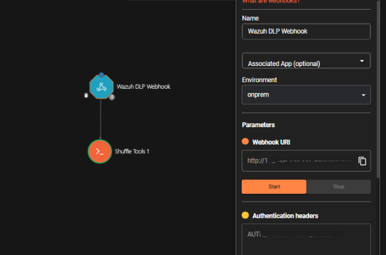

### Alert Processing

Shuffle received a webhook containing the DLP event data.

Python was used to:

- Parse the JSON payload
- Extract the event data
- Generate an email
- Connect to the Postfix SMTP relay
- Send the notification

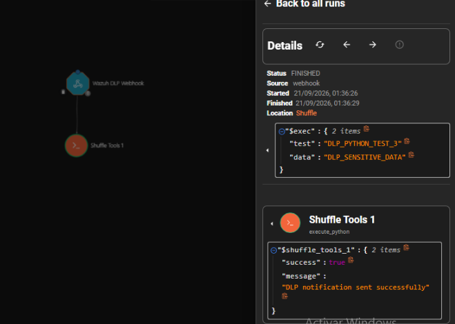

### Notification Validation

The workflow completed successfully.

The execution returned:

```text
Status: FINISHED
```

The Python action returned:

```text
DLP notification sent successfully
```

The resulting email was successfully received.

This validated the following workflow:

```text
DLP Event
    v
Webhook
    v
Shuffle
    v
Python
    v
Postfix
    v
Gmail
```

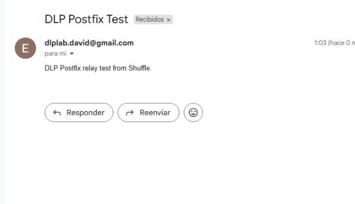

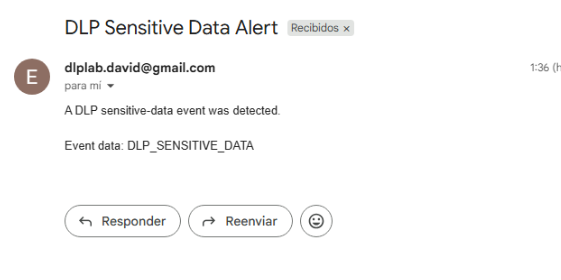

[Back to Roadmap](#dlp-roadmap)

---


## SMS / Mobile Notification

### SMS Integration

SMS notification was investigated using available Shuffle integrations and external SMS providers.

### Notification Workflow

The intended architecture was:

```text
DLP Event
    v
Wazuh
    v
Shuffle
    v
SMS Provider
    v
Mobile Notification
```

### Alert Validation

SMS notification was not implemented.

The available providers introduced external account, verification or provider-specific requirements that were outside the scope of the laboratory.

No payment was made and no production SMS service was deployed.

**Result:**

```text
Not implemented - documented limitation.
```

[Back to Roadmap](#dlp-roadmap)

---


## Controlled DLP Testing

### Test Methodology

Controlled DLP tests used synthetic sensitive data and were performed only against the laboratory environment.

For each scenario, the following aspects were considered:

```text
Scenario
    v
Sensitive Data
    v
Action Attempted
    v
DLP Control
    v
Detection / Audit
    v
Block / Allow
    v
Alert
    v
Evidence
```

### Email Exfiltration

Email-related DLP and notification workflows were investigated during the earlier stages of the laboratory.

The project also validated email notification infrastructure through the:

```text
Wazuh -> Shuffle -> Postfix -> Gmail
```

workflow.

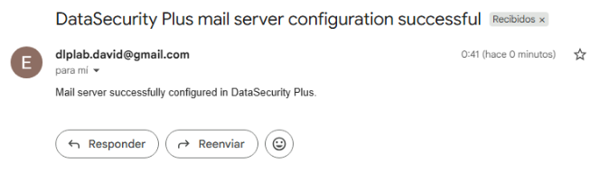

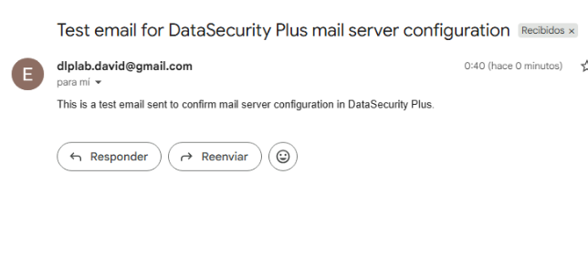

### USB / Removable Media

**Result: Validated**

DataSecurity Plus successfully audited USB activity.

The test file:

```text
DLP-USB-Restricted-Test.txt
```

was classified as:

```text
Restricted
```

and copied to removable storage.

The activity was recorded as:

```text
File Pasted
```

The report also recorded source and destination information.

The configured USB alert profile did not generate the expected automatic email notification during the controlled test. USB activity auditing itself was successful.

### Cloud Storage

**Result: Not implemented**

No dedicated cloud-storage client was configured on the Windows endpoint.

### Web Upload

**Result: Not implemented**

The available DataSecurity Plus configuration did not provide a dedicated web-upload control suitable for the planned test.

### Copy / Paste

**Result: Validated**

A custom Clipboard Control profile was created:

```text
DLP-Clipboard-Test
```

The profile was configured to audit file-copy attempts.

DataSecurity Plus recorded:

```text
File Copied
```

with the result:

```text
File/folder copy action allowed via clipboard control profile.
```

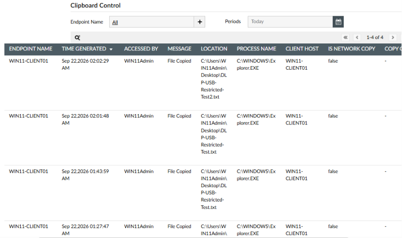

### Printing

**Result: Not implemented**

Printer testing was not completed because it was not required to demonstrate the primary DLP architecture.

### SMB / Network Share

**Result: Partially tested**

An existing DC01 SMB share was tested.

Network connectivity to SMB was confirmed, but the Windows endpoint received:

```text
System error 5
Access denied
```

The test was not extended by changing server permissions solely for the DLP laboratory.

### External Storage

External removable storage was covered through the USB / Removable Storage tests.

### Compressed Files

**Result: Not implemented**

A dedicated compressed-file scenario was not completed.

### File Renaming / Extension Changes

Rename activity was observed during USB testing and recorded by DataSecurity Plus.

A dedicated independent extension-manipulation test was not completed.

### Unauthorized Applications

**Result: Not implemented**

No dedicated unauthorized-application DLP scenario was implemented.

### Repeated Exfiltration Attempts

**Result: Not implemented**

No dedicated repeated-exfiltration scenario was implemented.

### Test Results

| Scenario | Result |
|---|---|
| USB / Removable Storage | Validated |
| Restricted Classification | Validated |
| Clipboard Copy | Validated |
| Email Notification Infrastructure | Validated |
| Wazuh DLP Detection | Validated |
| Shuffle Automation | Validated |
| Cloud Storage | Not implemented |
| Web Upload | Not implemented |
| Printing | Not implemented |
| SMB / Network Share | Partially tested |
| Compressed Files | Not implemented |
| Extension Manipulation | Partially observed |
| Unauthorized Applications | Not implemented |
| Repeated Exfiltration | Not implemented |
| SMS Notification | Not implemented |

[Back to Roadmap](#dlp-roadmap)

---


## Evidence & Incident Documentation

### Evidence Collection

Evidence was collected throughout the laboratory using screenshots of:

- DLP configuration
- Sensitive data classification
- USB activity
- Clipboard activity
- Wazuh events
- Custom detection rules
- Shuffle workflows
- Workflow executions
- SMTP configuration
- Email notification results

The evidence set was organized in the `screenshots/` directory and referenced from the relevant sections of this README.

Only screenshots that actually exist in the final repository are listed below.

### Incident Documentation

The laboratory documented both successful and unsuccessful test results.

Examples include:

- Successful USB activity auditing
- Successful Restricted classification
- Successful Clipboard auditing
- Successful Wazuh detection
- Successful Shuffle automation
- Successful SMTP notification
- Wazuh `100601` live-alert limitation
- USB alert notification limitation
- SMB access limitation
- Unimplemented cloud, web, printer and SMS scenarios

Where a control did not behave as expected, the result was documented as a limitation rather than treated as a successful detection.

### Alert Evidence

#### DLP 1-4

```text
screenshots/phase-dlp-domain-configuration.png
screenshots/phase-dlp-dns-validation.png
screenshots/phase-dlp-win11-agent-running.png
screenshots/phase-dlp-win11-workstation-configured.png
screenshots/phase-dlp-win11-agent-communication.png
screenshots/phase-dlp-data-leak-prevention-policy.png
```

#### DLP 5 - Wazuh DLP Detection

```text
screenshots/phase-dlp-wazuh-agent-connectivity.png
screenshots/phase-dlp-wazuh-agent-log-collection.png
screenshots/phase-dlp-wazuh-archive-event-100600.png
screenshots/phase-dlp-wazuh-event-details-100600.png
```

#### DLP 6 - Custom Detection Rules

```text
screenshots/phase-dlp-wazuh-custom-rule-100600.png
screenshots/phase-dlp-wazuh-custom-rule-100601.png
screenshots/phase-dlp-wazuh-dashboard-alert-100600.png
```

#### DLP 7 - Email Alerting

```text
screenshots/phase-dlp-email-notification-configuration.png
screenshots/phase-dlp-email-alert-profiles.png
screenshots/phase-dlp-email-incident.png
screenshots/phase-dlp-email-test-preparation.png
screenshots/phase-dlp-email-warning.png
screenshots/phase-dlp-script-log.png
```

#### DLP 8 - Shuffle Automation

```text
screenshots/dlp-8-Shuffle-DLP-Notification-Workflow.png
screenshots/dlp-8-Shuffle-Wazuh-Webhook-Configuration.png
screenshots/dlp-8-Shuffle-Successful-Workflow-Execution.png
screenshots/dlp-8-Postfix-Email-Delivery-Test.png
screenshots/dlp-8-DLP-Email-Notification-Received.png
```

#### DLP 10 - Controlled DLP Testing

```text
screenshots/dlp-10-Clipboard-File-Copy-Audit-Event.png
screenshots/dlp-10-DataSecurity-Plus-Mail-Server-Configured.png
screenshots/dlp-10-DataSecurity-Plus-SMTP-Test-Email.png
```

The DLP 10 evidence inventory intentionally does not list USB screenshots because no dedicated USB screenshots were captured for the final evidence set.

### Screenshot Review Before Publication

Before public publication, screenshots should be reviewed for:

- Private IP addresses
- Email addresses
- Webhook URLs
- Authentication headers
- API keys
- Passwords
- Tokens
- Internal infrastructure information
- Personal identifiers

Synthetic data was used during testing.

[Back to Roadmap](#dlp-roadmap)

---


## Final DLP Assessment

### Security Findings

The laboratory successfully demonstrated that endpoint DLP controls can provide visibility into sensitive-data activity and that DLP events can be integrated with a SIEM and automation platform.

Key validated findings included:

- Sensitive files can be classified as `Restricted`.
- USB file activity can be audited.
- Clipboard file-copy activity can be audited.
- Wazuh can detect custom DLP events.
- Shuffle can process DLP events.
- Python can automate notification logic.
- Postfix can provide an internal SMTP relay.
- Email notifications can be delivered successfully.

### DLP Coverage

The laboratory achieved representative DLP coverage rather than complete enterprise feature coverage.

Validated controls included:

```text
Sensitive Data Classification
USB Monitoring
Clipboard Monitoring
SIEM Detection
Custom Detection Rules
SOAR Automation
Email Notification
```

Several additional scenarios were not implemented because the required services or controls were not available in the laboratory environment.

### Detection & Response

The validated detection and response architecture was:

```text
Endpoint Activity
       v
DataSecurity Plus
       v
DLP Event
       v
Wazuh
       v
Shuffle
       v
Python
       v
Postfix
       v
Email Notification
```

This demonstrated how endpoint DLP activity can be integrated into a broader security monitoring and response workflow.

### Limitations

The main limitations identified during the project were:

- No dedicated cloud-storage client
- No dedicated web-upload DLP control
- Printer testing not completed
- SMB test affected by access permissions
- SMS integration not implemented
- USB alert profile did not generate the expected notification
- Wazuh live processing did not generate the expected automatic `100601` email alert
- Several advanced exfiltration scenarios were outside the available laboratory configuration

These limitations were documented rather than hidden.

### Recommendations

For a future version of the laboratory, possible improvements include:

- Integrating a cloud-storage platform
- Expanding web activity controls
- Adding printer DLP controls
- Creating a dedicated SMB test account and share
- Testing additional exfiltration channels
- Integrating a production-grade SMS provider
- Expanding automated incident response
- Comparing multiple DLP platforms
- Extending the environment toward an enterprise-style architecture

### Final Assessment

The DLP Mini Lab successfully demonstrated the core principles of:

```text
Identify
   v
Classify
   v
Monitor
   v
Detect
   v
Automate
   v
Notify
   v
Document
```

The project also demonstrated an important security engineering principle:

> A security control should be tested, its behavior validated, and its limitations documented rather than assumed.

The final laboratory therefore represents a practical DLP security engineering exercise combining endpoint controls, SIEM detection, automation and incident notification.

---

[Back to Roadmap](#dlp-roadmap)

