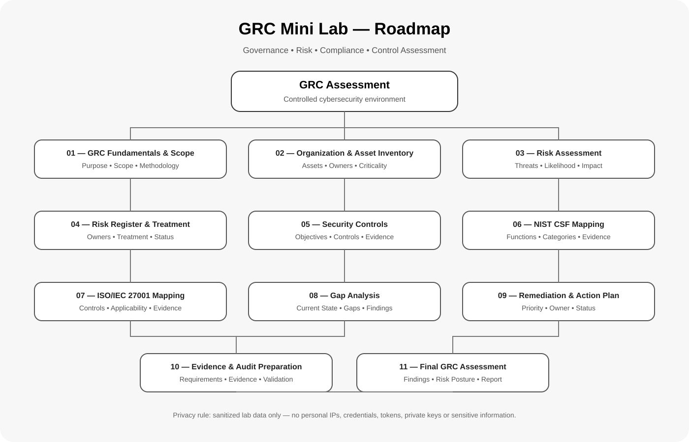
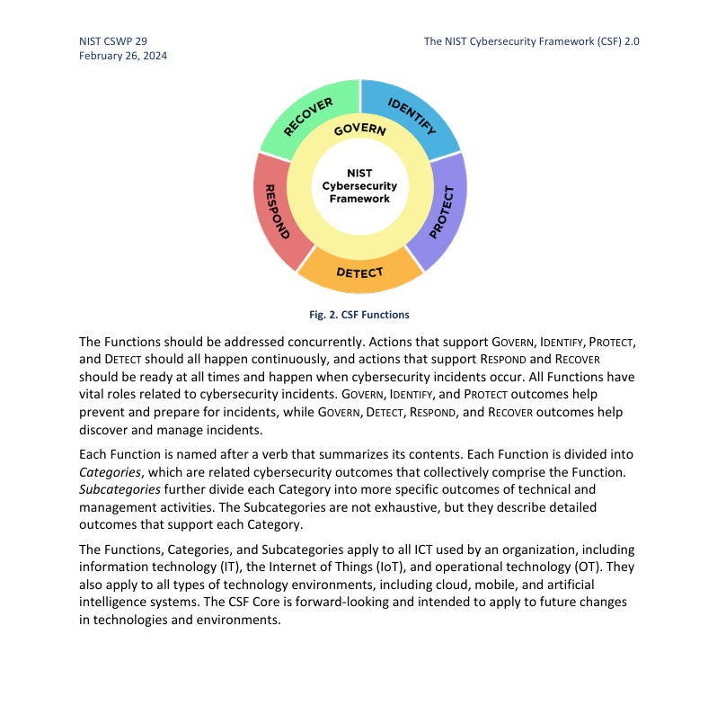
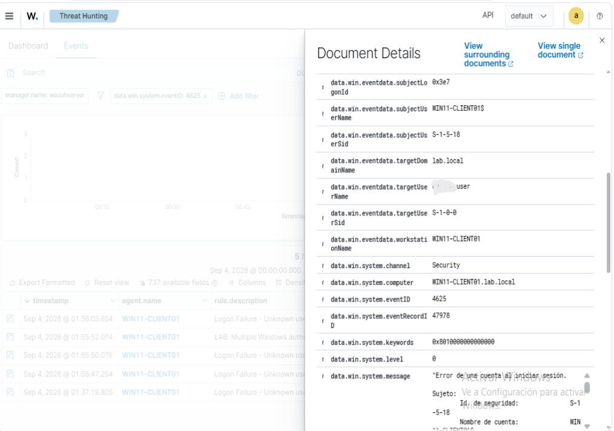
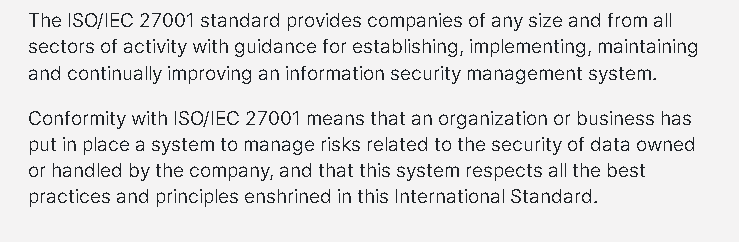
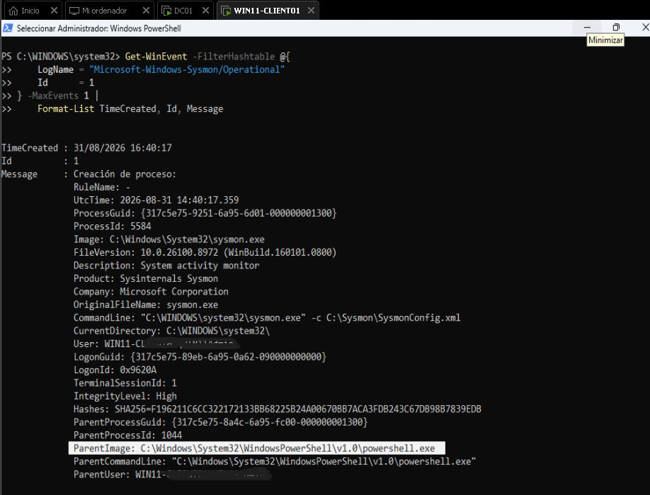
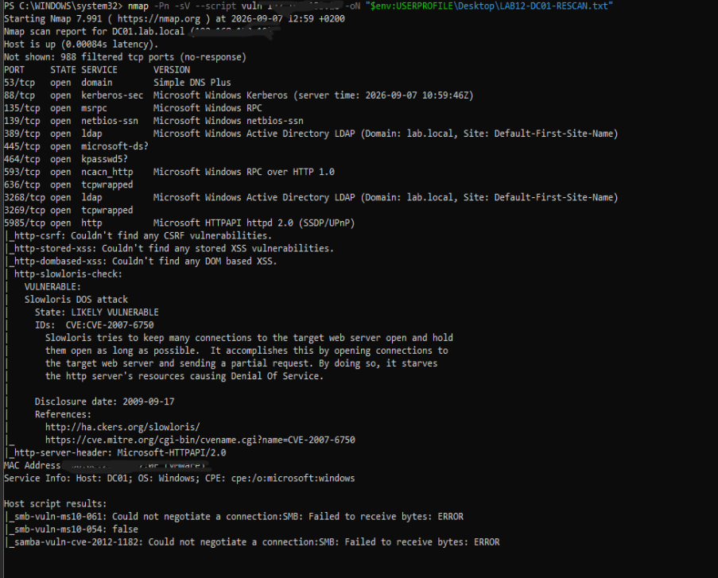
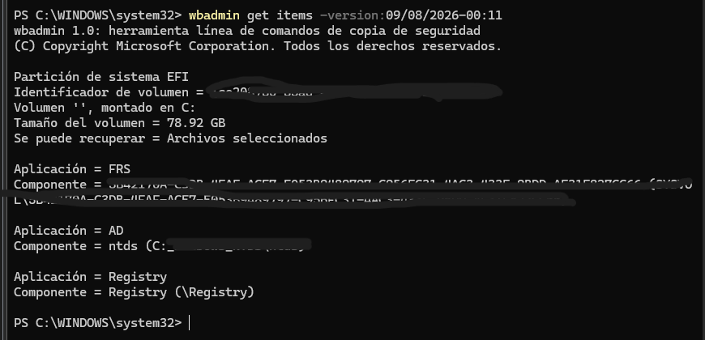
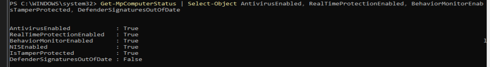

# GRC Mini Lab — Governance, Risk & Compliance

## GRC Roadmap



### Roadmap

1. [GRC Fundamentals & Scope](#grc-01)
2. [Organization & Asset Inventory](#grc-02)
3. [Risk Assessment](#grc-03)
4. [Risk Register & Risk Treatment](#grc-04)
5. [Security Controls](#grc-05)
6. [NIST CSF Control Mapping](#grc-06)
7. [ISO/IEC 27001 Control Mapping](#grc-07)
8. [Gap Analysis](#grc-08)
9. [Remediation & Action Plan](#grc-09)
10. [GRC Evidence & Audit Preparation](#grc-10)
11. [Final GRC Assessment Report](#grc-11)


## Overview

This GRC Mini Lab applies Governance, Risk and Compliance principles to a controlled cybersecurity environment.

The project focuses on practical GRC activities including security risk assessment, risk treatment, security control assessment, framework mapping, gap analysis, remediation planning, evidence preparation and final reporting.

The lab is designed to complement the technical experience developed through the cybersecurity Home Lab and demonstrate how technical security controls can be translated into governance, risk and compliance activities.

## Privacy & Data Handling

All information used in this project must be safe for public documentation.

The following must **never** be included in the project:

- Personal or real IP addresses
- Real usernames or personal identifiers
- Passwords or credentials
- API keys or access tokens
- Private keys or sensitive certificates
- Personal email addresses
- Real network details that could expose the private environment
- Other confidential or sensitive information

Where realistic examples are required, use fictional organizations, sanitized values and safe lab placeholders.

This privacy review is performed during each section of the lab rather than as a final cleanup step.

## GRC Assessment Model

The practical workflow used throughout the project is:

```text
Risk
  ↓
Control
  ↓
Evidence
  ↓
Gap
  ↓
Remediation
  ↓
Validation
  ↓
Report
```

## Assessment Flow

### Governance

Define the organization, scope, objectives, responsibilities and security expectations.

### Risk

Identify assets, threats and vulnerabilities, evaluate likelihood and impact, and determine risk levels.

### Compliance

Map relevant security controls and requirements to recognized cybersecurity frameworks and evaluate their implementation.

### Control Assessment

Review whether controls are implemented, partially implemented or not implemented and identify supporting evidence.

### Gap Analysis

Compare the expected security posture with the current state and document identified gaps and findings.

### Remediation

Develop prioritized remediation actions with ownership, target dates and status.

### Evidence & Audit Preparation

Organize evidence that demonstrates whether security requirements and controls are implemented and operating as intended.

### Final Assessment

Consolidate the assessment into a final report covering findings, risk posture, remediation priorities and limitations.

## Methodology

The lab will use a practical, risk-based approach combining:

- Asset identification
- Risk assessment
- Risk treatment
- Security control assessment
- NIST CSF mapping
- ISO/IEC 27001 mapping
- Gap analysis
- Remediation planning
- Evidence validation
- Final reporting

The assessment will remain within a controlled laboratory scenario and will not claim professional GRC employment experience.

## Documentation Standard

## Documentation Standard

The GRC Mini Lab is documented using a single centralized `README.md`.

The README contains all 11 assessment sections in a consistent structure, supported by the roadmap, technical evidence, GRC documentation and framework references.

Evidence will be included only when it materially supports the work performed.

```text
Objective
Scope / Context
Practical Work
Findings / Results
Evidence
Conclusion
Back to Roadmap
```

Evidence will be included only when it materially supports the work performed.

## Project Structure

```text
GRC-Mini-Lab/
│
├── README.md
├── Assets/
│   └── grc-mini-lab-roadmap.svg
└── Screenshots/
    └── [sanitized evidence]
```

## Project Objective

The final outcome is a documented practical GRC assessment demonstrating the ability to:

- Identify and assess cybersecurity risks
- Evaluate security controls
- Map controls to recognized frameworks
- Identify compliance and control gaps
- Recommend risk-based remediation actions
- Organize supporting evidence
- Communicate security findings clearly


<a id="grc-01"></a>
## GRC Fundamentals & Scope

### Organization

The GRC assessment is performed for a fictional organization named **SecureLab Solutions**.

SecureLab Solutions is a small technology company that relies on Windows-based infrastructure, centralized identity management, network services, file sharing, endpoint security and centralized security monitoring.

The organization is used exclusively as a simulated environment for this GRC assessment. No real company, customer or production environment is represented.

### GRC Overview

Governance, Risk and Compliance (GRC) provides a structured approach for managing information security within an organization.

**Governance** establishes security objectives, responsibilities, policies and decision-making processes.

**Risk Management** identifies and evaluates potential threats to organizational assets and determines appropriate actions to reduce risk to an acceptable level.

**Compliance** evaluates whether security controls and processes align with applicable requirements, policies and recognized security frameworks.

In this lab, GRC activities are connected to the technical cybersecurity controls and security practices developed throughout the 14-lab Cybersecurity Home Lab. These include identity and access management, Active Directory and Group Policy, network security, endpoint protection, security monitoring, vulnerability management, backup and recovery, and security assessment.

The technical work from the 14-lab Home Lab is used as a practical reference for evaluating security controls, identifying risks, analyzing gaps and developing remediation actions.

### Assessment Purpose

The purpose of this assessment is to evaluate the security posture of SecureLab Solutions from a Governance, Risk and Compliance perspective.

The assessment will identify relevant assets, evaluate security risks, review existing security controls, identify gaps against recognized security frameworks and define appropriate remediation actions.

The assessment uses the technical implementation and security practices developed throughout the 14-lab Cybersecurity Home Lab as the primary technical reference.

The objective is to demonstrate how technical security controls can be evaluated within a structured GRC process and how identified risks can be translated into documented findings and actionable improvements.

### Assessment Scope

The assessment covers the core information security processes and technical controls relevant to the SecureLab Solutions environment.

The scope includes identity and access management, Windows infrastructure, network security, endpoint protection, security monitoring, vulnerability management, backup and recovery, and security assessment activities.

The assessment is limited to the simulated SecureLab Solutions environment and the technical capabilities developed throughout the 14-lab Cybersecurity Home Lab.

Cloud infrastructure, third-party services, physical security and real-world production systems are outside the scope of this assessment.

### Assessment Boundaries

The assessment is limited to the simulated systems, processes and security controls represented within the SecureLab Solutions environment.

The assessment considers the security capabilities implemented and tested throughout the 14-lab Cybersecurity Home Lab, including identity management, access control, network security, endpoint protection, security monitoring, vulnerability management, backup and recovery, and security assessment.

The assessment does not include physical security, third-party environments, cloud infrastructure, external service providers or production systems.

All assessment activities are performed within the controlled laboratory environment and are intended for educational and portfolio purposes.

### Assessment Assumptions

The assessment assumes that the SecureLab Solutions environment is operated according to the documented configurations and security practices established throughout the 14-lab Cybersecurity Home Lab.

The assessment assumes that the available technical evidence accurately represents the security controls implemented within the simulated environment.

Where complete evidence is not available, the control will be treated as requiring further validation rather than being assumed to be fully effective.

The assessment is based on the information and evidence available during the execution of the GRC Mini Lab. Changes to the environment after the assessment may require the relevant risks, controls and findings to be reassessed.

### Assessment Criteria

The assessment will evaluate whether relevant security risks are identified, documented and addressed through appropriate security controls.

The assessment criteria will consider the presence, relevance and effectiveness of security controls within the defined scope.

Controls will be evaluated based on available technical evidence, documented configurations, security practices and the results of security testing performed within the laboratory environment.

Identified weaknesses or gaps will be documented as findings and considered during risk evaluation and remediation planning.

### Assessment Methodology

The assessment follows a structured process to identify, evaluate and address information security risks within the defined scope.

The methodology consists of identifying relevant assets, identifying potential threats and vulnerabilities, evaluating associated risks, reviewing existing security controls, identifying control gaps and defining appropriate remediation actions.

Technical evidence from the 14-lab Cybersecurity Home Lab will be used where applicable to support the assessment of existing controls and security practices.

Recognized security frameworks will be used as reference points during the control mapping and gap analysis stages of the assessment.

### Assessment Deliverables

The GRC Mini Lab will produce a set of documented outputs covering the main stages of the assessment.

These outputs will include an asset inventory, risk assessment, risk register, security control review, framework mappings, gap analysis, remediation plan, supporting evidence and a final GRC assessment report.

The deliverables are intended to demonstrate a complete GRC workflow from initial scope definition through risk identification, control evaluation, remediation planning and final reporting.


⬆️ [Back to Roadmap](#grc-roadmap)


<a id="grc-02"></a>
## Organization & Asset Inventory

### Asset Identification

The first step of the asset inventory is to identify the systems, services and resources that support the SecureLab Solutions environment.

The inventory is based on the technical environment developed throughout the 14-lab Cybersecurity Home Lab. Assets are identified according to their role within the environment and their relevance to information security.

The identified assets include infrastructure servers, client systems, identity and authentication services, network services, file-sharing resources, endpoint security components, security monitoring infrastructure and backup resources.

Each asset will be documented according to its function, security relevance and relationship with the organization's business and security processes.

### Asset Inventory

The following assets are identified within the SecureLab Solutions environment based on the technical infrastructure and security capabilities developed throughout the 14-lab Cybersecurity Home Lab.

| Asset | Type | Function | Related LAB |
|---|---|---|---|
| DC01 | Windows Server | Active Directory, DNS and domain services | LAB 1–3 |
| WIN11-CLIENT01 | Windows Endpoint | Domain-joined workstation | LAB 4 |
| File Shares | File Services | SMB file sharing and access control | LAB 5 |
| Network Infrastructure | Network Services | TCP/IP, DNS, DHCP and firewall services | LAB 6 |
| Windows Security Controls | Endpoint Security | Defender, Firewall and security hardening | LAB 7 |
| Windows Event Logs | Security Monitoring | Security event collection and analysis | LAB 8 |
| Security Operations Processes | SOC | Security investigation and event analysis | LAB 9 |
| Sysmon | Endpoint Monitoring | Detailed endpoint telemetry | LAB 10 |
| WAZUH-SERVER | Security Monitoring | SIEM, log analysis and detection | LAB 11 |
| Vulnerability Management | Security Management | Vulnerability identification and remediation | LAB 12 |
| Backup Resources | Recovery | Backup and recovery capabilities | LAB 13 |
| Security Assessment | Security Assessment | Security testing and final assessment activities | LAB 14 |

The inventory provides the foundation for the subsequent risk assessment by identifying the assets that may require protection and evaluation.

### Asset Classification

Assets are classified according to their importance to the security and operation of the SecureLab Solutions environment.

| Asset | Classification | Rationale |
|---|---|---|
| DC01 | High | Provides centralized identity, authentication, DNS and domain services. |
| WIN11-CLIENT01 | Medium | Represents a user endpoint and is part of the organization's domain environment. |
| File Shares | High | Store and provide access to organizational files and are protected through SMB and NTFS permissions. |
| Network Infrastructure | High | Supports communication between systems and provides essential network and security services. |
| Windows Security Controls | High | Protect endpoints against threats and enforce security policies. |
| Windows Event Logs | Medium | Provide security telemetry required for investigation and monitoring. |
| Security Operations Processes | Medium | Support the identification, investigation and handling of security events. |
| Sysmon | Medium | Provides detailed endpoint telemetry used for security monitoring and investigation. |
| WAZUH-SERVER | High | Provides centralized security monitoring, log analysis and detection capabilities. |
| Vulnerability Management | High | Supports the identification and remediation of security weaknesses. |
| Backup Resources | High | Support recovery of critical systems and data following security or operational incidents. |
| Security Assessment | Medium | Supports the identification of weaknesses and validation of security controls. |

The classification provides an initial indication of asset importance and will be considered during the subsequent risk assessment.

### Asset Ownership & Responsibility

Each asset within the SecureLab Solutions environment should have a defined owner or responsible role to ensure that its security and operational requirements are properly managed.

For this simulated environment, ownership is assigned according to the function and security responsibility associated with each asset.

| Asset | Responsible Role | Responsibility |
|---|---|---|
| DC01 | IT / System Administrator | Manage Active Directory, DNS, authentication and domain services. |
| WIN11-CLIENT01 | IT / Endpoint Administrator | Maintain endpoint configuration, security and domain connectivity. |
| File Shares | IT / System Administrator | Manage file access, permissions and data availability. |
| Network Infrastructure | Network Administrator | Maintain network connectivity, DNS, DHCP and firewall services. |
| Windows Security Controls | Security Administrator | Maintain endpoint protection, firewall and security policies. |
| Windows Event Logs | Security Analyst | Review security events and support security investigations. |
| Security Operations Processes | Security Analyst | Investigate security events and coordinate security response activities. |
| Sysmon | Security Analyst | Maintain endpoint telemetry and support security investigations. |
| WAZUH-SERVER | Security Analyst / SIEM Administrator | Maintain centralized monitoring, detection rules and security alerts. |
| Vulnerability Management | Security Analyst | Identify, assess, prioritize and track security vulnerabilities. |
| Backup Resources | IT / System Administrator | Maintain backup availability and support recovery activities. |
| Security Assessment | Security Analyst | Perform security testing and document assessment findings. |

Defining ownership establishes accountability for the protection, maintenance and security of each asset and provides a basis for subsequent risk treatment and remediation activities.

### Asset Criticality

Asset criticality represents the potential importance of each asset to the confidentiality, integrity and availability of the SecureLab Solutions environment.

The following initial criticality assessment is based on the role of each asset within the simulated environment.

| Asset | Criticality | Primary Security Concern |
|---|---|---|
| DC01 | Critical | Loss or compromise could affect identity, authentication, DNS and domain-wide services. |
| WIN11-CLIENT01 | Medium | Compromise could affect endpoint security and provide a potential path to other resources. |
| File Shares | High | Unauthorized access, modification or loss could affect the confidentiality and integrity of organizational data. |
| Network Infrastructure | High | Disruption or compromise could affect communication and access to multiple systems. |
| Windows Security Controls | High | Weak or disabled controls could increase exposure to endpoint-based threats. |
| Windows Event Logs | Medium | Loss or manipulation of logs could reduce visibility during security investigations. |
| Security Operations Processes | Medium | Ineffective processes could delay the identification and response to security events. |
| Sysmon | Medium | Loss of telemetry could reduce visibility into endpoint activity. |
| WAZUH-SERVER | Critical | Loss or compromise could significantly reduce centralized security monitoring and detection capabilities. |
| Vulnerability Management | High | Failure to identify or remediate vulnerabilities could increase the organization's exposure to attacks. |
| Backup Resources | Critical | Loss or corruption of backups could significantly affect recovery following an incident. |
| Security Assessment | Medium | Inadequate assessment activities could result in security weaknesses remaining unidentified. |

This initial criticality assessment will be used as an input to the risk assessment process. Final risk ratings will also consider the likelihood of a threat occurring and the potential impact of a security event.

### Asset Inventory Summary

The asset inventory establishes a structured view of the systems, services and security capabilities that support the SecureLab Solutions environment.

The identified assets have been classified according to their importance, assigned responsible roles and given an initial criticality rating.

This inventory provides the foundation for the next stage of the GRC assessment, where threats, vulnerabilities, likelihood and potential impact will be evaluated to determine the associated security risks.

The asset inventory will also be used to support control mapping, gap analysis and remediation planning in later stages of the assessment.


⬆️ [Back to Roadmap](#grc-roadmap)


<a id="grc-03"></a>
## Risk Assessment

### Objective

The objective of the risk assessment is to identify and evaluate the main information security risks affecting the SecureLab Solutions environment.

The assessment will consider the assets identified in the previous section, together with relevant threats, vulnerabilities, existing security controls, likelihood and potential impact.

The results will be used to prioritize the identified risks and determine appropriate treatment and remediation actions.

The assessment is based on the technical environment and security practices developed throughout the 14-lab Cybersecurity Home Lab.

### Risk Identification

Risk identification focuses on determining the main security risks that could affect the assets and services within the defined assessment scope.

The risks are identified using the technical findings, security testing and control observations from the 14-lab Cybersecurity Home Lab.

The initial risk areas include unauthorized access, weak or misconfigured security controls, insufficient monitoring, unaddressed vulnerabilities, network-based threats, data exposure and limited recovery capabilities.

These risks will be analyzed further by considering their likelihood and potential impact on the organization.

### Initial Risk Areas

Based on the technical work performed throughout the 14-lab Cybersecurity Home Lab, the following initial risk areas have been identified:

| Risk Area | Description | Related LAB |
|---|---|---|
| Unauthorized Access | Compromised or improperly managed accounts could provide unauthorized access to systems or resources. | LAB 2–3, 8–11 |
| Excessive Privileges | Inappropriate permissions or group memberships could allow users to access resources beyond their responsibilities. | LAB 3, 5 |
| Network Security Weaknesses | Misconfigured network services, firewall rules or exposed services could increase the attack surface. | LAB 6, 12, 14 |
| Malware or Ransomware | Malware or ransomware could compromise endpoints or servers and affect system availability, integrity or recovery capabilities. | LAB 7, 8, 10, 11, 13 |
| Insufficient Security Monitoring | Gaps in logging, telemetry or detection could delay the identification of security incidents. | LAB 8–11 |
| Unpatched or Vulnerable Systems | Known vulnerabilities or outdated components could be exploited if they are not identified and remediated. | LAB 12 |
| Data Access and Exposure | Incorrect SMB or NTFS permissions could result in unauthorized access to organizational files. | LAB 5 |
| Recovery Limitations | Insufficient or unavailable backups could increase the impact of a security or operational incident. | LAB 13 |
| Security Control Gaps | Security controls may exist but still require validation, improvement or additional hardening. | LAB 14 |

These risk areas provide an initial basis for the detailed risk assessment. Each risk will be evaluated according to its likelihood, potential impact and existing security controls.

### Risk Assessment Approach

Each identified risk will be evaluated using two main factors: likelihood and impact.

**Likelihood** represents how likely it is that a threat could successfully affect the identified asset or service.

**Impact** represents the potential consequences if the identified risk were to occur, considering the confidentiality, integrity and availability of the affected asset or service.

The combination of likelihood and impact will be used to determine an overall risk rating and help prioritize the risks that require attention.

Existing security controls will also be considered when evaluating the overall risk and determining whether additional treatment is required.

### Likelihood Scale

Likelihood represents the probability that a security risk could occur within the assessed environment.

| Rating | Level | Description |
|---|---|---|
| 1 | Low | The risk is unlikely to occur under normal conditions. |
| 2 | Medium | The risk could occur under certain circumstances. |
| 3 | High | The risk is likely to occur or could be easily triggered. |

### Impact Scale

Impact represents the potential consequences if a security risk occurs.

| Rating | Level | Description |
|---|---|---|
| 1 | Low | Limited effect on systems, data or security operations. |
| 2 | Medium | Noticeable effect that may require corrective action or recovery. |
| 3 | High | Significant effect on critical systems, sensitive data or security operations. |

### Risk Matrix

The risk score is calculated by multiplying the likelihood rating by the impact rating.

**Risk Score = Likelihood × Impact**

| Likelihood \ Impact | 1 — Low | 2 — Medium | 3 — High |
|---|---:|---:|---:|
| **1 — Low** | 1 — Low | 2 — Low | 3 — Medium |
| **2 — Medium** | 2 — Low | 4 — Medium | 6 — High |
| **3 — High** | 3 — Medium | 6 — High | 9 — High |

The resulting score is used to prioritize risks and determine which risks require further treatment.

Low risks may be accepted or monitored, while medium and high risks should be reviewed to determine whether additional controls or remediation actions are appropriate.

### Risk 01 — Unauthorized Access

**Risk Description**

Unauthorized access could occur if an attacker or unauthorized user gains access to an account or system without the appropriate permissions.

Within SecureLab Solutions, centralized identity and authentication services are provided through Active Directory. Compromised credentials or incorrectly managed access could therefore affect multiple resources within the environment.

**Potential Impact**

Unauthorized access could affect the confidentiality, integrity and availability of systems and organizational resources.

A compromised account with elevated privileges could have a greater impact because it may provide access to additional systems or administrative functions.

**Existing Controls**

The environment includes Active Directory, user and group management, Group Policy, access controls and security monitoring capabilities developed throughout the 14-lab Cybersecurity Home Lab.

These controls reduce the likelihood and potential impact of unauthorized access, but they do not completely eliminate the risk.

**Related LABs**

LAB 2, LAB 3, LAB 5, LAB 8, LAB 9 and LAB 11.

### Risk 01 — Risk Rating

| Factor | Rating | Rationale |
|---|---:|---|
| Likelihood | 2 — Medium | Credential compromise or incorrect access configuration could allow unauthorized access to domain resources. |
| Impact | 3 — High | A compromised account, particularly a privileged account, could affect multiple systems and organizational resources. |
| Risk Score | 6 — High | Likelihood × Impact = 2 × 3 = 6 |

**Risk Treatment**

The risk should be reduced through continued access control, least-privilege practices, account security, security monitoring and periodic review of user and group permissions.

The existing controls reduce the likelihood of unauthorized access, but the risk should remain under review because compromised credentials or misconfigured permissions could still affect the environment.

### Risk 02 — Excessive Privileges

**Risk Description**

Excessive privileges could occur when users are granted more permissions than required for their responsibilities.

Within SecureLab Solutions, Active Directory groups and NTFS permissions are used to control access to systems and shared resources. Incorrect group membership or overly broad permissions could allow a user to access resources that are not required for their role.

**Potential Impact**

Excessive privileges could increase the impact of a compromised account and could result in unauthorized access, modification or deletion of organizational resources.

The risk is particularly relevant for accounts with administrative or elevated permissions.

**Existing Controls**

The environment uses Active Directory users and groups, Group Policy and SMB/NTFS permissions to implement role-based access and limit access to resources.

These controls support the principle of least privilege, although permissions and group memberships require periodic review.

**Related LABs**

LAB 3 and LAB 5.

### Risk 02 — Risk Rating

| Factor | Rating | Rationale |
|---|---:|---|
| Likelihood | 2 — Medium | Incorrect group membership or overly broad permissions could result in users receiving access beyond their responsibilities. |
| Impact | 3 — High | Excessive privileges could allow unauthorized access, modification or deletion of organizational resources. |
| Risk Score | 6 — High | Likelihood × Impact = 2 × 3 = 6 |

**Risk Treatment**

The risk should be reduced through least-privilege practices, regular review of Active Directory group memberships, appropriate NTFS permissions and separation of administrative responsibilities.

Access should be granted according to business requirements and reviewed periodically to identify unnecessary or excessive permissions.

### Risk 03 — Network Security Weaknesses

**Risk Description**

Network security weaknesses could occur when network services, firewall rules or system configurations are incorrectly configured or insufficiently protected.

Within SecureLab Solutions, network connectivity and security depend on services such as TCP/IP, DNS, DHCP and Windows Firewall. Exposed or misconfigured services could increase the attack surface and provide opportunities for unauthorized activity.

**Potential Impact**

A network security weakness could allow unauthorized access to services, disruption of network communication or provide an attacker with additional opportunities to compromise systems within the environment.

The impact could be greater if a weakness affects services used by multiple systems.

**Existing Controls**

The environment includes Windows Firewall, network configuration controls, DNS and DHCP services, network troubleshooting procedures and controlled network reconnaissance using Nmap and Wireshark.

These controls help reduce the attack surface and provide visibility into network activity, although network configurations should be reviewed periodically.

**Related LABs**

LAB 6, LAB 12 and LAB 14.

### Risk 03 — Risk Rating

| Factor | Rating | Rationale |
|---|---:|---|
| Likelihood | 2 — Medium | Misconfigured services, firewall rules or exposed network services could increase the attack surface. |
| Impact | 3 — High | A successful network-based attack could affect communication between systems or compromise multiple services. |
| Risk Score | 6 — High | Likelihood × Impact = 2 × 3 = 6 |

**Risk Treatment**

The risk should be reduced through regular firewall and network configuration reviews, removal or restriction of unnecessary services, controlled network scanning and continuous monitoring of network activity.

Network security controls should also be periodically validated to ensure that configuration changes do not introduce unnecessary exposure.

### Risk 04 — Malware or Ransomware

**Risk Description**

Malware or ransomware could compromise endpoints or servers through malicious files, software, user activity or other attack vectors.

Within SecureLab Solutions, Windows systems represent an important part of the environment and could be affected by malware if endpoint security controls are bypassed, incorrectly configured or not kept up to date.

**Potential Impact**

A malware or ransomware incident could affect the availability and integrity of systems and data. It could also disrupt normal operations and require recovery from backups.

The impact could be significant if critical systems or backup resources were affected.

**Existing Controls**

The environment includes Windows Defender, Windows Firewall, security hardening measures, security event monitoring, Sysmon telemetry, Wazuh monitoring and backup capabilities.

These controls provide multiple layers of protection and detection, although they cannot completely eliminate the risk of malware or ransomware.

**Related LABs**

LAB 7, LAB 8, LAB 10, LAB 11 and LAB 13.

### Risk 04 — Risk Rating

| Factor | Rating | Rationale |
|---|---:|---|
| Likelihood | 2 — Medium | Malware could reach an endpoint or server if preventive controls are bypassed or incorrectly configured. |
| Impact | 3 — High | A successful malware or ransomware incident could affect system availability, data integrity and recovery operations. |
| Risk Score | 6 — High | Likelihood × Impact = 2 × 3 = 6 |

**Risk Treatment**

The risk should be reduced through layered endpoint protection, security hardening, centralized monitoring, timely security updates and reliable backups.

Security alerts and endpoint telemetry should be reviewed regularly to support early detection, while backup and recovery capabilities should be maintained and periodically tested to limit the impact of a successful incident.

### Risk 05 — Risk Rating

| Factor | Rating | Rationale |
|---|---:|---|
| Likelihood | 2 — Medium | Monitoring gaps or insufficient telemetry could allow security events to go unnoticed or delay their investigation. |
| Impact | 3 — High | Delayed detection could increase the time an attacker remains within the environment and make incident response more difficult. |
| Risk Score | 6 — High | Likelihood × Impact = 2 × 3 = 6 |

**Risk Treatment**

The risk should be reduced through centralized security monitoring, appropriate event logging, endpoint telemetry and detection rules.

Security events should be regularly reviewed and correlated to identify suspicious activity as early as possible. Monitoring coverage should also be periodically validated to identify telemetry gaps and ensure that important security events are being detected.

### Risk 05 — Evidence Mapping

The strongest technical evidence for this risk comes from LAB 8, LAB 10 and LAB 11 of the Cybersecurity Home Lab.

| LAB | Evidence Contribution | What It Demonstrates |
|---|---|---|
| LAB 8 — Windows Event Logs & Monitoring | Windows security event collection and analysis | Demonstrates the ability to collect and investigate security-relevant Windows events, including successful and failed logons and other security-related activity. |
| LAB 10 — Windows Security & Sysmon | Endpoint telemetry | Demonstrates the use of Sysmon to provide additional endpoint visibility and detailed telemetry that is not available from standard Windows event logging alone. |
| LAB 11 — Wazuh SIEM, Detection Engineering & Security Monitoring | Centralized monitoring and detection | Demonstrates centralized security monitoring through Wazuh, including log collection, event analysis and a custom detection rule correlating repeated failed logon events. |
| LAB 9 — Security Operations | Security investigation workflow | Demonstrates the practical use of security events and endpoint telemetry within a SOC-oriented investigation and analysis process. |

The combination of these labs demonstrates a layered monitoring capability, progressing from Windows event collection to enhanced endpoint telemetry and centralized SIEM-based detection.

This evidence reduces the assessed likelihood of undetected security activity, but monitoring coverage still requires periodic validation to identify telemetry gaps and ensure that relevant security events are detected.

### Risk 06 — Unpatched or Vulnerable Systems

**Risk Description**

Unpatched or vulnerable systems could expose the SecureLab Solutions environment to attacks that take advantage of known security weaknesses.

During the technical work performed in the Cybersecurity Home Lab, vulnerability assessment activities identified security weaknesses that required remediation and subsequent validation.

**Potential Impact**

An exploitable vulnerability could allow unauthorized access, privilege escalation, service disruption or compromise of affected systems.

The potential impact depends on the affected asset, the severity of the vulnerability and whether additional security controls can limit exploitation.

**Existing Controls**

The environment includes vulnerability assessment, security hardening, system configuration reviews, patch management and remediation validation activities.

These controls help identify and reduce known weaknesses, although vulnerabilities may remain as systems and software change over time.

**Related LABs**

LAB 7, LAB 12 and LAB 14.

### Risk 06 — Risk Rating

| Factor | Rating | Rationale |
|---|---:|---|
| Likelihood | 2 — Medium | Known vulnerabilities could be exploited if they are not identified and remediated in a timely manner. |
| Impact | 3 — High | Exploitation could result in unauthorized access, service disruption or compromise of an affected system. |
| Risk Score | 6 — High | Likelihood × Impact = 2 × 3 = 6 |

**Risk Treatment**

The risk should be reduced through regular vulnerability assessments, timely security updates, risk-based prioritization and validation of remediation actions.

Vulnerabilities should be tracked until remediation has been completed and the affected systems have been re-assessed to confirm that the identified weakness has been addressed.

### Risk 06 — Evidence Mapping

The strongest technical evidence for this risk comes from LAB 12 and LAB 14 of the Cybersecurity Home Lab.

| LAB | Evidence Contribution | What It Demonstrates |
|---|---|---|
| LAB 12 — Vulnerability Management | Vulnerability identification and remediation | Demonstrates the identification of security weaknesses, risk prioritization, remediation activities and subsequent validation through re-assessment. |
| LAB 14 — Windows Security & Hardening | Final security assessment | Demonstrates the review of the overall security posture and the identification of remaining vulnerabilities and hardening opportunities. |
| LAB 7 — Windows Security & Hardening | Preventive security controls | Demonstrates the implementation of Windows security hardening measures that can reduce exposure to known and potential vulnerabilities. |

LAB 12 provides the strongest evidence because vulnerability management was the primary focus of the laboratory. LAB 14 provides additional evidence by validating the overall security posture after the previous security and remediation activities.

Together, these labs demonstrate a practical vulnerability management process from identification and prioritization through remediation and validation.

### Risk 07 — Data Access and Exposure

**Risk Description**

Unauthorized access to organizational files could occur if SMB shares or NTFS permissions are incorrectly configured or provide broader access than required.

Within SecureLab Solutions, file-sharing services are used to provide access to organizational resources. Incorrect permissions could allow users to view, modify or delete files outside their intended responsibilities.

**Potential Impact**

Unauthorized access to files could affect the confidentiality and integrity of organizational information.

Inappropriate write permissions could also allow unauthorized modification or deletion of data, potentially affecting business operations.

**Existing Controls**

The environment uses SMB shares, NTFS permissions, Active Directory users and groups, and access control practices to restrict access to shared resources.

Access permissions were tested during the technical implementation to verify that users could access only the resources appropriate to their assigned permissions.

**Related LABs**

LAB 3 and LAB 5.

### Risk 07 — Risk Rating

| Factor | Rating | Rationale |
|---|---:|---|
| Likelihood | 2 — Medium | Incorrect SMB or NTFS permissions could result in users receiving access beyond their intended responsibilities. |
| Impact | 3 — High | Unauthorized access or modification of organizational files could affect data confidentiality and integrity. |
| Risk Score | 6 — High | Likelihood × Impact = 2 × 3 = 6 |

**Risk Treatment**

The risk should be reduced through least-privilege access, role-based Active Directory groups and appropriately configured SMB and NTFS permissions.

File-share permissions should be reviewed periodically and access should be tested after significant configuration changes to ensure that users can access only the resources required for their responsibilities.

### Risk 07 — Evidence Mapping

The strongest technical evidence for this risk comes from LAB 5, with supporting evidence from LAB 3.

| LAB | Evidence Contribution | What It Demonstrates |
|---|---|---|
| LAB 5 — File Shares, NTFS Permissions and SMB Access Control | File access control | Demonstrates the configuration and testing of SMB shares and NTFS permissions to control access to organizational files. |
| LAB 3 — Active Directory Users, Groups & Group Policy | Identity and group-based access | Demonstrates the use of Active Directory users and groups to support role-based access and permission management. |

LAB 5 provides the strongest evidence because it directly addresses file-sharing and access control. LAB 3 provides supporting evidence by showing how user and group management can be used as part of the access control model.

Together, these labs demonstrate how identity and file permissions are combined to reduce the risk of unauthorized access to organizational data.

### Risk 08 — Backup and Recovery

**Risk Description**

Insufficient or unavailable backups could limit the ability of SecureLab Solutions to recover from a security incident, system failure or accidental data loss.

The organization depends on backup resources to support the recovery of critical systems and data following an incident.

**Potential Impact**

Loss or corruption of backups could significantly increase the impact of an incident by making recovery more difficult or extending service disruption.

A failure to recover critical systems or data could affect the availability and integrity of organizational resources.

**Existing Controls**

The environment includes backup and recovery capabilities developed and tested during the Cybersecurity Home Lab.

Backup integrity and recovery procedures were validated within the controlled laboratory environment to confirm that recovery could be performed when required.

**Related LABs**

LAB 13 and LAB 14.

### Risk 08 — Risk Rating

| Factor | Rating | Rationale |
|---|---:|---|
| Likelihood | 2 — Medium | Backup failures, corruption or incomplete recovery procedures could affect the organization's ability to restore systems and data. |
| Impact | 3 — High | Loss of reliable backups could significantly increase downtime and data loss following a security or operational incident. |
| Risk Score | 6 — High | Likelihood × Impact = 2 × 3 = 6 |

**Risk Treatment**

The risk should be reduced through regular backup validation, secure backup storage, documented recovery procedures and periodic recovery testing.

Backup integrity should be verified and recovery procedures should be tested periodically to ensure that critical systems and data can be restored when required.

### Risk 08 — Evidence Mapping

The strongest technical evidence for this risk comes from LAB 13, with supporting evidence from LAB 14.

| LAB | Evidence Contribution | What It Demonstrates |
|---|---|---|
| LAB 13 — Backup, Recovery & Security Testing | Backup and recovery | Demonstrates the implementation, integrity validation and recovery testing of backup resources within the controlled laboratory environment. |
| LAB 14 — Windows Security & Hardening | Final security assessment | Provides supporting evidence by reviewing the overall security posture and identifying remaining recovery and resilience considerations. |

LAB 13 provides the strongest evidence because backup and recovery were the primary focus of the laboratory.

The evidence demonstrates that recovery capabilities were not only configured but also tested within the controlled environment. However, backup and recovery processes should continue to be validated periodically to ensure that they remain reliable.

### Risk 09 — Security Control Gaps

**Risk Description**

Security control gaps could occur when existing security controls do not fully address an identified risk or when their effectiveness has not been sufficiently validated.

Within SecureLab Solutions, multiple security controls have been implemented across the environment. However, the final security assessment identified areas where additional hardening, validation or improvement may still be required.

**Potential Impact**

Unaddressed control gaps could leave systems or processes exposed to security threats and could increase the likelihood or impact of a security incident.

The overall impact depends on the affected asset, the nature of the control gap and the effectiveness of other compensating controls.

**Existing Controls**

The environment includes security hardening, access controls, endpoint protection, security monitoring, vulnerability management and backup and recovery capabilities developed throughout the 14-lab Cybersecurity Home Lab.

LAB 14 provides a consolidated review of these controls and identifies remaining security improvement opportunities.

**Related LABs**

LAB 7, LAB 10, LAB 11, LAB 12, LAB 13 and LAB 14.

### Risk 09 — Risk Rating

| Factor | Rating | Rationale |
|---|---:|---|
| Likelihood | 2 — Medium | Security control gaps may remain as configurations, technologies and security requirements change over time. |
| Impact | 3 — High | An unaddressed control gap could increase the exposure of affected systems or reduce the effectiveness of existing security protections. |
| Risk Score | 6 — High | Likelihood × Impact = 2 × 3 = 6 |

**Risk Treatment**

The risk should be reduced through periodic security assessments, control validation, continuous hardening and documented remediation activities.

Identified control gaps should be documented, prioritized according to their potential impact and tracked until appropriate corrective actions have been completed.

### Risk 09 — Evidence Mapping

The strongest technical evidence for this risk comes from LAB 14, supported by the security controls and validation activities performed throughout the previous labs.

| LAB | Evidence Contribution | What It Demonstrates |
|---|---|---|
| LAB 14 — Windows Security & Hardening | Final security assessment | Demonstrates the overall review of the security posture, including identified findings, residual risks and remaining hardening opportunities. |
| LAB 7 — Windows Security & Hardening | Endpoint security controls | Demonstrates the implementation and validation of Windows security hardening measures. |
| LAB 10 — Windows Security & Sysmon | Endpoint monitoring | Demonstrates additional endpoint visibility and security telemetry. |
| LAB 11 — Wazuh SIEM, Detection Engineering & Security Monitoring | Security monitoring and detection | Demonstrates centralized monitoring and detection capabilities. |
| LAB 12 — Vulnerability Management | Vulnerability remediation | Demonstrates vulnerability identification, remediation and validation activities. |
| LAB 13 — Backup, Recovery & Security Testing | Recovery controls | Demonstrates backup and recovery capabilities and their validation. |

LAB 14 provides the strongest overall evidence because it consolidates the security assessment activities and identifies remaining security improvement opportunities.

The supporting labs provide evidence of the individual controls that were implemented and validated before the final assessment.

### Risk Assessment Summary

The risk assessment identified nine main security risk areas affecting the SecureLab Solutions environment.

The initial assessment resulted in medium likelihood and high impact ratings for the identified risks, resulting in a High risk score of 6 for each risk.

The assessment shows that multiple security controls are already in place across the environment. However, the presence of controls does not completely eliminate risk, and continued monitoring, validation and improvement are required.

The identified risks will be carried forward into the Risk Register, where they will be formally documented, prioritized and assigned appropriate treatment actions.

⬆️ [Back to Roadmap](#grc-roadmap)


<a id="grc-04"></a>
## Risk Register & Risk Treatment

### Objective

The objective of the risk register is to provide a structured record of the risks identified during the assessment.

The register will document each risk, the affected area, likelihood, impact, risk score, existing controls and planned treatment.

This provides a consistent way to prioritize risks, track their treatment and maintain visibility of outstanding security issues within the SecureLab Solutions environment.

### Risk Register

The following risk register consolidates the risks identified during the assessment and provides a consistent view of their current risk level and treatment priorities.

| ID | Risk | Affected Area | Likelihood | Impact | Risk Score | Level |
|---|---|---|---:|---:|---:|---|
| R-01 | Unauthorized Access | Identity & Access Management | 2 | 3 | 6 | High |
| R-02 | Excessive Privileges | Access Control | 2 | 3 | 6 | High |
| R-03 | Network Security Weaknesses | Network Security | 2 | 3 | 6 | High |
| R-04 | Malware or Ransomware | Endpoint Security | 2 | 3 | 6 | High |
| R-05 | Insufficient Security Monitoring | Security Monitoring | 2 | 3 | 6 | High |
| R-06 | Unpatched or Vulnerable Systems | Vulnerability Management | 2 | 3 | 6 | High |
| R-07 | Data Access and Exposure | File Services & Data Protection | 2 | 3 | 6 | High |
| R-08 | Backup and Recovery | Business Continuity & Recovery | 2 | 3 | 6 | High |
| R-09 | Security Control Gaps | Security Governance & Controls | 2 | 3 | 6 | High |

The register provides a consolidated view of the risks identified during the assessment. The risks will be reviewed and treated according to their potential impact and the effectiveness of the existing controls.

### Risk Treatment Strategy

Risk treatment is used to determine how each identified risk should be addressed based on its current risk level and the effectiveness of existing controls.

The primary treatment approach for the identified risks is **risk reduction**, using additional controls, configuration improvements, monitoring, validation and remediation activities where appropriate.

Risk acceptance may be considered for residual risks when the remaining exposure is understood and considered acceptable within the scope of the simulated environment.

Risk avoidance or transfer are not currently considered necessary for the identified laboratory risks.

### Risk Treatment Actions

The following actions define how the identified risks could be reduced within the SecureLab Solutions environment.

| ID | Risk | Treatment | Recommended Action | Responsible Role | Priority |
|---|---|---|---|---|---|
| R-01 | Unauthorized Access | Reduce | Review account security, authentication controls and privileged access. | Security Administrator | High |
| R-02 | Excessive Privileges | Reduce | Review group memberships and permissions and apply least-privilege principles. | IT / System Administrator | High |
| R-03 | Network Security Weaknesses | Reduce | Review firewall rules, exposed services and network configurations and perform periodic validation. | Network Administrator | High |
| R-04 | Malware or Ransomware | Reduce | Maintain endpoint protection, security hardening, monitoring and tested backups. | Security Administrator | High |
| R-05 | Insufficient Security Monitoring | Reduce | Improve monitoring coverage, validate telemetry and maintain effective detection rules. | Security Analyst | High |
| R-06 | Unpatched or Vulnerable Systems | Reduce | Perform regular vulnerability assessments, prioritize findings and validate remediation. | Security Analyst | High |
| R-07 | Data Access and Exposure | Reduce | Review SMB and NTFS permissions and verify access according to user responsibilities. | IT / System Administrator | High |
| R-08 | Backup and Recovery | Reduce | Maintain reliable backups and periodically test backup integrity and recovery procedures. | IT / System Administrator | High |
| R-09 | Security Control Gaps | Reduce | Review identified control gaps, prioritize improvements and track remediation activities. | Security Administrator | High |

The treatment actions provide a practical starting point for reducing the identified risks. They will be reviewed and refined during the remediation planning stage of the assessment.

### Risk Register Summary

The risk register provides a consolidated view of the security risks identified within the SecureLab Solutions environment.

All identified risks have been assigned a risk level, treatment strategy, recommended action, responsible role and priority.

The current treatment approach focuses primarily on reducing risk through security controls, monitoring, configuration improvements, vulnerability management and periodic validation.

Risk status and treatment progress should be reviewed periodically to ensure that identified risks remain visible and that planned actions are followed through to completion.

The risk register will serve as a reference for the control review, gap analysis and remediation planning activities in the following stages of the GRC assessment.

⬆️ [Back to Roadmap](#grc-roadmap)


<a id="grc-05"></a>
## Security Controls

### Objective

The objective of this section is to review the security controls currently in place within the SecureLab Solutions environment.

The review is based on the technical work carried out during the 14-lab Cybersecurity Home Lab. This includes controls related to identity and access, network security, endpoint protection, security monitoring, vulnerability management and backup and recovery.

The purpose is to understand what controls are already being used, how they help reduce the risks identified in the previous sections and where further improvements may be needed.

The controls identified here will later be compared with recognized security frameworks as part of the control mapping and gap analysis.

### Identity & Access Controls

SecureLab Solutions uses Active Directory, user accounts, security groups and Group Policy to manage identities and control access to domain resources.

These controls were implemented and tested during the Home Lab and provide a basic access management structure based on user roles and assigned permissions.

| Control | Purpose | Related LAB |
|---|---|---|
| Active Directory | Centralized identity and authentication | LAB 2 |
| User and Group Management | Organize users and assign access according to their role | LAB 3 |
| Group Policy | Apply centralized security and configuration settings | LAB 3–4 |
| SMB and NTFS Permissions | Restrict access to shared files and resources | LAB 5 |
| Least-Privilege Access | Limit permissions to what users require | LAB 3, 5 |

These controls help reduce risks related to unauthorized access and excessive privileges identified during the risk assessment.

### Network Security Controls

Network security controls are used to protect communication between systems and limit unnecessary exposure within the SecureLab Solutions environment.

During the Home Lab, network configuration, firewall rules and network traffic were reviewed and tested to identify connectivity problems as well as potential security weaknesses.

| Control | Purpose | Related LAB |
|---|---|---|
| Windows Firewall | Control inbound and outbound network traffic | LAB 6–7 |
| DNS Configuration | Provide reliable and controlled name resolution | LAB 2, 4, 6 |
| DHCP Configuration | Provide controlled network configuration to client systems | LAB 6 |
| Network Segmentation | Separate systems and services within the lab environment | LAB 6 |
| Network Scanning | Identify exposed services and potential attack surface | LAB 6, 12 |
| Traffic Analysis | Investigate network communication and troubleshoot suspicious activity | LAB 6 |

These controls help reduce exposure to network-based threats and support the risks identified during the assessment.

### Endpoint Security Controls

Windows endpoints and servers are protected through a combination of built-in security features, hardening measures and additional monitoring.

During the Home Lab, these controls were configured and tested to improve endpoint protection and reduce the risk of malware, unauthorized changes and other security threats.

| Control | Purpose | Related LAB |
|---|---|---|
| Windows Defender | Detect and protect against malware and other threats | LAB 7 |
| Windows Firewall | Protect the host from unwanted network connections | LAB 7 |
| Security Hardening | Reduce unnecessary exposure and strengthen system configuration | LAB 7, 14 |
| Security Auditing | Record relevant security activity for investigation | LAB 7–8 |
| Sysmon | Provide detailed endpoint telemetry | LAB 10 |
| Removable Drive Scanning | Scan removable media for potential threats | LAB 7 |
| PUA Protection | Detect and block potentially unwanted applications | LAB 7 |

These controls provide several layers of endpoint protection and also generate security information that can be used for monitoring and investigation.

### Security Monitoring & Detection Controls

Security monitoring is supported by Windows event logging, endpoint telemetry and centralized SIEM capabilities within the SecureLab Solutions environment.

During the Home Lab, these capabilities were used to collect security events, investigate activity and create detection logic for suspicious behavior.

| Control | Purpose | Related LAB |
|---|---|---|
| Windows Event Logging | Record security-related system activity | LAB 8 |
| Event Analysis | Review and investigate relevant security events | LAB 8–9 |
| PowerShell Telemetry | Provide visibility into PowerShell activity | LAB 9 |
| Sysmon Telemetry | Provide detailed endpoint activity data | LAB 10 |
| Wazuh SIEM | Centralize security events and alerts | LAB 11 |
| Custom Detection Rules | Identify specific suspicious activity through event correlation | LAB 11 |
| Security Alert Investigation | Support analysis and response to detected events | LAB 9, 11 |

These controls improve visibility across the environment and help reduce the risk of security activity going undetected.

### Vulnerability Management Controls

Vulnerability management is used to identify, prioritize and address security weaknesses within the SecureLab Solutions environment.

LAB 12 included vulnerability assessment activities, remediation work and subsequent validation to confirm whether identified weaknesses had been addressed.

| Control | Purpose | Related LAB |
|---|---|---|
| Vulnerability Assessment | Identify known security weaknesses | LAB 12 |
| Risk-Based Prioritization | Prioritize vulnerabilities according to their potential impact | LAB 12 |
| Remediation | Address identified security weaknesses | LAB 12 |
| Remediation Validation | Re-assess systems after remediation | LAB 12 |
| Security Reassessment | Identify remaining weaknesses and hardening opportunities | LAB 14 |

These controls help reduce the likelihood that known vulnerabilities remain unaddressed and provide a repeatable process for identifying and managing security weaknesses.

### Backup & Recovery Controls

Backup and recovery controls help protect the availability and integrity of systems and data in the event of a security incident, system failure or accidental data loss.

During LAB 13, backup resources were configured, integrity was checked and recovery procedures were tested within the controlled laboratory environment.

| Control | Purpose | Related LAB |
|---|---|---|
| System State Backup | Protect critical Windows Server configuration and system data | LAB 13 |
| Backup Integrity Validation | Confirm that backup data has not been altered or corrupted | LAB 13 |
| Recovery Testing | Verify that systems can be recovered when required | LAB 13 |
| Backup Access Control | Restrict access to backup resources | LAB 13 |
| Recovery Procedures | Provide a defined process for restoring systems and data | LAB 13 |

These controls help reduce the potential impact of system failures and security incidents by providing a way to recover critical systems and data.

### Security Assessment & Governance Controls

Security assessment and governance activities help ensure that security controls are reviewed, tested and improved over time.

Within SecureLab Solutions, security assessments are supported by the technical validation performed throughout the Home Lab, together with vulnerability management, security monitoring and documented findings.

| Control | Purpose | Related LAB |
|---|---|---|
| Security Assessment | Review the overall security posture and identify weaknesses | LAB 14 |
| Security Control Validation | Verify that implemented controls work as intended | LAB 7, 11, 12, 13, 14 |
| Vulnerability Management | Identify and address known security weaknesses | LAB 12 |
| Security Findings | Document identified weaknesses and improvement opportunities | LAB 12, 14 |
| Risk-Based Prioritization | Focus remediation efforts on the most relevant risks | LAB 12, 14 |
| Security Documentation | Record configurations, evidence, findings and remediation activities | LAB 1–14 |

These activities provide a foundation for continuous security improvement and help connect technical security work with risk management and organizational priorities.

### Security Controls Summary

The review identified a range of security controls already implemented within the SecureLab Solutions environment.

These controls cover identity and access management, network security, endpoint protection, security monitoring, vulnerability management, backup and recovery, and security assessment activities.

The technical work performed throughout LAB 1–14 provides practical evidence that many of these controls have been implemented and tested within the laboratory environment.

Having a control in place does not automatically mean that the associated risk has been eliminated. Controls still need to be reviewed, validated and improved as the environment and its risks change.

The identified controls will be used in the next stages of the GRC assessment to map technical capabilities to recognized security frameworks and identify potential gaps.

⬆️ [Back to Roadmap](#grc-roadmap)


<a id="grc-06"></a>
## NIST CSF Control Mapping


### Objective

The objective of this section is to compare the security controls implemented within SecureLab Solutions with the NIST Cybersecurity Framework.

The mapping will help identify how the technical security practices developed throughout the 14-lab Cybersecurity Home Lab relate to the functions and categories defined by NIST.

Each relevant mapping will be supported by evidence from the Home Lab where appropriate.

The purpose is not to claim full compliance with NIST, but to understand how the existing security controls align with a recognized cybersecurity framework and identify areas where additional improvements may be needed.

### NIST CSF 2.0 Overview

### GOVERN (GV)

The GOVERN Function establishes and manages the organization's cybersecurity risk management strategy, expectations and policies.

NIST CSF 2.0 uses GOVERN to provide direction for the other five Functions: Identify, Protect, Detect, Respond and Recover. It connects cybersecurity activities with organizational objectives, risk management, responsibilities, policies and oversight.

GOVERN is divided into six categories:

| Category | Identifier | Description |
|---|---|---|
| Organizational Context | GV.OC | Establishes the organizational context in which cybersecurity risk is managed. |
| Risk Management Strategy | GV.RM | Defines how cybersecurity risks are managed and prioritized. |
| Roles, Responsibilities, and Authorities | GV.RR | Establishes cybersecurity responsibilities, roles and decision-making authority. |
| Policy | GV.PO | Establishes and communicates cybersecurity policies. |
| Oversight | GV.OV | Provides oversight of cybersecurity risk management activities. |
| Cybersecurity Supply Chain Risk Management | GV.SC | Addresses cybersecurity risks associated with suppliers and the technology supply chain. |

Within SecureLab Solutions, GOVERN-related activities are represented primarily through the GRC assessment process. The organization, assessment scope, risk criteria, risk register, treatment strategy and assigned responsibilities provide a practical example of how cybersecurity governance can support technical security activities.

The governance activities developed in GRC 01, GRC 03 and GRC 04 are used as the management layer for the technical controls implemented throughout LAB 1–14.

**Reference:**

NIST Cybersecurity Framework (CSF) 2.0, National Institute of Standards and Technology (NIST), February 2024.

**Reference Evidence:**




### GV.OC — Organizational Context

Organizational Context focuses on understanding the circumstances in which cybersecurity risk is managed.

This includes the organization's objectives, mission, stakeholder expectations, legal and regulatory considerations, and other factors that may influence cybersecurity decisions.

For SecureLab Solutions, the organizational context was established during GRC 01 by defining the simulated organization, its cybersecurity scope and the boundaries of the assessment.

The environment depends on Windows-based infrastructure, centralized identity management, network services, file sharing, endpoint security and centralized security monitoring. These dependencies help determine which assets and security controls are relevant to the assessment.

This context provides the foundation for the risk assessment and control evaluation performed in the following GRC sections.

**Technical / GRC Evidence:**

The organizational context, assessment scope and boundaries are documented in GRC 01 — GRC Fundamentals & Scope.

**Assessment Result:**

**Aligned** — The assessment established a defined organizational context and documented the scope and boundaries used for the GRC assessment.

### GV.RM — Risk Management Strategy

Risk Management Strategy establishes how cybersecurity risks are evaluated, prioritized and managed within the organization.

A risk management strategy provides a consistent basis for deciding which risks require action, which risks may be accepted and which risks should receive greater priority based on their potential impact on organizational objectives.

Within SecureLab Solutions, this approach was applied during GRC 03 and GRC 04. Identified risks were evaluated using likelihood and impact, assigned a risk score and rating, and then recorded in the risk register with a defined treatment strategy.

For example, the risk associated with unpatched or vulnerable systems was assessed as High and assigned a risk reduction treatment. This connects the technical findings from LAB 12 and LAB 14 with a formal risk management decision.

This process demonstrates how technical security findings can be translated into risk-based decisions rather than being treated as isolated technical issues.

**Technical / GRC Evidence:**

Risk identification, scoring and treatment decisions are documented in GRC 03 — Risk Assessment and GRC 04 — Risk Register & Risk Treatment.

**Assessment Result:**

**Aligned** — A documented risk assessment and treatment process was established and applied to the cybersecurity risks identified within the simulated environment.

### GV.RR — Roles, Responsibilities & Authorities

Roles, Responsibilities and Authorities establish who is responsible for managing cybersecurity activities and making security-related decisions within the organization.

Clearly defined responsibilities help ensure that security controls, risks and remediation activities have appropriate ownership. They also reduce ambiguity when security issues require investigation, escalation or corrective action.

Within SecureLab Solutions, security responsibilities were assigned to functional roles rather than individual people. Examples include Security Administrator, IT/System Administrator, Network Administrator and Security Analyst.

These roles were used in GRC 04 to assign ownership for the risks identified during the assessment. For example, vulnerability management and security monitoring activities were assigned to the Security Analyst role, while backup and recovery responsibilities were assigned to the IT/System Administrator role.

Using role-based ownership is appropriate for the simulated environment because no real personnel or organizational identities are represented.

**Technical / GRC Evidence:**

Risk ownership and assigned responsibilities are documented in GRC 04 — Risk Register & Risk Treatment.

**Assessment Result:**

**Aligned** — Security responsibilities and risk ownership were assigned to defined organizational roles within the simulated environment.

### GV.PO — Policy

The Policy category focuses on establishing, communicating and maintaining cybersecurity policies that support the organization's security objectives and risk management approach.

Security policies provide a formal basis for defining expectations and requirements for areas such as access control, vulnerability management, incident response, data protection and backup management.

Within SecureLab Solutions, several security practices and requirements were implemented through the technical work performed in LAB 1–14. These include access control, system hardening, security monitoring, vulnerability management and backup procedures.

However, the technical controls were not developed as part of a complete corporate policy framework. The GRC assessment therefore distinguishes between implemented technical controls and formal organizational policies.

This distinction is important because having a technical control in place does not necessarily demonstrate that the organization has formally defined, approved, communicated and maintained the corresponding security policy.

**Technical / GRC Evidence:**

Security practices and control requirements are documented throughout LAB 1–14 and reviewed in GRC 05 — Security Controls.

**Assessment Result:**

**Partially Aligned** — Security practices and technical controls are present, but a complete formal cybersecurity policy framework has not been established within the simulated environment.

### GV.OV — Oversight

The Oversight category focuses on reviewing and supervising cybersecurity risk management to ensure that security activities remain effective and aligned with organizational objectives.

Effective oversight involves reviewing risks, security controls, remediation activities and changes in the environment. Regular validation helps identify whether previously implemented measures continue to provide the expected level of protection.

Within SecureLab Solutions, oversight activities are represented through the repeated validation and reassessment performed throughout LAB 7–14. Examples include security control validation, Sysmon and Wazuh monitoring validation, vulnerability remediation and reassessment, backup and recovery testing, and the final security assessment.

LAB 12 provides a clear example of this process by identifying vulnerabilities, applying remediation actions and validating the resulting security posture. LAB 14 then provides a broader reassessment of the environment and its remaining security risks.

Because SecureLab Solutions is a simulated environment, no formal security committee or executive governance structure is represented. The assessment therefore focuses on the practical oversight and validation activities that can be demonstrated within the Home Lab.

**Technical / GRC Evidence:**

Security control validation and reassessment activities are documented in LAB 7–14, with vulnerability remediation and reassessment documented in LAB 12 and the final security assessment documented in LAB 14.

**Assessment Result:**

**Partially Aligned** — Practical security validation and reassessment activities are present, but formal organizational oversight structures are not implemented within the simulated environment.

### GV.SC — Cybersecurity Supply Chain Risk Management

Cybersecurity Supply Chain Risk Management focuses on identifying and managing cybersecurity risks associated with suppliers, service providers and other external dependencies.

Organizations may depend on third parties for software, hardware, cloud services, infrastructure, technical support and other capabilities. These dependencies can introduce additional cybersecurity risks that should be considered as part of the organization's overall risk management strategy.

Within SecureLab Solutions, the Home Lab relies on various technology components and software platforms to provide its infrastructure and security capabilities. However, the laboratory does not currently include a formal supplier assessment process or a documented third-party cybersecurity risk management program.

This limitation is relevant from a GRC perspective because external dependencies can affect the security, availability and reliability of organizational systems even when internal controls are properly implemented.

The absence of a formal supply chain risk management process will therefore be considered as a potential control gap in the later gap analysis.

**Technical / GRC Evidence:**

The technical environment and its dependencies are documented throughout LAB 1–14 and the asset inventory developed in GRC 02.

**Assessment Result:**

**Gap** — No formal cybersecurity supply chain risk management process or supplier assessment framework has been implemented within the simulated environment.

### IDENTIFY (ID)

The IDENTIFY Function helps an organization understand its current cybersecurity risks by identifying assets, understanding their importance and assessing the risks associated with them.

This function provides the foundation for informed cybersecurity decisions. An organization needs to understand its assets, dependencies, vulnerabilities and risk exposure before determining which protections and security measures should receive priority.

Within SecureLab Solutions, the IDENTIFY activities are primarily represented by the asset inventory developed in GRC 02 and the risk assessment performed in GRC 03.

The technical work from LAB 1–14 provides the underlying information used to identify systems, security resources, vulnerabilities, dependencies and other areas relevant to the cybersecurity assessment.

The results from IDENTIFY are then used to support decisions in the PROTECT, DETECT, RESPOND and RECOVER Functions.

### ID.AM — Asset Management

Asset Management focuses on identifying and understanding the assets that are relevant to the organization's cybersecurity objectives.

An effective asset inventory should provide enough information to understand what assets exist, what functions they support, how important they are and who is responsible for managing them.

Within SecureLab Solutions, an asset inventory was developed in GRC 02 based on the technical infrastructure and security capabilities implemented throughout LAB 1–14.

The inventory includes infrastructure systems, endpoints, file shares, network resources, security controls, monitoring capabilities, vulnerability management resources, backup resources and security assessment activities.

Assets were also classified according to their security relevance and assigned appropriate ownership roles. This provides a foundation for prioritizing security controls and evaluating risks associated with critical assets.

**Technical / GRC Evidence:**

The asset inventory, classification, ownership and criticality assessment are documented in GRC 02 — Organization & Asset Inventory.

**Assessment Result:**

**Aligned** — Relevant assets within the simulated environment have been identified, classified according to their importance and assigned ownership responsibilities.

### ID.RA — Risk Assessment

Risk Assessment focuses on identifying and evaluating cybersecurity risks that could affect organizational assets, operations and objectives.

Risk assessment considers factors such as threats, vulnerabilities, likelihood and potential impact in order to determine which risks require greater attention.

Within SecureLab Solutions, risk assessment was performed using the findings and security observations developed throughout LAB 1–14. Technical findings from vulnerability management and the final security assessment were used as inputs for the GRC risk assessment process.

GRC 03 established a consistent approach for evaluating likelihood and impact and assigning a risk rating to the identified risk areas. The results were then carried into GRC 04 for risk treatment and ownership.

This approach demonstrates how technical security findings can be translated into a structured assessment of organizational risk.

**Technical / GRC Evidence:**

Vulnerability findings and security assessment activities are documented in LAB 12 and LAB 14. Risk identification, likelihood, impact and risk ratings are documented in GRC 03 — Risk Assessment.

**Assessment Result:**

**Aligned** — Cybersecurity risks were identified and evaluated using a documented risk assessment methodology based on likelihood and impact.

### ID.IM — Improvement

Improvement focuses on using assessments, findings, lessons learned and changes in the cybersecurity environment to improve the organization's security posture over time.

Continuous improvement helps ensure that security controls and risk management processes remain effective as threats, technologies and organizational requirements change.

Within SecureLab Solutions, improvement activities are demonstrated through the remediation and reassessment processes performed during LAB 12 and LAB 14. Findings were identified, remediation actions were applied where appropriate, and the resulting security posture was reassessed.

The GRC assessment extends this process by documenting risks, control gaps and potential remediation actions that can be used to guide further improvements.

Because the environment is a simulated Home Lab, this represents a practical improvement cycle rather than a formal enterprise continuous improvement program.

**Technical / GRC Evidence:**

Remediation and reassessment activities are documented in LAB 12 and LAB 14. Risk treatment and identified improvement areas are documented in GRC 04 and will be further developed during the GRC gap analysis and remediation planning stages.

**Assessment Result:**

**Aligned** — Security findings and assessment results are used to identify remediation actions and improvement opportunities within the simulated environment.

### PR.AA — Identity Management, Authentication, and Access Control

Identity Management, Authentication, and Access Control focuses on ensuring that identities are managed appropriately and that access to systems and resources is granted according to defined requirements.

Effective access control helps prevent unauthorized access and limits users and systems to the permissions required for their intended responsibilities.

Within SecureLab Solutions, identity and access controls were implemented through Active Directory, user and group management, Group Policy, domain integration and SMB/NTFS permissions.

LAB 2 established centralized identity management through Active Directory. LAB 3 introduced organizational units, user accounts, security groups and Group Policy. LAB 4 validated domain integration and policy application, while LAB 5 implemented role-based access and resource permissions using SMB and NTFS.

These controls provide a practical implementation of identity management, authentication and authorization within the simulated environment.

**Technical / GRC Evidence:**

Identity and access controls are documented in LAB 2–5, including Active Directory, user and group management, Group Policy, domain integration and SMB/NTFS permissions.

**Assessment Result:**

**Aligned** — Identity management, authentication and access control mechanisms are implemented and validated within the simulated environment.

### PR.AT — Awareness and Training

Awareness and Training focuses on ensuring that personnel understand their cybersecurity responsibilities and have the knowledge required to perform their roles securely.

Security awareness may include topics such as phishing, authentication, password security, safe handling of information, incident reporting and acceptable use of organizational systems. Personnel with technical or administrative responsibilities may also require role-specific security training.

Within SecureLab Solutions, the Home Lab demonstrates a range of technical security controls, but it does not include a formal security awareness or user training program.

The technical controls implemented throughout LAB 1–14 therefore provide protection against several security risks, but they do not demonstrate that users have received security awareness training or understand their individual security responsibilities.

This represents an important distinction between implementing technical controls and addressing the human element of cybersecurity.

**Technical / GRC Evidence:**

Technical security controls are documented throughout LAB 1–14. No formal user awareness or security training program was implemented within the simulated environment.

**Assessment Result:**

**Gap — Not Demonstrated** — No formal security awareness or role-based cybersecurity training program is currently implemented within the simulated environment.

### PR.DS — Data Security

Data Security focuses on protecting data from unauthorized access, modification, loss or disclosure throughout its lifecycle.

Effective data security requires appropriate access controls, protection mechanisms, integrity measures and recovery capabilities based on the sensitivity and importance of the information.

Within SecureLab Solutions, data protection is primarily represented through SMB and NTFS access controls, Windows security hardening and backup and recovery controls.

LAB 5 implemented role-based access to shared resources using SMB and NTFS permissions. These controls restricted access to files according to the defined user and group permissions.

LAB 13 extended data protection through backup creation, integrity validation, access control and recovery testing. SHA-256 hashes were used to support the validation of backup integrity.

The environment does not implement a complete enterprise data protection program covering areas such as formal data classification, enterprise-wide encryption or Data Loss Prevention (DLP). These limitations are therefore considered when evaluating the overall level of alignment.

**Technical / GRC Evidence:**

Data access controls are documented in LAB 5. Backup integrity, access control and recovery testing are documented in LAB 13.

**Assessment Result:**

**Partially Aligned** — Data access, integrity and recovery controls are implemented and validated, but the simulated environment does not include a complete enterprise data protection program.

### PR.PS — Platform Security

Platform Security focuses on maintaining the security of systems and technology platforms through secure configuration, protection mechanisms, vulnerability management and ongoing security maintenance.

Secure platform management helps reduce the attack surface and limits the exposure created by insecure configurations, unnecessary services, outdated software and other weaknesses.

Within SecureLab Solutions, platform security was implemented and validated throughout LAB 1–14. Windows Server 2025 and Windows 11 were configured as the core operating systems of the environment, followed by security hardening and endpoint protection measures.

LAB 7 implemented Windows security hardening, including Microsoft Defender, Windows Firewall, security auditing, Network Protection, PUA protection and the disabling of unnecessary services. LAB 10 added Sysmon to improve endpoint visibility, while LAB 12 addressed vulnerability identification and remediation. LAB 14 provided a final assessment of the resulting security posture.

These activities demonstrate a practical approach to securing and maintaining the platforms used within the simulated environment.

**Technical / GRC Evidence:**

Platform security controls are documented in LAB 1, LAB 4, LAB 7, LAB 10, LAB 12 and LAB 14, including system configuration, hardening, endpoint protection, monitoring and vulnerability remediation.

**Assessment Result:**

**Aligned** — Security hardening, endpoint protection, monitoring and vulnerability management controls are implemented and validated across the simulated environment.

### PR.IR — Technology Infrastructure Resilience

Technology Infrastructure Resilience focuses on ensuring that technology infrastructure can maintain or restore its intended operation and security capabilities during disruptive events.

Resilience may involve protection against failures, appropriate infrastructure design, recovery capabilities and mechanisms that reduce the impact of interruptions.

Within SecureLab Solutions, infrastructure resilience is supported by network configuration and troubleshooting activities, security controls and backup and recovery capabilities implemented throughout the Home Lab.

LAB 6 established and validated core network services and troubleshooting procedures. LAB 7 implemented network and endpoint protection controls, while LAB 13 provided system state backup, backup integrity validation and controlled recovery testing.

These controls provide practical recovery capabilities for the simulated environment. However, the Home Lab does not implement enterprise-level high availability, redundant infrastructure or automated failover mechanisms.

**Technical / GRC Evidence:**

Network resilience and troubleshooting activities are documented in LAB 6. Security protection controls are documented in LAB 7, while backup integrity and recovery testing are documented in LAB 13.

**Assessment Result:**

**Partially Aligned** — Recovery and protection capabilities are implemented and tested, but the simulated environment does not include enterprise-level redundancy, high availability or automated failover.

### PROTECT (PR) Summary

The PROTECT Function review identified a combination of implemented security controls and areas requiring further improvement within the SecureLab Solutions environment.

Strong alignment was demonstrated in identity and access management and platform security through Active Directory, Group Policy, SMB/NTFS permissions, Windows hardening, endpoint protection, Sysmon and vulnerability management.

Data security and infrastructure resilience were assessed as partially aligned because the environment includes access controls, backup and recovery capabilities but does not represent a complete enterprise data protection or highly resilient infrastructure architecture.

Security awareness and training was identified as a gap because the simulated environment does not include a formal user awareness or role-based cybersecurity training program.

Overall, the assessment demonstrates that technical security controls can provide significant protection, while organizational processes and broader security capabilities are also required to achieve a more complete cybersecurity posture.

The identified gaps and partial alignments will be carried forward into the GRC gap analysis and remediation planning stages.

### DETECT (DE)

The DETECT Function focuses on finding and analyzing possible cybersecurity events in a timely manner.

Detection activities help an organization identify abnormal behavior, security events, indicators of compromise and other conditions that may require investigation or response.

Effective detection depends on appropriate monitoring, event collection, analysis and alerting capabilities. Detection mechanisms should provide enough visibility to recognize potentially significant security activity within the environment.

Within SecureLab Solutions, the DETECT Function is strongly represented by the monitoring and security operations capabilities developed throughout LAB 8–11 and validated further in LAB 14.

Windows Event Logs, PowerShell telemetry, Sysmon, Wazuh SIEM and custom detection rules provide multiple layers of visibility into endpoint and security activity.

The results generated through these monitoring capabilities provide the foundation for the RESPOND Function, where detected security events can be investigated and handled.

### DETECT (DE)

The DETECT Function focuses on finding and analyzing possible cybersecurity events in a timely manner.

Detection activities help an organization identify abnormal behavior, security events, indicators of compromise and other conditions that may require investigation or response.

Effective detection depends on appropriate monitoring, event collection, analysis and alerting capabilities. Detection mechanisms should provide enough visibility to recognize potentially significant security activity within the environment.

Within SecureLab Solutions, the DETECT Function is strongly represented by the monitoring and security operations capabilities developed throughout LAB 8–11 and validated further in LAB 14.

Windows Event Logs, PowerShell telemetry, Sysmon, Wazuh SIEM and custom detection rules provide multiple layers of visibility into endpoint and security activity.

The results generated through these monitoring capabilities provide the foundation for the RESPOND Function, where detected security events can be investigated and handled.

### DE.CM — Continuous Monitoring

Continuous Monitoring focuses on continuously observing systems, networks, services and other relevant sources for signs of cybersecurity events or abnormal activity.

Effective monitoring provides visibility into security-relevant activity and helps identify conditions that may require investigation or response. Monitoring capabilities may include endpoint telemetry, security event logs, network activity, system changes and centralized security monitoring platforms.

Within SecureLab Solutions, continuous monitoring capabilities were developed through LAB 8–11 and further validated in LAB 14.

LAB 8 established Windows event monitoring and analysis. LAB 9 introduced security operations workflows and event investigation. LAB 10 expanded endpoint visibility through Sysmon telemetry, while LAB 11 centralized security events through Wazuh SIEM and implemented custom detection logic.

The monitoring pipeline was validated by generating controlled failed logon activity and confirming that Windows Event ID 4625 was collected by the Wazuh agent, processed by the Wazuh manager and evaluated by the configured detection rule.

This provides practical evidence that security-relevant activity can be monitored, correlated and escalated for investigation within the simulated environment.

**Technical / GRC Evidence:**

Windows event monitoring is documented in LAB 8. Security operations activities are documented in LAB 9. Sysmon telemetry is documented in LAB 10. Wazuh monitoring and custom detection are documented in LAB 11, with the detection workflow validated again in LAB 14.

**Assessment Result:**

**Aligned** — Security monitoring, endpoint telemetry, centralized event collection and detection capabilities are implemented and validated within the simulated environment.

**Technical Evidence:**



### DE.AE — Adverse Event Analysis

Adverse Event Analysis focuses on analyzing security-relevant events to determine whether they may represent suspicious activity, security incidents or conditions requiring further investigation.

Analysis can involve correlating events from multiple sources, identifying patterns, comparing activity with expected behavior and evaluating the potential significance of detected events.

Within SecureLab Solutions, event analysis was developed through LAB 8–11 and validated in LAB 14.

LAB 8 established the analysis of Windows security events, while LAB 9 introduced a structured security operations workflow for investigating suspicious activity. LAB 10 expanded the available telemetry through Sysmon, and LAB 11 introduced centralized event correlation and custom detection logic through Wazuh SIEM.

A practical example involved repeated failed logon events. Individual Event ID 4625 occurrences may not necessarily indicate malicious activity, but repeated failures within a defined time window were correlated by a custom Wazuh detection rule and escalated as a higher-severity alert for investigation.

This demonstrates the use of event correlation and contextual analysis rather than treating individual security events in isolation.

**Technical / GRC Evidence:**

Event analysis is documented in LAB 8 and LAB 9. Sysmon telemetry and endpoint visibility are documented in LAB 10. Event correlation and custom detection logic are documented in LAB 11, with the detection workflow validated in LAB 14.

**Assessment Result:**

**Aligned** — Security events can be analyzed, correlated and evaluated for potential significance using multiple sources of telemetry within the simulated environment.

### RESPOND (RS)

The RESPOND Function focuses on taking appropriate action after a cybersecurity event has been detected and analyzed.

Response activities help contain potential threats, reduce their impact, coordinate the appropriate actions and communicate relevant information to those responsible for managing the event.

An effective response process should provide a structured way to investigate security events, determine appropriate actions, contain affected systems when necessary and document the results.

Within SecureLab Solutions, the RESPOND Function is primarily represented by the security operations and investigation activities developed in LAB 9, supported by the monitoring and detection capabilities implemented in LAB 8, LAB 10 and LAB 11.

The response process builds on the detection and analysis capabilities established in the previous Function and provides the operational foundation for handling confirmed or suspected security incidents.

### RS.MA — Incident Management

Incident Management focuses on managing cybersecurity incidents through a structured process that supports detection validation, investigation, prioritization, response actions and documentation.

An effective incident management process helps ensure that security events are handled consistently and that appropriate actions are taken based on their potential impact and severity.

Within SecureLab Solutions, incident management concepts were applied through the security operations workflow developed in LAB 9 and supported by the monitoring and detection capabilities implemented in LAB 8, LAB 10 and LAB 11.

LAB 9 established a structured approach for reviewing suspicious activity, gathering relevant evidence, analyzing events and documenting findings. LAB 11 extended this workflow by providing centralized Wazuh alerts that could be reviewed and investigated.

The Home Lab did not contain a confirmed real-world security incident. Controlled security events were therefore used to validate the investigation and response workflow without claiming production incident response experience.

**Technical / GRC Evidence:**

Security operations and investigation procedures are documented in LAB 9. Wazuh alert generation and investigation capabilities are documented in LAB 11, with the detection workflow further validated in LAB 14.

**Assessment Result:**

**Partially Aligned** — A structured security event investigation and response workflow is implemented and tested in the simulated environment, but no full production incident response process or confirmed real-world incident is represented.

### RS.AN — Incident Analysis

Incident Analysis focuses on understanding the nature, scope and potential impact of a cybersecurity incident or suspicious security event.

Analysis activities may include reviewing available evidence, identifying affected systems or identities, establishing relevant timelines, correlating related events and determining the potential significance of the activity.

Within SecureLab Solutions, incident analysis capabilities were developed through LAB 8–11 and validated in LAB 14.

LAB 8 provided Windows security event analysis, while LAB 9 established a structured investigation workflow. LAB 10 added detailed endpoint telemetry through Sysmon, and LAB 11 provided centralized Wazuh alerts and event correlation. LAB 14 used these capabilities as part of the final security assessment.

The controlled failed logon scenario provides a practical example of this process. Event ID 4625 activity was reviewed in context, correlated across the monitoring pipeline and evaluated to determine whether the observed pattern required further investigation.

Because the activity was intentionally generated within the laboratory, the exercise demonstrates incident analysis techniques without representing a confirmed production security incident.

**Technical / GRC Evidence:**

Windows event analysis is documented in LAB 8. Security investigation procedures are documented in LAB 9. Sysmon telemetry is documented in LAB 10. Wazuh alert analysis and event correlation are documented in LAB 11, with the overall detection and investigation workflow validated in LAB 14.

**Assessment Result:**

**Aligned** — Security events can be investigated using endpoint telemetry, Windows event data and centralized SIEM alerts to establish context and assess their potential significance within the simulated environment.

### RS.CO — Incident Communication

Incident Communication focuses on coordinating and communicating relevant information during the management of cybersecurity incidents.

Effective communication helps ensure that appropriate stakeholders receive timely and accurate information based on their responsibilities and the nature and severity of the event.

Within SecureLab Solutions, communication practices are primarily represented through the documentation and reporting activities developed during LAB 9, LAB 12 and LAB 14.

Security findings, investigation results, vulnerabilities, risk ratings and remediation recommendations were documented so that relevant information could be communicated and used to support security decisions.

The simulated environment does not include a formal enterprise incident communication plan, defined notification procedures for external stakeholders or regulatory reporting processes. These limitations are therefore considered when evaluating the overall level of alignment.

**Technical / GRC Evidence:**

Security event investigations and findings are documented in LAB 9. Vulnerability findings and remediation activities are documented in LAB 12. Security findings, risk assessments and recommendations are documented in LAB 14 and the GRC assessment.

**Assessment Result:**

**Partially Aligned** — Security findings and investigation results are documented and can support internal communication, but a formal enterprise incident communication and notification process is not implemented within the simulated environment.

### RESPOND (RS) Summary

The RESPOND Function review identified practical capabilities for investigating and managing security events within the SecureLab Solutions environment.

Incident management and analysis activities were demonstrated through the security operations workflow, Windows event analysis, Sysmon telemetry and Wazuh SIEM alerts. These capabilities provide a structured basis for validating alerts, investigating suspicious activity and documenting findings.

Incident communication was assessed as partially aligned because security findings and investigation results are documented, but the simulated environment does not include a formal enterprise incident communication and notification process.

Overall, the Home Lab demonstrates practical response and investigation capabilities while also highlighting the organizational processes that would require further development in a production environment.

The identified response limitations will be considered during the later GRC gap analysis and remediation planning stages.

### RC.RP — Recovery Plan Execution

Recovery Plan Execution focuses on carrying out recovery activities to restore affected systems, services and capabilities following a cybersecurity incident or disruptive event.

A recovery process should provide a structured approach for restoring critical resources, validating their integrity and confirming that recovered systems can safely return to operation.

Within SecureLab Solutions, recovery capabilities were primarily demonstrated in LAB 13 through backup creation, integrity validation and controlled recovery testing.

A System State backup of DC01 was created to support recovery of the domain controller, while selected Wazuh configuration data was also backed up. SHA-256 hashing was used to support integrity validation, and controlled recovery procedures were performed to verify that the backup resources could support restoration activities.

The recovery process was documented and followed by validation activities to confirm the resulting state of the recovered resources.

Because the Home Lab is a simulated environment, the exercise does not represent recovery from a real production incident. It demonstrates the practical ability to execute and validate controlled recovery procedures.

**Technical / GRC Evidence:**

Backup creation, integrity validation, access controls and recovery testing are documented in LAB 13 — Backup, Recovery & Security Testing.

**Assessment Result:**

**Aligned** — Backup and recovery procedures were implemented, tested and validated within the simulated environment.

### RC.CO — Recovery Communication

Recovery Communication focuses on communicating the status of recovery activities and providing relevant information to stakeholders during the restoration of systems and services.

Effective recovery communication helps ensure that stakeholders understand the current recovery status, affected capabilities, remaining limitations and when restored services can safely return to normal operation.

Within SecureLab Solutions, recovery activities and their results were documented as part of LAB 13. The recovery procedures, integrity validation and testing results provide technical information that could support communication about the recovery status of affected resources.

However, the simulated environment does not include a formal business continuity communication process, defined stakeholder notification procedures or user-facing recovery communications.

This distinction is important because successful technical recovery should also be accompanied by clear communication about the status and availability of restored services.

**Technical / GRC Evidence:**

Recovery procedures, validation activities and recovery results are documented in LAB 13 — Backup, Recovery & Security Testing.

**Assessment Result:**

**Partially Aligned** — Recovery activities and results are documented, but a formal organizational recovery communication process is not implemented within the simulated environment.

### RECOVER (RC) Summary

The RECOVER Function review identified practical capabilities for restoring and validating affected resources within the SecureLab Solutions environment.

Recovery Plan Execution was demonstrated through LAB 13, including System State backup, backup integrity validation, controlled recovery testing and post-recovery validation.

Recovery Communication was assessed as partially aligned because recovery activities and results are documented, but the simulated environment does not include a formal business continuity communication process or defined stakeholder notification procedures.

Overall, the Home Lab demonstrates practical backup and recovery capabilities while highlighting the organizational processes that would require further development in a production environment.

The identified recovery limitations will be considered during the later GRC gap analysis and remediation planning stages.

### NIST CSF Mapping Summary

The NIST CSF 2.0 mapping provided a structured comparison between the cybersecurity practices implemented within SecureLab Solutions and the Functions and categories relevant to the simulated environment.

The assessment demonstrated strong alignment in several technical areas, particularly identity and access management, platform security, continuous monitoring, event analysis and recovery capabilities.

Partial alignment was identified where technical capabilities exist but broader organizational processes are not fully established. These areas include formal security policies, organizational oversight, data protection, infrastructure resilience, incident management and recovery communication.

Several gaps were also identified, including the absence of a formal security awareness and training program and a documented cybersecurity supply chain risk management process.

The results demonstrate that technical controls alone do not provide a complete cybersecurity posture. Effective security requires a combination of technology, processes, governance, risk management and organizational responsibilities.

The identified partial alignments and gaps will be carried forward into GRC 08 — Gap Analysis, where they will be prioritized and translated into specific remediation actions.

### NIST CSF Assessment Overview

| NIST Function | Assessment Focus | Overall Result |
|---|---|---|
| GOVERN | Governance, risk strategy, responsibilities, policies, oversight and supply chain | Partially Aligned |
| IDENTIFY | Asset management, risk assessment and improvement | Aligned |
| PROTECT | Identity, data, platform and infrastructure protection | Partially Aligned |
| DETECT | Continuous monitoring and adverse event analysis | Aligned |
| RESPOND | Incident management, analysis and communication | Partially Aligned |
| RECOVER | Recovery execution and communication | Partially Aligned |

**Overall Assessment:**

The SecureLab Solutions environment demonstrates a practical foundation for cybersecurity risk management and control implementation. The strongest alignment is found in technical security capabilities supported by LAB 1–14, while the main areas for improvement relate to formal organizational processes, policies, training, oversight and third-party risk management.

This assessment does not represent formal NIST CSF compliance or certification. It demonstrates a practical application of NIST CSF 2.0 concepts within a controlled cybersecurity laboratory environment.


⬆️ [Back to Roadmap](#grc-roadmap)


<a id="grc-07"></a>
## ISO/IEC 27001 Control Mapping

### Objective

The objective of this section is to compare the security management practices developed within SecureLab Solutions with the principles and requirements of ISO/IEC 27001:2022.

The assessment focuses on understanding how the technical controls, risk management activities and governance practices developed throughout the GRC Mini Lab relate to an Information Security Management System (ISMS).

The purpose is not to claim ISO/IEC 27001 compliance or certification. Instead, the mapping provides a practical assessment of how the simulated environment aligns with selected ISO/IEC 27001 concepts and identifies areas where additional management processes or controls would be required.

The assessment will use ISO/IEC 27001:2022 as the primary reference standard and will consider relevant information security controls and practices demonstrated throughout the 14-lab Cybersecurity Home Lab.

### ISO/IEC 27001 and the ISMS

ISO/IEC 27001:2022 specifies requirements for establishing, implementing, maintaining and continually improving an Information Security Management System (ISMS).

An ISMS provides a structured management approach for protecting information and managing information security risks within the context of an organization.

The ISMS considers people, processes, technology, organizational responsibilities and risk management rather than relying only on technical security controls.

Within SecureLab Solutions, the GRC Mini Lab provides a simulated foundation for an ISMS through organizational context, asset identification, risk assessment, risk treatment, security controls and continuous improvement activities.

However, the simulated environment does not represent a complete certified ISMS. The assessment therefore distinguishes between individual practices that align with ISO/IEC 27001 concepts and the broader management system requirements that would be necessary in a real organization.

**Reference:**

ISO/IEC 27001:2022 — Information security, cybersecurity and privacy protection — Information security management systems — Requirements.

**Reference Source:**

[ISO/IEC 27001:2022 — Official ISO Standard Page](https://www.iso.org/standard/27001.html)

**Reference Evidence:**



### Clause 4 — Context of the Organization

Clause 4 establishes the need for an organization to understand its context, relevant interested parties and the scope of its Information Security Management System (ISMS).

Understanding the organizational context helps determine which internal and external factors may affect information security and which requirements should be considered when establishing the ISMS.

Within SecureLab Solutions, the organizational context was defined in GRC 01 through the identification of the simulated organization, its operational environment, assessment scope, boundaries and assumptions.

The simulated organization relies on Windows-based infrastructure, centralized identity management, network services, file sharing, endpoint security and centralized security monitoring. These characteristics were used to determine the information security areas relevant to the assessment.

The GRC assessment also establishes clear boundaries by defining SecureLab Solutions as a controlled simulated environment that does not represent a real organization, customer or production environment.

**GRC Evidence:**

Organizational context, scope, boundaries and assumptions are documented in GRC 01 — GRC Fundamentals & Scope.

**Assessment Result:**

**Partially Aligned** — The organizational context and assessment scope are defined, but the simulated environment does not represent a complete enterprise ISMS with formally documented organizational requirements and interested-party analysis.

### Clause 5 — Leadership

Clause 5 establishes the importance of leadership and organizational commitment to the Information Security Management System (ISMS).

Leadership is responsible for ensuring that information security supports organizational objectives, that appropriate responsibilities are assigned and that the ISMS receives the necessary support and resources.

Within SecureLab Solutions, cybersecurity responsibilities were defined through role-based ownership in GRC 04. Roles such as Security Administrator, IT/System Administrator, Network Administrator and Security Analyst were assigned responsibility for managing specific security risks and controls.

These assignments provide a practical representation of security responsibilities within the simulated organization. However, the Home Lab does not include a formal executive leadership structure responsible for approving, directing and supporting an enterprise ISMS.

The assessment therefore distinguishes between defined operational security responsibilities and formal organizational leadership of an ISMS.

**GRC Evidence:**

Security roles and risk ownership are documented in GRC 04 — Risk Register & Risk Treatment.

**Assessment Result:**

**Partially Aligned** — Security responsibilities are defined within the simulated environment, but formal executive leadership and organizational commitment to an enterprise ISMS are not represented.

### Clause 6 — Planning

Clause 6 focuses on planning how the organization will address information security risks and opportunities and establish appropriate information security objectives.

Risk-based planning provides a structured basis for determining which security issues require treatment, defining appropriate actions and establishing objectives that support the organization's information security direction.

Within SecureLab Solutions, planning activities are represented primarily through GRC 03 — Risk Assessment and GRC 04 — Risk Register & Risk Treatment.

GRC 03 identified and evaluated the main cybersecurity risks affecting the simulated environment. GRC 04 then documented the selected treatment approach, assigned responsibilities and defined actions intended to reduce the identified risks.

The GRC assessment also provides a foundation for defining future security improvements and remediation objectives based on identified gaps and residual risks.

However, the simulated environment does not contain a formally established enterprise ISMS with approved information security objectives, documented planning processes or formal management approval.

**GRC Evidence:**

Risk assessment and treatment planning are documented in GRC 03 — Risk Assessment and GRC 04 — Risk Register & Risk Treatment.

**Assessment Result:**

**Partially Aligned** — Risk assessment and treatment planning activities are established, but formal ISMS objectives and management-approved planning processes are not implemented within the simulated environment.

### Clause 7 — Support

Clause 7 focuses on the resources, competence, awareness, communication and documented information required to support the Information Security Management System (ISMS).

An effective ISMS requires appropriate resources and personnel with the necessary knowledge and skills to perform information security responsibilities. It also requires relevant security information and documentation to be maintained and communicated appropriately.

Within SecureLab Solutions, practical technical competence is demonstrated through the 14-lab Cybersecurity Home Lab and the GRC Mini Lab. The project includes hands-on work with Windows Server, Active Directory, networking, security hardening, event monitoring, Sysmon, Wazuh SIEM, vulnerability management, backup and recovery, and security assessment.

Security responsibilities and ownership were also defined during the risk treatment process in GRC 04. Technical findings, risks, controls and remediation activities are documented throughout the assessment.

However, the simulated environment does not include formal employee security awareness programs, organization-wide training processes, formal communication procedures or an enterprise document management process for an ISMS.

**GRC Evidence:**

Technical competence, security responsibilities and documented security activities are demonstrated throughout the 14-lab Cybersecurity Home Lab and the GRC Mini Lab, particularly GRC 04 — Risk Register & Risk Treatment and the supporting technical lab documentation.

**Assessment Result:**

**Partially Aligned** — The environment demonstrates technical competence, assigned security responsibilities and structured security documentation, but formal ISMS support processes such as organizational awareness, training, communication and controlled document management are not fully implemented.

### Clause 8 — Operation

Clause 8 focuses on the operational planning and control required to implement the information security processes established by the Information Security Management System (ISMS).

Operational security activities should be planned, controlled and performed consistently so that identified risks are managed and security objectives can be supported.

Within SecureLab Solutions, operational security activities are demonstrated throughout the 14-lab Cybersecurity Home Lab.

These activities include implementing security controls, configuring Active Directory and Group Policy, applying endpoint hardening, monitoring security events, deploying Sysmon and Wazuh SIEM, performing vulnerability assessments, validating remediation actions, testing backup and recovery procedures and conducting a final security assessment.

The GRC Mini Lab extends these technical activities by introducing risk identification, risk treatment, control assessment and remediation planning.

The environment therefore demonstrates practical execution and validation of several information security processes. However, the laboratory does not represent a production organization with formally approved operational procedures, service management processes or continuous ISMS operational governance.

**GRC Evidence:**

Operational security activities are demonstrated throughout LAB 1–14, with particularly relevant evidence from LAB 11 — Wazuh SIEM, LAB 12 — Vulnerability Management, LAB 13 — Backup, Recovery & Security Testing and LAB 14 — Windows Security & Hardening.

Risk treatment and remediation planning are also documented in GRC 04 — Risk Register & Risk Treatment.

**Assessment Result:**

**Partially Aligned** — The simulated environment demonstrates practical planning, implementation and validation of information security activities, but it does not include the formal operational governance and documented processes expected within a production ISMS.

### Clause 9 — Performance Evaluation

Clause 9 focuses on evaluating whether the Information Security Management System (ISMS) and its security processes are performing as intended.

Performance evaluation involves monitoring, measurement, analysis and evaluation of information security activities. It also includes reviewing the effectiveness of the ISMS and conducting internal audits and management reviews where applicable.

Within SecureLab Solutions, performance evaluation is demonstrated through several activities performed during the 14-lab Cybersecurity Home Lab.

Security events were monitored and analyzed using Windows Event Viewer, PowerShell, Sysmon and Wazuh SIEM. Detection rules were validated through controlled security events, including repeated failed authentication attempts.

Vulnerability management activities included identifying security weaknesses, applying remediation actions and validating the results through reassessment.

LAB 13 also provided evidence of backup integrity and recovery testing, while LAB 14 performed a broader final security assessment covering identity, network security, endpoint protection, monitoring, vulnerability management and other security controls.

These activities provide practical evidence that security controls can be monitored, tested and evaluated within the simulated environment.

However, the laboratory does not include a formal internal audit program or management review process comparable to those expected within a production ISMS.

**GRC Evidence:**

Performance monitoring and security evaluation activities are demonstrated throughout LAB 8 — Windows Event Logs & Monitoring, LAB 10 — Windows Security & Sysmon, LAB 11 — Wazuh SIEM, LAB 12 — Vulnerability Management, LAB 13 — Backup, Recovery & Security Testing and LAB 14 — Windows Security & Hardening.

**Assessment Result:**

**Partially Aligned** — The simulated environment demonstrates monitoring, measurement, analysis, testing and security assessment activities, but formal ISMS internal audits and management reviews are not implemented.

### Clause 10 — Improvement

Clause 10 focuses on continual improvement of the Information Security Management System (ISMS) and the management of nonconformities and corrective actions.

An effective ISMS should not remain static. Security findings, incidents, weaknesses and evaluation results should be used to identify improvements and determine appropriate corrective actions.

Within SecureLab Solutions, continual improvement is demonstrated through the iterative activities performed throughout the Cybersecurity Home Lab and GRC Mini Lab.

Examples include identifying vulnerabilities in LAB 12, applying remediation actions, validating the results through reassessment and documenting residual risks during LAB 14.

The GRC Mini Lab also applies an improvement cycle through risk identification, risk treatment, control assessment, framework mapping, gap identification and remediation planning.

Security findings identified during the assessment can therefore be used as inputs for future improvement activities.

However, the simulated environment does not include a formal organizational process for managing nonconformities, corrective actions, management review outputs or a continuous improvement program within a production ISMS.

**GRC Evidence:**

Continual improvement and corrective actions are demonstrated through LAB 12 — Vulnerability Management, LAB 14 — Windows Security & Hardening, and the GRC Mini Lab sections covering Risk Treatment, Control Mapping, Gap Analysis and Remediation Planning.

**Assessment Result:**

**Partially Aligned** — The simulated environment demonstrates practical continual improvement through assessment, remediation and reassessment activities, but formal ISMS processes for managing nonconformities and corrective actions are not fully implemented.

### Annex A — Selected Security Controls

The ISO/IEC 27001:2022 Annex A controls were reviewed selectively based on their relevance to the technical security controls and security practices implemented within the SecureLab Solutions environment.

The purpose of this mapping is not to assess all Annex A controls or claim ISO/IEC 27001 compliance. Instead, selected controls are used to demonstrate how the technical capabilities developed throughout LAB 1–14 can be evaluated against recognized information security control objectives.

#### A.5.1 — Policies for Information Security

This control area relates to establishing and maintaining appropriate information security policies.

SecureLab Solutions has documented security practices and technical configurations throughout the Home Lab and GRC Mini Lab. However, these documents do not constitute a formal organizational information security policy framework.

**Evidence:**

GRC documentation and security control documentation developed throughout the Home Lab.

**Assessment Result:**

**Partially Aligned** — Security practices are documented, but a formal organizational information security policy framework is not implemented.

#### A.5.15 — Access Control

This control area focuses on establishing and managing rules for access to information and associated assets.

Access control is strongly represented within SecureLab Solutions through Active Directory, organizational units, security groups, Group Policy and SMB/NTFS permissions.

LAB 3 established identity and group management, while LAB 5 implemented and validated role-based access to file shares.

**Evidence:**

LAB 3 — Active Directory Users, Groups & Group Policy  
LAB 5 — File Shares, NTFS Permissions and SMB Access Control

**Assessment Result:**

**Aligned** — Access control mechanisms are implemented and validated within the simulated environment.

#### A.5.16 — Identity Management

This control area relates to managing identities throughout their lifecycle.

Identity management is demonstrated through the Active Directory environment created in LAB 2 and the user and group administration performed in LAB 3.

The environment provides centralized identity management through the domain infrastructure.

**Evidence:**

LAB 2 — Active Directory Domain Services Deployment  
LAB 3 — Active Directory Users, Groups & Group Policy

**Assessment Result:**

**Aligned** — Centralized identity management is implemented through Active Directory within the simulated environment.

#### A.5.18 — Access Rights

This control area relates to provisioning, reviewing and managing access rights according to organizational requirements.

SecureLab Solutions demonstrates access-right management through Active Directory group membership, Group Policy and SMB/NTFS permissions.

Permission testing was performed to verify that users received the intended level of access.

**Evidence:**

LAB 3 — Active Directory Users, Groups & Group Policy  
LAB 5 — File Shares, NTFS Permissions and SMB Access Control

**Assessment Result:**

**Aligned** — Access rights are assigned through groups and permissions and were validated through controlled access testing.

#### A.8.7 — Protection Against Malware

This control area relates to protection against malware and malicious software.

Endpoint protection was implemented through Microsoft Defender, security hardening, firewall configuration, auditing and additional endpoint security controls.

Monitoring and security telemetry were further strengthened through Sysmon and Wazuh.

**Evidence:**

LAB 7 — Windows Security & Hardening  
LAB 10 — Windows Security & Sysmon  
LAB 11 — Wazuh SIEM, Detection Engineering & Security Monitoring

**Assessment Result:**

**Aligned** — Multiple preventive and detective controls are implemented to reduce malware-related risk within the simulated environment.

#### A.8.8 — Management of Technical Vulnerabilities

This control area relates to identifying and managing technical vulnerabilities in information systems.

LAB 12 performed a dedicated vulnerability management exercise that included vulnerability identification, risk prioritization, remediation and validation.

LAB 14 extended this work through a broader security assessment and residual risk review.

**Evidence:**

LAB 12 — Vulnerability Management  
LAB 14 — Windows Security & Hardening

**Assessment Result:**

**Aligned** — Technical vulnerabilities were assessed, prioritized, remediated and reassessed within the simulated environment.

#### A.8.15 — Logging

This control area relates to generating, protecting and using relevant event logs to support security activities.

Security logging was extensively demonstrated through Windows Event Logs, Event Viewer, PowerShell telemetry and Sysmon.

The collected events were used to investigate security activity and support detection engineering.

**Evidence:**

LAB 8 — Windows Event Logs & Monitoring  
LAB 10 — Windows Security & Sysmon  
LAB 11 — Wazuh SIEM, Detection Engineering & Security Monitoring

**Assessment Result:**

**Aligned** — Security-relevant logging is implemented and used as part of the monitoring and investigation process.

#### A.8.16 — Monitoring Activities

This control area relates to monitoring systems and activities to identify potentially undesirable or anomalous events.

SecureLab Solutions demonstrates centralized security monitoring through Wazuh SIEM.

A custom detection rule was created to correlate repeated failed authentication events, demonstrating the use of security telemetry for detection and analysis.

**Evidence:**

LAB 8 — Windows Event Logs & Monitoring  
LAB 10 — Windows Security & Sysmon  
LAB 11 — Wazuh SIEM, Detection Engineering & Security Monitoring

**Assessment Result:**

**Aligned** — Security monitoring and event correlation are implemented and validated within the simulated environment.

#### A.8.13 — Information Backup

This control area relates to maintaining appropriate backup capabilities to support information availability and recovery.

LAB 13 implemented backup and recovery activities, including System State backup, integrity validation and controlled recovery testing.

The assessment also considered the security of backup resources and identified areas for future improvement.

**Evidence:**

LAB 13 — Backup, Recovery & Security Testing  
LAB 14 — Windows Security & Hardening

**Assessment Result:**

**Aligned** — Backup and recovery capabilities are implemented and tested within the simulated environment.

### Annex A Mapping Summary

The selected Annex A controls demonstrate strong technical alignment in areas directly covered by the Home Lab, particularly access control, identity management, endpoint protection, vulnerability management, logging, monitoring and backup.

| Annex A Control | Area | Assessment |
|---|---|---|
| A.5.1 | Information Security Policies | Partially Aligned |
| A.5.15 | Access Control | Aligned |
| A.5.16 | Identity Management | Aligned |
| A.5.18 | Access Rights | Aligned |
| A.8.7 | Protection Against Malware | Aligned |
| A.8.8 | Technical Vulnerability Management | Aligned |
| A.8.15 | Logging | Aligned |
| A.8.16 | Monitoring Activities | Aligned |
| A.8.13 | Information Backup | Aligned |

### ISO/IEC 27001 Mapping Summary

The ISO/IEC 27001:2022 assessment shows that SecureLab Solutions has a strong technical foundation across several areas of information security.

The strongest alignment is found where the GRC assessment can be directly supported by evidence from the 14-lab Cybersecurity Home Lab, including identity and access management, endpoint security, vulnerability management, logging, security monitoring and backup and recovery.

The main limitations are related to formal organizational processes rather than the absence of technical security capabilities. These include formal information security policies, executive governance, employee awareness and training, internal audit, management review, supplier security management and other enterprise-level ISMS processes.

These observations will be carried forward into GRC 08 — Gap Analysis, where the identified partial alignments and gaps will be analyzed in greater detail and prioritized for remediation.

This assessment does not constitute ISO/IEC 27001 compliance, certification or an audit. It represents a practical mapping exercise performed against a controlled simulated environment.

⬆️ [Back to Roadmap](#grc-roadmap)


<a id="grc-08"></a>
## Gap Analysis

### Objective

The objective of this section is to identify and document gaps between the current security capabilities of SecureLab Solutions and the security practices and control expectations assessed throughout the GRC Mini Lab.

The analysis builds on the results from GRC 01–07, including the organizational context, asset inventory, risk assessment, risk treatment, security controls and NIST CSF 2.0 and ISO/IEC 27001:2022 mappings.

The purpose is to distinguish between controls that are already implemented, controls that are only partially implemented and areas where security capabilities or formal processes have not yet been demonstrated.

Identified gaps will be evaluated based on their security relevance and will provide the foundation for the remediation and action plan developed in GRC 09.

The gap analysis does not represent a formal compliance audit or certification assessment. It is a practical evaluation of a controlled simulated environment using the technical evidence developed throughout the 14-lab Cybersecurity Home Lab.

### Gap Classification

The assessment uses three primary classifications:

- **Aligned** — The relevant security capability is implemented and supported by available evidence.
- **Partially Aligned** — Some elements are implemented, but additional controls, processes or formalization are required.
- **Gap / Not Demonstrated** — The relevant capability has not been implemented or sufficient evidence has not been demonstrated within the simulated environment.

### Assessment Principle

A gap is not automatically considered a technical vulnerability.

A gap may represent a missing technical control, an incomplete process, a governance weakness, insufficient documentation or the absence of formal organizational procedures.

Each identified gap will therefore be considered in relation to its potential security impact and the risks previously identified in the GRC assessment.

### Governance Gaps

The governance review identified several areas where the simulated environment has technical security capabilities but lacks the formal organizational structures normally associated with an enterprise Information Security Management System (ISMS).

#### GAP-01 — Formal Information Security Policy Framework

**Current State:**

SecureLab Solutions has documented security practices, technical configurations and assessment procedures throughout the Home Lab and GRC Mini Lab.

**Expected State:**

An organization should maintain formally approved information security policies that establish security direction, responsibilities and expectations.

**Gap:**

A formal organizational information security policy framework has not been implemented within the simulated environment.

**Related Risk:**

R-09 — Security Control Gaps

**Priority:**

Medium

**Assessment:**

**Partially Aligned** — Security practices are documented, but they are not supported by a formal enterprise policy framework.

#### GAP-02 — Formal Security Governance and Oversight

**Current State:**

Security responsibilities and risk ownership have been assigned to operational roles such as Security Administrator, IT/System Administrator, Network Administrator and Security Analyst.

**Expected State:**

An enterprise ISMS should have appropriate governance, oversight and management support for information security activities.

**Gap:**

The simulated environment does not include a formal executive governance structure responsible for overseeing the ISMS and approving security objectives and decisions.

**Related Risk:**

R-09 — Security Control Gaps

**Priority:**

Medium

**Assessment:**

**Partially Aligned** — Operational security responsibilities are defined, but formal management oversight is not represented.

#### GAP-03 — Security Awareness and Training

**Current State:**

The technical environment demonstrates security knowledge and practical security capabilities through the 14-lab Cybersecurity Home Lab.

**Expected State:**

An organization should provide appropriate security awareness and training to personnel whose activities can affect information security.

**Gap:**

A formal security awareness and training program has not been implemented within the simulated organization.

**Related Risk:**

R-09 — Security Control Gaps

**Priority:**

Medium

**Assessment:**

**Gap / Not Demonstrated** — Technical security knowledge is demonstrated, but an organizational security awareness and training process is not implemented.

#### GAP-04 — Supplier and Third-Party Security Management

**Current State:**

The assessment covers the internal simulated infrastructure and security controls of SecureLab Solutions.

**Expected State:**

An enterprise security program should consider information security risks associated with suppliers and third-party services.

**Gap:**

No formal supplier security assessment or third-party risk management process has been implemented within the simulated environment.

**Related Risk:**

R-09 — Security Control Gaps

**Priority:**

Medium

**Assessment:**

**Gap / Not Demonstrated** — Supplier and third-party security management has not been demonstrated within the scope of the laboratory.

### Governance Gap Summary

The governance assessment identified four main areas requiring improvement: formal security policies, management oversight, security awareness and training, and supplier security management.

These gaps do not indicate that the technical security controls implemented within the Home Lab are ineffective. Instead, they demonstrate the difference between having technical security capabilities and operating a mature enterprise security governance program.

The identified governance gaps will be carried forward into GRC 09 — Remediation & Action Plan.

### Risk Management Gaps

The risk management review identified several areas where SecureLab Solutions has established practical risk assessment and treatment activities but does not yet represent a fully mature enterprise risk management process.

#### GAP-05 — Formal Risk Review Cycle

**Current State:**

GRC 03 established an initial risk assessment and GRC 04 documented risk treatment actions, responsibilities and priorities.

The technical assessments performed in LAB 12 and LAB 14 also provided additional information that can be used to reassess security risks.

**Expected State:**

An enterprise risk management process should periodically review risks and update assessments as the organization's environment, assets, threats and security controls change.

**Gap:**

A formally scheduled and documented recurring risk review cycle has not been implemented within the simulated organization.

**Related Risk:**

R-09 — Security Control Gaps

**Priority:**

Medium

**Assessment:**

**Partially Aligned** — Risk assessment and reassessment activities are demonstrated, but a formal recurring review cycle is not established.

#### GAP-06 — Formal Residual Risk Acceptance Process

**Current State:**

The GRC assessment identifies residual risks after security controls and remediation actions are considered.

Risk treatment strategies were documented in GRC 04, including risk reduction and the possibility of accepting residual risk where appropriate.

**Expected State:**

An enterprise risk management process should formally document risk acceptance decisions, including appropriate ownership and management approval.

**Gap:**

A formal management-approved residual risk acceptance process has not been implemented within the simulated environment.

**Related Risk:**

R-09 — Security Control Gaps

**Priority:**

Medium

**Assessment:**

**Partially Aligned** — Residual risk is considered during the assessment, but formal risk acceptance authority and approval processes are not represented.

#### GAP-07 — Formal Risk Metrics and Reporting

**Current State:**

The GRC Mini Lab uses risk scores, priorities, control assessments and findings to evaluate the security posture of SecureLab Solutions.

**Expected State:**

A mature risk management process should use appropriate metrics and reporting to communicate risk status, trends and remediation progress to relevant stakeholders.

**Gap:**

Formal recurring risk reporting, risk metrics and management dashboards have not been implemented within the simulated organization.

**Related Risk:**

R-09 — Security Control Gaps

**Priority:**

Low

**Assessment:**

**Partially Aligned** — Risk information is measured and documented, but formal recurring management reporting is not implemented.

### Risk Management Gap Summary

The assessment identified three main risk management gaps: the absence of a formal recurring risk review cycle, the lack of a management-approved residual risk acceptance process and the absence of formal recurring risk metrics and management reporting.

The existing GRC Mini Lab demonstrates the fundamental risk management lifecycle through identification, assessment, treatment and reassessment.

The identified gaps primarily concern the formalization, governance and continuous operation of the risk management process rather than the absence of basic risk assessment capabilities.

These gaps will be considered during the remediation planning activities in GRC 09 — Remediation & Action Plan.

### Security Control Gaps

The security control review identified several areas where SecureLab Solutions has implemented technical security capabilities but additional controls, formal processes or broader security coverage would be required to reach a more mature security posture.

#### GAP-08 — Formal Information Security Policies

**Current State:**

Security controls and technical configurations are implemented and documented throughout the Home Lab.

**Expected State:**

Security controls should be supported by formally approved policies defining security requirements, responsibilities and expected practices.

**Gap:**

A complete formal information security policy framework has not been implemented.

**Related Risk:**

R-09 — Security Control Gaps

**Priority:**

Medium

**Assessment:**

**Partially Aligned** — Technical controls are present, but formal policy support is limited.

#### GAP-09 — Data Protection and DLP

**Current State:**

SecureLab Solutions implements access control through Active Directory, SMB and NTFS permissions. Backup and security monitoring capabilities are also present.

**Expected State:**

A mature environment may require additional controls for protecting sensitive information, including data classification, data loss prevention and broader information protection mechanisms.

**Gap:**

A formal data classification and Data Loss Prevention (DLP) capability has not been implemented or demonstrated within the simulated environment.

**Related Risk:**

R-07 — Data Access and Exposure

**Priority:**

Medium

**Assessment:**

**Partially Aligned** — Access control and data protection mechanisms exist, but broader information protection and DLP capabilities are not demonstrated.

#### GAP-10 — High Availability and Redundancy

**Current State:**

The Home Lab includes backup and recovery capabilities designed to support recovery from system or security-related failures.

**Expected State:**

A production environment may require additional availability controls such as redundancy, failover capabilities and resilient infrastructure.

**Gap:**

High-availability architecture, redundant infrastructure and automated failover have not been implemented within the simulated environment.

**Related Risk:**

R-08 — Backup and Recovery

**Priority:**

Low

**Assessment:**

**Partially Aligned** — Recovery capabilities are demonstrated, but high-availability and redundancy mechanisms are outside the current laboratory scope.

#### GAP-11 — Formal Security Awareness Controls

**Current State:**

The Home Lab demonstrates technical security controls including endpoint hardening, monitoring, access control and vulnerability management.

**Expected State:**

Organizations should complement technical controls with appropriate user awareness and security training.

**Gap:**

Formal user security awareness activities and training exercises have not been implemented within the simulated organization.

**Related Risk:**

R-09 — Security Control Gaps

**Priority:**

Medium

**Assessment:**

**Gap / Not Demonstrated** — Technical security controls are present, but organizational security awareness controls have not been demonstrated.

### Security Control Gap Summary

The assessment identified several security control gaps involving formal policies, data protection and DLP, high availability and redundancy, and security awareness.

The majority of these gaps do not indicate that existing technical controls are ineffective. Instead, they represent additional layers of security, formalization or resilience that would normally be expected in a more mature enterprise environment.

The gaps will be prioritized according to their associated risks and considered during the remediation planning process in GRC 09.

### Monitoring & Detection Gaps

The monitoring and detection review identified a strong technical foundation within SecureLab Solutions, including Windows event logging, Sysmon telemetry, Wazuh SIEM and custom detection rules.

The main gaps therefore concern monitoring coverage, operational maturity and the formalization of detection and response processes.

#### GAP-12 — Limited Monitoring Coverage

**Current State:**

SecureLab Solutions collects and analyzes security telemetry from the Windows environment using Event Viewer, Sysmon and Wazuh SIEM.

The Home Lab demonstrates detection of security-relevant events, including repeated failed authentication attempts.

**Expected State:**

A mature security monitoring capability should provide appropriate visibility across relevant systems, assets, network activity and security events.

**Gap:**

The current monitoring architecture is primarily focused on the laboratory Windows environment and does not provide broad enterprise-wide visibility across multiple platforms, cloud services or external infrastructure.

**Related Risk:**

R-05 — Insufficient Security Monitoring

**Priority:**

Medium

**Assessment:**

**Partially Aligned** — Security monitoring is implemented and validated, but monitoring coverage is limited to the scope of the simulated environment.

#### GAP-13 — Limited Detection Rule Coverage

**Current State:**

Wazuh SIEM includes a custom detection rule designed to correlate repeated failed authentication events.

Additional Windows and Sysmon events are available for investigation and analysis.

**Expected State:**

A mature detection capability should maintain a broader set of detection rules covering relevant attack techniques, anomalous behavior and security events.

**Gap:**

The laboratory contains a limited set of custom detection scenarios compared with a mature enterprise detection engineering program.

**Related Risk:**

R-05 — Insufficient Security Monitoring

**Priority:**

Medium

**Assessment:**

**Partially Aligned** — Detection engineering is demonstrated through Wazuh and custom correlation, but broader detection coverage would be required for a mature monitoring capability.

#### GAP-14 — Formal Security Monitoring Procedures

**Current State:**

Security events are investigated through a structured laboratory workflow involving event collection, analysis, correlation and validation.

**Expected State:**

A production security monitoring function should maintain documented procedures defining monitoring responsibilities, alert handling, escalation criteria and operational workflows.

**Gap:**

The simulated environment does not include formal enterprise procedures for continuous security monitoring, alert escalation and operational handover.

**Related Risk:**

R-05 — Insufficient Security Monitoring

**Priority:**

Medium

**Assessment:**

**Partially Aligned** — Practical monitoring and investigation activities are demonstrated, but formal operational procedures are not fully implemented.

### Monitoring & Detection Gap Summary

The assessment confirms that SecureLab Solutions has a functional technical foundation for security monitoring and detection.

Windows Event Logs, Sysmon and Wazuh provide visibility into endpoint activity, while the custom Wazuh detection rule demonstrates practical event correlation and alert generation.

The identified gaps primarily concern the scale and maturity of the monitoring capability. Broader telemetry coverage, additional detection scenarios and formal monitoring procedures would be required to support a more mature enterprise security operations function.

These gaps will be considered during the remediation planning activities in GRC 09.

### Incident Response Gaps

The incident response review identified practical investigation and detection capabilities within SecureLab Solutions, particularly through the SOC workflow developed in LAB 9, Wazuh SIEM in LAB 11 and the security assessment performed in LAB 14.

The main gaps relate to formalization, escalation and organizational response processes.

#### GAP-15 — Formal Incident Response Plan

**Current State:**

The Home Lab demonstrates a structured approach to investigating security events. Events can be collected, analyzed, correlated and validated using Windows security logs, Sysmon and Wazuh.

**Expected State:**

A mature security program should maintain a documented incident response plan defining how security incidents are identified, handled, contained, eradicated and recovered.

**Gap:**

A formal enterprise incident response plan has not been implemented within the simulated organization.

**Related Risk:**

R-05 — Insufficient Security Monitoring

**Priority:**

Medium

**Assessment:**

**Partially Aligned** — Practical investigation activities are demonstrated, but a formal organizational incident response plan is not implemented.

#### GAP-16 — Incident Escalation and Communication

**Current State:**

Security findings and investigation results are documented within the Home Lab and GRC assessment.

**Expected State:**

An enterprise incident response process should define escalation paths, responsibilities and communication procedures for relevant stakeholders.

**Gap:**

Formal incident escalation procedures and stakeholder communication processes have not been demonstrated within the simulated environment.

**Related Risk:**

R-09 — Security Control Gaps

**Priority:**

Medium

**Assessment:**

**Gap / Not Demonstrated** — Technical investigation and documentation are demonstrated, but formal escalation and communication procedures are not implemented.

#### GAP-17 — Incident Response Exercises

**Current State:**

Controlled security events were generated and investigated within the Home Lab to validate monitoring and detection capabilities.

**Expected State:**

A mature incident response capability should periodically test response procedures through controlled exercises or simulations.

**Gap:**

A formal recurring incident response exercise program has not been implemented.

**Related Risk:**

R-05 — Insufficient Security Monitoring

**Priority:**

Low

**Assessment:**

**Partially Aligned** — Controlled security testing is demonstrated, but a recurring formal incident response exercise program is not established.

### Incident Response Gap Summary

The assessment confirms that SecureLab Solutions has practical capabilities for detecting, investigating and documenting security events.

The main limitations are related to the organizational side of incident response, including formal response plans, escalation procedures, stakeholder communication and recurring response exercises.

These gaps represent opportunities to improve the transition from technical event investigation to a mature and repeatable incident response capability.

The identified gaps will be considered during the remediation planning activities in GRC 09.

### Recovery Gaps

The recovery review identified that SecureLab Solutions has practical backup and recovery capabilities, but additional resilience and formal recovery management processes would be required for a mature enterprise environment.

#### GAP-18 — Recovery Process Formalization

**Current State:**

LAB 13 implemented backup and recovery activities, including System State backup, integrity validation and controlled recovery testing.

**Expected State:**

A mature organization should maintain documented recovery procedures that define recovery responsibilities, priorities and expected recovery activities for relevant systems and information.

**Gap:**

The simulated environment does not include a comprehensive enterprise recovery process covering all systems, business services and recovery dependencies.

**Related Risk:**

R-08 — Backup and Recovery

**Priority:**

Medium

**Assessment:**

**Partially Aligned** — Backup and recovery procedures are demonstrated for selected laboratory resources, but a complete enterprise recovery process is not implemented.

#### GAP-19 — Recovery Resilience and Redundancy

**Current State:**

The Home Lab uses backup capabilities to support recovery from system or security-related failures.

**Expected State:**

A production environment may require additional resilience mechanisms, including redundant systems, alternative recovery resources and failover capabilities.

**Gap:**

High-availability, redundancy and automated failover capabilities have not been implemented within the simulated environment.

**Related Risk:**

R-08 — Backup and Recovery

**Priority:**

Low

**Assessment:**

**Partially Aligned** — Recovery through backup is demonstrated, but infrastructure redundancy and automated failover are outside the current laboratory scope.

#### GAP-20 — Recovery Communication and Coordination

**Current State:**

Recovery activities and test results are documented within LAB 13 and the GRC assessment.

**Expected State:**

An enterprise recovery process should define how recovery activities are coordinated and how relevant stakeholders are informed during significant disruptions.

**Gap:**

Formal recovery communication, stakeholder coordination and business-level recovery procedures have not been demonstrated.

**Related Risk:**

R-08 — Backup and Recovery

**Priority:**

Low

**Assessment:**

**Gap / Not Demonstrated** — Technical recovery activities are demonstrated, but formal organizational recovery coordination and communication processes are not implemented.

### Recovery Gap Summary

The assessment confirms that SecureLab Solutions has practical backup, integrity validation and recovery capabilities.

The primary gaps concern the formalization and resilience of the recovery process rather than the absence of backup functionality.

Additional improvements would include broader recovery procedures, stronger infrastructure resilience, redundancy and formal coordination and communication processes.

These gaps will be considered together with the other findings when developing the remediation and action plan in GRC 09.

### Gap Analysis Summary

The GRC assessment identified 20 gaps across governance, risk management, security controls, monitoring and detection, incident response and recovery.

The gaps were identified by comparing the current capabilities of SecureLab Solutions with the security practices and control expectations assessed throughout the GRC Mini Lab.

| Gap | Area | Priority | Assessment |
|---|---|---|---|
| GAP-01 | Formal Information Security Policy Framework | Medium | Partially Aligned |
| GAP-02 | Security Governance and Oversight | Medium | Partially Aligned |
| GAP-03 | Security Awareness and Training | Medium | Gap / Not Demonstrated |
| GAP-04 | Supplier and Third-Party Security Management | Medium | Gap / Not Demonstrated |
| GAP-05 | Formal Risk Review Cycle | Medium | Partially Aligned |
| GAP-06 | Residual Risk Acceptance Process | Medium | Partially Aligned |
| GAP-07 | Risk Metrics and Reporting | Low | Partially Aligned |
| GAP-08 | Formal Information Security Policies | Medium | Partially Aligned |
| GAP-09 | Data Protection and DLP | Medium | Partially Aligned |
| GAP-10 | High Availability and Redundancy | Low | Partially Aligned |
| GAP-11 | Security Awareness Controls | Medium | Gap / Not Demonstrated |
| GAP-12 | Monitoring Coverage | Medium | Partially Aligned |
| GAP-13 | Detection Rule Coverage | Medium | Partially Aligned |
| GAP-14 | Security Monitoring Procedures | Medium | Partially Aligned |
| GAP-15 | Formal Incident Response Plan | Medium | Partially Aligned |
| GAP-16 | Incident Escalation and Communication | Medium | Gap / Not Demonstrated |
| GAP-17 | Incident Response Exercises | Low | Partially Aligned |
| GAP-18 | Recovery Process Formalization | Medium | Partially Aligned |
| GAP-19 | Recovery Resilience and Redundancy | Low | Partially Aligned |
| GAP-20 | Recovery Communication and Coordination | Low | Gap / Not Demonstrated |

### Gap Prioritization

The identified gaps were prioritized according to their potential impact on the security posture of the simulated environment and their relationship to the risks identified in GRC 03 and GRC 04.

Medium-priority gaps primarily concern areas that could directly affect governance, access to information, security monitoring, incident handling, risk management or recovery capabilities.

Low-priority gaps generally represent maturity improvements, resilience enhancements or organizational processes that are not essential to demonstrate the core technical security capabilities of the laboratory.

The prioritization does not represent a formal enterprise risk rating. It is intended to provide a practical basis for defining remediation priorities within the simulated environment.

### Gap Analysis Conclusion

The assessment demonstrates that SecureLab Solutions has a strong technical security foundation supported by the 14-lab Cybersecurity Home Lab.

The most significant gaps are primarily related to formalization, governance and operational maturity rather than the complete absence of technical security controls.

Existing capabilities include centralized identity management, access control, endpoint security, security logging, SIEM monitoring, vulnerability management and backup and recovery.

The assessment also identified opportunities to strengthen formal security policies, risk governance, data protection, monitoring coverage, incident response processes and recovery coordination.

These findings provide a structured baseline for the next stage of the GRC assessment.

GRC 09 — Remediation & Action Plan will convert the identified gaps into prioritized improvement actions, assigned responsibilities and target outcomes.

⬆️ [Back to Roadmap](#grc-roadmap)


<a id="grc-09"></a>
## Remediation & Action Plan

### Objective

The objective of this section is to define practical remediation actions for the gaps identified during GRC 08 — Gap Analysis.

The remediation plan translates identified security and governance gaps into prioritized improvement actions that can be assigned, tracked and validated.

Each remediation action will consider the identified gap, associated risk, recommended action, responsible role, priority and expected outcome.

The objective is not to eliminate all risk. Instead, the plan focuses on reducing relevant risks to an acceptable level while improving the overall security maturity of the simulated organization.

The remediation activities are based on the findings identified throughout GRC 01–08 and the technical capabilities demonstrated during the 14-lab Cybersecurity Home Lab.

### Remediation Approach

The remediation process follows a structured lifecycle:

**Gap Identification → Risk Evaluation → Remediation Action → Assignment → Implementation → Validation → Residual Risk Review**

Remediation actions will be prioritized according to their potential security impact, relationship to identified risks and the effort required to implement the improvement.

Where a gap represents a missing technical capability, the remediation may involve implementing or strengthening a security control.

Where a gap represents a governance or process weakness, the remediation may involve creating policies, procedures, responsibilities, review processes or documentation.

### Remediation Priorities

The following priority levels are used:

- **High** — Significant security or governance improvement that should be addressed as a priority.
- **Medium** — Important improvement that should be planned and addressed after higher-priority actions.
- **Low** — Maturity, resilience or process improvement that can be addressed as resources and priorities allow.

### Validation Principle

A remediation action is not considered complete simply because the recommended change has been implemented.

The result should be validated through appropriate evidence, testing or review.

Where applicable, the remediation lifecycle should therefore follow:

**Implement → Test → Validate → Document → Reassess**

This approach ensures that remediation activities produce measurable security improvements rather than only documented intentions.

### Consolidated Remediation Action Plan

The following remediation actions address the gaps identified during GRC 08 — Gap Analysis.

| Action ID | Related Gap | Remediation Action | Responsible Role | Priority | Validation Method | Status |
|---|---|---|---|---|---|---|
| RA-01 | GAP-01 | Develop a formal Information Security Policy Framework | Security Administrator | Medium | Policy review | Planned |
| RA-02 | GAP-02 | Establish a formal security governance and oversight structure | Security Administrator | Medium | Governance review | Planned |
| RA-03 | GAP-03 | Establish a formal security awareness and training program | Security Administrator | Medium | Training records review | Planned |
| RA-04 | GAP-04 | Establish a supplier and third-party security management process | Security Administrator | Medium | Supplier assessment review | Planned |
| RA-05 | GAP-05 | Establish a recurring formal risk review cycle | Security Administrator | Medium | Periodic risk review | Planned |
| RA-06 | GAP-06 | Establish a formal residual risk acceptance and approval process | Security Administrator | Medium | Risk acceptance review | Planned |
| RA-07 | GAP-07 | Define formal risk metrics and recurring management reporting | Security Administrator | Low | Metrics and reports review | Planned |
| RA-08 | GAP-08 | Formalize security policies supporting technical controls | Security Administrator | Medium | Policy and control review | Planned |
| RA-09 | GAP-09 | Implement data classification and evaluate DLP capabilities | Security Administrator | Medium | Control and DLP assessment | Planned |
| RA-10 | GAP-10 | Evaluate infrastructure redundancy and high-availability requirements | IT/System Administrator | Low | Resilience assessment | Planned |
| RA-11 | GAP-11 | Implement formal user security awareness controls | Security Administrator | Medium | Awareness program review | Planned |
| RA-12 | GAP-12 | Expand security monitoring coverage across relevant systems | Security Analyst | Medium | Monitoring coverage review | Planned |
| RA-13 | GAP-13 | Expand detection rules and security monitoring scenarios | Security Analyst | Medium | Detection validation | Planned |
| RA-14 | GAP-14 | Document formal security monitoring and alert escalation procedures | Security Analyst | Medium | Procedure review | Planned |
| RA-15 | GAP-15 | Develop a formal incident response plan | Security Administrator | Medium | Incident response plan review | Planned |
| RA-16 | GAP-16 | Define incident escalation and stakeholder communication procedures | Security Administrator | Medium | Procedure and escalation review | Planned |
| RA-17 | GAP-17 | Establish recurring incident response exercises | Security Administrator | Low | Exercise records review | Planned |
| RA-18 | GAP-18 | Formalize enterprise recovery procedures and responsibilities | IT/System Administrator | Medium | Recovery procedure review | Planned |
| RA-19 | GAP-19 | Evaluate recovery resilience, redundancy and failover capabilities | IT/System Administrator | Low | Resilience and recovery testing | Planned |
| RA-20 | GAP-20 | Define recovery communication and coordination procedures | IT/System Administrator | Low | Procedure review | Planned |

### Remediation Prioritization

The remediation actions are prioritized according to their potential security impact, relationship to identified risks and the maturity improvement they provide.

Medium-priority actions focus primarily on governance, risk management, security monitoring, incident response, data protection and recovery capabilities.

Low-priority actions primarily address additional resilience, maturity and formalization improvements that can be implemented after higher-priority activities.

The prioritization is intended to provide a practical improvement roadmap for the simulated environment and does not represent a formal enterprise remediation deadline.

### Validation & Tracking

Each remediation action should be tracked from identification through validation.

The recommended lifecycle is:

**Planned → In Progress → Implemented → Validated → Closed**

An action should only be considered closed after appropriate evidence confirms that the remediation has been implemented and the intended improvement has been achieved.

Where remediation changes the security posture or risk level, the associated risk should be reassessed and the residual risk documented.

### Remediation Conclusion

The remediation plan converts the findings identified during GRC 08 into a structured set of improvement actions.

The plan addresses both technical and governance-related improvements, recognizing that information security maturity depends on the combination of effective technical controls, documented processes, defined responsibilities and continuous validation.

The proposed actions provide a practical roadmap for improving the security posture of SecureLab Solutions and will provide the basis for the evidence and audit preparation activities developed in GRC 10.

⬆️ [Back to Roadmap](#grc-roadmap)


<a id="grc-10"></a>
## GRC Evidence & Audit Preparation

### Objective

The objective of this section is to organize and evaluate the evidence supporting the security controls, risk management activities and GRC findings identified throughout the assessment.

Evidence provides the basis for demonstrating that a security control, process or remediation activity has been implemented and can be validated.

The evidence review will use information generated throughout the 14-lab Cybersecurity Home Lab and the GRC Mini Lab.

The assessment will distinguish between technical evidence, GRC documentation and framework reference evidence to provide a clear connection between security requirements, implemented controls and assessment conclusions.

The objective is not to prepare for a formal certification audit. Instead, the section demonstrates how evidence can be organized and reviewed as part of a practical GRC assessment and audit preparation process.

### Evidence Collection Approach

Evidence will be collected and organized according to the security control, risk, gap or remediation activity being assessed.

The assessment will use evidence generated during the 14-lab Cybersecurity Home Lab and the GRC Mini Lab.

Evidence will be selected based on its ability to demonstrate that a security activity, control or process exists and can be validated.

The assessment will avoid unnecessary evidence collection. Screenshots and supporting documentation will only be included when they materially strengthen the assessment or demonstrate an important finding.

Evidence will be organized into three main categories:

- **Technical Evidence** — Screenshots, configuration results, logs, command output and validation results generated during the technical Home Lab.
- **GRC Evidence** — Risk assessments, risk registers, control mappings, gap analysis, remediation actions and other assessment documentation created during the GRC Mini Lab.
- **Reference Evidence** — Relevant information from recognized security frameworks or official sources used to support the assessment criteria.

Where possible, evidence will establish a clear relationship between the requirement being assessed, the implemented control and the resulting assessment conclusion.

The evidence collection process follows:

**Requirement / Control → Evidence → Validation → Assessment Result**

All evidence must be reviewed before inclusion to ensure that it does not expose passwords, credentials, API keys, private keys, personal information, real usernames, personal IP addresses or other sensitive information.

Where sensitive information is not necessary to demonstrate the security result, it should be removed, masked or replaced with sanitized laboratory values.

### Evidence Selection Principle

Evidence should answer a simple question:

**"What proves that this control, process or activity actually exists or was performed?"**

Evidence that does not contribute to answering this question should not be included.

This approach keeps the assessment focused, auditable and professionally documented while minimizing unnecessary exposure of technical or personal information.

### Evidence Classification

Evidence within the GRC assessment is classified according to its purpose and relationship to the assessed requirement or control.

#### Technical Evidence

Technical evidence demonstrates that a security control or technical activity has been implemented or tested.

Examples include:

- Security configuration results.
- Windows Event Logs.
- Sysmon telemetry.
- Wazuh alerts.
- Vulnerability assessment results.
- Access control validation.
- Backup and recovery test results.
- Security assessment findings.

Technical evidence is primarily derived from LAB 1–14.

#### GRC Evidence

GRC evidence demonstrates that security management and assessment activities have been performed and documented.

Examples include:

- Organizational scope.
- Asset inventory.
- Risk assessments.
- Risk register.
- Risk treatment decisions.
- Security control assessments.
- NIST CSF mapping.
- ISO/IEC 27001 mapping.
- Gap analysis.
- Remediation planning.

GRC evidence is primarily generated within GRC 01–09.

#### Reference Evidence

Reference evidence supports the criteria used to evaluate security practices.

Examples include:

- Official NIST publications.
- Official ISO/IEC 27001 information.
- Other authoritative security framework or standard references where applicable.

Reference evidence establishes the external basis for the assessment but does not by itself demonstrate that a control has been implemented.

### Evidence Relationship

The three evidence categories serve different purposes:

**Reference Evidence → Defines the expected security practice**

**Technical Evidence → Demonstrates technical implementation**

**GRC Evidence → Demonstrates management, assessment and decision-making**

Together, these evidence types provide a stronger basis for evaluating the security posture of SecureLab Solutions.

An assessment conclusion should not rely on reference evidence alone. Where practical, the relevant requirement or control should be supported by appropriate technical or GRC evidence.

### Technical Evidence

Technical evidence demonstrates the implementation, configuration, testing or validation of security controls within the simulated environment.

The primary source of technical evidence for this assessment is the 14-lab Cybersecurity Home Lab.

Relevant technical evidence includes:

- Windows Server and Active Directory configuration.
- Active Directory users, groups and Group Policy configuration.
- SMB and NTFS access control validation.
- Network configuration and troubleshooting results.
- Windows security hardening and endpoint protection settings.
- Windows security event logs and monitoring results.
- Sysmon telemetry and event analysis.
- Wazuh SIEM alerts and detection results.
- Vulnerability assessment and remediation validation.
- Backup integrity and recovery testing.
- Final security assessment findings.

Technical evidence should demonstrate an observable security result rather than simply showing that a command or configuration was executed.

For example, a configuration showing that a security control was enabled provides implementation evidence, while a controlled test demonstrating that the control produces the expected security result provides validation evidence.

**Sysmon Telemetry — LAB 10**



**Vulnerability Assessment — LAB 12**



**Backup & Recovery — LAB 13**



**Windows Security Controls — LAB 7**



### Technical Evidence Quality

Technical evidence should be:

- **Relevant** — directly related to the control or finding being assessed.
- **Clear** — the important information should be visible and understandable.
- **Traceable** — the evidence should be linked to the relevant LAB, GRC section or assessment finding.
- **Repeatable** — where practical, the result should be reproducible through the documented procedure.
- **Sanitized** — sensitive or personal information should be removed or masked before publication.

### Evidence Examples

| Security Area | Example Evidence | Related LAB |
|---|---|---|
| Identity & Access | AD users, groups and permissions | LAB 2–5 |
| Network Security | Network configuration and validation results | LAB 6 |
| Endpoint Security | Defender, Firewall and hardening configuration | LAB 7 |
| Security Monitoring | Windows Event Logs and event analysis | LAB 8 |
| SOC Operations | Investigation and security event analysis | LAB 9 |
| Endpoint Telemetry | Sysmon events and analysis | LAB 10 |
| SIEM & Detection | Wazuh alerts and custom detection rule | LAB 11 |
| Vulnerability Management | Assessment and remediation validation | LAB 12 |
| Backup & Recovery | Backup integrity and recovery testing | LAB 13 |
| Security Assessment | Findings, validation and residual risk | LAB 14 |

Technical evidence will be referenced only where it materially supports the assessment. The absence of a screenshot does not necessarily mean that a control was not implemented; the evidence available for the assessment may also consist of documented results, configuration records or other validation material.

### GRC / Documentation Evidence

GRC evidence demonstrates that security management, risk assessment and governance activities have been performed and documented.

The primary sources of GRC evidence are the sections developed within GRC 01–09.

Relevant documentation evidence includes:

- Organizational context, scope and assessment boundaries.
- Asset inventory and asset classification.
- Risk identification and risk assessment results.
- Risk register and treatment decisions.
- Security control assessment.
- NIST CSF 2.0 control mapping.
- ISO/IEC 27001:2022 control mapping.
- Gap analysis and identified findings.
- Remediation actions and priorities.
- Validation and tracking criteria.

GRC documentation should provide traceability between the identified issue, associated risk, security control, remediation decision and expected outcome.

### GRC Evidence Traceability

The assessment follows the relationship:

**Risk → Control → Gap → Remediation → Validation**

For example, a security monitoring weakness may be linked to an identified risk, mapped to relevant security controls, documented as a gap, assigned a remediation action and subsequently validated through appropriate evidence.

This traceability helps ensure that GRC decisions are based on documented assessment results rather than isolated observations.

### Documentation Quality

GRC evidence should be:

- **Accurate** — Reflect the actual state of the simulated environment.
- **Traceable** — Clearly connected to the relevant risk, control or finding.
- **Consistent** — Use the same terminology and assessment criteria throughout the project.
- **Reviewable** — Allow another reviewer to understand how the conclusion was reached.
- **Current** — Reflect the latest assessment and remediation status.

The GRC documentation represents a simulated assessment and must not be interpreted as evidence of professional consulting, organizational compliance or ISO/IEC 27001 certification.

### Framework Reference Evidence

Framework reference evidence provides the external basis used to evaluate security practices within the GRC assessment.

The primary framework references used in this project are the NIST Cybersecurity Framework (CSF) 2.0 and ISO/IEC 27001:2022.

NIST CSF 2.0 is used to evaluate cybersecurity outcomes across the six functions:

- Govern
- Identify
- Protect
- Detect
- Respond
- Recover

ISO/IEC 27001:2022 is used to evaluate information security management practices and selected security controls within the context of an Information Security Management System (ISMS).

Reference material is used to establish the assessment criteria and provide context for the evaluation. It does not by itself demonstrate that a security control has been implemented within SecureLab Solutions.

### Reference Evidence Approach

Where a framework requirement or control is relevant to an assessment finding, the corresponding official source should be referenced.

Where practical, a limited screenshot or excerpt from the official public source may be retained as reference evidence to show the basis used for the assessment.

Reference screenshots should contain only the relevant information required to support the assessment and should not reproduce large portions of copyrighted standards or publications.

The preferred evidence relationship is:

**Official Framework Reference → Assessment Criterion → Technical/GRC Evidence → Assessment Result**

### Official References

**NIST Cybersecurity Framework 2.0:**

[NIST Cybersecurity Framework (CSF) 2.0 — Official NIST Publication](https://www.nist.gov/publications/nist-cybersecurity-framework-csf-20)

**ISO/IEC 27001:2022:**

[ISO/IEC 27001:2022 — Official ISO Standard Page](https://www.iso.org/standard/27001.html)

These sources provide the framework context used throughout GRC 06 and GRC 07.

### Evidence Quality & Integrity

Evidence used during the assessment should be sufficiently reliable, clear and traceable to support the conclusions reached.

The quality of evidence is evaluated according to the following principles:

- **Authenticity** — The evidence should originate from the assessed environment or an identified authoritative source.
- **Integrity** — Evidence should not be altered in a way that changes the information required for the assessment.
- **Relevance** — Evidence should directly support the control, finding or conclusion being assessed.
- **Traceability** — Evidence should be linked to the relevant LAB, GRC section, control or assessment finding.
- **Completeness** — The available evidence should provide sufficient information to understand the result without unnecessary material.
- **Confidentiality** — Sensitive information should be removed, masked or sanitized before evidence is published.

### Evidence Integrity Practices

Where appropriate, evidence should retain enough contextual information to establish what was tested, when it was tested and what result was obtained.

For technical evidence, relevant contextual information may include the system or security control being evaluated, the test performed and the resulting output.

For GRC documentation, traceability is maintained through the relationship between risks, controls, gaps, remediation actions and validation results.

Reference evidence should identify the authoritative source used to establish the assessment criteria.

Where evidence is sanitized for portfolio or public documentation purposes, the sanitization should not remove information necessary to understand the security result.

### Evidence Handling Principle

The objective is to maintain evidence that is:

**Reliable → Relevant → Traceable → Verifiable → Appropriately Sanitized**

This approach supports a professional assessment process while reducing the risk of exposing sensitive technical or personal information.

### Audit Preparation Checklist

The following checklist provides a structured approach for preparing the SecureLab Solutions environment for an internal GRC review or security assessment.

| Review Area | Preparation Activity | Evidence Source | Status |
|---|---|---|---|
| Organizational Context | Confirm scope, boundaries and assumptions | GRC 01 | Completed |
| Asset Management | Review asset inventory and classification | GRC 02 | Completed |
| Risk Management | Review identified risks and assessment results | GRC 03 | Completed |
| Risk Treatment | Confirm treatment decisions and ownership | GRC 04 | Completed |
| Security Controls | Review implemented security controls | GRC 05 | Completed |
| NIST Mapping | Review CSF 2.0 control mappings | GRC 06 | Completed |
| ISO Mapping | Review ISO/IEC 27001:2022 mappings | GRC 07 | Completed |
| Gap Analysis | Confirm identified gaps and priorities | GRC 08 | Completed |
| Remediation | Review remediation actions and priorities | GRC 09 | Completed |
| Technical Evidence | Verify supporting technical evidence | LAB 1–14 | Available |
| Documentation | Verify assessment documentation and traceability | GRC 01–09 | Available |
| Evidence Sanitization | Review evidence for sensitive information | GRC 10 | Required |
| Framework References | Confirm authoritative framework sources | GRC 06–07 | Available |

### Audit Readiness Principles

Before an assessment or internal review, the available evidence should be checked to ensure that:

- The assessment scope is clearly defined.
- Identified assets and risks are documented.
- Security controls can be linked to relevant risks.
- Findings are supported by appropriate evidence.
- Remediation actions have assigned ownership and priorities.
- Evidence can be traced back to the relevant LAB or GRC section.
- Sensitive or personal information has been removed or sanitized.
- Framework references are based on authoritative sources.
- Assessment conclusions accurately reflect the evidence available.

The checklist is intended as a practical preparation tool for the simulated environment and does not represent an official ISO/IEC 27001 certification audit checklist.

### Evidence Summary

The evidence review confirms that the SecureLab Solutions assessment is supported by both technical and GRC documentation developed throughout the project.

The 14-lab Cybersecurity Home Lab provides technical evidence for the implementation and validation of security capabilities, while the GRC Mini Lab provides the risk, control, framework, gap and remediation context required to evaluate those capabilities.

| Evidence Category | Main Evidence Sources | Assessment Purpose |
|---|---|---|
| Identity & Access | LAB 2–5 | Demonstrate identity, access control and permissions |
| Network Security | LAB 6 | Demonstrate network configuration and security validation |
| Endpoint Security | LAB 7 | Demonstrate security hardening and endpoint controls |
| Security Monitoring | LAB 8–11 | Demonstrate logging, telemetry, detection and SIEM monitoring |
| Vulnerability Management | LAB 12 | Demonstrate vulnerability identification, remediation and validation |
| Backup & Recovery | LAB 13 | Demonstrate backup integrity and recovery testing |
| Security Assessment | LAB 14 | Demonstrate final security evaluation and residual risk analysis |
| Risk Management | GRC 03–04 | Demonstrate risk identification, assessment and treatment |
| Security Controls | GRC 05 | Demonstrate control assessment |
| NIST Mapping | GRC 06 | Establish framework alignment with NIST CSF 2.0 |
| ISO Mapping | GRC 07 | Establish alignment with selected ISO/IEC 27001:2022 concepts and controls |
| Gap Analysis | GRC 08 | Document identified security and governance gaps |
| Remediation | GRC 09 | Define improvement actions and priorities |

### Evidence Traceability

The assessment maintains traceability between the technical implementation, GRC evaluation and resulting security decisions.

The overall evidence chain is:

**Technical Activity → Evidence → Control Assessment → Risk / Gap → Remediation → Validation**

This structure allows a reviewer to understand how technical security activities contributed to the GRC assessment and how identified weaknesses were translated into improvement actions.

### Evidence Limitations

The assessment is based on a controlled simulated environment and therefore has limitations.

The available evidence does not represent production enterprise systems, real organizational processes, external stakeholders or formal certification audit evidence.

Some governance and organizational controls are assessed as partially aligned or not demonstrated because the laboratory focuses primarily on practical cybersecurity implementation.

These limitations are explicitly considered when interpreting the assessment results.

### GRC 10 Conclusion

The evidence and audit preparation review confirms that the SecureLab Solutions assessment is supported by a structured combination of technical evidence, GRC documentation and authoritative framework references.

The 14-lab Cybersecurity Home Lab provides practical evidence of implemented and tested security capabilities, while the GRC Mini Lab provides the governance, risk, control, gap and remediation context required to evaluate those capabilities.

Evidence has been organized according to relevance, traceability, quality and security. The assessment also recognizes the limitations of a simulated environment and avoids presenting laboratory evidence as proof of enterprise compliance or certification.

The evidence structure established in this section provides the foundation for the final GRC assessment report.

⬆️ [Back to Roadmap](#grc-roadmap)


<a id="grc-11"></a>
## Final GRC Assessment Report

### Executive Summary

The GRC Mini Lab was conducted to assess the overall security posture of the simulated SecureLab Solutions environment using the technical capabilities developed throughout the 14-lab Cybersecurity Home Lab.

The assessment combined technical security controls, governance practices, risk management, security monitoring, vulnerability management, backup and recovery capabilities, and security assessment activities.

The assessment identified a number of security controls that are already implemented and functioning within the laboratory environment. These include identity and access controls, network security controls, endpoint protection, security monitoring, vulnerability management, backup and recovery, and security assessment activities.

The risk assessment identified nine primary risk areas. These risks were evaluated based on likelihood and impact and were carried forward into the risk register for treatment planning.

The framework mapping activities showed alignment with several areas of the NIST Cybersecurity Framework 2.0 and selected ISO/IEC 27001:2022 concepts. However, the assessment also identified governance, documentation, monitoring coverage, incident response and resilience gaps that would require further development in a real organizational environment.

The gap analysis identified 20 improvement areas. These were translated into a structured remediation and action plan with defined priorities, responsible roles, validation activities and tracking states.

Overall, the SecureLab Solutions environment demonstrates a solid technical security foundation for a simulated laboratory environment. The main opportunities for improvement relate to formalizing governance processes, expanding security monitoring and detection capabilities, strengthening incident response procedures, improving resilience and establishing more mature risk and compliance processes.

The assessment does not represent a formal certification, compliance audit or professional GRC assessment. It is a practical learning exercise designed to demonstrate the application of governance, risk and compliance principles to a controlled cybersecurity environment.

### Assessment Scope

The assessment covered the simulated SecureLab Solutions environment and the security capabilities developed throughout the 14-lab Cybersecurity Home Lab.

The scope included the following areas:

- Identity and access management
- Active Directory and Group Policy
- Network security and infrastructure
- SMB and NTFS access control
- Windows endpoint security and hardening
- Windows security event logging and monitoring
- PowerShell and Sysmon telemetry
- Security operations and event investigation
- Wazuh SIEM and security detection
- Vulnerability management
- Backup and recovery
- Security assessment and control validation
- Governance, risk and compliance activities developed within the GRC Mini Lab

The assessment considered both technical controls and management practices. Technical capabilities were evaluated using the practical work and evidence generated during LAB 1–14, while governance and risk practices were evaluated through the GRC Mini Lab activities.

The assessment did not include production systems, external organizations, real customer data, or third-party environments.

The scope was intentionally limited to the controlled laboratory environment so that security controls, risks, gaps and remediation activities could be evaluated without affecting real systems or users.

### Security Posture Overview

The overall security posture of the SecureLab Solutions environment can be considered **moderate**, with a solid technical foundation and several opportunities for further improvement.

The assessment identified a number of security controls that are implemented and validated within the laboratory environment. These controls provide protection across multiple security domains, including identity and access management, endpoint security, network security, security monitoring, vulnerability management, and backup and recovery.

Key strengths identified during the assessment include:

- Active Directory and Group Policy controls supporting identity and access management.
- SMB and NTFS permissions supporting role-based access and least privilege.
- Windows Firewall and endpoint protection controls.
- Security auditing and Windows event monitoring.
- Sysmon deployment for enhanced endpoint telemetry.
- Wazuh SIEM deployment and security event correlation.
- Vulnerability assessment and remediation validation.
- Backup and recovery capabilities with integrity validation.
- Structured security assessment and documentation processes.

The assessment also identified areas where the security posture could be strengthened. These include formal security governance, security awareness, supplier and third-party risk management, broader monitoring and detection coverage, formal incident response procedures, recovery resilience and the formalization of risk management processes.

The existing technical controls reduce several of the risks identified during the assessment, but they do not eliminate risk completely. Continued monitoring, periodic reassessment, remediation and control validation would therefore be required to maintain and improve the security posture over time.

The overall posture demonstrates that the environment has a practical defensive security foundation, while also highlighting the difference between having technical controls implemented and having a mature enterprise-wide security program.

### Risk Overview

The risk assessment identified nine primary information security risk areas within the SecureLab Solutions environment.

The initial assessment evaluated each risk using a three-level likelihood and impact scale. The identified risks were initially assessed as having a **medium likelihood** and **high impact**, resulting in an initial risk score of **6 (High)**.

The primary risks identified were:

| Risk ID | Risk Area | Initial Risk |
|---|---|---|
| R-01 | Unauthorized Access | High |
| R-02 | Excessive Privileges | High |
| R-03 | Network Security Weaknesses | High |
| R-04 | Malware or Ransomware | High |
| R-05 | Insufficient Security Monitoring | High |
| R-06 | Unpatched or Vulnerable Systems | High |
| R-07 | Data Access and Exposure | High |
| R-08 | Backup and Recovery | High |
| R-09 | Security Control Gaps | High |

The assessment identified existing controls that reduce the likelihood or potential impact of these risks. Examples include Active Directory and Group Policy controls, SMB/NTFS permissions, Windows security hardening, endpoint protection, security monitoring, Wazuh SIEM, vulnerability management and backup and recovery capabilities.

However, the presence of security controls does not eliminate risk. Several risks remain subject to residual exposure due to limitations identified during the technical assessment and GRC gap analysis.

The risks were therefore carried forward into the risk register and assigned treatment actions. The primary treatment strategy was **risk reduction**, with remediation activities focused on strengthening existing controls, improving monitoring, formalizing security processes and addressing identified gaps.

Risk treatment should be followed by validation and reassessment to determine whether the implemented actions have reduced the associated risk to an acceptable level.

### Framework Alignment

The assessment compared the security practices implemented within SecureLab Solutions against selected areas of the **NIST Cybersecurity Framework (CSF) 2.0** and **ISO/IEC 27001:2022**.

The purpose of the mapping was to understand how the existing technical and GRC practices relate to recognized cybersecurity and information security management frameworks.

The assessment did not attempt to demonstrate full compliance or certification. Instead, the frameworks were used as reference points to evaluate the maturity and coverage of the existing security practices.

#### NIST Cybersecurity Framework 2.0

The NIST CSF 2.0 mapping identified the following overall alignment:

| NIST CSF Function | Overall Alignment |
|---|---|
| GOVERN | Partially Aligned |
| IDENTIFY | Aligned |
| PROTECT | Partially Aligned |
| DETECT | Aligned |
| RESPOND | Partially Aligned |
| RECOVER | Partially Aligned |

The strongest alignment was identified in **IDENTIFY** and **DETECT**. Asset management, risk assessment, security monitoring, event analysis and detection capabilities were supported by practical work performed throughout the Home Lab and GRC Mini Lab.

The remaining areas were generally assessed as partially aligned due to the absence of formal enterprise-level governance, security awareness programs, supply chain risk management, comprehensive incident response processes, high-availability capabilities and formal recovery communication procedures.

#### ISO/IEC 27001:2022

The ISO/IEC 27001:2022 assessment considered both the ISMS management requirements and selected Annex A controls relevant to the laboratory environment.

The assessment identified practical alignment with areas including:

- Information security context and risk management
- Access control and identity management
- Protection against malware
- Technical vulnerability management
- Logging and monitoring
- Information backup
- Security assessment and continual improvement activities

Several ISO/IEC 27001 management requirements were assessed as partially aligned because the simulated environment does not contain a complete formal ISMS, executive governance structure, internal audit program, management review process, formal awareness program or documented organizational processes equivalent to those expected in a real enterprise.

Selected Annex A controls showed stronger technical alignment where corresponding controls had been implemented and validated within LAB 1–14.

#### Framework Alignment Summary

The framework mapping demonstrates that the technical controls developed within the Home Lab can be evaluated using recognized cybersecurity and information security frameworks.

NIST CSF 2.0 provided a useful structure for organizing cybersecurity outcomes across governance, identification, protection, detection, response and recovery.

ISO/IEC 27001:2022 provided a broader management-system perspective, highlighting the importance of governance, documented processes, risk management, continual improvement and organizational responsibilities in addition to technical controls.

The combined use of both frameworks helped identify the difference between **technical security capability** and **organizational security maturity**.

The results of this mapping were used as inputs for the gap analysis and remediation planning performed in the following sections.

### Key Findings

The final assessment identified several key findings affecting the overall security posture of the SecureLab Solutions environment.

The findings reflect both technical observations from LAB 1–14 and governance and process gaps identified during the GRC Mini Lab.

#### Security Strengths

The assessment confirmed several areas where effective security capabilities are already in place:

- Identity and access controls are implemented through Active Directory, Group Policy, user and group management, and SMB/NTFS permissions.
- Windows endpoints and servers have been hardened using security configuration, firewall and endpoint protection controls.
- Security auditing and event monitoring are enabled and supported by Windows Event Logs and Sysmon.
- Wazuh provides centralized security monitoring and detection capabilities.
- Custom detection logic was implemented to identify repeated failed authentication attempts.
- Vulnerability assessment activities were performed and remediation actions were validated.
- Backup and recovery capabilities were implemented and tested.
- Security findings and remediation activities were documented throughout the assessment.

#### Key Improvement Areas

The assessment also identified several areas requiring further development:

- Formal information security policies and governance processes are not fully established.
- Security awareness and training activities were not formally demonstrated.
- Supplier and third-party security risk management was not demonstrated.
- Risk review, residual risk acceptance and management reporting processes require further formalization.
- Security monitoring and detection coverage could be expanded with additional telemetry and detection scenarios.
- A formal enterprise incident response and escalation process is not currently established.
- Recovery resilience, redundancy and failover capabilities are limited within the simulated environment.
- Data classification and broader data protection or DLP capabilities require further development.
- Security oversight, internal audit and management review processes are not fully demonstrated.

#### Overall Finding

The assessment indicates that the environment has a **stronger technical security foundation than its formal governance maturity**.

Most of the identified improvement areas are therefore related to process maturity, governance, documentation, monitoring coverage and organizational resilience rather than the absence of basic technical security capabilities.

These findings were incorporated into the gap analysis and remediation plan, where each identified gap was assigned a priority, responsible role, remediation action and validation approach.

### Remediation Priorities

The remediation plan was prioritized according to the potential security impact, the maturity of the existing controls and the effort required to address each identified gap.

The primary objective is to reduce risk while progressively improving the overall security maturity of the SecureLab Solutions environment.

#### High-Priority Improvements

The following areas should receive priority because they directly affect the ability to prevent, detect and respond to security incidents:

- Formalize the information security governance and policy framework.
- Establish a recurring risk review and residual risk acceptance process.
- Expand security monitoring and detection coverage.
- Formalize incident response, escalation and communication procedures.
- Strengthen vulnerability management processes and maintain regular remediation validation.
- Review access rights and continue enforcing least privilege.
- Maintain reliable backup and recovery capabilities and periodically validate recovery procedures.

#### Medium-Priority Improvements

The following areas should be addressed to improve security maturity and strengthen existing capabilities:

- Establish a formal security awareness and training program.
- Develop supplier and third-party security risk management processes.
- Improve data classification and evaluate additional data protection or DLP capabilities.
- Establish formal security monitoring and alert escalation procedures.
- Improve security metrics and management reporting.
- Formalize recovery procedures, responsibilities and communication processes.
- Expand detection scenarios and validate additional security use cases.

#### Lower-Priority Improvements

The following improvements would strengthen resilience and long-term security maturity:

- Evaluate high-availability and redundancy requirements.
- Evaluate recovery resilience and failover capabilities.
- Conduct recurring incident response exercises.
- Improve formal recovery coordination and stakeholder communication.

#### Remediation Approach

Remediation should follow a continuous improvement cycle:

**Identify → Prioritize → Remediate → Validate → Reassess → Document**

A remediation action should not be considered complete simply because a technical or procedural change has been implemented. Validation should confirm that the change addresses the original finding and reduces the associated risk.

The remediation priorities identified in this assessment are therefore intended to provide a structured roadmap for improving the security posture rather than representing a one-time checklist.

### Evidence Overview

The final assessment is supported by a combination of technical evidence, GRC documentation and authoritative framework references.

#### Technical Evidence

Technical evidence was collected from the practical activities performed throughout LAB 1–14. This includes configuration results, security settings, event logs, monitoring data, Sysmon telemetry, Wazuh alerts, vulnerability assessment results, remediation validation and backup and recovery testing.

The technical evidence demonstrates that selected security controls were implemented and tested within the controlled laboratory environment.

#### GRC Evidence

GRC evidence was produced throughout the GRC Mini Lab and includes:

- Assessment scope and boundaries
- Asset inventory and classification
- Risk assessment
- Risk register and risk treatment
- Security control review
- NIST CSF 2.0 mapping
- ISO/IEC 27001:2022 mapping
- Gap analysis
- Remediation and action planning
- Evidence and audit preparation

This documentation provides the governance and risk context required to interpret the technical evidence.

#### Framework Reference Evidence

Authoritative sources from NIST and ISO/IEC 27001 were used to support the framework mapping activities.

Framework references were treated as assessment criteria rather than implementation evidence. A framework requirement or recommendation by itself does not demonstrate that a corresponding security control exists within the environment.

Where appropriate, reference evidence can be paired with technical evidence to demonstrate the relationship between a framework expectation and the control implemented in the laboratory.

#### Evidence Traceability

The assessment follows a traceability model connecting security observations with risk and remediation activities:

**Risk → Control → Gap → Remediation → Validation**

This approach helps maintain a clear relationship between the original security concern, the controls available to address it, identified deficiencies, planned improvements and subsequent validation.

#### Evidence Limitations

The evidence was generated within a controlled laboratory environment and therefore does not represent production evidence or evidence from a real organization.

All evidence intended for public documentation should be reviewed and sanitized to prevent disclosure of personal information, credentials, private keys, tokens, internal identifiers, sensitive network information or other confidential data.

### Assessment Limitations

The assessment was conducted within a controlled cybersecurity laboratory environment and therefore has several limitations that should be considered when interpreting the results.

The environment does not represent a production enterprise infrastructure and does not include the full range of organizational, operational and regulatory requirements that would normally exist in a real organization.

The assessment was also limited by the size and scope of the laboratory environment. High-availability architectures, large-scale cloud environments, complex third-party relationships, enterprise data protection programs and full organizational security processes were outside the scope of the project.

The assessment did not include a formal external audit, certification assessment, penetration test of a production environment or independent validation by a third party.

The NIST CSF 2.0 and ISO/IEC 27001:2022 mappings were performed for educational and practical assessment purposes. They should not be interpreted as evidence of formal compliance, certification or conformity with either framework or standard.

The technical evidence demonstrates that selected controls were implemented and tested within the laboratory, but laboratory validation cannot be assumed to represent equivalent effectiveness in a production environment.

Finally, the risk ratings and remediation priorities represent the assessment assumptions and methodology defined within this project. In a real organization, risk decisions would also depend on business objectives, regulatory requirements, threat intelligence, organizational risk appetite, asset value and management decisions.

These limitations are intentionally documented to ensure that the conclusions of the assessment remain accurate, transparent and appropriately scoped.

### Final Conclusion

The GRC Mini Lab provided a practical assessment of the security posture of the simulated SecureLab Solutions environment by combining technical security capabilities with governance, risk and compliance practices.

The assessment demonstrated that the environment has a solid technical security foundation supported by identity and access controls, network security, endpoint protection, security monitoring, vulnerability management, backup and recovery, and security assessment activities.

The risk assessment identified nine primary risk areas, while the gap analysis identified 20 areas requiring further improvement. These findings were translated into a structured remediation plan designed to reduce risk and progressively improve security maturity.

The use of NIST CSF 2.0 and ISO/IEC 27001:2022 provided additional structure for evaluating the environment from both a cybersecurity and information security management perspective. The assessment highlighted that technical controls are only one component of an effective security program and that governance, documented processes, risk management, monitoring, response and continual improvement are equally important.

One of the main conclusions of the assessment is that security maturity depends not only on implementing controls, but also on establishing a continuous process of **risk identification, control validation, remediation and reassessment**.

The assessment therefore follows the principle:

**Identify → Assess → Treat → Validate → Reassess → Improve**

Overall, the SecureLab Solutions environment demonstrates practical defensive security capabilities and provides a structured foundation for further security maturity improvements.

This project also demonstrates the ability to connect technical cybersecurity activities with business-oriented GRC concepts, including risk management, control assessment, framework mapping, gap analysis, remediation planning and evidence preparation.

The assessment is intentionally limited to a simulated laboratory environment and does not represent professional GRC experience, formal compliance, certification or an independent audit.

The GRC Mini Lab is considered complete and provides a practical foundation for understanding how technical security controls can be evaluated, documented and managed within a broader governance, risk and compliance context.


⬆️ [Back to Roadmap](#grc-roadmap)
