## Lab Architecture

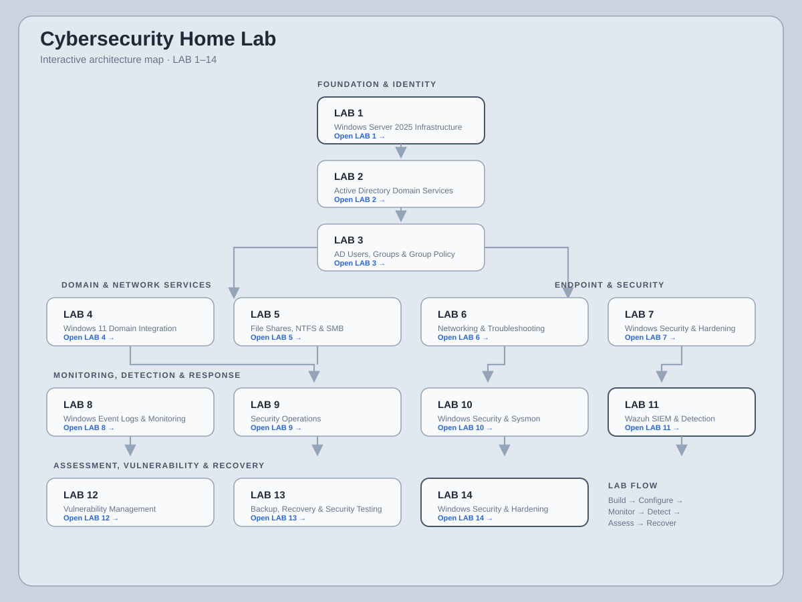

<a id="lab-roadmap"></a>
### Lab Roadmap

- [LAB 1 — Windows Server 2025 Infrastructure Deployment](#lab-1)
- [LAB 2 — Active Directory Domain Services Deployment](#lab-2)
- [LAB 3 — Active Directory Users, Groups & Group Policy](#lab-3)
- [LAB 4 — Windows 11 Domain Integration & Group Policy Validation](#lab-4)
- [LAB 5 — File Shares, NTFS Permissions and SMB Access Control](#lab-5)
- [LAB 6 — Networking & Troubleshooting](#lab-6)
- [LAB 7 — Windows Security & Hardening](#lab-7)
- [LAB 8 — Windows Event Logs & Monitoring](#lab-8)
- [LAB 9 — Security Operations](#lab-9)
- [LAB 10 — Windows Security & Sysmon](#lab-10)
- [LAB 11 — Wazuh SIEM, Detection Engineering & Security Monitoring](#lab-11)
- [LAB 12 — Vulnerability Management](#lab-12)
- [LAB 13 — Backup, Recovery & Security Testing](#lab-13)
- [LAB 14 — Windows Security & Hardening](#lab-14)

<a id="lab-1"></a>
# LAB 1 — Windows Server 2025 Infrastructure Deployment

## Overview

This phase documents the deployment and initial configuration of a Windows Server 2025 virtual machine as the foundation of the cybersecurity lab.

## Objectives

- Deploy a Windows Server 2025 virtual machine.
- Configure the server's hostname and network settings.
- Prepare the server for Active Directory Domain Services.
- Establish a stable recovery point using VMware snapshots.

## Lab Environment

- Host operating system: Windows 11
- Virtualization platform: VMware Workstation
- Virtual machine: Windows Server
- Server hostname: DC01
- Server operating system: Windows Server 2025 Standard Evaluation (Desktop Experience)
- Virtual disk: 80 GB
- Network: VMware VMnet8 (NAT)
- Static IPv4 address: 10.10.10.10
- Subnet mask: 255.255.255.0
- Default gateway: 10.10.10.1
- DNS: 10.10.10.1 (initial configuration)
- VM storage: External SSD

### VMware Virtual Machine

The lab environment was built using VMware Workstation with a dedicated Windows Server 2025 virtual machine. This server was used as the initial infrastructure host for the lab and was later configured as the domain controller.

### Evidence

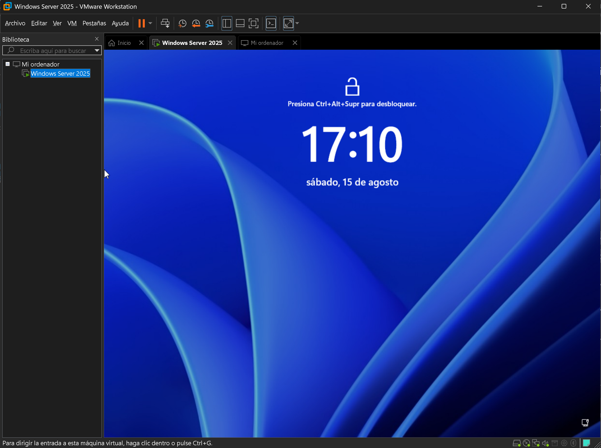

## Server Manager

The Windows Server 2025 installation was verified through Server Manager, confirming that the server was operational and ready for further configuration.

### Evidence
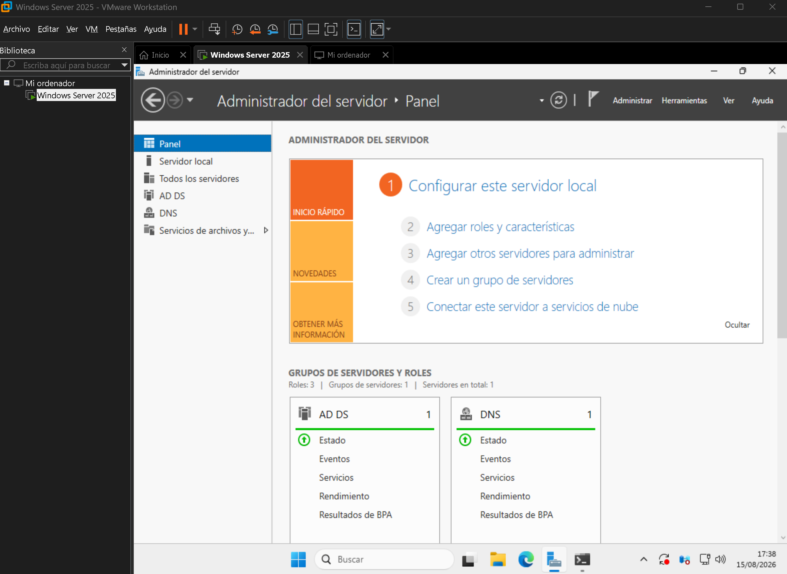

## Initial Server Configuration

After installing Windows Server 2025, the virtual machine was configured as the initial infrastructure server for the lab.

### Hostname

The server was renamed from the default Windows-generated hostname to:

`DC01`

### Network Configuration

A static IPv4 configuration was assigned to the server:

- IPv4 address: `10.10.10.10`
- Subnet mask: `255.255.255.0`
- Default gateway: `10.10.10.1`
- Initial DNS server: `10.10.10.1`

DHCP was disabled after assigning the static configuration.

### Network Configuration Evidence

The network configuration confirmed that DC01 was using the expected static IPv4 settings. The initial DNS configuration used the VMware NAT DNS server at `10.10.10.1` before Active Directory Domain Services deployment.

**Public evidence note:** The original screenshot was intentionally omitted from the public repository because it may contain internal laboratory network information, account identifiers, or sensitive security configuration details. The validation was performed as documented, but the screenshot is not included in the public version.
### Purpose

The server was prepared to become the first Domain Controller of the `lab.local` Active Directory environment in the following phase.

## Troubleshooting

During the initial deployment, an issue was encountered while attempting to install server roles and features required for the Active Directory deployment.

### Issue

The Server Manager installation wizard returned the following error:

`0x800f0831`

The error indicated that Windows was unable to complete the requested feature installation and that the required feature `Directory-Services-DomainController` could not be found.

### Investigation

The problem was investigated from the Windows Recovery Environment and Command Prompt.

The Windows installation volume was checked and the integrity of the Windows installation was investigated using built-in Windows servicing and disk repair tools.

A Windows Server 2025 installation ISO matching the installed operating system was available on the external SSD and was used as the repair source.

### Resolution

The Windows component store was repaired using DISM with the matching Windows Server 2025 installation image as the source.

The repair completed successfully.

### Validation

After the repair:

- The component store reported no corruption.
- DISM completed successfully.
- The Active Directory Domain Services installation was retried.
- The AD DS installation subsequently completed successfully.

### DISM Validation Evidence

A subsequent DISM health check confirmed that no corruption was detected in the Windows component store.

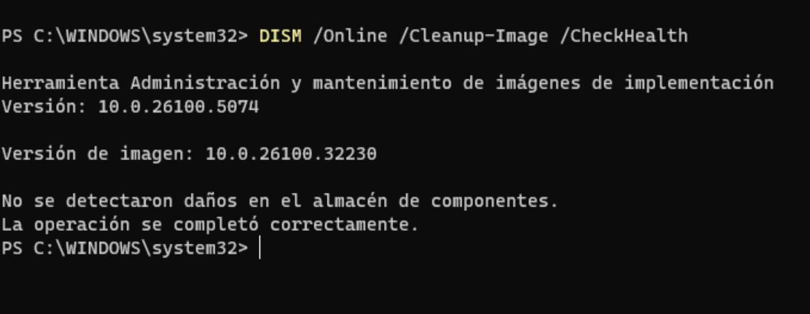

## Snapshot and Recovery Point

After completing the initial Windows Server configuration and resolving the component store issue, a VMware snapshot was created to preserve a stable recovery point before continuing with the Active Directory deployment.

The snapshot provided a rollback point in case subsequent configuration changes caused system instability.

### Snapshot Evidence

The snapshot preserved a known-good recovery point before continuing with the Active Directory deployment.

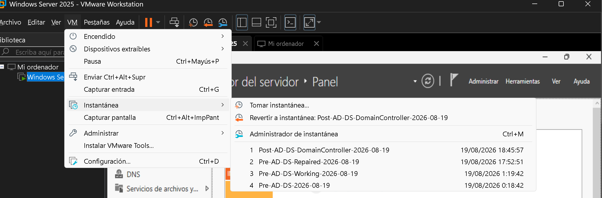

## Outcome

The initial Windows Server 2025 infrastructure was successfully deployed and prepared for Active Directory Domain Services.

At the end of this phase:

- DC01 was running Windows Server 2025.
- Static network configuration was operational.
- The Windows component store had been repaired and validated.
- A VMware recovery point was available.
- The server was ready for Active Directory Domain Services deployment.

⬆️ [Back to Roadmap](#lab-roadmap) 


<a id="lab-2"></a>
# LAB 2 — Active Directory Domain Services Deployment

With the Windows Server infrastructure prepared and a VMware recovery point available, Active Directory Domain Services (AD DS) was deployed on DC01.

DC01 was configured as the first domain controller for the new Active Directory forest using the domain:

- **Domain:** `lab.local`
- **Domain Controller:** `DC01`
- **IP Address:** `10.10.10.10`

After the AD DS deployment, DC01 was restarted to complete the configuration and bring the domain controller services online.

The next step was to validate the health and functionality of Active Directory, DNS, SYSVOL, NETLOGON, and the core domain controller services.

## Active Directory Validation

After the Active Directory Domain Services deployment, the health and functionality of the domain controller were validated using the built-in `dcdiag` diagnostic tool.

The diagnostic confirmed successful connectivity and proper domain controller advertising. Additional directory service, Active Directory reference, and partition integrity checks were also completed successfully. System log events reported by `dcdiag` were reviewed separately as part of the validation process.

### DC01 Health Check

The `dcdiag` diagnostic was used to verify the overall health of DC01 and the Active Directory environment.

Key validation areas included:

- Domain controller connectivity.
- Domain controller advertising.
- Directory service availability.
- Active Directory reference validation.
- Active Directory partition integrity.
- Domain locator functionality.

### Validation Evidence

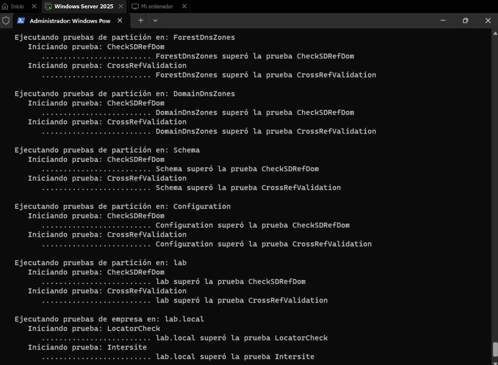

## DNS Validation

DNS functionality was validated to ensure that Active Directory service records were correctly registered and that DC01 could be located through DNS.

### SRV Record Validation

The `_ldap._tcp.dc._msdcs.lab.local` SRV record was queried using `nslookup`.

The query successfully returned DC01 as the domain controller responsible for LDAP:

- **Domain Controller:** `dc01.lab.local`
- **IP Address:** `10.10.10.10`
- **LDAP Port:** `389`

### SRV Record Evidence

**Public evidence note:** The original screenshot was intentionally omitted from the public repository because it may contain internal laboratory network information, account identifiers, or sensitive security configuration details. The validation was performed as documented, but the screenshot is not included in the public version.
### DNS Health Check

The `dcdiag /test:dns /v` diagnostic was then used to verify the overall DNS health of the domain controller.

The DNS diagnostic confirmed that all tests passed on DC01 and that name resolution was functional. The `_ldap._tcp` SRV record for the forest root domain was also confirmed as registered, and the `_msdcs.lab.local` DNS delegation was operational.

### DNS Health Evidence

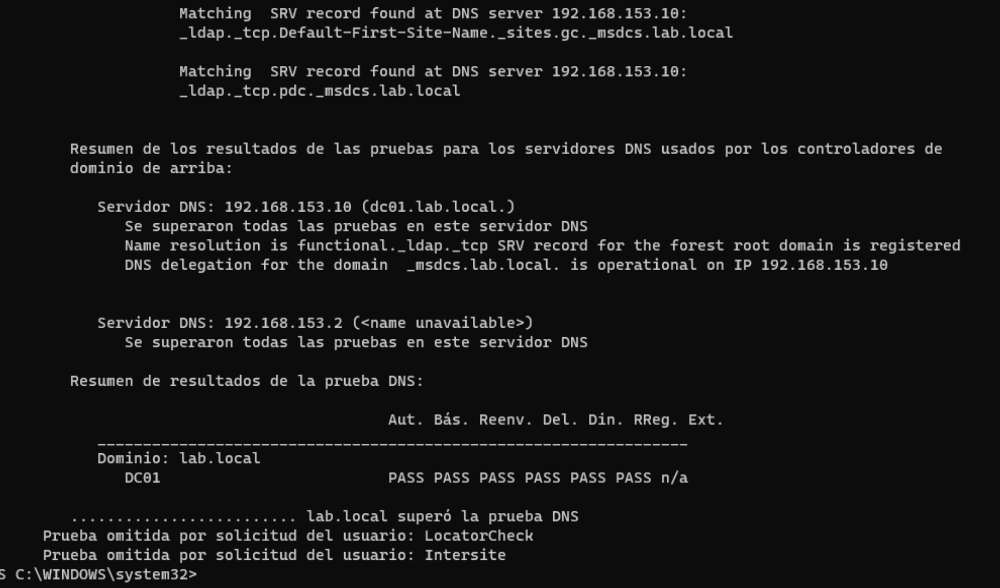

## SYSVOL and NETLOGON Validation

The SYSVOL and NETLOGON shared folders were validated to confirm that the resources required by the domain controller were correctly published.

The `net share` command confirmed that both required shares were available on DC01:

- **NETLOGON:** `C:\Windows\SYSVOL\sysvol\lab.local\SCRIPTS`
- **SYSVOL:** `C:\Windows\SYSVOL\sysvol`

### SYSVOL and NETLOGON Evidence

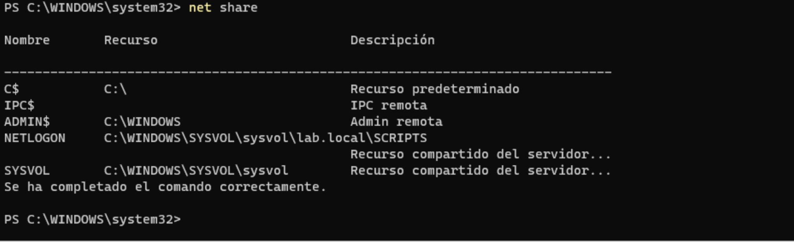

## Core Services Validation

The core services required for Active Directory Domain Services were checked to confirm that they were running correctly on DC01.

The following services were verified as running:

- **DFSR** — Distributed File System Replication
- **DNS** — DNS Server
- **Netlogon** — Net Logon
- **NTDS** — Active Directory Domain Services

All four services were in a `Running` state at the time of validation.

### Core Services Evidence

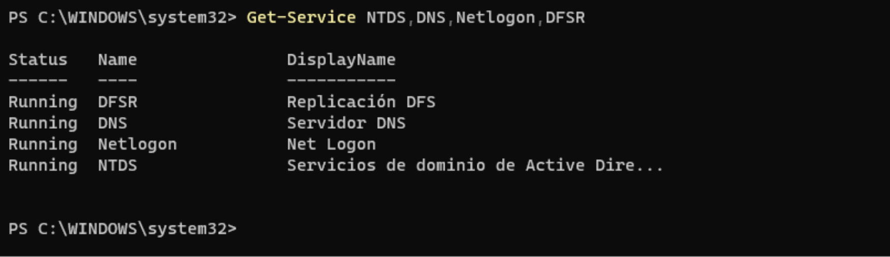

## Troubleshooting and Findings

During the initial `dcdiag` validation, the `SystemLog` test reported several warning and error events recorded during the early domain controller configuration.

One of the warnings indicated a DNS resolution timeout for the Active Directory LDAP SRV record:

`_ldap._tcp.dc._msdcs.lab.local`

Additional events were related to WinRM SPN registration, time synchronization configuration, a SAM/KDC event, and a Windows Terminal update. These events were reviewed to determine whether they represented active issues affecting the domain controller.

### DNS Verification

The DNS-related event was investigated using an SRV record query and a dedicated DNS health diagnostic.

The current DNS state was confirmed to be functional:

- The LDAP SRV record resolved successfully to `dc01.lab.local`.
- DC01 was returned with IP address `10.10.10.10`.
- The LDAP service was registered on port `389`.
- `dcdiag /test:dns /v` reported that all DNS tests passed on DC01.
- DNS name resolution was confirmed as functional.

Based on these validation results, the reported DNS timeout was not reproduced as a current DNS failure.

The remaining events were retained as findings from the initial configuration and were not treated as evidence of an active Active Directory or DNS failure.

## Final Outcome

The Active Directory Domain Services deployment was successfully completed and validated on DC01.

At the end of this phase:

- DC01 was operating as the first domain controller for the `lab.local` Active Directory forest.
- Active Directory health checks completed successfully for connectivity, advertising, directory references, partition integrity, and domain locator functionality.
- DNS service records required by Active Directory were successfully registered and resolved.
- DNS health checks completed successfully.
- SYSVOL and NETLOGON shares were available on DC01.
- Core Active Directory services, including NTDS, DNS, Netlogon, and DFSR, were running.
- A VMware recovery point was available for rollback if required.

The initial `dcdiag` SystemLog findings were investigated through additional DNS and service validation. No current DNS failure was reproduced, and the domain controller remained operational.

The environment was therefore ready for the next stage of the lab: continued Active Directory administration and configuration.

⬆️ [Back to Roadmap](#lab-roadmap)

<a id="lab-3"></a>
# LAB 3 — Active Directory Users, Groups & Group Policy

## Objective

The objective of this phase was to extend the `lab.local` Active Directory environment by creating a structured Organizational Unit (OU) hierarchy, configuring security groups, creating domain user accounts, assigning appropriate group memberships, and implementing a basic Group Policy Object (GPO).

This phase focused on applying fundamental Active Directory administration concepts in a controlled lab environment while maintaining a clear separation between organizational structure, user accounts, security groups, and policy management.

## Environment

- **Server:** Windows Server 2025 Standard Evaluation (Desktop Experience)
- **Domain Controller:** DC01
- **Active Directory Domain:** `lab.local`
- **Forest:** `lab.local`
- **DNS:** Active Directory-integrated DNS
- **Virtualization Platform:** VMware Workstation
- **Network:** VMware NAT (VMnet8)

## Organizational Unit Structure

A structured Organizational Unit (OU) hierarchy was created to separate users, groups, computers, and servers within the `lab.local` domain.

The following OUs were created:

- `Lab-Users`
- `Lab-Groups`
- `Lab-Computers`
- `Lab-Servers`

This structure provides a logical foundation for managing Active Directory objects and allows Group Policy Objects (GPOs) to be linked to specific organizational scopes.

For this phase, user accounts were placed in the `Lab-Users` OU, while security groups were stored in `Lab-Groups`.

## Security Groups

Two security groups were created to organize administrative and helpdesk-related access within the `lab.local` domain.

The following groups were created:

- `Lab-IT-Admins` — used for IT administration-related membership.
- `Lab-Helpdesk` — used for helpdesk-related membership.

Security groups were stored separately in the `Lab-Groups` OU to maintain a clear distinction between user accounts, groups, and other Active Directory objects.

## User Accounts

Three domain user accounts were created under the `Lab-Users` OU to represent different roles within the lab environment.

The following accounts were created:

| Display Name | Username | Role |
|---|---|---|
| Alex Admin | `alex.admin` | IT Administration |
| Jamie Helpdesk | `jamie.helpdesk` | Helpdesk |
| Taylor User | `taylor.user` | Standard User |

All three accounts were verified as enabled after creation.

### Evidence
**Public evidence note:** The original screenshot was intentionally omitted from the public repository because it may contain internal laboratory network information, account identifiers, or sensitive security configuration details. The validation was performed as documented, but the screenshot is not included in the public version.
## Group Membership

User accounts were assigned to security groups according to their intended roles within the lab environment.

The following group memberships were configured:

| User | Security Group | Purpose |
|---|---|---|
| `alex.admin` | `Lab-IT-Admins` | IT administration |
| `jamie.helpdesk` | `Lab-Helpdesk` | Helpdesk operations |
| `taylor.user` | None | Standard user |

### Evidence

#### IT Administration Group

**Public evidence note:** The original screenshot was intentionally omitted from the public repository because it may contain internal laboratory network information, account identifiers, or sensitive security configuration details. The validation was performed as documented, but the screenshot is not included in the public version.
#### Helpdesk Group

**Public evidence note:** The original screenshot was intentionally omitted from the public repository because it may contain internal laboratory network information, account identifiers, or sensitive security configuration details. The validation was performed as documented, but the screenshot is not included in the public version.
## Group Policy Configuration

A Group Policy Object (GPO) named `LAB-Users-Baseline` was created to apply a basic user configuration to accounts located within the `Lab-Users` OU.

The following user policy was configured:

- **Policy:** Prevent changing desktop background
- **Setting:** Enabled

This policy was selected as a basic example of centralized user configuration through Group Policy.

### Evidence
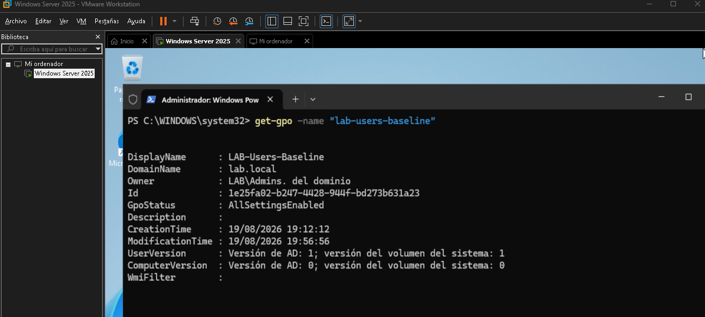

## Group Policy Linking

The `LAB-Users-Baseline` GPO was linked directly to the `Lab-Users` OU.

This configuration establishes the intended scope of the policy so that user accounts located within `Lab-Users` can receive the configured user policy.

The inheritance information for the OU was also reviewed. In addition to the directly linked `LAB-Users-Baseline` GPO, inherited domain-level policies such as the `Default Domain Policy` were present.

### Evidence
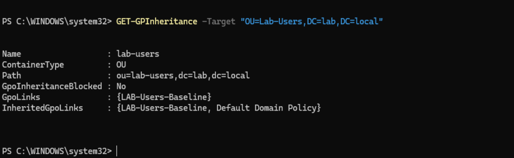

## Administrative Validation

The Active Directory configuration created during this phase was validated using PowerShell and Active Directory diagnostic tools.

The following checks were completed:

- The three domain user accounts were confirmed as enabled.
- `alex.admin` was confirmed as a member of `Lab-IT-Admins`.
- `jamie.helpdesk` was confirmed as a member of `Lab-Helpdesk`.
- `taylor.user` was confirmed as an enabled standard user.
- The `LAB-Users-Baseline` GPO was confirmed to exist in the `lab.local` domain.
- The GPO was confirmed to be linked directly to the `Lab-Users` OU.
- Active Directory health was rechecked with `dcdiag`, with no errors reported.

## Endpoint-Level Group Policy Validation

The `LAB-Users-Baseline` GPO was validated on the domain-joined Windows 11 endpoint using the `LAB\alex.admin` account.

The following validation steps were completed:

1. The Windows 11 client was joined to the `lab.local` domain.
2. The `LAB\alex.admin` domain account was used to sign in to the client.
3. `gpupdate /force` completed successfully for both computer and user policy processing.
4. `gpresult /r` confirmed that `LAB-Users-Baseline` was applied to `LAB\alex.admin`.
5. The configured desktop background policy was visually verified on the Windows 11 endpoint.
6. Evidence was captured showing the applied GPO and the resulting desktop state.

The Group Policy Results confirmed that `LAB-Users-Baseline` was applied from `DC01.lab.local` to the `LAB\alex.admin` user account located in the `Lab-Users` OU.

### Evidence 
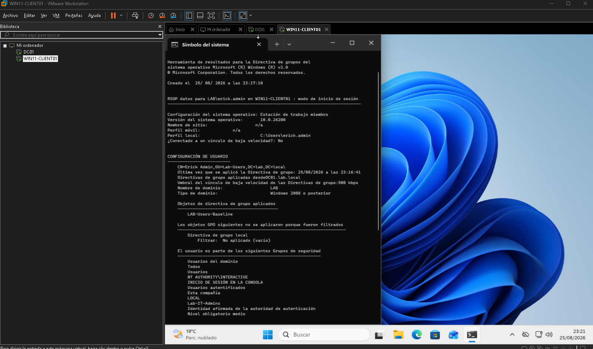

## Final Outcome

The Active Directory user, group, and Group Policy configuration was successfully completed and validated across the domain controller and a domain-joined Windows 11 endpoint.

At the end of this phase:

- The `lab.local` domain contained a structured OU hierarchy for users, groups, computers, and servers.
- Three domain user accounts were created under the `Lab-Users` OU.
- Security groups were created for IT administration and helpdesk roles.
- User group memberships were configured according to their intended roles.
- The `LAB-Users-Baseline` GPO was created and configured.
- The GPO was linked directly to the `Lab-Users` OU.
- Active Directory configuration and domain controller health were validated successfully.
- The Windows 11 client was successfully joined to the `lab.local` domain.
- The `LAB\alex.admin` domain account was successfully used to sign in to the Windows 11 client.
- `gpupdate /force` completed successfully for both computer and user policy processing.
- `gpresult /r` confirmed that `LAB-Users-Baseline` was applied to `LAB\alex.admin`.
- The configured desktop background policy was visually verified on the Windows 11 endpoint.
- Evidence was collected for Active Directory objects, group memberships, GPO configuration, GPO linking, and endpoint-level Group Policy application.

### LAB 3 Status

**COMPLETED**

The Active Directory organizational structure, users, security groups, Group Policy configuration, and endpoint-level policy application were successfully implemented and validated.

The Windows 11 client is now ready for continued use in the lab environment and for the infrastructure troubleshooting and validation activities documented in the following phase.

⬆️ [Back to Roadmap](#lab-roadmap)


<a id="lab-4"></a>
# LAB 4 — Windows 11 Domain Integration & Group Policy Validation

## Objective

The objective of this phase was to integrate a Windows 11 client into the `lab.local` Active Directory environment and validate end-to-end domain functionality.

This phase focused on joining the Windows 11 client to the domain, establishing reliable DNS and time synchronization with the domain controller, validating Group Policy processing, and troubleshooting infrastructure issues affecting domain authentication and policy application.

The phase also provided an opportunity to apply a structured troubleshooting methodology by identifying symptoms, testing hypotheses, analyzing results, implementing corrective actions, and validating the final configuration.

## Environment

- **Domain Controller:** DC01
- **Operating System:** Windows Server 2025 Standard Evaluation (Desktop Experience)
- **Active Directory Domain:** `lab.local`
- **Windows 11 Client:** `WIN11-CLIENT01`
- **Client Operating System:** Windows 11
- **Domain:** `lab.local`
- **DNS Server:** `DC01` (`10.10.10.10`)
- **Client IPv4 Address:** `10.10.10.20`
- **Virtualization Platform:** VMware Workstation
- **Network:** VMware NAT (VMnet8)
- **Domain User:** `LAB\alex.admin`

## Windows 11 Client Setup

A Windows 11 virtual machine was prepared as the client endpoint for the `lab.local` Active Directory environment.

The client was configured with the hostname:

- **Hostname:** `WIN11-CLIENT01`

The client was connected to the VMware NAT network (VMnet8) and received the following network configuration:

- **IPv4 Address:** `10.10.10.20`
- **Subnet Mask:** `255.255.255.0`
- **Default Gateway:** `10.10.10.1`
- **Preferred DNS Server:** `10.10.10.10` (`DC01`)

The Windows 11 client was configured to use the domain controller as its primary DNS server to support Active Directory name resolution and domain services.

### Initial Connectivity Validation

Connectivity between the Windows 11 client and the domain controller was verified before proceeding with domain integration.

The client was able to communicate with the domain controller over the VMware NAT network.

### Evidence

**Public evidence note:** The original screenshot was intentionally omitted from the public repository because it may contain internal laboratory network information, account identifiers, or sensitive security configuration details. The validation was performed as documented, but the screenshot is not included in the public version.
## Domain Integration

The Windows 11 client was joined to the `lab.local` Active Directory domain using the domain controller `DC01`.

The domain join process was completed successfully, and the client was registered in Active Directory as:

- **Computer:** `WIN11-CLIENT01`
- **Domain:** `lab.local`
- **Domain Controller:** `DC01.lab.local`

After joining the domain, the client was restarted and domain authentication was tested using the `LAB\alex.admin` account.

The successful domain authentication confirmed that the Windows 11 client could communicate with the Active Directory environment and authenticate against the domain controller.

### Active Directory Computer Object

The computer object was verified in Active Directory under the default `Computers` container:

`CN=WIN11-CLIENT01,CN=Computers,DC=lab,DC=local`

### Evidence

**Public evidence note:** The original screenshot was intentionally omitted from the public repository because it may contain internal laboratory network information, account identifiers, or sensitive security configuration details. The validation was performed as documented, but the screenshot is not included in the public version.
##  Windows Time Synchronization

Accurate time synchronization is an important requirement in an Active Directory environment because Kerberos authentication relies on synchronized system clocks.

During the initial domain integration testing, a Windows Time synchronization issue was identified on the Windows 11 client.

### Initial Synchronization Issue

The first attempt to manually synchronize the client returned the following message:

`The computer did not resync because the required time change was too large.`

This indicated that the difference between the client clock and the expected domain time source was too large for the initial synchronization attempt.

A second synchronization attempt was then performed:

`w32tm /resync`

The command completed successfully.

### Validation

The synchronization state was verified using:

`w32tm /query /status`

The final status showed:

- **Leap Indicator:** `0` — no warning
- **Last Successful Sync:** `25/08/2026 16:41:09`
- **Time Source:** `DC01.lab.local`

The active time source was independently confirmed using:

`w32tm /query /source`

The command returned:

`DC01.lab.local`

This confirmed that the Windows 11 client was successfully synchronized with the domain controller.

### Evidence

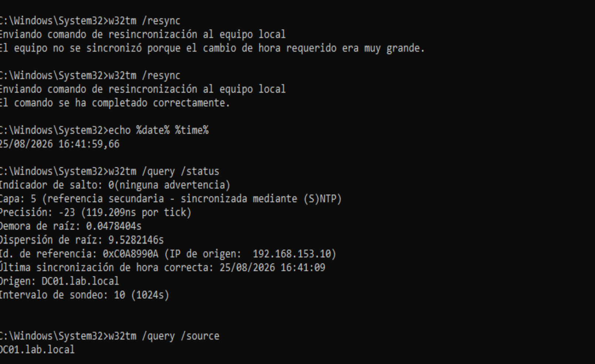 

## DNS Troubleshooting

DNS is a critical component of Active Directory because domain clients rely on DNS to locate domain controllers and access services such as LDAP and Kerberos.

During the Windows 11 domain integration process, DNS resolution was investigated after Group Policy processing initially failed.

### Initial DNS Investigation

The Windows 11 client initially required additional DNS validation to confirm correct hostname registration and name resolution within the `lab.local` domain.

Initial DNS queries showed that the DNS server could resolve the `lab.local` domain and the domain controller:

`nslookup DC01.lab.local`

The query returned:

`10.10.10.10`

Active Directory service discovery was also tested using an LDAP SRV record:

`nslookup -type=SRV _ldap._tcp.dc._msdcs.lab.local`

The query successfully returned `DC01.lab.local` with the LDAP service available on port `389`.

### Client DNS Registration

The Windows 11 client initially experienced problems with its own DNS name resolution.

The client hostname was:

`WIN11-CLIENT01`

and its IPv4 address was:

`10.10.10.20`

The DNS zone was inspected on `DC01` to verify whether the client had a corresponding host record.

The client A record was subsequently confirmed in the `lab.local` DNS zone:

`WIN11-CLIENT01 → 10.10.10.20`

This confirmed that the Windows 11 client was correctly registered in DNS.

### DNS Validation

The client record was independently verified using the DNS Server PowerShell tools on `DC01`.

The resulting A record contained:

- **Hostname:** `WIN11-CLIENT01`
- **Record Type:** `A`
- **IPv4 Address:** `10.10.10.20`

The client name was then successfully resolved by explicitly querying the domain controller DNS server:

`nslookup WIN11-CLIENT01.lab.local 10.10.10.10`

The query returned:

`10.10.10.20`

This confirmed that the Windows 11 client could be resolved correctly through the Active Directory-integrated DNS server.

### Evidence

**Public evidence note:** The original screenshot was intentionally omitted from the public repository because it may contain internal laboratory network information, account identifiers, or sensitive security configuration details. The validation was performed as documented, but the screenshot is not included in the public version.
**Public evidence note:** The original screenshot was intentionally omitted from the public repository because it may contain internal laboratory network information, account identifiers, or sensitive security configuration details. The validation was performed as documented, but the screenshot is not included in the public version.
**Public evidence note:** The original screenshot was intentionally omitted from the public repository because it may contain internal laboratory network information, account identifiers, or sensitive security configuration details. The validation was performed as documented, but the screenshot is not included in the public version.
## Group Policy Troubleshooting

After the Windows 11 client was joined to the `lab.local` domain, Group Policy processing was tested using the `LAB\alex.admin` account.

### Initial Group Policy Processing Issue

The first Group Policy update attempts did not complete as expected.

Because Group Policy processing depends on Active Directory, DNS resolution, and communication with the domain controller, these components were reviewed before making further changes.

The client was verified to use `DC01` (`10.10.10.10`) as its DNS server, and DNS resolution was subsequently confirmed.

### Group Policy Refresh

After the underlying domain connectivity and DNS configuration were validated, Group Policy was refreshed using:

`gpupdate /force`

The command completed successfully for both computer and user policy processing.

### Group Policy Results

The resulting Group Policy configuration was verified using:

`gpresult /r`

The results confirmed that:

- Group Policy was applied from `DC01.lab.local`.
- The `LAB-Users-Baseline` GPO was applied to `LAB\alex.admin`.
- The user account was located in the `Lab-Users` OU.
- The client was operating as a member workstation in the `lab.local` domain.

This confirmed successful communication between the Windows 11 endpoint and the Active Directory environment for Group Policy processing.

### Evidence

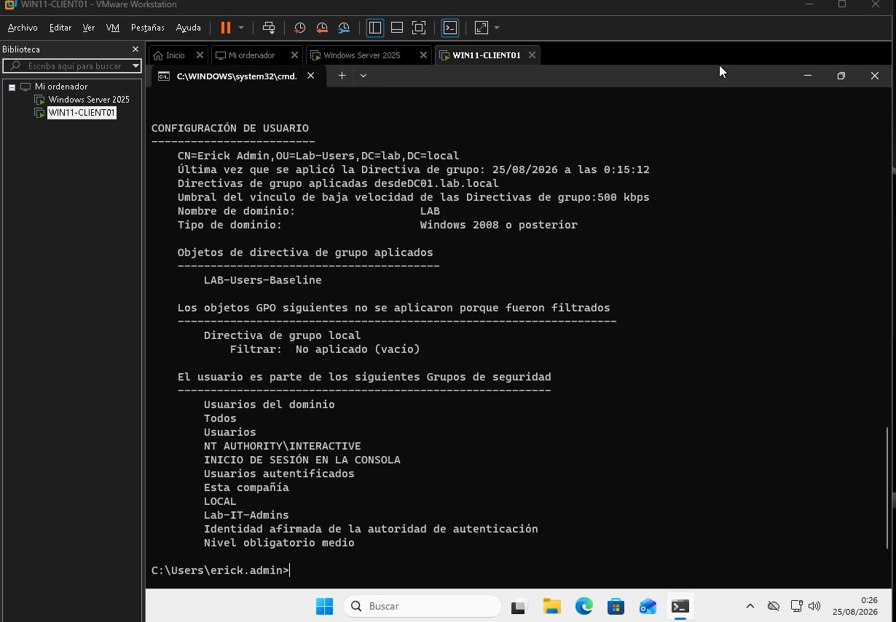


## Final Validation

The Windows 11 client and Active Directory environment were subjected to final validation after completing the domain integration, time synchronization, DNS troubleshooting, and Group Policy testing.

The following checks were completed successfully:

- The Windows 11 client `WIN11-CLIENT01` remained successfully joined to the `lab.local` domain.
- The client successfully resolved the domain controller `DC01.lab.local`.
- The client successfully resolved its own DNS record as `WIN11-CLIENT01.lab.local`.
- The Windows Time service successfully synchronized with `DC01.lab.local`.
- `w32tm /query /status` reported no synchronization warnings.
- `w32tm /query /source` confirmed `DC01.lab.local` as the active time source.
- `gpupdate /force` completed successfully for both computer and user policy processing.
- `gpresult /r` confirmed that `LAB-Users-Baseline` was applied to `LAB\alex.admin`.
- The `LAB-Users-Baseline` user policy was visually verified on the Windows 11 endpoint.
- Active Directory and DNS services remained operational on `DC01`.

### Validation Result

The final validation confirmed successful communication between the Windows 11 endpoint and the `lab.local` Active Directory environment.

The client was able to resolve required DNS records, synchronize time with the domain controller, authenticate using a domain account, and successfully process the configured Group Policy.

### Evidence


**Public evidence note:** The original screenshot was intentionally omitted from the public repository because it may contain internal laboratory network information, account identifiers, or sensitive security configuration details. The validation was performed as documented, but the screenshot is not included in the public version.


## Final Outcome

The Windows 11 client was successfully integrated into the `lab.local` Active Directory environment and validated against the domain controller `DC01`.

During this phase:

- The `WIN11-CLIENT01` Windows 11 client was successfully joined to the `lab.local` domain.
- Domain authentication was successfully validated using the `LAB\alex.admin` account.
- Connectivity between the Windows 11 client and `DC01` was verified.
- Active Directory DNS service records were successfully resolved.
- The `WIN11-CLIENT01.lab.local` DNS record was successfully resolved to `10.10.10.20`.
- Windows Time synchronization was successfully established with `DC01.lab.local`.
- The initial time synchronization issue was identified and successfully resolved.
- `gpupdate /force` completed successfully for both computer and user policy processing.
- `gpresult /r` confirmed that `LAB-Users-Baseline` was successfully applied to `LAB\alex.admin`.
- The configured user policy was visually verified on the Windows 11 endpoint.
- Evidence was collected throughout the integration, troubleshooting, and final validation process.

### LAB 4 Status

**COMPLETED**

This phase demonstrated successful Windows 11 integration with the `lab.local` Active Directory environment, including domain authentication, DNS resolution, time synchronization, and Group Policy processing.

The environment is now validated and ready for the next stage of the cybersecurity lab.

⬆️ [Back to Roadmap](#lab-roadmap)


<a id="lab-5"></a>
# LAB 5 — File Shares, NTFS Permissions and SMB Access Control

## Overview

In this phase, the Windows Server 2025 domain controller (DC01) was configured as an SMB file server. Shared folders were created and protected using Active Directory security groups and NTFS permissions.

The main goal was to implement role-based access control and verify that different users could access only the resources required for their role.

The configuration was validated from the domain-joined Windows 11 client using real access and write tests.

## Objectives

- Create dedicated shared folders for different organizational roles.
- Configure NTFS permissions using Active Directory security groups.
- Publish the folders as SMB network shares.
- Apply the principle of least privilege.
- Validate permitted and denied access from a domain-joined Windows 11 client.
- Verify both read and write access.
- Document the final configuration and test results.

## Lab Environment

| Component | Configuration |
|---|---|
| Server | DC01 |
| Operating System | Windows Server 2025 |
| Domain | `lab.local` |
| Client | WIN11-CLIENT01 |
| Client Operating System | Windows 11 |
| Network | VMware NAT |
| Server IP | `10.10.10.10` |

## Active Directory Groups

The following Active Directory security groups were used to control access to the shared folders:

| Security Group | Purpose |
|---|---|
| `Lab-IT-Admins` | IT administrators |
| `Lab-Helpdesk` | Helpdesk users |
| `LAB\Standard-Users` | Standard domain users |

The following domain accounts were used during the access validation:

| User | Security Group | Role |
|---|---|---|
| `alex.admin` | `Lab-IT-Admins` | IT Administrator |
| `jamie.helpdesk` | `Lab-Helpdesk` | Helpdesk User |
| `taylor.user` | `LAB\Standard-Users` | Standard User |

## Folder Structure

Three shared folders were created on DC01 under `C:\LabShares`:

- `C:\LabShares\IT`
- `C:\LabShares\Helpdesk`
- `C:\LabShares\Public`

Each folder was configured with specific NTFS permissions based on the intended access requirements.

## NTFS Permissions

NTFS permissions were configured on the shared folders to control access at the file-system level.

Access was assigned through Active Directory security groups instead of individual user accounts. This approach provides centralized and role-based access control.

The three folders were configured according to the following access model:

| Folder | Security Group | NTFS Access |
|---|---|---|
| `IT` | `Lab-IT-Admins` | Modify |
| `Helpdesk` | `Lab-Helpdesk` | Modify |
| `Public` | `LAB\Standard-Users` | Read & Execute |

### IT Share

Members of `Lab-IT-Admins` were granted **Modify** permissions on the `IT` folder.

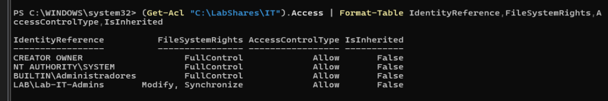

### Helpdesk Share

Members of `Lab-Helpdesk` were granted **Modify** permissions on the `Helpdesk` folder.

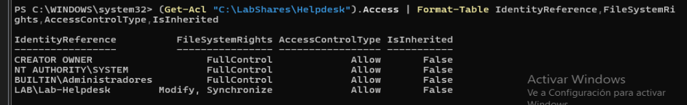

### Public Share

Members of `LAB\Standard-Users` were granted **Read & Execute** permissions on the `Public` folder.

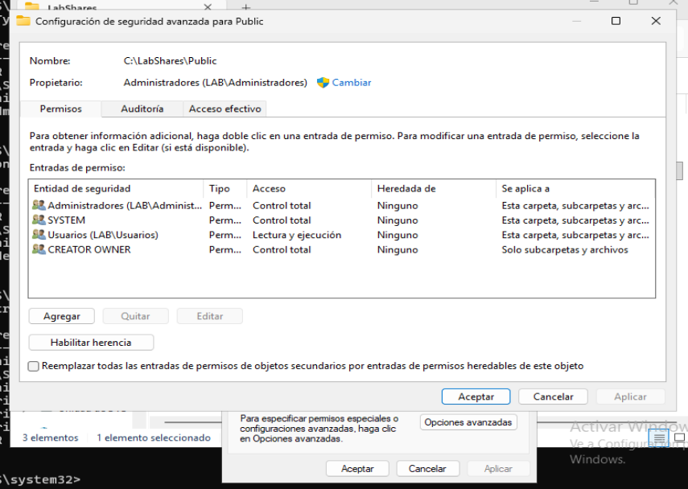

## SMB Share Configuration

The three folders were published as SMB network shares on DC01.

| Local Path | SMB Share |
|---|---|
| `C:\LabShares\IT` | `\\DC01\IT` |
| `C:\LabShares\Helpdesk` | `\\DC01\Helpdesk` |
| `C:\LabShares\Public` | `\\DC01\Public` |

The SMB share permissions were configured with `Everyone` set to **Full Control**.

Access restrictions were implemented through NTFS permissions, which provided the role-based access control for each folder.

### IT Share

The `IT` folder was published as the `\\DC01\IT` SMB share.

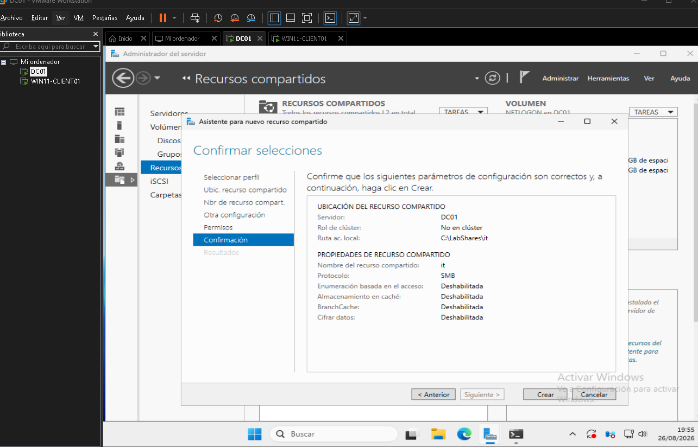

### Helpdesk Share

The `Helpdesk` folder was published as the `\\DC01\Helpdesk` SMB share.

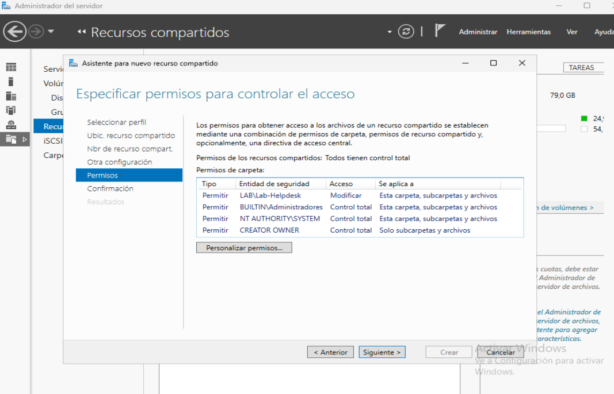

### Public Share

The `Public` folder was published as the `\\DC01\Public` SMB share.

### Final SMB Share Validation

The final validation on DC01 confirmed that the `IT`, `Helpdesk`, and `Public` SMB shares were successfully published.

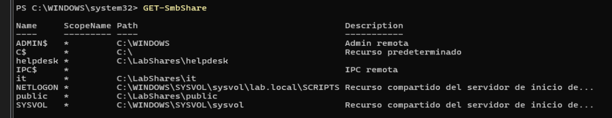

## Access Control Testing

After configuring the NTFS permissions and SMB shares, access was tested from `WIN11-CLIENT01` using different domain accounts.

The purpose of these tests was to verify effective access and confirm that users could access only the resources allowed by their assigned security groups.

### Test 1 — Alex Admin → IT

**User:** `LAB\alex.admin`

**Resource:** `\\DC01\IT`

**Result:** **Access granted**

Erick successfully accessed the IT share and created a test file, confirming effective write access.

**Public evidence note:** The original screenshot was intentionally omitted from the public repository because it may contain internal laboratory network information, account identifiers, or sensitive security configuration details. The validation was performed as documented, but the screenshot is not included in the public version.
### Test 2 — Jamie Helpdesk → IT

**User:** `LAB\jamie.helpdesk`

**Resource:** `\\DC01\IT`

**Result:** **Access denied**

Ana was denied access to the IT share because her account is not a member of the `Lab-IT-Admins` security group.

**Public evidence note:** The original screenshot was intentionally omitted from the public repository because it may contain internal laboratory network information, account identifiers, or sensitive security configuration details. The validation was performed as documented, but the screenshot is not included in the public version.
### Test 3 — Jamie Helpdesk → Helpdesk

**User:** `LAB\jamie.helpdesk`

**Resource:** `\\DC01\Helpdesk`

**Result:** **Access granted**

Ana successfully accessed the Helpdesk share and created a test file, confirming effective write access.

**Public evidence note:** The original screenshot was intentionally omitted from the public repository because it may contain internal laboratory network information, account identifiers, or sensitive security configuration details. The validation was performed as documented, but the screenshot is not included in the public version.
### Test 4 — Taylor User → Public

**User:** `LAB\taylor.user`

**Resource:** `\\DC01\Public`

**Result:** **Access granted**

Carlos successfully accessed the Public share and was able to read its contents.

**Public evidence note:** The original screenshot was intentionally omitted from the public repository because it may contain internal laboratory network information, account identifiers, or sensitive security configuration details. The validation was performed as documented, but the screenshot is not included in the public version.
### Test 5 — Taylor User → Public Write Attempt

**User:** `LAB\taylor.user`

**Resource:** `\\DC01\Public`

**Result:** **Write access denied**

Carlos was able to access the Public share, but he was denied permission to create or modify files.

**Public evidence note:** The original screenshot was intentionally omitted from the public repository because it may contain internal laboratory network information, account identifiers, or sensitive security configuration details. The validation was performed as documented, but the screenshot is not included in the public version.
### Test 6 — Taylor User → IT

**User:** `LAB\taylor.user`

**Resource:** `\\DC01\IT`

**Result:** **Access denied**

Carlos was denied access to the IT share because his account is not a member of the `Lab-IT-Admins` security group.

**Public evidence note:** The original screenshot was intentionally omitted from the public repository because it may contain internal laboratory network information, account identifiers, or sensitive security configuration details. The validation was performed as documented, but the screenshot is not included in the public version.
## Access Control Matrix

The following table summarizes the access results validated from `WIN11-CLIENT01`:

| User | IT | Helpdesk | Public |
|---|---|---|---|
| `alex.admin` | Modify | Not tested | Not tested |
| `jamie.helpdesk` | Denied | Read/Write | Not tested |
| `taylor.user` | Denied | Not tested | Read only |

The tests confirmed that:

- `alex.admin` can access and modify IT resources.
- `jamie.helpdesk` can access and modify Helpdesk resources.
- `jamie.helpdesk` is denied access to IT resources.
- `taylor.user` can access and read Public resources.
- `taylor.user` cannot create or modify files in Public.
- `taylor.user` is denied access to IT resources.

## Validation

The SMB configuration was validated on DC01 using PowerShell.

The following command was used to verify the published SMB shares:

```powershell

Get-SmbShare
```


The command confirmed that the following SMB shares were available on DC01:

IT
Helpdesk
Public
NETLOGON
SYSVOL

The SMB share permissions for the IT and Helpdesk shares were verified using PowerShell:

```powershell

Get-SmbShareAccess -Name IT
Get-SmbShareAccess -Name Helpdesk
```


## Security Principles Demonstrated

### Role-Based Access Control

Access was assigned through Active Directory security groups rather than directly to individual users. This allows permissions to be managed according to the user's role.

### Principle of Least Privilege

Users were given only the access required for their role. IT administrators received access to IT resources, Helpdesk users received access to Helpdesk resources, and standard users were restricted to read-only access to Public.

### NTFS Permissions

NTFS permissions were used to control access to the underlying folders and determine the effective permissions available to users.

### SMB File Sharing

The folders were published as SMB network shares, allowing domain users to access them through paths such as `\\DC01\IT`, `\\DC01\Helpdesk`, and `\\DC01\Public`.

### Layered Access Control

SMB share permissions and NTFS permissions were combined to control access to the shared resources.

### Access Validation

The configuration was validated through real access and write tests from the domain-joined Windows 11 client using multiple domain accounts.

### Evidence

The following screenshots document the configuration and validation performed during this phase.

### NTFS Permissions


### SMB Configuration


### Access Control Tests

**Public evidence note:** The original screenshot was intentionally omitted from the public repository because it may contain internal laboratory network information, account identifiers, or sensitive security configuration details. The validation was performed as documented, but the screenshot is not included in the public version.
**Public evidence note:** The original screenshot was intentionally omitted from the public repository because it may contain internal laboratory network information, account identifiers, or sensitive security configuration details. The validation was performed as documented, but the screenshot is not included in the public version.
**Public evidence note:** The original screenshot was intentionally omitted from the public repository because it may contain internal laboratory network information, account identifiers, or sensitive security configuration details. The validation was performed as documented, but the screenshot is not included in the public version.
**Public evidence note:** The original screenshot was intentionally omitted from the public repository because it may contain internal laboratory network information, account identifiers, or sensitive security configuration details. The validation was performed as documented, but the screenshot is not included in the public version.
**Public evidence note:** The original screenshot was intentionally omitted from the public repository because it may contain internal laboratory network information, account identifiers, or sensitive security configuration details. The validation was performed as documented, but the screenshot is not included in the public version.
**Public evidence note:** The original screenshot was intentionally omitted from the public repository because it may contain internal laboratory network information, account identifiers, or sensitive security configuration details. The validation was performed as documented, but the screenshot is not included in the public version.
## Outcome

LAB 5 was successfully completed.

DC01 was configured as an SMB file server with role-based access control implemented through Active Directory security groups and NTFS permissions.

The configuration was validated from WIN11-CLIENT01 using multiple domain accounts. Both permitted and denied access scenarios were successfully tested according to the intended security model.

The final environment demonstrates how Active Directory groups, NTFS permissions, SMB shares, and effective access control work together in a Windows Server environment.

## LAB Status

**LAB 5 — COMPLETED** ✅

The SMB file shares, NTFS permissions, Active Directory group-based access control, and access validation tests were successfully implemented and verified.

⬆️ [Back to Roadmap](#lab-roadmap)


<a id="lab-6"></a>
# LAB 6 — Networking & Troubleshooting

## Objective

The objective of this phase was to validate network connectivity between the Windows 11 client and the Windows Server 2025 domain controller and to troubleshoot DNS and network-related issues within the `lab.local` Active Directory environment.

This phase focused on practical infrastructure troubleshooting, including IP configuration, DHCP behavior, DNS forward and reverse resolution, Active Directory service discovery, network connectivity, Windows Firewall validation, packet analysis with Wireshark, and service discovery with Nmap.

The troubleshooting process followed a structured methodology:

- Identify the observed symptom.
- Formulate a possible cause.
- Perform targeted tests.
- Analyze the results.
- Apply corrective actions where required.
- Re-test and validate the final state.

## Environment

The laboratory environment used during this phase consisted of a Windows Server 2025 domain controller and a domain-joined Windows 11 client operating on the same VMware NAT network.

The following infrastructure components and network configuration were used:

- **Domain Controller:** `DC01`
- **Server Operating System:** Windows Server 2025 Standard Evaluation (Desktop Experience)
- **Active Directory Domain:** `lab.local`
- **Windows 11 Client:** `WIN11-CLIENT01`
- **Client Operating System:** Windows 11
- **DC01 IPv4 Address:** `10.10.10.10`
- **Client IPv4 Address:** `10.10.10.20`
- **Subnet Mask:** `255.255.255.0`
- **Default Gateway:** `10.10.10.1`
- **DNS Server:** `10.10.10.10` (`DC01`)
- **Virtualization Platform:** VMware Workstation
- **Network:** VMware NAT (VMnet8)

The Windows 11 client used DC01 as its primary DNS server to support Active Directory name resolution and domain services.

This environment provided the foundation for the connectivity, DNS, firewall, packet analysis, and service discovery tests performed during this phase.

## Client-to-Domain Controller Connectivity

Network connectivity between the Windows 11 client and the Windows Server 2025 domain controller was validated before performing the DNS and service-level troubleshooting tests.

The Windows 11 client, `WIN11-CLIENT01`, was able to communicate successfully with the domain controller, `DC01`, using the server's IPv4 address:

`10.10.10.10`

The connectivity test confirmed that both virtual machines were communicating correctly through the VMware VMnet8 NAT network.

### Evidence

**Public evidence note:** The original screenshot was intentionally omitted from the public repository because it may contain internal laboratory network information, account identifiers, or sensitive security configuration details. The validation was performed as documented, but the screenshot is not included in the public version.
## DNS Forward Resolution

DNS forward resolution was validated from the Windows 11 client to confirm that the domain controller could be resolved correctly by hostname and that Active Directory service records were available through DNS.

The domain controller was identified using the hostname:

`DC01.lab.local`

The corresponding IPv4 address was:

`10.10.10.10`

Active Directory service discovery was also validated using the LDAP SRV record:

`_ldap._tcp.dc._msdcs.lab.local`

The SRV query successfully identified `DC01.lab.local` as the domain controller providing LDAP services on port `389`.

This confirmed that the Windows 11 client was able to use the Active Directory-integrated DNS service to locate the domain controller and its LDAP service.

### Evidence

**Public evidence note:** The original screenshot was intentionally omitted from the public repository because it may contain internal laboratory network information, account identifiers, or sensitive security configuration details. The validation was performed as documented, but the screenshot is not included in the public version.
## DNS Reverse Resolution

Reverse DNS resolution was validated to confirm that the Windows 11 client IP address could be resolved back to its corresponding hostname through the Active Directory-integrated DNS service.

The Windows 11 client used the following IPv4 address:

`10.10.10.20`

A reverse DNS query was performed against the DNS server running on `DC01`.

The query successfully resolved the client IP address to:

`WIN11-CLIENT01.lab.local`

This confirmed that reverse DNS resolution was functioning correctly for the Windows 11 client within the `lab.local` Active Directory environment.

### Evidence

**Public evidence note:** The original screenshot was intentionally omitted from the public repository because it may contain internal laboratory network information, account identifiers, or sensitive security configuration details. The validation was performed as documented, but the screenshot is not included in the public version.
## Reverse DNS Zone Troubleshooting

During the reverse DNS validation, the DNS configuration for the `10.10.10.0/24` network was reviewed on `DC01`.

The purpose of this investigation was to verify whether an appropriate reverse lookup zone was available for resolving IP addresses back to hostnames.

### Initial Reverse DNS Zone State

The DNS Server configuration was inspected before creating the reverse lookup zone.

The initial state was documented to establish a baseline for the troubleshooting process.

### Evidence

**Public evidence note:** The original screenshot was intentionally omitted from the public repository because it may contain internal laboratory network information, account identifiers, or sensitive security configuration details. The validation was performed as documented, but the screenshot is not included in the public version.
### Reverse DNS Zone Configuration

A reverse lookup zone for the `10.10.10.0/24` network was created on `DC01`.

The zone was configured to support reverse DNS queries for the laboratory network and to allow IP addresses to be resolved back to their corresponding hostnames.

After the zone was created, the DNS configuration was reviewed to confirm that the reverse lookup zone was available.

### Evidence

**Public evidence note:** The original screenshot was intentionally omitted from the public repository because it may contain internal laboratory network information, account identifiers, or sensitive security configuration details. The validation was performed as documented, but the screenshot is not included in the public version.
### Validation

The reverse DNS configuration was subsequently tested from the Windows 11 client.

The client IP address `10.10.10.20` successfully resolved to `WIN11-CLIENT01.lab.local`, confirming that reverse DNS resolution was operational after the configuration change.

## DHCP Release and Renew

The DHCP configuration of the Windows 11 client was investigated to verify its network address assignment and confirm the behavior of the VMware NAT network.

The client was configured to obtain its network configuration through DHCP before the static DNS configuration required for Active Directory was applied.

The DHCP lease was released and renewed using the following commands:

`ipconfig /release`

`ipconfig /renew`

The renewal process completed successfully and the client obtained a valid IPv4 configuration from the VMware NAT network.

The resulting network configuration was then verified to ensure that the client remained connected to the `10.10.10.0/24` laboratory network.

### Evidence

**Public evidence note:** The original screenshot was intentionally omitted from the public repository because it may contain internal laboratory network information, account identifiers, or sensitive security configuration details. The validation was performed as documented, but the screenshot is not included in the public version.
## Windows Firewall Validation

Windows Firewall configuration was reviewed as part of the network troubleshooting process to determine whether local firewall policies could affect communication between the Windows 11 client and the domain controller.

The firewall status was checked to confirm that the Windows Firewall profiles were operating as expected.

The validation focused on ensuring that firewall configuration was not preventing the network communication required for Active Directory, DNS, SMB, and other domain services.

The firewall state was reviewed before continuing with the service and port validation tests.

### Evidence

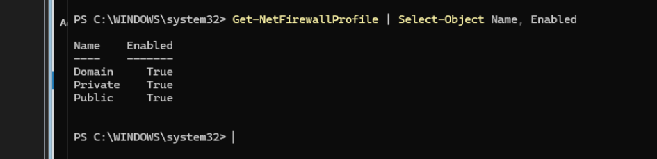

### Validation

The firewall configuration was reviewed together with the successful connectivity and DNS tests performed during this phase.

The Windows 11 client was able to communicate with `DC01`, resolve Active Directory DNS records, and access required domain services.

Based on these results, Windows Firewall was not identified as preventing the validated Active Directory network communication.

## Essential Active Directory Ports

The network ports used by core Active Directory services were validated to confirm that the required services were listening and accessible on the domain controller.

The validation focused on DNS, LDAP, and Kerberos, which are essential components of the `lab.local` Active Directory environment.

### DNS and LDAP

DNS uses TCP port `53`, while LDAP uses TCP port `389`.

These services are required for DNS name resolution and directory communication between domain members and the domain controller.

The validation confirmed that the expected DNS and LDAP ports were available on `DC01`.

### Evidence

**Public evidence note:** The original screenshot was intentionally omitted from the public repository because it may contain internal laboratory network information, account identifiers, or sensitive security configuration details. The validation was performed as documented, but the screenshot is not included in the public version.
### Kerberos

Kerberos uses TCP port `88` for authentication within the Active Directory environment.

The availability of port `88` on `DC01` was validated as part of the service connectivity checks.

The successful validation confirmed that the domain controller was providing the Kerberos service required for Active Directory authentication.

### Evidence

**Public evidence note:** The original screenshot was intentionally omitted from the public repository because it may contain internal laboratory network information, account identifiers, or sensitive security configuration details. The validation was performed as documented, but the screenshot is not included in the public version.
### Validation

The availability of ports `53`, `88`, and `389` confirmed that the core DNS, Kerberos, and LDAP services required by the Active Directory environment were accessible on `DC01`.

These results provided a baseline for the broader service discovery performed with Nmap in the following section.

## Nmap Installation and Service Discovery

Nmap was installed on the Windows 11 client to perform network service discovery against the Active Directory domain controller.

The installation was validated from PowerShell using the Nmap version command.

### Nmap Installation Validation

The installed Nmap version and its compiled components were verified successfully.

The validation confirmed that Nmap was installed correctly and that Npcap was available as the packet capture component required by Nmap on Windows.

### Evidence

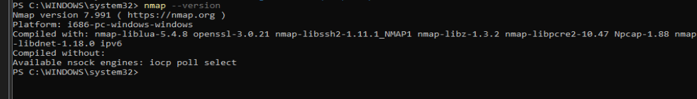

### DC01 Service Discovery

A TCP port scan was performed against the domain controller using its IPv4 address:

`10.10.10.10`

The scan identified the host as active and detected several open TCP ports associated with Active Directory and Windows Server services.

The following ports were identified as open:

| Port | Service |
|---:|---|
| `53` | DNS |
| `88` | Kerberos |
| `135` | MSRPC |
| `139` | NetBIOS Session Service |
| `389` | LDAP |
| `445` | Microsoft-DS / SMB |
| `464` | Kerberos Password Change |
| `593` | RPC over HTTP |
| `636` | LDAP over SSL |
| `3268` | Global Catalog LDAP |
| `3269` | Global Catalog LDAP over SSL |
| `5985` | WinRM |

The scan confirmed that `DC01.lab.local` was reachable and identified multiple open TCP ports associated with Active Directory, DNS, SMB, and Windows management services.

### Evidence

**Public evidence note:** The original screenshot was intentionally omitted from the public repository because it may contain internal laboratory network information, account identifiers, or sensitive security configuration details. The validation was performed as documented, but the screenshot is not included in the public version.
### Validation

The Nmap results were consistent with the services configured on `DC01`.

The presence of DNS, Kerberos, LDAP, SMB, Global Catalog, and WinRM ports provided additional evidence that the corresponding network services were reachable on the domain controller.

## SMB Port 445 and Firewall Validation

The Server Message Block (SMB) service was validated as part of the network and file-sharing troubleshooting process.

SMB uses TCP port `445` for direct file and printer sharing over the network. Because SMB access had previously been configured and validated in Phase 5, port `445` was specifically reviewed during this phase to confirm that the service remained accessible.

The Windows Firewall configuration was also examined to verify that the firewall was not blocking SMB communication between the Windows 11 client and `DC01`.

### SMB Port 445

The service discovery results confirmed that TCP port `445` was open on `DC01`.

This indicated that the Microsoft-DS/SMB service was listening and available on the domain controller.

### Evidence

**Public evidence note:** The original screenshot was intentionally omitted from the public repository because it may contain internal laboratory network information, account identifiers, or sensitive security configuration details. The validation was performed as documented, but the screenshot is not included in the public version.
### Validation

The successful identification of TCP port `445`, together with the previous SMB access tests performed in Phase 5, confirmed that SMB communication remained available between the Windows 11 client and `DC01`.

The firewall configuration was reviewed as part of the validation process, and no firewall-related issue preventing the tested SMB communication was identified.

## Wireshark DNS Packet Analysis

Wireshark was used to capture and analyze DNS traffic between the Windows 11 client and the domain controller.

The packet capture was reviewed to verify that DNS queries generated by the client were reaching `DC01` and that the domain controller was returning DNS responses.

### DNS Query

The captured traffic showed a DNS query originating from the Windows 11 client:

- **Source:** `10.10.10.20`
- **Destination:** `10.10.10.10`
- **Protocol:** DNS
- **Query:** `AAAA DC01.lab.local`

This demonstrated that the Windows 11 client was sending DNS queries to the domain controller.

### DNS Response

The corresponding DNS response was observed from `DC01`:

- **Source:** `10.10.10.10`
- **Destination:** `10.10.10.20`
- **Source Port:** `53`
- **Destination Port:** `57650`
- **Protocol:** DNS

The packet analysis confirmed that the domain controller was responding to DNS requests generated by the Windows 11 client.

### Packet-Level Validation

The captured DNS traffic provided packet-level evidence of communication between the Windows 11 client and `DC01`.

The analysis confirmed:

- The client was using `DC01` as its DNS server.
- DNS traffic was reaching the domain controller.
- `DC01` was responding to DNS queries.
- UDP port `53` was being used for the DNS communication.
- The DNS exchange was successfully observed at the packet level.

### Evidence

**Public evidence note:** The original screenshot was intentionally omitted from the public repository because it may contain internal laboratory network information, account identifiers, or sensitive security configuration details. The validation was performed as documented, but the screenshot is not included in the public version.
### Validation

The Wireshark capture complemented the previous DNS command-line tests and Nmap service discovery results.

The combination of DNS resolution tests, service discovery, and packet-level analysis confirmed that DNS communication between `WIN11-CLIENT01` and `DC01` was functioning correctly.

## Troubleshooting Findings

The troubleshooting activities performed during this phase provided practical validation of the network and Active Directory infrastructure.

Several areas were investigated to confirm that the Windows 11 client and the domain controller were communicating correctly.

### Network Connectivity

Connectivity between `WIN11-CLIENT01` and `DC01` was successfully verified over the VMware VMnet8 NAT network.

The client was able to reach the domain controller at `10.10.10.10`.

### DNS Resolution

Forward DNS resolution successfully identified `DC01.lab.local` and the Active Directory LDAP SRV record.

Reverse DNS resolution was also validated after reviewing and configuring the reverse lookup zone for the laboratory network.

The client address `10.10.10.20` successfully resolved to `WIN11-CLIENT01.lab.local`.

### Active Directory Service Discovery

Nmap service discovery confirmed that the domain controller was reachable and exposing the expected network services.

The scan identified services including DNS, Kerberos, LDAP, SMB, Global Catalog, and WinRM.

### Firewall Validation

Windows Firewall configuration was reviewed to determine whether local firewall rules could interfere with the required network services.

No firewall-related issue preventing the validated Active Directory, DNS, or SMB communication was identified.

### Packet-Level Analysis

Wireshark was used to confirm DNS communication at the packet level.

The capture showed DNS traffic from `WIN11-CLIENT01` to `DC01` and the corresponding DNS response from the domain controller.

These results provided additional evidence that DNS communication was functioning correctly.

## Final Validation and Outcome

The final validation confirmed that the Windows 11 client and the Windows Server 2025 domain controller were communicating correctly and that the main network and Active Directory services required by the laboratory environment were operational.

The following checks were successfully completed:

- `WIN11-CLIENT01` successfully communicated with `DC01` over the VMware VMnet8 network.
- DNS forward resolution successfully identified `DC01.lab.local`.
- The Active Directory LDAP SRV record `_ldap._tcp.dc._msdcs.lab.local` successfully identified `DC01` as the LDAP server.
- Reverse DNS resolution successfully mapped `10.10.10.20` to `WIN11-CLIENT01.lab.local`.
- The reverse DNS zone for the laboratory network was configured and validated.
- DHCP release and renewal operations were successfully tested.
- Windows Firewall configuration was reviewed and did not prevent the validated network communication.
- Essential Active Directory ports, including DNS, Kerberos, and LDAP, were confirmed to be available.
- Nmap successfully identified the expected Active Directory and Windows Server services on `DC01`.
- TCP port `445` was confirmed to be available for SMB communication.
- Wireshark packet analysis confirmed DNS queries and responses between `WIN11-CLIENT01` and `DC01`.

The combined results from command-line testing, DNS validation, service discovery, firewall inspection, and packet-level analysis confirmed that the laboratory network and Active Directory infrastructure were functioning as expected.

### LAB 6 Status

**LAB 6 — COMPLETED** ✅

The networking and troubleshooting activities were successfully completed.

This phase demonstrated practical troubleshooting skills involving Windows networking, DHCP, DNS, Active Directory service discovery, Windows Firewall, SMB, Wireshark packet analysis, and Nmap service discovery.

The laboratory environment is now ready for the next stage of the cybersecurity lab.

⬆️ [Back to Roadmap](#lab-roadmap)


<a id="lab-7"></a>
# LAB 7 — Windows Security & Hardening

## Objective

The objective of this phase is to assess, harden, and validate the security configuration of the Windows 11 domain-joined endpoint `WIN11-CLIENT01`.

This phase focuses on establishing a security baseline, reviewing Microsoft Defender, Windows Firewall, security policies, auditing configuration, and Windows services, followed by the implementation of selected hardening measures.

All security changes are validated after implementation to ensure that the endpoint remains fully operational and maintains connectivity with the Active Directory infrastructure.

### Main objectives

- Establish a security baseline before making changes.
- Review Microsoft Defender configuration and protection status.
- Review Windows Firewall profiles and relevant inbound rules.
- Review RDP, WinRM, SMB, and ICMP exposure.
- Review local security policies and auditing configuration.
- Identify unnecessary or potentially risky configurations.
- Apply selected security hardening measures.
- Validate Defender and Firewall operation after hardening.
- Validate DNS, SMB, Group Policy, domain membership, and the Active Directory secure channel.
- Document all relevant changes and evidence.


## Scope

The main systems involved in this phase are:

| System | Role | Hostname |
|---|---|---|
| Windows Server | Active Directory / DNS | `DC01` |
| Windows 11 | Domain-joined endpoint | `WIN11-CLIENT01` |

The hardening activities in this phase are primarily performed on `WIN11-CLIENT01`.

The Active Directory infrastructure on `DC01` is used as the reference environment for post-hardening validation.

## 3. Lab Environment

### Infrastructure

| Component | Hostname | Role |
|---|---|---|
| Windows Server | `DC01` | Active Directory Domain Services / DNS |
| Windows 11 | `WIN11-CLIENT01` | Domain-joined client |
| Domain | `lab.local` | Active Directory domain |

### Network

| System | IP Address |
|---|---|
| `DC01` | `10.10.10.10` |
| `WIN11-CLIENT01` | `10.10.10.20` |

### Security Baseline

Before applying any hardening changes, the security configuration of `WIN11-CLIENT01` was reviewed and documented.

The baseline included:

- Microsoft Defender status and configuration.
- Windows Firewall profiles and relevant firewall rules.
- Remote Desktop (RDP) exposure.
- Windows Remote Management (WinRM) exposure.
- SMB inbound and outbound firewall rules.
- ICMP inbound rules.
- Local security policies.
- Password and account lockout policies.
- Advanced auditing configuration.
- Windows services.
- Domain membership and Group Policy status.

The baseline was established before applying the security hardening changes described in this document.

## Microsoft Defender — Security Baseline

The initial Microsoft Defender configuration was collected using PowerShell before applying any hardening changes.

### Defender Status

The following command was used to collect the Defender security status:

```powershell
Get-MpComputerStatus
```

The initial baseline confirmed that the main Microsoft Defender protection components were enabled.

| Protection | Initial Status |
|---|---|
| Microsoft Defender Antivirus | Enabled |
| Real-Time Protection | Enabled |
| Behavior Monitoring | Enabled |
| IOAV Protection | Enabled |
| On-Access Protection | Enabled |
| Network Inspection System (NIS) | Enabled |
| Tamper Protection | Enabled |
| Antivirus Signatures | Up to date |
| Antispyware Signatures | Up to date |

### Evidence

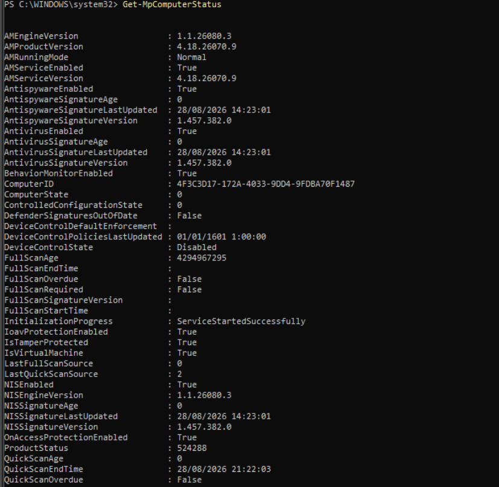 

### Defender Preferences

The detailed Microsoft Defender configuration was reviewed using:

```powershell
Get-MpPreference
```


The baseline was used to identify security settings that could benefit from additional hardening.

Relevant findings included:

- Network Protection was disabled.
- Removable drive scanning was disabled.
- Potentially Unwanted Application (PUA) protection was configured in Audit Mode.
- Script scanning was not disabled.
- Network file scanning was not disabled.
- Real-time monitoring was not disabled.
- Tamper Protection was not disabled.

### Evidence

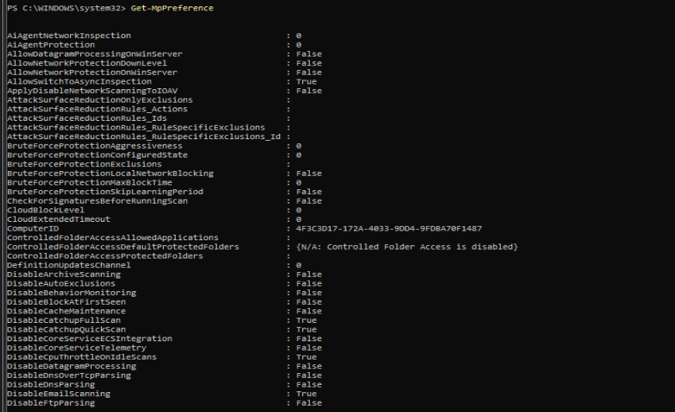


## Microsoft Defender — Hardening

After establishing the initial security baseline, selected Microsoft Defender settings were hardened.

The changes were chosen to improve endpoint protection while maintaining compatibility with the Active Directory lab environment.

### Network Protection

The initial configuration showed Network Protection as disabled.

The initial value was verified using:

```powershell
(Get-MpPreference).EnableNetworkProtection
```

Initial result:

```text
0
```

Network Protection was enabled using:

```powershell
Set-MpPreference -EnableNetworkProtection Enabled
```

The configuration was then verified using:

```powershell
(Get-MpPreference).EnableNetworkProtection
```

Final result:

```text
1
```

This confirmed that Network Protection was successfully enabled.

### Evidence

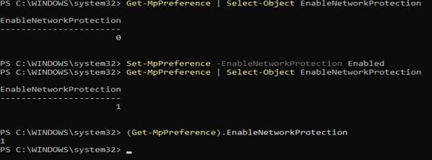


### Removable Drive Scanning

The initial configuration showed that removable drive scanning was disabled.

The initial value was verified using:

```powershell
(Get-MpPreference).DisableRemovableDriveScanning
```

Initial result:

```text
True
```

Removable drive scanning was enabled using:

```powershell
Set-MpPreference -DisableRemovableDriveScanning $false
```

The configuration was then verified using:

```powershell
(Get-MpPreference).DisableRemovableDriveScanning
```

Final result:

```text
False
```

This confirmed that removable drive scanning was no longer disabled.

### Evidence

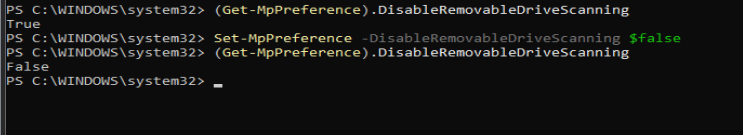

### Potentially Unwanted Application Protection

The initial Defender configuration showed PUA Protection in Audit Mode.

The initial value was verified using:

```powershell
(Get-MpPreference).PUAProtection
```

Initial result:

```text
2
```

The Windows Security interface also confirmed that protection against potentially unwanted applications was not configured to block these applications.

### Evidence — Initial Configuration

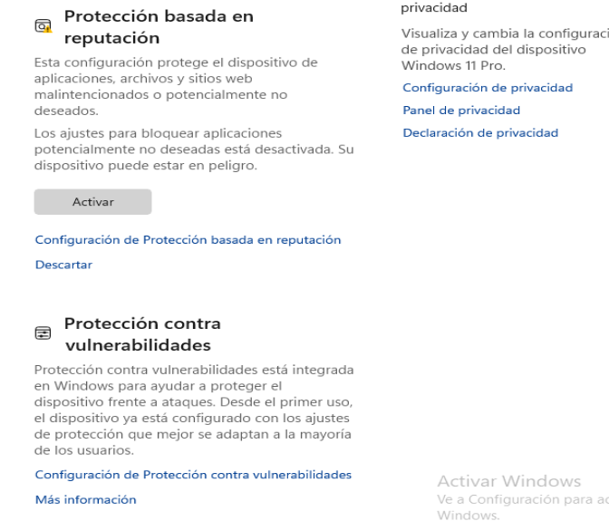

PUA Protection was enabled using:

```powershell
Set-MpPreference -PUAProtection Enabled
```

The configuration was then verified using:

```powershell
(Get-MpPreference).PUAProtection
```

Final result:

```text
1
```

This changed PUA Protection from Audit Mode to Block Mode.

### Evidence — Hardening


### Defender Hardening Summary

The following Microsoft Defender settings were hardened:

| Security Setting | Initial State | Final State |
|---|---|---|
| Network Protection | Disabled | Enabled |
| Removable Drive Scanning | Disabled | Enabled |
| PUA Protection | Audit Mode | Block Mode |

Other Defender security settings that were already correctly configured were left unchanged.

These included:

- Real-Time Protection
- Behavior Monitoring
- IOAV Protection
- On-Access Protection
- Network Inspection System (NIS)
- Tamper Protection
- Script Scanning
- Network File Scanning

This approach avoided unnecessary changes while focusing the hardening effort on specific security improvements.

### Final Defender Validation

The final Defender configuration was verified using:

```powershell
Get-MpPreference | Select-Object EnableNetworkProtection, DisableRemovableDriveScanning, PUAProtection
```

The final values were:

```text
EnableNetworkProtection        : 1
DisableRemovableDriveScanning  : False
PUAProtection                  : 1
```

These results confirmed that the three selected Defender hardening measures were successfully applied.


## Windows Firewall Hardening

Windows Defender Firewall was reviewed as part of the endpoint security hardening process.

The objective was to verify that unnecessary inbound administrative and file-sharing services were not exposed on `WIN11-CLIENT01`, while maintaining the network connectivity required by the Active Directory environment.

### Firewall Profiles

The status of the three Windows Firewall profiles was verified using:

```powershell
Get-NetFirewallProfile | Select-Object Name, Enabled, DefaultInboundAction, DefaultOutboundAction
```

The final validation confirmed that Windows Defender Firewall was enabled on all three profiles:

| Profile | Firewall Status |
|---|---|
| Domain | Enabled |
| Private | Enabled |
| Public | Enabled |

The default inbound and outbound actions were reported as `NotConfigured`. Therefore, individual firewall rules were reviewed to determine the effective exposure of specific services.

### Evidence

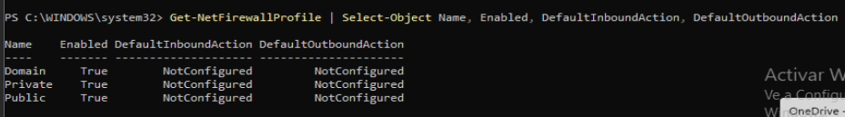


### Remote Desktop (RDP)

Remote Desktop firewall rules were reviewed to determine whether the endpoint accepted incoming RDP connections.

The following command was used:

```powershell
Get-NetFirewallRule -DisplayGroup "Escritorio remoto" | Select-Object DisplayName, Enabled, Profile, Direction, Action
```

The relevant Remote Desktop rules were found to be disabled:

| Rule | Direction | Status |
|---|---|---|
| Remote Desktop - TCP | Inbound | Disabled |
| Remote Desktop - TCP | Inbound | Disabled |
| Remote Desktop - UDP | Inbound | Disabled |

This configuration prevents the reviewed RDP firewall rules from allowing incoming Remote Desktop connections.

No changes were required.

### Evidence

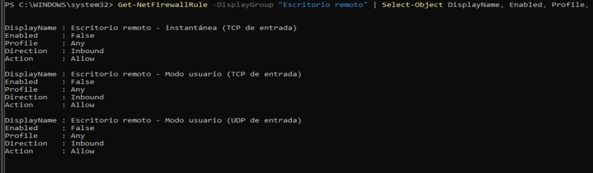

### Windows Remote Management (WinRM)

Windows Remote Management firewall rules were reviewed because WinRM provides remote administration capabilities and can increase the attack surface of an endpoint.

The following command was used:

```powershell
Get-NetFirewallRule -DisplayGroup "Administración remota de Windows" | Select-Object DisplayName, Enabled, Profile, Direction, Action
```

The reviewed WinRM inbound rules were disabled:

| Rule | Profile | Direction | Status |
|---|---|---|---|
| Windows Remote Management (HTTP-In) | Public | Inbound | Disabled |
| Windows Remote Management (HTTP-In) | Domain, Private | Inbound | Disabled |

No changes were required.

Keeping these inbound WinRM rules disabled reduces unnecessary remote administration exposure on the client.

### Evidence

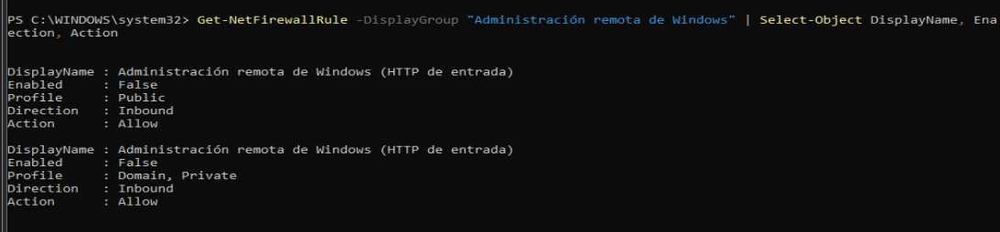

### SMB Firewall Rules

SMB-related firewall rules were reviewed because SMB is required for communication with domain infrastructure but should not be unnecessarily exposed for inbound connections on the Windows 11 client.

The firewall rules were located using:

```powershell
Get-NetFirewallRule | Where-Object {
    $_.DisplayName -like "*archivos*" -or
    $_.DisplayName -like "*impres*"
} | Select-Object DisplayName, DisplayGroup, Enabled, Direction, Action
```

The review identified multiple file and printer sharing rules.

The relevant SMB inbound rules were found to be disabled, including:

- `Compartir archivos e impresoras (SMB de entrada)`
- `Uso compartido de archivos e impresoras (restrictivo) (SMB de entrada)`

The corresponding SMB inbound rules were therefore not enabled on the client.

No firewall changes were required.

### Evidence

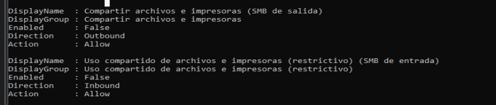

### ICMPv4 Inbound Rules

ICMPv4 inbound rules were reviewed to determine whether the Windows 11 endpoint accepted incoming echo requests.

The following command was used:

```powershell
Get-NetFirewallRule -DisplayName "*solicitud de eco*ICMPv4*" | Select-Object DisplayName, Enabled, Profile, Direction, Action
```

The reviewed inbound ICMPv4 echo request rules were disabled.

These included rules for:

- Network Diagnostics
- File and Printer Sharing
- Virtual Machine Monitoring

Therefore, the endpoint was not configured to allow the reviewed ICMPv4 echo request rules for inbound traffic.

No changes were required.

### Evidence

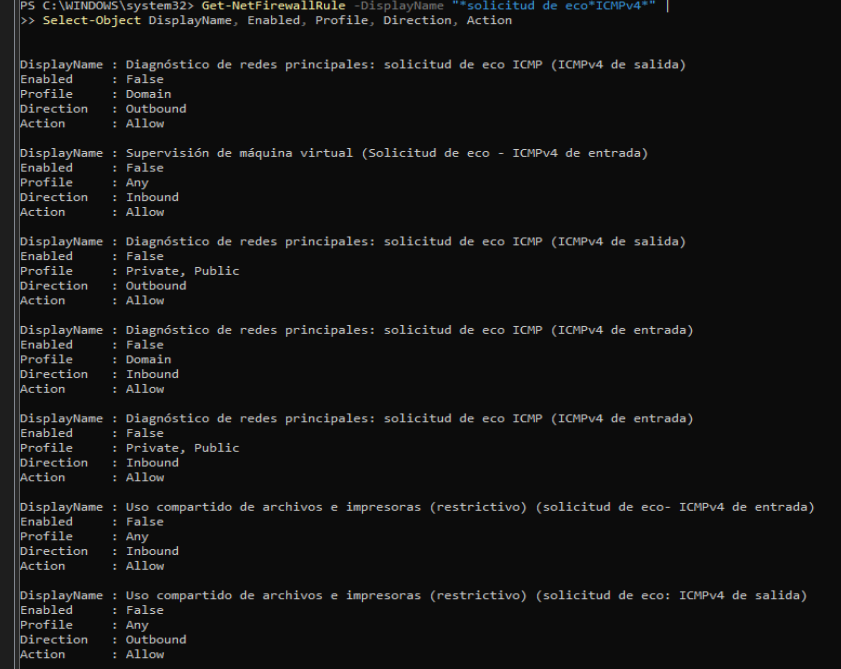

### Firewall Hardening Summary

The Windows Defender Firewall review confirmed that the firewall was enabled across all three network profiles.

The review also confirmed that unnecessary inbound exposure for the following services was restricted:

| Service / Protocol | Inbound Status | Action |
|---|---|---|
| Remote Desktop (RDP) | Restricted | No change required |
| Windows Remote Management (WinRM) | Restricted | No change required |
| SMB | Restricted | No change required |
| ICMPv4 Echo | Restricted | No change required |

The firewall configuration was intentionally not modified where the existing configuration already provided the desired security posture.

This avoided unnecessary changes while maintaining compatibility with the Active Directory environment.

### Firewall Post-Hardening Validation

After completing the firewall review, connectivity to the domain controller was tested to ensure that the hardening process had not disrupted required network communication.

The following command was used:

```powershell
Test-NetConnection DC01 -Port 445
```

The result was:

```text
ComputerName     : DC01
RemoteAddress    : 10.10.10.10
RemotePort       : 445
InterfaceAlias   : Ethernet0
SourceAddress    : 10.10.10.20
TcpTestSucceeded : True
```

This confirmed that `WIN11-CLIENT01` could still establish a TCP connection to the SMB service on `DC01`.

### Evidence

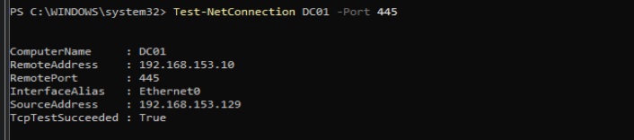

## Security Policies & Auditing

As part of the Windows 11 security hardening process, the local security configuration and Windows auditing policies of `WIN11-CLIENT01` were reviewed.

The objective was to establish a security baseline for authentication, account management, security options, and Windows auditing before applying additional security controls.

The review was performed using the Local Security Policy console and the Advanced Audit Policy Configuration interface.

### Local Security Policy

The Local Security Policy configuration was reviewed using:

```powershell
secpol.msc
```

The review covered the main security policy areas available on the Windows 11 endpoint, including:

- Account Policies
- Local Policies
- Security Options
- Advanced Audit Policy Configuration

The purpose of the review was to identify existing security controls and determine whether additional configuration was required.

The existing configuration was reviewed before making any changes.

No unnecessary policy modifications were performed during this stage.

### Account Policies

The Account Policies section was reviewed as part of the security baseline.

The review included:

- Password Policy
- Account Lockout Policy

These policies were reviewed to assess the existing authentication and account protection configuration of the endpoint.

The configuration was examined through the Local Security Policy console.

No unnecessary changes were applied to the existing account policy configuration.

### Local Policies and Security Options

The Local Policies section was reviewed to assess the security configuration of the Windows 11 endpoint.

The review included:

- Audit Policy
- User Rights Assignment
- Security Options

The existing configuration was examined to identify security settings that were already configured and settings that remained at their default or unconfigured state.

No unnecessary changes were introduced during this review.

### Advanced Audit Policy Configuration

Advanced Audit Policy Configuration was reviewed in detail as part of the Windows security baseline.

The audit policy tree was reviewed category by category, including:

- Account Logon
- Account Management
- Detailed Tracking
- DS Access
- Logon/Logoff
- Object Access
- Policy Change
- Privilege Use
- System
- Global Object Access Auditing

The purpose of this review was to determine which security events were configured for auditing and which remained unconfigured.

During the review, the available audit categories were found to contain multiple policies in the `Not Configured` state.

The existing configuration was documented rather than enabling every available audit subcategory individually.

### Authentication and Kerberos Auditing

The following authentication-related audit policies were specifically reviewed:

- Audit Credential Validation
- Audit Kerberos Authentication Service
- Audit Kerberos Service Ticket Operations
- Audit Logon

These policies were found to be `Not Configured` during the review.

No changes were made to these policies because the objective of this stage was to establish the current security baseline rather than enable every available audit category.

### Evidence

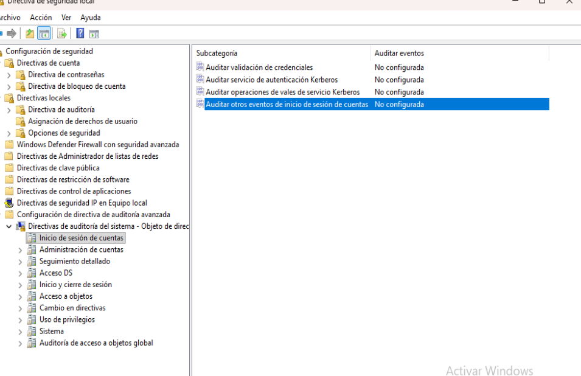

### Audit Policy Review

The complete Advanced Audit Policy tree was reviewed from the Local Security Policy interface.

The review established that multiple audit categories and subcategories remained in their existing `Not Configured` state.

The review covered authentication, account management, logon/logoff, object access, policy change, privilege use, system, and directory service access auditing.

No unnecessary audit policies were enabled during this phase.

This approach avoids introducing excessive audit activity without a defined monitoring requirement and provides a clear baseline for future security monitoring.

### Audit Review Summary

| Audit Area | Status |
|---|---|
| Account Logon | Reviewed |
| Account Management | Reviewed |
| Detailed Tracking | Reviewed |
| DS Access | Reviewed |
| Logon/Logoff | Reviewed |
| Object Access | Reviewed |
| Policy Change | Reviewed |
| Privilege Use | Reviewed |
| System | Reviewed |
| Global Object Access Auditing | Reviewed |

### Authentication Audit Subcategories

| Audit Subcategory | Initial State |
|---|---|
| Audit Credential Validation | Not Configured |
| Audit Kerberos Authentication Service | Not Configured |
| Audit Kerberos Service Ticket Operations | Not Configured |
| Audit Logon | Not Configured |

### Security Policies & Auditing — Final Assessment

The security policy and auditing review established a documented baseline for the Windows 11 endpoint before additional hardening.

The assessment covered:

| Security Area | Result |
|---|---|
| Password Policy | Reviewed |
| Account Lockout Policy | Reviewed |
| Local Security Policy | Reviewed |
| Security Options | Reviewed |
| Advanced Audit Policy | Reviewed |
| Authentication Auditing | Reviewed |
| Kerberos Auditing | Reviewed |
| Logon Auditing | Reviewed |

Several audit policies were identified as `Not Configured`.

No unnecessary changes were made to these policies during this phase.

The resulting baseline provides a reference point for future security monitoring, Windows Event Log analysis, and additional auditing configuration in later phases of the Home Lab.

## Windows Services Hardening

Windows services were reviewed as part of the endpoint hardening process.

The objective was to identify services that were not required by the laboratory environment and determine whether disabling any of them would reduce the attack surface without affecting Active Directory, networking, Windows security, or VMware functionality.

### Running Services Baseline

The running services on `WIN11-CLIENT01` were reviewed using PowerShell:

```powershell
Get-Service | Where-Object {$_.Status -eq "Running"} | Sort-Object DisplayName | Select-Object Status, Name, DisplayName
```

The review identified services required for the operation of the Windows 11 endpoint and the Active Directory laboratory environment.

Services associated with Active Directory, networking, Windows security, event logging, VMware, and domain functionality were intentionally left unchanged.

Examples included:

- `Netlogon` — Net Logon
- `LanmanWorkstation` — Workstation
- `Dnscache` — DNS Client
- `gpsvc` — Group Policy Client
- `WinDefend` — Microsoft Defender Antivirus Service
- `WdNisSvc` — Microsoft Defender Antivirus Network Inspection Service
- `mpssvc` — Windows Defender Firewall
- `BFE` — Base Filtering Engine
- `EventLog` — Windows Event Log
- `W32Time` — Windows Time
- `VMTools` — VMware Tools
- `VGAuthService` — VMware Alias Manager and Ticket Service

No services were disabled simply because they were running.

### Print Spooler

The Print Spooler service was identified as a potential hardening candidate.

The service was checked using:

```powershell
Get-Service Spooler | Select-Object Status, StartType, Name, DisplayName
```

Initial result:

```text
Status     : Running
StartType  : Automatic
Name       : Spooler
DisplayName: Cola de impresión
```

The laboratory Windows 11 endpoint does not use a printer and does not require the Print Spooler service.

Therefore, the service was selected for hardening to reduce unnecessary attack surface.

The startup type was changed to `Disabled` using:

```powershell
Set-Service -Name Spooler -StartupType Disabled
```

The service was then stopped:

```powershell
Stop-Service -Name Spooler
```

The final configuration was verified using:

```powershell
Get-Service -Name Spooler | Select-Object Status, StartType, Name, DisplayName
```

Final result:

```text
Status     : Stopped
StartType  : Disabled
Name       : Spooler
DisplayName: Cola de impresión
```

This confirmed that the Print Spooler service was successfully stopped and configured as disabled.

### Evidence

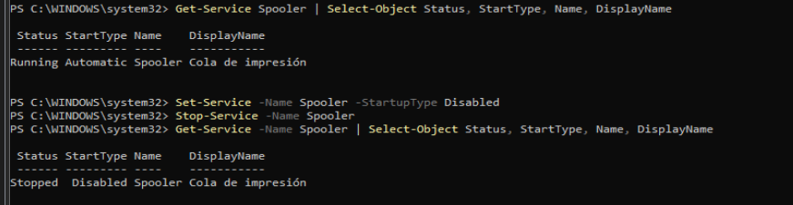

### SSDP Service Review

The SSDP Discovery service was also reviewed as a potential hardening candidate.

The service was checked using:

```powershell
Get-Service -Name SSDPSRV | Select-Object Status, StartType, Name, DisplayName
```

Initial result:

```text
Status     : Running
StartType  : Manual
Name       : SSDPSRV
DisplayName: Detección SSDP
```

The service was left unchanged.

The reason for leaving it unchanged was that it was configured with a `Manual` startup type and there was no demonstrated requirement to modify it as part of this phase.

This follows the principle of making only security changes that are justified and validated.

### Critical Services Validation

After the service hardening activity, the critical services required by the laboratory environment were validated.

The following command was used:

```powershell
Get-Service WinDefend, WdNisSvc, mpssvc, BFE, EventLog, gpsvc, Netlogon, LanmanWorkstation, Dnscache, W32Time |
Select-Object Status, Name
```

Final validation result:

```text
Status  Name
------  ----
Running BFE
Running Dnscache
Running EventLog
Running gpsvc
Running LanmanWorkstation
Running mpssvc
Running Netlogon
Running W32Time
Running WdNisSvc
Running WinDefend
```

All critical services were confirmed to be running.

### Evidence

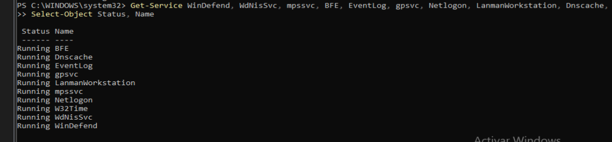

### Group Policy Service Validation

During the validation process, the Group Policy Client service (`gpsvc`) was temporarily observed in a stopped state.

Its configuration was checked using:

```powershell
Get-Service gpsvc | Select-Object Status, StartType, Name, DisplayName
```

The service was configured as:

```text
Status     : Stopped
StartType  : Automatic
Name       : gpsvc
DisplayName: Cliente de directiva de grupo
```

Instead of manually forcing the service to start, Group Policy processing was triggered using:

```powershell
gpupdate /force
```

The operation completed successfully:

```text
La actualización de la directiva de equipo se completó correctamente.
Se completó correctamente la Actualización de directiva de usuario.
```

The service was then checked again:

```powershell
Get-Service gpsvc | Select-Object Status, StartType, Name, DisplayName
```

Final result:

```text
Status     : Running
StartType  : Automatic
Name       : gpsvc
DisplayName: Cliente de directiva de grupo
```

This confirmed that Group Policy processing remained operational after the hardening activities.

### Evidence

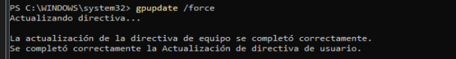

### 8.6 Services Hardening Summary

The service review resulted in the following actions:

| Service | Initial State | Final State | Action |
|---|---|---|---|
| Print Spooler | Running / Automatic | Stopped / Disabled | Hardened |
| SSDP Discovery | Running / Manual | Running / Manual | No change |
| Group Policy Client | Stopped / Automatic during validation | Running / Automatic | Validated |
| Microsoft Defender | Running | Running | No change |
| Windows Defender Firewall | Running | Running | No change |
| Netlogon | Running | Running | No change |
| DNS Client | Running | Running | No change |
| Workstation | Running | Running | No change |
| Windows Time | Running | Running | No change |

The service hardening approach focused on removing unnecessary functionality while preserving services required for security, networking, Active Directory, Group Policy, and virtualization.

No additional services were disabled without a clear operational justification.

## Post-Hardening Validation

After completing the security hardening activities, the Windows 11 endpoint was fully validated to ensure that the security changes did not disrupt the functionality required by the Active Directory laboratory environment.

The validation focused on Microsoft Defender, Windows Firewall, DNS, SMB connectivity, domain membership, Group Policy processing, critical Windows services, and the secure channel between `WIN11-CLIENT01` and `DC01`.

### Microsoft Defender Validation

The final Defender configuration was verified using:

```powershell
Get-MpPreference | Select-Object EnableNetworkProtection, DisableRemovableDriveScanning, PUAProtection
```

Final result:

```text
EnableNetworkProtection        : 1
DisableRemovableDriveScanning  : False
PUAProtection                  : 1
```

These values confirmed that the three selected Defender hardening measures remained correctly applied.

The Microsoft Defender Antivirus and Network Inspection System services were also confirmed to be running during the final services validation.

---

### Windows Firewall Validation

The Windows Defender Firewall profiles were checked after the hardening activities using:

```powershell
Get-NetFirewallProfile | Select-Object Name, Enabled, DefaultInboundAction, DefaultOutboundAction
```

Final result:

```text
Name     Enabled
----     -------
Domain   True
Private  True
Public   True
```

Windows Defender Firewall was therefore confirmed to be enabled on all three network profiles.

### Evidence


### SMB Connectivity Validation

SMB connectivity between `WIN11-CLIENT01` and the domain controller was tested using TCP port 445:

```powershell
Test-NetConnection DC01 -Port 445
```

Result:

```text
ComputerName     : DC01
RemoteAddress    : 10.10.10.10
RemotePort       : 445
InterfaceAlias   : Ethernet0
SourceAddress    : 10.10.10.20
TcpTestSucceeded : True
```

The successful result confirmed that the client could still establish TCP connectivity to the SMB service on `DC01` after the hardening activities.

### Evidence


### DNS Resolution Validation

DNS resolution for the domain controller was tested using:

```powershell
Resolve-DnsName dc01.lab.local
```

Result:

```text
Name            : dc01.lab.local
Type            : A
TTL             : 3600
Section         : Answer
IPAddress       : 10.10.10.10
```

The result confirmed that `dc01.lab.local` continued to resolve correctly to the domain controller's IP address.

### Evidence

**Public evidence note:** The original screenshot was intentionally omitted from the public repository because it may contain internal laboratory network information, account identifiers, or sensitive security configuration details. The validation was performed as documented, but the screenshot is not included in the public version.
### Domain Membership Validation

The Windows 11 endpoint's domain membership was verified using:

```powershell
(Get-CimInstance Win32_ComputerSystem) | Select-Object Name, Domain, PartOfDomain
```

Final result:

```text
Name         : WIN11-CLIENT01
Domain       : lab.local
PartOfDomain : True
```

This confirmed that the endpoint remained correctly joined to the Active Directory domain after the hardening process.

### Evidence

**Public evidence note:** The original screenshot was intentionally omitted from the public repository because it may contain internal laboratory network information, account identifiers, or sensitive security configuration details. The validation was performed as documented, but the screenshot is not included in the public version.
---

### 9.6 Group Policy Validation

Group Policy processing was validated using:

```powershell
gpupdate /force
```

The update completed successfully:

```text
La actualización de la directiva de equipo se completó correctamente.
Se completó correctamente la Actualización de directiva de usuario.
```

The resulting Group Policy configuration was reviewed using:

```powershell
gpresult /r
```

The results confirmed that Group Policy was being applied from:

```text
DC01.lab.local
```

The following GPO was applied:

```text
Default Domain Policy
```

The computer was identified as a member of the `LAB` domain.

### Evidence

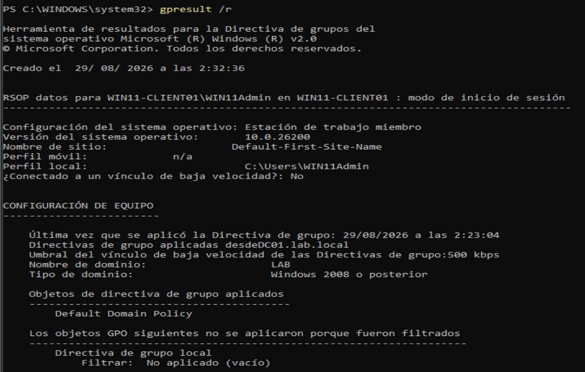

---

### Critical Windows Services Validation

The critical services required by the laboratory environment were verified using:

```powershell
Get-Service WinDefend, WdNisSvc, mpssvc, BFE, EventLog, gpsvc, Netlogon, LanmanWorkstation, Dnscache, W32Time | Select-Object Status, Name
```

Final result:

```text
Status  Name
------  ----
Running BFE
Running Dnscache
Running EventLog
Running gpsvc
Running LanmanWorkstation
Running mpssvc
Running Netlogon
Running W32Time
Running WdNisSvc
Running WinDefend
```

All critical services were confirmed to be running.

### Evidence


### Active Directory Secure Channel Validation

The final validation checked the secure channel between `WIN11-CLIENT01` and the `lab.local` Active Directory domain.

The following command was used:

```powershell
Test-ComputerSecureChannel -Verbose
```

The command returned:

```text
True
```

The verbose output confirmed:

```text
El canal seguro entre el equipo local y el dominio lab.local está en buen estado.
```

This confirmed that the trust relationship between `WIN11-CLIENT01` and the `lab.local` domain remained healthy after the hardening process.


### Post-Hardening Validation Summary

The final validation confirmed that the security hardening activities did not disrupt the core functionality of the laboratory environment.

| Validation | Result |
|---|---|
| Microsoft Defender | Passed |
| Windows Firewall | Passed |
| SMB TCP 445 connectivity | Passed |
| DNS resolution | Passed |
| Domain membership | Passed |
| Group Policy processing | Passed |
| Critical Windows services | Passed |
| Active Directory secure channel | Passed |

The endpoint remained fully operational and correctly integrated with the Active Directory infrastructure after the security hardening changes.

## Security Hardening Summary

The security hardening activities performed during this phase focused on reducing the attack surface of `WIN11-CLIENT01` while maintaining the functionality required by the Active Directory laboratory environment.

The hardening process followed a baseline-first approach:

1. Review the existing security configuration.
2. Identify unnecessary or weaker security settings.
3. Apply targeted hardening changes.
4. Verify each change.
5. Validate that domain functionality remained operational.

### Microsoft Defender

The following Microsoft Defender settings were hardened:

| Security Setting | Initial State | Final State |
|---|---|---|
| Network Protection | Disabled | Enabled |
| Removable Drive Scanning | Disabled | Enabled |
| PUA Protection | Audit Mode | Block Mode |

The changes were verified after configuration using `Get-MpPreference`.

The final configuration confirmed:

```text
EnableNetworkProtection        : 1
DisableRemovableDriveScanning  : False
PUAProtection                  : 1
```

### Windows Firewall

Windows Defender Firewall was reviewed across all three network profiles.

| Firewall Profile | Final Status |
|---|---|
| Domain | Enabled |
| Private | Enabled |
| Public | Enabled |

The review also confirmed that the relevant inbound firewall rules for RDP, WinRM, SMB, and ICMPv4 were disabled.

No unnecessary firewall changes were made because the existing configuration already provided the required security posture.

### Windows Services

The Windows services configuration was reviewed to identify unnecessary services.

The main hardening change was applied to the Print Spooler service:

| Service | Initial State | Final State |
|---|---|---|
| Print Spooler | Running / Automatic | Stopped / Disabled |

The SSDP Discovery service was reviewed but left unchanged because it was configured as `Manual` and no requirement was identified to disable it.

Critical services required for Windows security and Active Directory functionality remained operational.

### Security Policies and Auditing

Local Security Policy and Advanced Audit Policy Configuration were reviewed.

The review covered:

- Password Policy
- Account Lockout Policy
- Local Policies
- Security Options
- Advanced Audit Policy
- Account Logon
- Account Management
- Logon/Logoff
- Policy Change
- Privilege Use
- System
- DS Access
- Object Access

Several audit subcategories were found to be `Not Configured`.

No unnecessary audit policies were enabled during this phase.

### Hardening Philosophy

The hardening approach was intentionally conservative.

Security settings were changed only when there was a clear security benefit and when the change was appropriate for the laboratory environment.

Existing configurations that already provided an acceptable security posture were left unchanged.

This reduced the risk of introducing unnecessary configuration changes that could affect:

- Active Directory communication
- DNS resolution
- SMB connectivity
- Group Policy processing
- Windows security services
- Domain authentication

### Final Security Posture

After the hardening activities, the endpoint maintained connectivity and functionality with the Active Directory infrastructure.

The following areas were successfully validated:

| Security / Functionality Area | Result |
|---|---|
| Microsoft Defender | Passed |
| Windows Defender Firewall | Passed |
| RDP inbound exposure | Restricted |
| WinRM inbound exposure | Restricted |
| SMB inbound exposure | Restricted |
| ICMPv4 inbound exposure | Restricted |
| Print Spooler | Disabled |
| Critical security services | Running |
| DNS resolution | Passed |
| SMB TCP 445 connectivity | Passed |
| Group Policy | Passed |
| Domain membership | Passed |
| Active Directory secure channel | Passed |

The final configuration represents a hardened Windows 11 endpoint while preserving the functionality required by the Home Lab Active Directory environment.

## Evidence

The following evidence was collected throughout LAB 7 to document the security baseline, hardening changes, and post-hardening validation performed on `WIN11-CLIENT01`.

All screenshots are stored in the central `Screenshots/` directory of the Home Lab repository.

### Microsoft Defender

The following evidence documents the Defender configuration and hardening process:

| Evidence | Description |
|---|---|
| Defender Status Baseline | Initial Microsoft Defender protection status |
| Defender Preferences Baseline | Initial Defender configuration |
| Network Protection Hardening | Network Protection configuration and verification |
| Removable Drive Scanning Hardening | Removable drive scanning configuration and verification |
| PUA Protection Baseline | Initial PUA Protection configuration |
| PUA Protection Hardening | PUA Protection configuration after hardening |

### Evidence


### Windows Firewall

The following evidence documents the firewall review and validation:

| Evidence | Description |
|---|---|
| Firewall Profiles | Windows Defender Firewall profile configuration |
| RDP Rules | Remote Desktop inbound firewall rules |
| WinRM Rules | Windows Remote Management inbound firewall rules |
| SMB Rules | File and printer sharing / SMB firewall rules |
| ICMPv4 Rules | ICMPv4 inbound firewall rules |
| SMB Connectivity | TCP port 445 connectivity to `DC01` |

### Evidence


### Security Policies & Auditing

The following evidence documents the Advanced Audit Policy review:


The screenshot provides visual evidence of the Account Logon audit policy review performed during the security baseline assessment.

### Windows Services

The following evidence documents the service hardening and validation activities:


The evidence confirms that the Print Spooler service was disabled while critical Windows and Active Directory-related services remained operational.

### Validation Evidence

The post-hardening validation confirmed that the endpoint remained operational after the security changes.

The documented validation included:

- Microsoft Defender
- Windows Defender Firewall
- SMB connectivity
- DNS resolution
- Domain membership
- Group Policy processing
- Critical Windows services
- Active Directory secure channel

Where a specific screenshot was not collected, the validation result is documented through the corresponding PowerShell command and its recorded output in the previous sections.

This ensures that the evidence presented in this document reflects the actual tests performed during LAB 7.

## Conclusion

LAB 7 successfully established and validated a security hardening baseline for the Windows 11 domain-joined endpoint `WIN11-CLIENT01`.

The security assessment covered Microsoft Defender, Windows Defender Firewall, Windows services, local security policies, and Windows auditing configuration.

The main hardening actions successfully implemented were:

- Enabled Microsoft Defender Network Protection.
- Enabled scanning of removable drives.
- Changed Potentially Unwanted Application (PUA) Protection from Audit Mode to Block Mode.
- Disabled the Print Spooler service because it was not required by the laboratory environment.

Additional security areas were reviewed without unnecessary configuration changes, including:

- Remote Desktop (RDP)
- Windows Remote Management (WinRM)
- SMB
- ICMPv4
- Password Policy
- Account Lockout Policy
- Advanced Audit Policy
- SSDP Discovery
- Critical Windows services

After the hardening activities, the endpoint was validated to ensure that the security changes did not affect the functionality required by the Active Directory environment.

The final validation confirmed:

- Microsoft Defender remained operational.
- Windows Defender Firewall remained enabled.
- SMB connectivity to `DC01` remained available.
- DNS resolution for `dc01.lab.local` remained functional.
- `WIN11-CLIENT01` remained joined to the `lab.local` domain.
- Group Policy processing completed successfully.
- Critical Windows services remained operational.
- The Active Directory secure channel remained healthy.

The successful validation demonstrates that `WIN11-CLIENT01` was hardened without disrupting the core services required by the Home Lab environment.

**LAB 7 — Windows Security & Hardening: COMPLETED ✅**

⬆️ [Back to Roadmap](#lab-roadmap)


<a id="lab-8"></a>
# LAB 8 — Windows Event Logs & Monitoring

## Objective

The objective of this phase is to analyze Windows Event Logs and establish a basic monitoring methodology for the domain-joined endpoint `WIN11-CLIENT01`.

This phase focuses on Security, System, and Application logs, with particular attention to authentication events, privileged logons, failed authentication attempts, Group Policy processing, service configuration changes, application events, and process creation.

PowerShell and `Get-WinEvent` were also used to perform structured event queries and identify patterns within the collected security events.

The main objectives were:

- Review Windows Security, System, and Application logs.
- Identify relevant security events.
- Analyze successful and failed authentication events.
- Analyze privileged logons.
- Identify authentication patterns.
- Review Group Policy processing events.
- Review service configuration change events.
- Review Application log activity.
- Review process creation auditing.
- Use PowerShell to query and structure Windows Event Logs.
- Establish a basic authentication and process-monitoring baseline.
- Document relevant findings and evidence.

## Scope

The primary system analyzed during this phase was:

| System | Role | Hostname |
|---|---|---|
| Windows Server | Active Directory / DNS | `DC01` |
| Windows 11 | Domain-joined endpoint | `WIN11-CLIENT01` |

The event-log monitoring activities were primarily performed on `WIN11-CLIENT01`.

The Active Directory infrastructure on `DC01` was used as the reference environment for domain-related activity.

## Lab Environment

### Infrastructure

| Component | Hostname | Role |
|---|---|---|
| Windows Server | `DC01` | Active Directory Domain Services / DNS |
| Windows 11 | `WIN11-CLIENT01` | Domain-joined endpoint |
| Domain | `lab.local` | Active Directory domain |

### Network

| System | IP Address |
|---|---|
| `DC01` | `10.10.10.10` |
| `WIN11-CLIENT01` | `10.10.10.20` |

## Windows Event Log Baseline

The Windows Event Viewer was reviewed to establish an initial monitoring baseline.

The following Windows logs were analyzed:

- Security
- System
- Application

The Security log was used primarily for authentication and security auditing analysis.

The System log was used to review operating-system, Group Policy, and service-related activity.

The Application log was reviewed to identify application-level events and establish an additional baseline.

## Security Log Baseline

The Security log on `WIN11-CLIENT01` was reviewed before performing detailed event analysis.

The baseline showed active Windows Security Auditing events, including authentication and privileged logon activity.

### Evidence

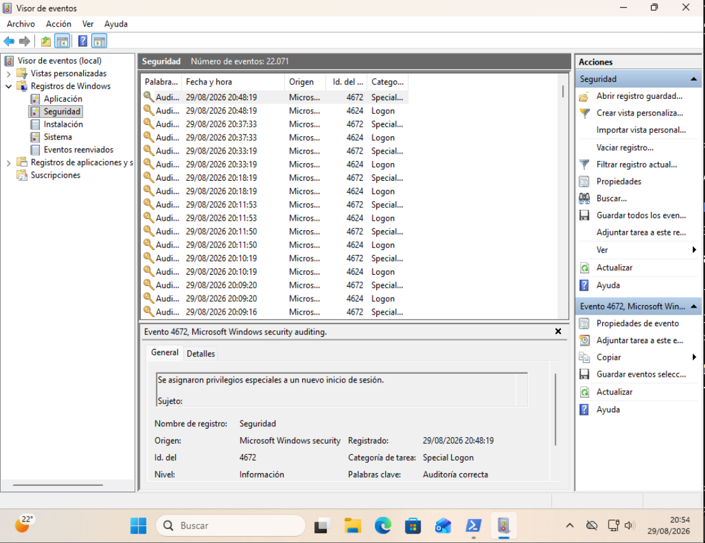

## Successful Authentication — Event ID 4624

Event ID `4624` represents a successful logon.

A real `4624` event from `WIN11-CLIENT01` was analyzed.

The event showed:

- `EventID`: `4624`
- `TargetUserName`: `SYSTEM`
- `TargetDomainName`: `NT AUTHORITY`
- `LogonType`: `5`
- `LogonProcessName`: `Advapi`
- `AuthenticationPackageName`: `Negotiate`
- `ProcessName`: `C:\Windows\System32\services.exe`
- `IpAddress`: `-`

The event represented a successful service logon performed by the Windows system rather than a remote user authentication.

### Evidence

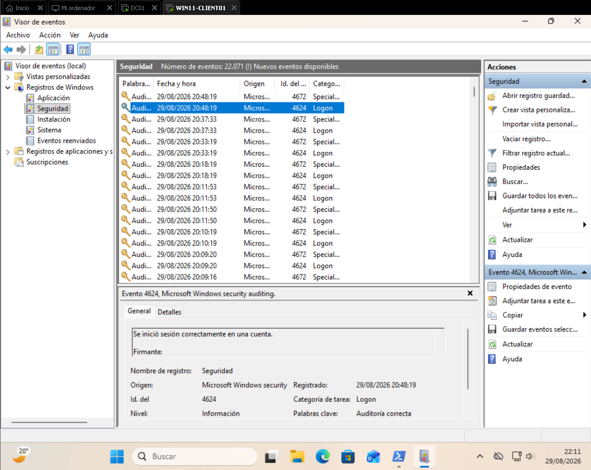

The XML representation was also reviewed to inspect the technical event fields.

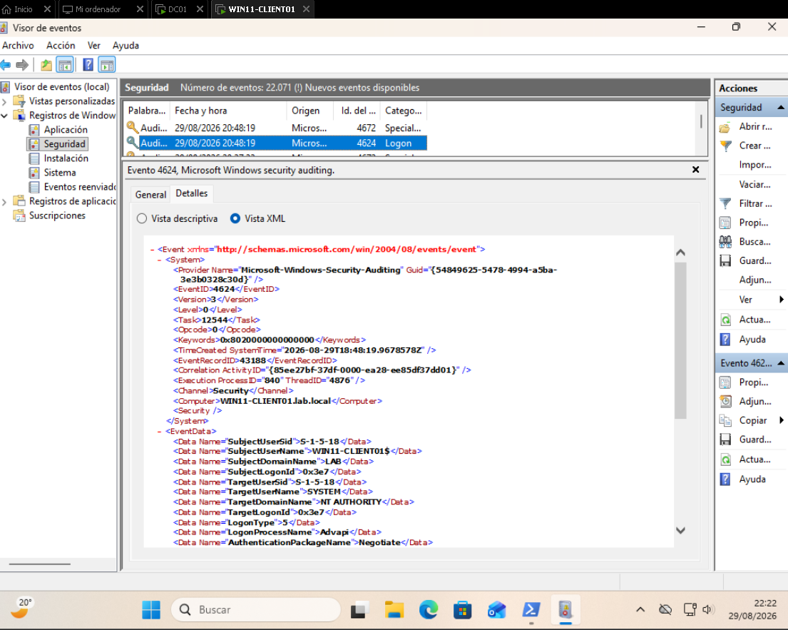

## Privileged Logon — Event ID 4672

Event ID `4672` was analyzed to identify special privileges assigned to a logon.

The analyzed event contained:

- `EventID`: `4672`
- `SubjectUserName`: `SYSTEM`
- `SubjectDomainName`: `NT AUTHORITY`
- `SubjectLogonId`: `0x3e7`

The event contained several special privileges, including:

- `SeAssignPrimaryTokenPrivilege`
- `SeTcbPrivilege`
- `SeSecurityPrivilege`
- `SeTakeOwnershipPrivilege`
- `SeLoadDriverPrivilege`
- `SeBackupPrivilege`
- `SeRestorePrivilege`
- `SeDebugPrivilege`
- `SeAuditPrivilege`
- `SeImpersonatePrivilege`

The event was associated with the integrated Windows `SYSTEM` account.

### Evidence

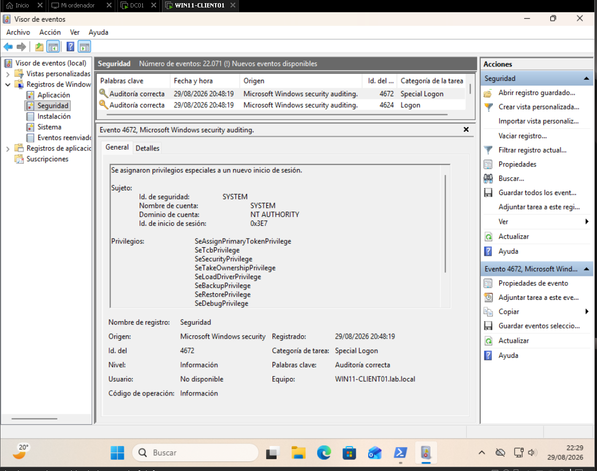

The XML representation was also analyzed.

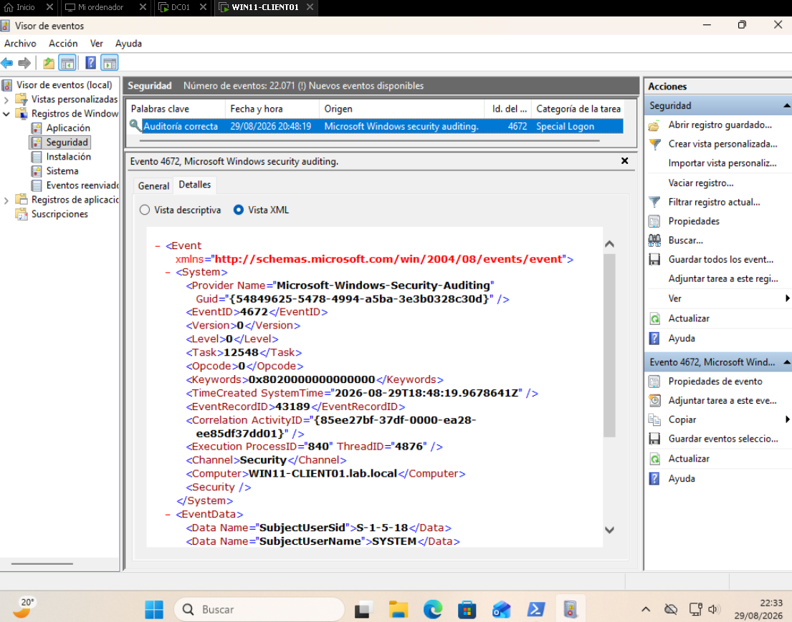

The `SubjectLogonId` value `0x3e7` was consistent with the system logon activity observed in the corresponding authentication events.

## Failed Authentication — Event ID 4625

Event ID `4625` represents a failed logon attempt.

A real `4625` event from `WIN11-CLIENT01` was investigated.

The analyzed event contained:

- `TargetUserName`: `WIN11Admin`
- `TargetDomainName`: `WIN11-CLIENT01`
- `LogonType`: `11`
- `Status`: `0xc000010b`
- `SubStatus`: `0x0`
- `LogonProcessName`: `CredPro`
- `AuthenticationPackageName`: `Negotiate`
- `WorkstationName`: `WIN11-CLIENT01`
- `ProcessName`: `C:\Windows\System32\consent.exe`
- `IpAddress`: `::1`

The `::1` address represents the IPv6 loopback address, indicating that the authentication request originated locally from the same system.

The event was therefore treated as local authentication activity rather than evidence of a remote authentication attack.

### Evidence

The technical XML representation was captured because it contained the relevant authentication fields.

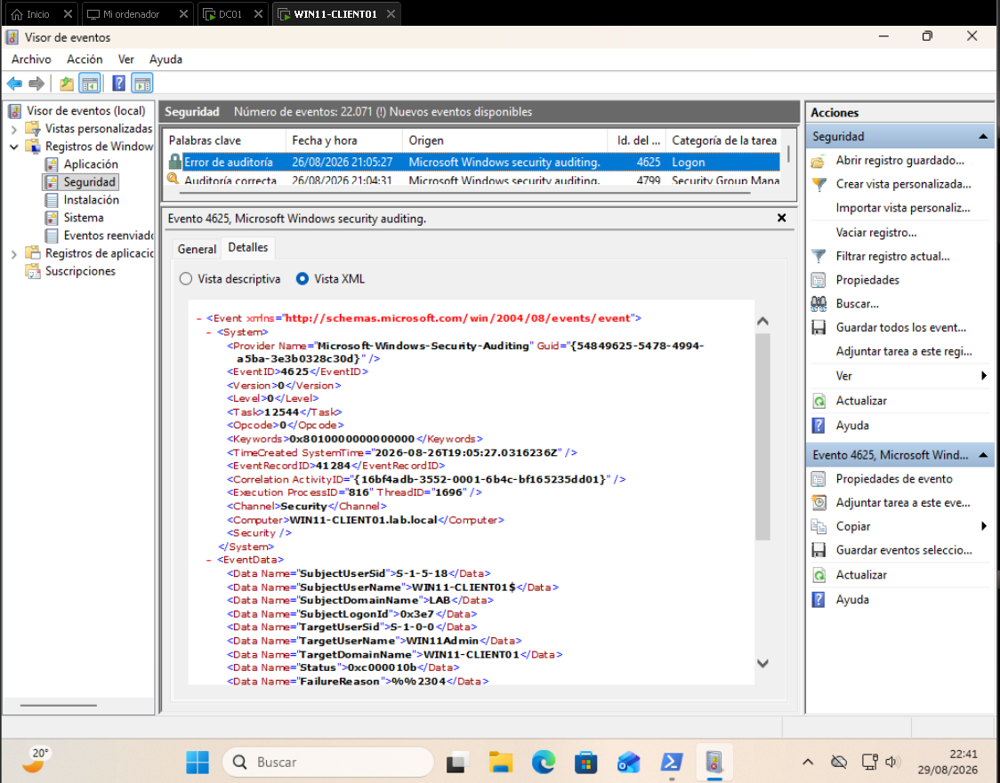

## Analysis of Failed Authentication Patterns

PowerShell was used to query the Security log and retrieve the most recent `4625` events.

The following event fields were extracted:

- TimeCreated
- TargetUserName
- TargetDomainName
- LogonType
- Status
- SubStatus
- WorkstationName
- IpAddress

The query returned multiple failed authentication events and allowed the events to be analyzed as structured data rather than individually through Event Viewer.

The observed events included local authentication attempts involving:

- `WIN11Admin`
- `WIN11-CLIENT01`
- `alex.admin`
- `taylor.user`

Several events used loopback addresses such as:

- `127.0.0.1`
- `::1`

This indicated that the observed failed authentication activity was local to `WIN11-CLIENT01`.

### Authentication Event Filter

The following PowerShell query was used to retrieve authentication-related events:

```powershell
Get-WinEvent -FilterHashtable @{
    LogName = 'Security'
    Id = 4624,4625,4672
} -MaxEvents 20 |
Select-Object TimeCreated, Id, ProviderName, LevelDisplayName
```

### Evidence

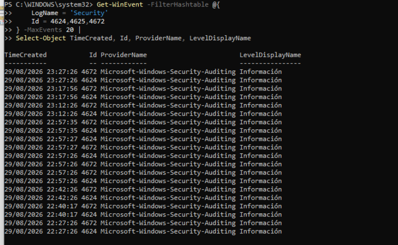

## Failed Authentication — Logon Type Distribution

The failed `4625` events were grouped by `LogonType`.

The resulting distribution was:

| Logon Type | Events |
|---:|---:|
| `11` | `9` |
| `2` | `8` |
| `3` | `3` |
| **Total** | **20** |

The results showed that the observed failed authentications were primarily associated with cached interactive and interactive logon types.

The three `LogonType 3` events did not contain a usable remote source IP address. Therefore, they could not be reliably classified as remote authentication attempts based solely on the available evidence.

### Evidence

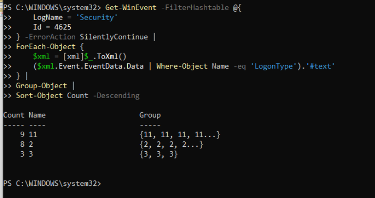

## Successful Authentication — Logon Type Distribution

The same analysis was performed against successful `4624` events.

The observed distribution was:

| Logon Type | Events |
|---:|---:|
| `5` | `1203` |
| `2` | `130` |
| `3` | `50` |
| `11` | `14` |
| `0` | `12` |
| `7` | `9` |

The high number of `LogonType 5` events was investigated further.

A representative `4624` event showed:

- `TargetUserName`: `SYSTEM`
- `TargetDomainName`: `NT AUTHORITY`
- `LogonType`: `5`
- `ProcessName`: `C:\Windows\System32\services.exe`
- `IpAddress`: `-`

This is consistent with service-related logon activity generated by Windows.

### Evidence

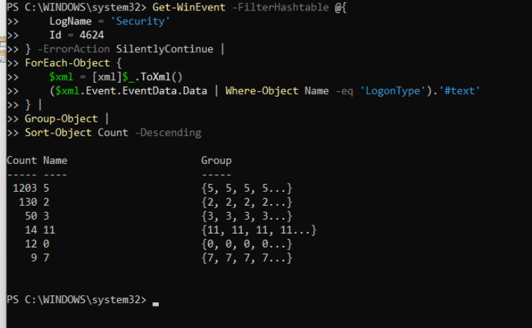

## Remote Authentication Check

A PowerShell query was used to search successful `4624` events for source IP addresses other than:

- `-`
- `127.0.0.1`
- `::1`

The query returned no results.

Therefore, within the currently retained events queried during this lab, no successful `4624` events with a non-loopback source IP address were identified.

This result does not prove that the system has never received a remote authentication. It only describes the events currently available in the queried Security log.


## Account Lockout Monitoring — Event ID 4740

Event ID `4740` was queried to determine whether account lockout events were present.

The query returned no results.

Therefore, no account lockout events were identified in the currently available Security log during this analysis.

No artificial account lockout was generated because there was no operational requirement to create one.

## Security Audit Policy Change — Event ID 4719

Event ID `4719` was queried to determine whether changes to the Windows system audit policy were present in the Security log.

The query returned no results.

No audit policy changes were identified in the currently available Security log during this analysis.

No artificial audit policy change was performed solely to generate an event.

## System Log Baseline

The Windows System log was reviewed to identify operating-system and service-related activity.

The baseline contained events from sources including:

- `GroupPolicy`
- `Service Control Manager`
- `Kernel-General`
- `WindowsUpdateClient`
- `Winlogon`
- `DistributedCOM`

The presence of warning events was not automatically interpreted as malicious activity. Individual events were considered in context.

### Evidence

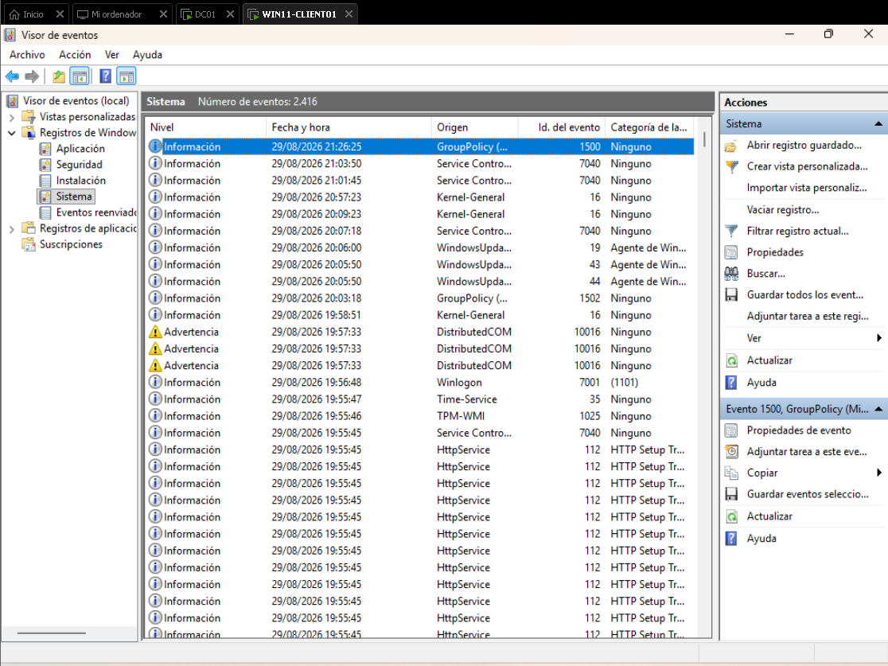

## Group Policy Processing — Event ID 1500

Event ID `1500` from `Microsoft-Windows-GroupPolicy` was analyzed.

The event reported that the computer Group Policy configuration was processed successfully and that no changes had been detected since the previous successful processing.

Relevant information included:

- `EventID`: `1500`
- `Computer`: `WIN11-CLIENT01.lab.local`
- `User`: `SYSTEM`
- `DCName`: `\\DC01.lab.local`
- `ProcessingTimeInMilliseconds`: `266`

This provided evidence that Group Policy processing was functioning correctly and that the client was communicating with the domain controller.

### Evidence

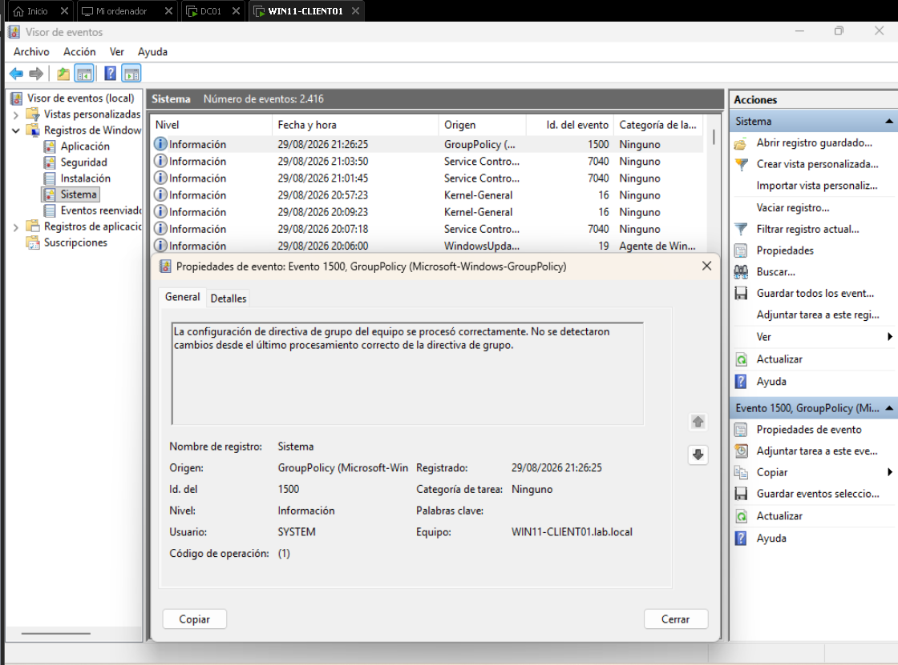

## Service Configuration Change — Event ID 7040

Event ID `7040` from `Service Control Manager` was analyzed.

The event recorded a change in the startup configuration of the Background Intelligent Transfer Service (BITS).

The recorded change was:

```text
Automatic → Start on demand
```

The event was generated by the `SYSTEM` account on `WIN11-CLIENT01.lab.local`.

No service configuration was modified as part of this investigation. The event was analyzed as existing system activity.

### Evidence

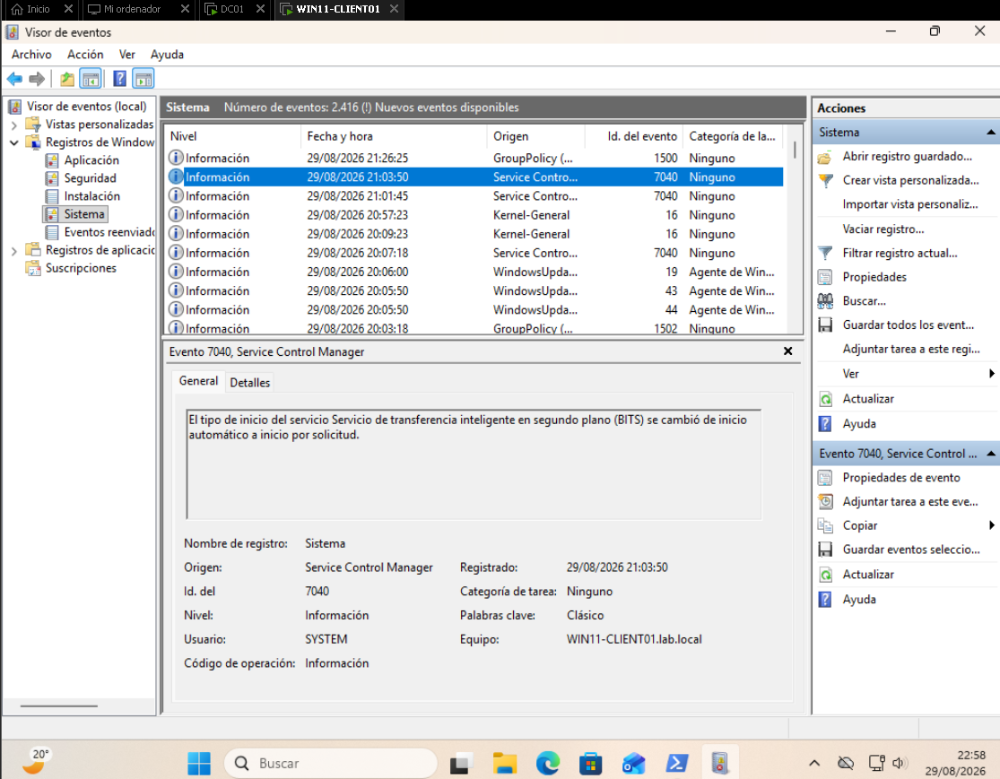

## Application Log Baseline

The Windows Application log was reviewed to establish an application-level monitoring baseline.

The log contained recent events from sources including:

- `Microsoft-Windows-Security-SPP`
- `SecurityCenter`
- `ESENT`

### Evidence

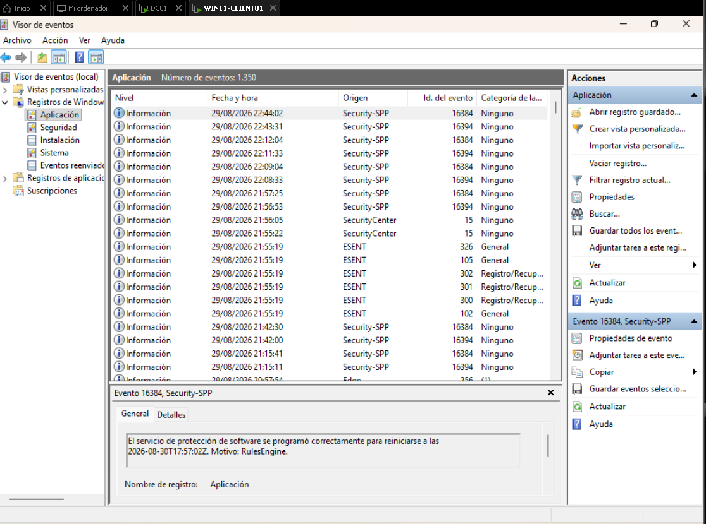

## Application Event — Security-SPP Event ID 16384

Event ID `16384` from `Microsoft-Windows-Security-SPP` was analyzed.

The event was an informational Application event generated by the Software Protection Platform Service.

Relevant fields included:

- `EventID`: `16384`
- `Channel`: `Application`
- `Computer`: `WIN11-CLIENT01.lab.local`
- `Level`: Information
- `Data`: `RulesEngine`

The event did not indicate an application error or malicious activity.

### Evidence

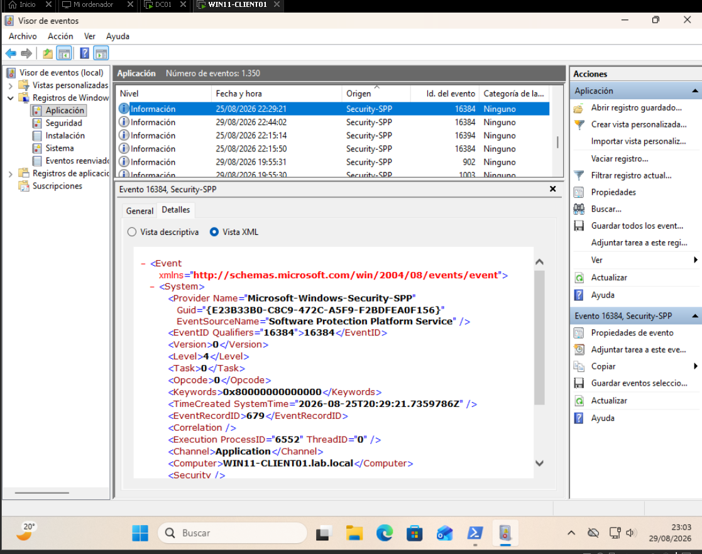

## Process Creation Auditing — Event ID 4688

Event ID `4688` was queried to determine whether process creation auditing was active.

Multiple `4688` events were found in the Security log.

A representative event recorded:

- New process: `C:\Windows\System32\lsass.exe`
- Creator process: `C:\Windows\System32\wininit.exe`
- Creator SID: `S-1-5-18`
- Token elevation type: `TokenElevationTypeDefault (1)`
- Logon ID: `0x3E7`

The process relationship:

```text
wininit.exe
    ↓
lsass.exe
```

is consistent with normal Windows system initialization.

The event was therefore treated as legitimate system activity.

### Evidence

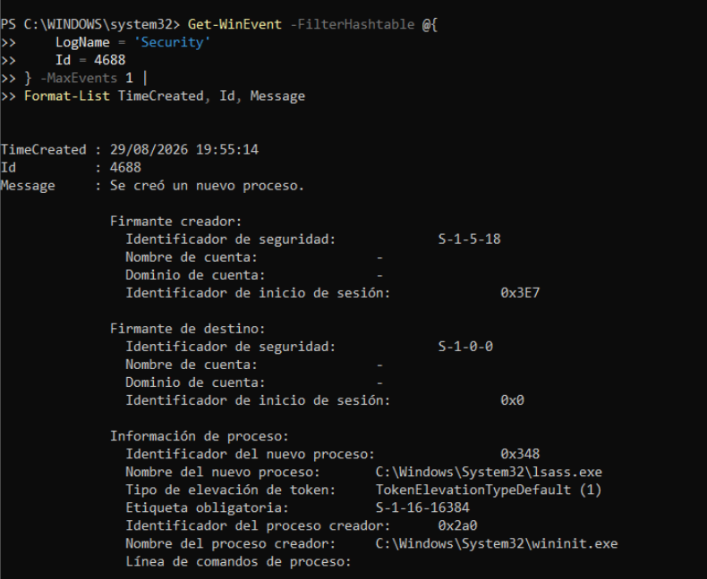

## Process Creation Monitoring Query

A PowerShell query was used to extract recent `4688` events into structured process information.

The query extracted:

- TimeCreated
- NewProcess
- ParentProcess
- SubjectUser

The most recent events primarily contained standard Windows system processes, including:

- `smss.exe`
- `csrss.exe`
- `wininit.exe`
- `winlogon.exe`
- `services.exe`
- `lsass.exe`
- `autochk.exe`
- `Registry`

The events were grouped around system startup activity.

### Evidence

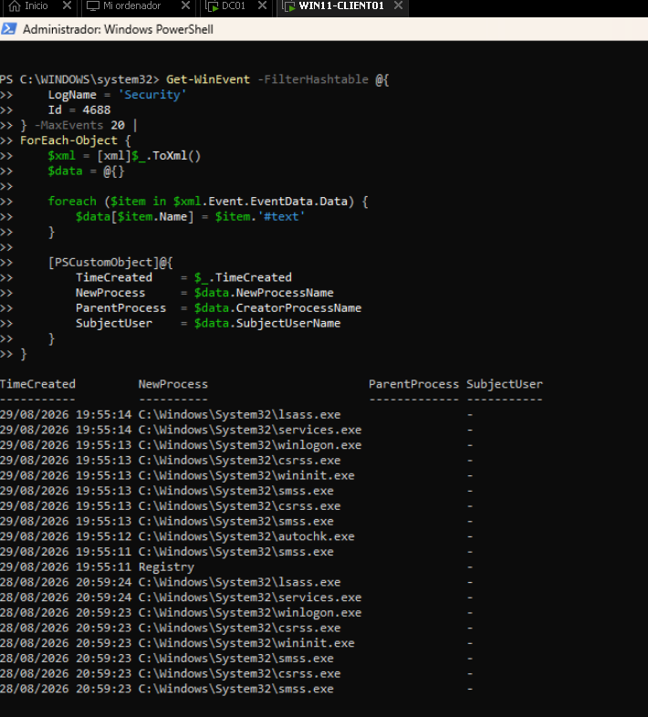

## Controlled Process Monitoring Test

A controlled test was performed using:

```powershell
Start-Process notepad.exe
```

The command successfully launched Notepad.

A subsequent query for recent `4688` events did not identify a corresponding `notepad.exe` event.

This result was not treated as a successful demonstration of process capture.

No evidence screenshot was retained for this test.

The existing `4688` evidence was considered sufficient to demonstrate that process creation auditing is active in the Security log.

## Monitoring Methodology

The following basic monitoring methodology was established during this phase.

### Step 1 — Identify the relevant log

Determine whether the activity belongs to:

- Security
- System
- Application

### Step 2 — Identify the event

Use the Event ID and event source to determine the type of activity.

### Step 3 — Inspect event details

Review relevant fields such as:

- Username
- Domain
- Logon Type
- Status
- SubStatus
- Process
- Parent process
- Source IP
- Workstation
- Logon ID

### Step 4 — Correlate related events

Events should not be interpreted individually when related events can provide additional context.

For example:

```text
4624 → Successful Logon
4672 → Special Privileges Assigned
```

can be analyzed together.

### Step 5 — Identify patterns

PowerShell and `Get-WinEvent` can be used to:

- filter events;
- extract fields;
- group events;
- count occurrences;
- identify repeated activity.

### Step 6 — Avoid unsupported conclusions

An event should not automatically be classified as malicious simply because it is:

- an error;
- a warning;
- a privileged event;
- a failed authentication;
- or associated with a system process.

Context and correlation are required.

## Key Findings

The following findings were identified during LAB 8:

1. Windows Security auditing is generating authentication events.
2. Successful authentication events (`4624`) are present.
3. Special privileged logons (`4672`) are present.
4. Failed authentication events (`4625`) are present.
5. The analyzed failed authentication activity was primarily local.
6. Loopback addresses `127.0.0.1` and `::1` were observed in local authentication events.
7. No successful `4624` event with a non-loopback source IP was identified by the specific query performed.
8. No `4740` account lockout events were identified.
9. No `4719` audit policy change events were identified.
10. Group Policy processing (`1500`) was successful and referenced `DC01.lab.local`.
11. A service configuration change (`7040`) was present for BITS.
12. Application logging was active.
13. Security-SPP informational activity (`16384`) was observed.
14. Process creation auditing (`4688`) was active.
15. PowerShell was successfully used to filter, extract, group, and analyze Windows event data.
16. The observed data demonstrates the value of correlating multiple event fields before classifying activity as suspicious.

## Conclusion

LAB 8 established a practical Windows Event Log monitoring and analysis workflow for the domain-joined endpoint `WIN11-CLIENT01`.

During this phase, the Security, System, and Application event logs were reviewed and analyzed using both Windows Event Viewer and PowerShell.

Security auditing events such as `4624`, `4625`, and `4672` were investigated to understand successful authentication, failed authentication, and privileged logon activity.

Additional system and application events were analyzed, including Group Policy processing (`1500`), service configuration changes (`7040`), Security-SPP activity (`16384`), and process creation auditing (`4688`).

PowerShell and `Get-WinEvent` were used to perform structured queries, extract relevant fields, group events, identify patterns, and establish basic authentication and process-monitoring baselines.

The analysis demonstrated the importance of correlating multiple event fields before determining whether an event represents suspicious activity. The observed authentication failures were primarily associated with local activity, while no successful authentication with a non-loopback source IP was identified by the specific query performed.

The phase also demonstrated that the absence of an event is itself a useful monitoring result, while also recognizing that the absence of an event in the currently retained logs does not prove that the activity has never occurred.

The controlled process-monitoring test further demonstrated the importance of validating assumptions against actual telemetry rather than treating the presence of an audit event as proof that every process execution will necessarily be captured by a simplified query.

Overall, LAB 8 provided the foundation for moving from manual event inspection toward structured security monitoring and basic event triage.

The knowledge and evidence collected in this phase will be used as the foundation for the next stage of the project:

**LAB 9 — Security Operations**, focusing on detection, triage, indicators of compromise (IOCs), investigation, and security incident documentation.

**LAB 8 — Windows Event Logs & Monitoring: COMPLETED**

⬆️ [Back to Roadmap](#lab-roadmap)


<a id="lab-9"></a>
# LAB 9 — Security Operations

## Introduction

This phase focuses on Windows security operations, event correlation, security monitoring, and basic incident triage.

The investigation was performed on the domain-joined Windows 11 endpoint `WIN11-CLIENT01` within the `lab.local` environment.

The objective of this phase was to move beyond individual Windows Event Log analysis and apply a structured security operations workflow.

The investigation included authentication events, privileged logons, credential access activity, group enumeration, PowerShell activity, process-related telemetry, controlled security simulations, and evidence correlation.

The phase also examined the limitations of the available Windows auditing configuration and demonstrated why additional telemetry sources can be valuable for security monitoring.

All potentially suspicious activity introduced during the practical exercise was performed in a controlled virtual machine environment using a previously created clean snapshot.

## Security Operations Baseline

The initial security operations baseline was established by reviewing the local user accounts configured on `WIN11-CLIENT01`.

The review was performed using PowerShell and the `Get-LocalUser` cmdlet.

The system contained the following local accounts:

| Account | Enabled |
|---|---|
| Administrador | False |
| DefaultAccount | False |
| Invitado | False |
| WDAGUtilityAccount | False |
| WIN11Admin | True |

The built-in `Administrador`, `DefaultAccount`, `Invitado`, and `WDAGUtilityAccount` accounts were disabled, while `WIN11Admin` was enabled.

This baseline was used as a reference during the subsequent authentication, privilege, and group enumeration investigations.

### Evidence

**Public evidence note:** The original screenshot was intentionally omitted from the public repository because it may contain internal laboratory network information, account identifiers, or sensitive security configuration details. The validation was performed as documented, but the screenshot is not included in the public version.
## Privileged Group Membership

The next stage of the baseline focused on identifying members of privileged local and domain security groups on `WIN11-CLIENT01`.

The local `Administradores` group was reviewed to determine which accounts and security principals had administrative privileges on the endpoint.

The investigation identified the following members:

| Name | ObjectClass | PrincipalSource |
|---|---|---|
| LAB\Admins. del dominio | Group | ActiveDirectory |
| WIN11-CLIENT01\Administrador | User | Local |
| WIN11-CLIENT01\WIN11Admin | User | Local |

The domain group `LAB\Admins. del dominio` was also reviewed separately. It contained the account `Alex Admin` (`alex.admin`) as a member.

This established the privileged access baseline used for the subsequent authentication and privilege escalation-related event analysis.

### Evidence

**Public evidence note:** The original screenshot was intentionally omitted from the public repository because it may contain internal laboratory network information, account identifiers, or sensitive security configuration details. The validation was performed as documented, but the screenshot is not included in the public version.
## Successful Authentication — Event ID 4624

Event ID `4624` represents a successful logon.

A `4624` event associated with the local administrative account `WIN11Admin` was analyzed on `WIN11-CLIENT01`.

The relevant event data showed:

| Field | Value |
|---|---|
| Event ID | 4624 |
| User | WIN11Admin |
| Domain | WIN11-CLIENT01 |
| Logon Type | 2 |
| Logon ID | 0x9413B |
| Source IP | 127.0.0.1 |

A second related `4624` event was also observed with Logon ID `0x941F8`.

The `LogonType` value `2` indicates an interactive logon. The source address `127.0.0.1` indicates that the authentication activity originated locally on the endpoint rather than from a remote network source.

These events established the authentication context used to correlate subsequent privileged activity associated with the `WIN11Admin` session.

### Evidence

**Public evidence note:** The original screenshot was intentionally omitted from the public repository because it may contain internal laboratory network information, account identifiers, or sensitive security configuration details. The validation was performed as documented, but the screenshot is not included in the public version.
## Special Privileges Assigned — Event ID 4672

Event ID `4672` indicates that special privileges were assigned to a new logon.

A `4672` event associated with the `WIN11Admin` administrative session was analyzed.

The event was correlated using the Logon ID `0x9413B`, which matched the previously identified `4624` authentication event.

The event showed the following privileges:

| Privilege |
|---|
| SeSecurityPrivilege |
| SeTakeOwnershipPrivilege |
| SeLoadDriverPrivilege |
| SeBackupPrivilege |
| SeRestorePrivilege |
| SeDebugPrivilege |
| SeSystemEnvironmentPrivilege |
| SeImpersonatePrivilege |
| SeDelegateSessionUserImpersonatePrivilege |

These privileges are associated with the administrative context of the `WIN11Admin` account.

The correlation between Event ID `4624` and Event ID `4672` demonstrates how the Logon ID can be used to associate an authentication event with the privileges assigned to the resulting session.

### Evidence

**Public evidence note:** The original screenshot was intentionally omitted from the public repository because it may contain internal laboratory network information, account identifiers, or sensitive security configuration details. The validation was performed as documented, but the screenshot is not included in the public version.
## Credential Manager Access — Event ID 5379

Event ID `5379` records an operation in which credentials stored in Windows Credential Manager were read.

A real `5379` event associated with `WIN11Admin` on `WIN11-CLIENT01` was analyzed.

The event showed:

| Field | Value |
|---|---|
| Event ID | 5379 |
| User | WIN11Admin |
| Domain | WIN11-CLIENT01 |
| Logon ID | 0x941F8 |
| Operation | Enumerate credentials |

The event indicated that the `WIN11Admin` account performed a read operation against Windows Credential Manager to enumerate stored credentials.

Credential Manager access is a security-relevant activity because credential enumeration can be performed by legitimate administrative software as well as by malicious tooling during credential-access activity.

The event was therefore treated as a security-relevant observation requiring contextual analysis rather than being classified as malicious by itself.

### Evidence

**Public evidence note:** The original screenshot was intentionally omitted from the public repository because it may contain internal laboratory network information, account identifiers, or sensitive security configuration details. The validation was performed as documented, but the screenshot is not included in the public version.
## Local Group Enumeration — Event IDs 4798 and 4799

Event IDs `4798` and `4799` were analyzed to identify local group and security-enabled group enumeration activity.

The investigation identified activity associated with the `WIN11Admin` account and the local `Administradores` group.

A relevant `4799` event showed:

| Field | Value |
|---|---|
| Event ID | 4799 |
| User | WIN11Admin |
| Domain | WIN11-CLIENT01 |
| Logon ID | 0x9413B |
| Target Group | Administradores |
| Process | `C:\Windows\System32\WindowsPowerShell\v1.0\powershell.exe` |

The event demonstrated that `WIN11Admin` enumerated membership information for the local `Administradores` security-enabled group.

The activity was correlated with the administrative session identified through Event ID `4624` using the matching Logon ID.

Group enumeration can be a legitimate administrative operation, but it is also relevant during security investigations because attackers may enumerate privileged groups to identify potential targets for privilege escalation.

In this case, the available evidence did not provide sufficient information to classify the activity as malicious.

### Evidence

**Public evidence note:** The original screenshot was intentionally omitted from the public repository because it may contain internal laboratory network information, account identifiers, or sensitive security configuration details. The validation was performed as documented, but the screenshot is not included in the public version.
## PowerShell Activity Correlation

PowerShell activity was correlated with the security events observed during the investigation.

PowerShell Operational logging confirmed PowerShell initialization activity on `WIN11-CLIENT01`.

The following events were observed:

| Event ID | Description |
|---|---|
| 40961 | PowerShell console starting |
| 53504 | PowerShell IPC listener initialized |
| 40962 | PowerShell console ready |

A `4799` event was also correlated with the PowerShell process. The event identified `powershell.exe` as the process responsible for enumerating the local `Administradores` group.

The process identifier reported by the `4799` event was `0x2244`, which corresponds to PID `8772` in decimal. The PowerShell Operational event also identified process ID `8772`.

This correlation provided additional context linking the group enumeration activity to a specific PowerShell process.

The available telemetry demonstrated that PowerShell was involved in the observed administrative activity, although it did not by itself indicate malicious behavior.

### Evidence

**Public evidence note:** The original screenshot was intentionally omitted from the public repository because it may contain internal laboratory network information, account identifiers, or sensitive security configuration details. The validation was performed as documented, but the screenshot is not included in the public version.
## PowerShell Script Block Logging — Event ID 4104

Event ID `4104` was analyzed to determine whether PowerShell Script Block Logging was providing visibility into PowerShell activity on `WIN11-CLIENT01`.

A `4104` event was observed in the PowerShell Operational log.

The event was associated with the `WIN11Admin` account and contained the full text of a PowerShell script block.

The observed script queried Windows configuration related to Text Services Framework (TSF) language profiles and included a `Write-Host` operation that returned a final result.

The presence of Event ID `4104` confirmed that PowerShell Script Block Logging was enabled and capable of recording PowerShell script content on the endpoint.

However, the event could not be directly attributed to the controlled reconnaissance commands executed during this investigation. No `4104` event containing the specific commands used in the simulation (`whoami`, `Get-LocalUser`, or `Get-LocalGroupMember`) was identified.

This distinction is important during security investigations because the presence of PowerShell logging does not necessarily mean that every PowerShell operation will be available in the retained event data.

### Evidence

**Public evidence note:** The original screenshot was intentionally omitted from the public repository because it may contain internal laboratory network information, account identifiers, or sensitive security configuration details. The validation was performed as documented, but the screenshot is not included in the public version.
## Controlled Security Simulation

A controlled security simulation was performed on `WIN11-CLIENT01` using the administrative account `WIN11Admin`.

Before the simulation, a clean virtual machine snapshot was created to provide a known-good recovery point.

The simulation consisted of harmless PowerShell reconnaissance and the creation of a test artifact.

The following activities were performed:

| Activity | Purpose |
|---|---|
| `whoami /all` | Identify the current user, groups, and privileges |
| `Get-LocalUser` | Enumerate local user accounts |
| `Get-LocalGroupMember` | Enumerate members of the local Administrators group |
| `Get-ChildItem` | Enumerate files and directories in the temporary directory |
| `Out-File` | Create a harmless test artifact |

The simulation did not introduce real malware, establish persistence, modify security configuration, or perform destructive actions.

The purpose of the exercise was to determine what security telemetry would be generated by behavior resembling basic attacker reconnaissance.

### Evidence

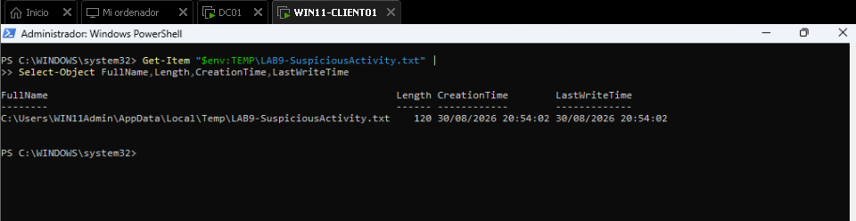

## Security Telemetry Assessment

The controlled simulation was followed by a review of the available Windows security telemetry.

The investigation attempted to correlate the simulated PowerShell activity with process creation, file access, and PowerShell Script Block Logging events.

The following results were observed:

| Telemetry Source | Result |
|---|---|
| Security Event `4688` | No corresponding process creation event identified |
| File access auditing | No corresponding event identified |
| PowerShell Event `4104` | No event containing the simulated reconnaissance commands identified |
| PowerShell Operational logging | Available on the endpoint |
| Test artifact | Successfully created and independently verified |

The results demonstrated that the simulated activity was successfully performed, but the currently configured Windows auditing sources did not provide complete visibility into the execution chain.

This represents an important security monitoring limitation. The absence of a specific event does not prove that an action did not occur; it may indicate that the relevant auditing category was not enabled, the event was not generated, or the required telemetry was not retained.

The investigation therefore relied on the evidence that was actually available rather than assuming that every action would generate a corresponding security event.

### Evidence


## Indicators of Compromise (IOCs)

The investigation did not identify confirmed indicators of compromise associated with malware or unauthorized access.

The controlled simulation generated a single known test artifact:

| Type | Value | Context |
|---|---|---|
| File | `LAB9-SuspiciousActivity.txt` | Harmless artifact created during the controlled simulation |
| Path | `%TEMP%\LAB9-SuspiciousActivity.txt` | User temporary directory |
| Size | 120 bytes | Verified after creation |
| Created | 30/08/2026 20:54:02 | Timestamp verified during the investigation |

This file must not be considered a malware indicator. It was intentionally created as part of the controlled security simulation.

No malicious executable, external IP address, domain, persistence mechanism, or confirmed credential compromise was identified during this phase.

The distinction between a test artifact and a genuine IOC is important when documenting security investigations. An artifact created intentionally for testing should be clearly identified to prevent it from being incorrectly interpreted as evidence of compromise.

## Investigation Timeline

The investigation produced the following relevant timeline of security-related activity on `WIN11-CLIENT01`.

| Time | Event / Activity | Interpretation |
|---|---|---|
| 19:21:19 | Event ID `4624` — `WIN11Admin` | Interactive local logon (`LogonType 2`) from `127.0.0.1` |
| 19:21:19 | Event ID `4672` — `WIN11Admin` | Special privileges assigned to the administrative session |
| 19:29:04 | Event ID `5379` — `WIN11Admin` | Credential Manager credentials enumerated |
| 19:29:09 | Event ID `4799` — `WIN11Admin` | Local `Administradores` group membership enumerated using PowerShell |
| 19:29:05–19:29:06 | PowerShell Operational events | PowerShell process initialized and console became ready |
| 20:21:25 | Event ID `4104` | PowerShell Script Block Logging recorded a script block |
| 20:54:02 | `LAB9-SuspiciousActivity.txt` created | Harmless test artifact created during the controlled simulation |

The timeline demonstrates the value of correlating timestamps, user accounts, Logon IDs, event IDs, and process information when investigating Windows security activity.

The observed events were not automatically classified as malicious. Context and correlation were used to distinguish legitimate administrative activity from potentially suspicious behavior.

The controlled simulation was intentionally separated from the earlier observed activity and did not introduce real malware or persistence.

##  Scope and Impact Assessment

The investigation assessed the scope and potential impact of the observed activity on `WIN11-CLIENT01`.

The activity reviewed during this phase was limited to the local Windows endpoint and the administrative account `WIN11Admin`.

The investigation confirmed:

| Area | Finding |
|---|---|
| Affected endpoint | `WIN11-CLIENT01` |
| Account involved | `WIN11Admin` |
| Authentication source | Local (`127.0.0.1`) |
| Privileged access | Administrative privileges were present |
| Credential Manager | Credential enumeration was observed |
| Group enumeration | Local `Administradores` group was enumerated |
| Malware | No confirmed malware identified |
| Persistence | No persistence mechanism identified |
| External communication | No malicious external communication identified |
| Data modification | No unauthorized data modification identified |

The controlled simulation was intentionally limited to reconnaissance activities and creation of a harmless test artifact.

No evidence was identified demonstrating lateral movement, persistence, malware execution, credential compromise, or unauthorized modification of system configuration.

Based on the available evidence, the scope of the investigation remained limited to `WIN11-CLIENT01`, with no confirmed impact beyond the local endpoint.

The assessment is based on the telemetry available during the investigation. Missing audit events cannot be interpreted as proof that an activity never occurred.

## Incident Triage and Classification

The observed security activity was evaluated using a structured incident triage approach.

The investigation considered authentication context, account privileges, credential-related activity, group enumeration, PowerShell activity, process information, and the results of the controlled simulation.

The initial activity associated with `WIN11Admin` was assessed as administrative activity with security-relevant characteristics rather than confirmed malicious activity.

The following factors supported this assessment:

- The activity was associated with the known administrative account `WIN11Admin`.
- The observed authentication was interactive and originated locally from `127.0.0.1`.
- The account was confirmed as a member of the local `Administradores` group.
- Credential Manager enumeration was observed, but the event alone did not establish malicious intent.
- Local administrator group enumeration was performed through PowerShell.
- No confirmed malicious executable, external command-and-control address, persistence mechanism, or malware was identified.

The controlled simulation demonstrated that reconnaissance activity can resemble techniques used during an actual compromise while still being completely legitimate when performed as part of an authorized security assessment.

Based on the available evidence, the activity was classified as:

> **No confirmed compromise — security-relevant administrative activity / controlled simulation.**

This classification reflects the evidence available during the investigation and does not imply that the endpoint is inherently free from undetected malicious activity.

## Detection Gaps and Monitoring Limitations

The investigation identified several limitations in the current Windows security monitoring configuration on `WIN11-CLIENT01`.

The controlled simulation successfully executed PowerShell reconnaissance commands and created a harmless test artifact. However, several expected telemetry sources did not provide corresponding events for the simulated activity.

The following monitoring gaps were identified:

| Detection Area | Result |
|---|---|
| Process creation — Event ID `4688` | No corresponding event identified for the simulation |
| File access auditing | No corresponding event identified for the test artifact |
| PowerShell Script Block Logging — Event ID `4104` | Enabled, but no event containing the simulated reconnaissance commands was identified |
| PowerShell Operational logging | Available and capable of recording PowerShell activity |
| Direct artifact verification | Successful |

These findings demonstrate that relying on a single Windows event source can provide incomplete visibility during security investigations.

The absence of a specific event must therefore be interpreted carefully. It may indicate that the relevant audit policy was not enabled, that the event was not generated for the particular activity, or that the required telemetry was not retained.

The investigation also demonstrated the value of correlating multiple telemetry sources rather than relying on a single event as proof of malicious activity.

These monitoring gaps provide a practical justification for introducing additional endpoint telemetry and centralized security monitoring technologies in later phases of the project.

## Investigation Findings

The investigation produced several relevant findings regarding security monitoring and administrative activity on `WIN11-CLIENT01`.

The endpoint contained an enabled administrative account, `WIN11Admin`, which was confirmed as a member of the local `Administradores` group and associated with the domain administrative group `LAB\Admins. del dominio`.

Security Event ID `4624` confirmed successful interactive authentication for `WIN11Admin`, while Event ID `4672` showed that the session received multiple administrative privileges.

Event ID `5379` documented an operation in which the Credential Manager credentials were enumerated. This activity was considered security-relevant but was not sufficient by itself to establish malicious intent.

Event IDs `4798` and `4799` documented local group enumeration. The relevant `4799` event identified `powershell.exe` as the process responsible for enumerating the local `Administradores` group.

PowerShell Operational logging was also reviewed. Event ID `4104` demonstrated that Script Block Logging was available and capable of recording PowerShell script content, although the specific reconnaissance commands used during the controlled simulation were not recorded in the available telemetry.

A controlled security simulation was performed after creating a clean snapshot. The simulation successfully executed harmless reconnaissance commands and created the test artifact `LAB9-SuspiciousActivity.txt`.

The investigation did not identify confirmed malware, persistence, lateral movement, malicious external communication, or confirmed credential compromise.

The overall findings demonstrate that security-relevant administrative activity must be evaluated through event correlation and contextual analysis rather than by treating individual events as definitive evidence of compromise.

## Recommended Monitoring Improvements

The investigation identified several opportunities to improve security visibility on `WIN11-CLIENT01`.

The current Windows Event Log configuration provided useful information about authentication, privileges, credential access, group enumeration, and PowerShell activity. However, the controlled simulation demonstrated that important parts of the execution chain were not consistently visible.

The following improvements are recommended:

| Area | Recommendation |
|---|---|
| Process monitoring | Deploy additional process telemetry such as Sysmon |
| PowerShell monitoring | Maintain and improve PowerShell logging and Script Block Logging |
| Centralized monitoring | Forward relevant security events to a centralized SIEM |
| Endpoint detection | Use endpoint telemetry capable of correlating processes, files, network activity, and user sessions |
| Event retention | Increase retention of security-relevant telemetry |
| Correlation | Correlate authentication, privilege, process, file, and network events |
| Alerting | Create detection rules for suspicious administrative and reconnaissance activity |

The limitations identified during this phase provide a practical justification for introducing more comprehensive monitoring technologies in later stages of the project.

Future phases can build on this foundation by comparing the visibility provided by native Windows Event Logs with enhanced endpoint telemetry and centralized security monitoring.

## Lessons Learned

This phase demonstrated that effective security operations require more than identifying individual Windows security events.

The investigation reinforced the importance of correlating authentication events, Logon IDs, privileges, group enumeration, PowerShell activity, and process information before determining whether activity is suspicious.

Several security-relevant events were observed during the investigation, including credential enumeration and privileged group enumeration. However, these events could not be classified as malicious without additional contextual evidence.

The controlled simulation also demonstrated that successful execution of an activity does not guarantee that the corresponding telemetry will be available in the Windows Event Logs.

The absence of Event ID `4688`, file access auditing, or a corresponding `4104` event for the simulated commands highlighted the importance of understanding the limitations of the monitoring configuration.

The investigation therefore emphasized three fundamental security operations principles:

1. **Correlate events instead of analyzing them in isolation.**
2. **Distinguish security-relevant activity from confirmed malicious activity.**
3. **Treat missing telemetry as a detection limitation rather than proof that an activity did not occur.**

These lessons provide the foundation for more advanced endpoint monitoring, detection engineering, and centralized security operations in later phases of the project.

## Final Security Assessment

The security investigation performed on `WIN11-CLIENT01` demonstrated a complete basic security operations workflow, from establishing an endpoint baseline to reviewing security events, correlating activity, performing controlled testing, and assessing available telemetry.

The investigation confirmed legitimate administrative activity associated with `WIN11Admin`, including interactive authentication, assignment of administrative privileges, Credential Manager enumeration, and local administrator group enumeration.

The controlled simulation demonstrated how reconnaissance activity can be performed without introducing malware or persistence. A harmless test artifact was created to provide a verifiable result for the exercise.

The investigation did not identify confirmed malware, persistence, lateral movement, malicious external communication, or confirmed credential compromise.

At the same time, the investigation identified significant visibility limitations in the current Windows auditing configuration. Process creation events, file access auditing, and Script Block Logging did not provide complete telemetry for the simulated activity.

The final assessment is therefore that no confirmed security compromise was identified during this investigation, while the endpoint's current monitoring configuration does not provide sufficient telemetry to guarantee comprehensive detection of all potentially suspicious activity.

The findings establish a practical baseline for improving endpoint visibility and centralized security monitoring in subsequent phases of the project.

## Evidence Summary

The following evidence was collected during the investigation of `WIN11-CLIENT01`:

| Evidence | Description |
|---|---|
| Local user baseline | Local accounts and their enabled/disabled status |
| Local administrator baseline | Members of the local `Administradores` group |
| Event ID `4624` | Successful interactive authentication associated with `WIN11Admin` |
| Event ID `4672` | Special privileges assigned to the administrative session |
| Event ID `5379` | Credential Manager credential enumeration |
| Event ID `4798/4799` | Local group enumeration activity |
| PowerShell Operational | PowerShell initialization and operational activity |
| Event ID `4104` | PowerShell Script Block Logging evidence |
| Controlled simulation artifact | `LAB9-SuspiciousActivity.txt` created during the authorized simulation |

The collected evidence was used to establish the security baseline, correlate related activity, evaluate the controlled simulation, and identify limitations in the available telemetry.

All evidence was obtained from the laboratory environment and was analyzed in the context of the investigation.

## Security Operations Workflow

The investigation followed a structured security operations workflow:

1. **Establish a baseline**
   - Reviewed local user accounts.
   - Identified privileged groups and administrative accounts.

2. **Collect security telemetry**
   - Reviewed Windows Security and PowerShell Operational logs.
   - Identified relevant authentication, privilege, credential, group enumeration, and PowerShell events.

3. **Correlate events**
   - Correlated `4624` authentication events with `4672` privileged logons using the Logon ID.
   - Correlated `4799` group enumeration with the `powershell.exe` process.
   - Compared timestamps and process identifiers between available telemetry sources.

4. **Perform security triage**
   - Distinguished legitimate administrative activity from confirmed malicious activity.
   - Evaluated potentially security-relevant events within their context.

5. **Perform controlled validation**
   - Created a clean snapshot before the controlled simulation.
   - Executed harmless reconnaissance activity.
   - Created a known test artifact to verify the activity.

6. **Assess detection coverage**
   - Attempted to correlate the simulated activity with process creation, file access, and PowerShell telemetry.
   - Documented the telemetry that was and was not available.

7. **Assess scope and impact**
   - Evaluated the affected endpoint, account, privileges, potential credential access, persistence, and external communication.

8. **Document findings**
   - Recorded the evidence, limitations, conclusions, and recommended monitoring improvements.

This workflow provides a repeatable foundation for security event investigation and incident triage in the laboratory environment.

## Incident Response Considerations

If similar activity were identified outside the controlled laboratory scenario and could not be attributed to authorized administrative activity, the following incident response actions would be appropriate:

1. **Validate the alert**
   - Confirm the affected endpoint, account, timestamp, Logon ID, and associated process information.

2. **Identify the scope**
   - Determine whether other accounts, endpoints, or systems were involved.
   - Review authentication and network telemetry for related activity.

3. **Investigate the account**
   - Determine whether the administrative account was expected to perform the observed actions.
   - Review recent authentication and privilege-related events.

4. **Investigate PowerShell activity**
   - Review available PowerShell telemetry and process information.
   - Identify commands, scripts, or execution patterns associated with the activity when telemetry is available.

5. **Preserve evidence**
   - Preserve relevant event logs, files, timestamps, and other available forensic evidence before making changes to the system.

6. **Contain the endpoint if required**
   - If malicious activity were confirmed, isolate the affected endpoint according to the incident response procedure.

7. **Remediate**
   - Remove confirmed malicious artifacts or persistence mechanisms.
   - Reset compromised credentials where appropriate.
   - Address the monitoring gaps identified during the investigation.

8. **Document and review**
   - Record the timeline, evidence, findings, actions taken, and final disposition of the incident.

These actions were not performed against the laboratory environment because the observed activity was either legitimate administrative activity or intentionally generated as part of the controlled simulation.

## Final Status

The security operations investigation was completed on `WIN11-CLIENT01`.

The phase successfully established a security baseline, reviewed relevant Windows security telemetry, correlated authentication and privilege events, investigated credential and group enumeration activity, analyzed PowerShell telemetry, and performed a controlled security simulation.

The investigation did not identify confirmed malware, persistence, lateral movement, malicious external communication, or confirmed credential compromise.

The controlled simulation demonstrated both the value and limitations of the current Windows auditing configuration. Security-relevant activity could be identified and investigated, but several telemetry gaps prevented complete reconstruction of the simulated execution chain.

The endpoint therefore remains classified as:

> **No confirmed compromise identified during the investigation.**

The monitoring limitations and recommendations identified during this phase will be used as a foundation for more advanced endpoint monitoring and centralized security operations in subsequent phases.

**LAB 9 — Security Operations: INVESTIGATION COMPLETED**

## Conclusion

LAB 9 established a practical security operations and incident triage workflow for `WIN11-CLIENT01`.

The investigation combined endpoint baselining, Windows security telemetry, event correlation, privilege analysis, credential and group enumeration analysis, PowerShell telemetry, controlled security testing, and scope assessment.

No confirmed compromise was identified during the investigation. However, the controlled simulation demonstrated important limitations in the available Windows telemetry, reinforcing the need for additional endpoint visibility and centralized security monitoring.

The findings from this phase provide the foundation for more advanced detection, monitoring, and security operations capabilities in subsequent phases of the project.

**LAB 9 — Security Operations: COMPLETED** ✅

⬆️ [Back to Roadmap](#lab-roadmap)


<a id="lab-10"></a>
# LAB 10 — Windows Security & Sysmon

## Introduction

This phase focuses on endpoint security monitoring using Microsoft Sysinternals Sysmon.

The objective of this phase was to deploy Sysmon on the Windows 11 endpoint `WIN11-CLIENT01`, configure security-focused telemetry, validate the generated events, and establish an endpoint monitoring foundation for the centralized security monitoring implementation planned for the next phase.

The investigation included process creation, network connections, file creation, Registry activity, DNS queries, file deletion, and Process Tampering telemetry.

The phase also included Sysmon configuration validation, controlled event generation, Windows Event Log analysis, and troubleshooting of telemetry collection issues.

All testing was performed within the controlled laboratory environment on the Windows 11 endpoint.

The results obtained during this phase were documented according to the telemetry that was actually observed. Events that could not be reproduced were recorded as detection limitations rather than being artificially generated.

## Lab Environment

The Sysmon deployment and security telemetry validation were performed on the domain-joined Windows 11 endpoint `WIN11-CLIENT01` within the `lab.local` environment.

The endpoint was used as the primary telemetry source for this phase, with Sysmon configured to collect detailed process, network, file, Registry, and DNS activity.

The main laboratory components used during the phase were:

| Component | Configuration |
|---|---|
| Operating System | Windows 11 |
| Hostname | `WIN11-CLIENT01` |
| Domain | `lab.local` |
| Sysmon Configuration | `C:\Sysmon\SysmonConfig.xml` |
| Sysmon Schema Version | `4.91` |
| Hash Algorithm | SHA256 |
| Event Log | `Microsoft-Windows-Sysmon/Operational` |

PowerShell was used extensively during the validation process to generate controlled activity and query the Sysmon Operational event log.

The laboratory environment was used to validate Sysmon telemetry through controlled tests while maintaining the endpoint in a known and isolated environment.

## Sysmon Installation

Sysmon was installed on the Windows 11 endpoint `WIN11-CLIENT01` as the primary endpoint telemetry source for this phase.

The installation was performed using the Microsoft Sysinternals Sysmon utility.

After installation, the Sysmon executable, service, and driver were verified to ensure that the deployment was functioning correctly.

The installation established the following components:

| Component | Status |
|---|---|
| Sysmon Service | Installed |
| Sysmon Driver | Installed |
| Sysmon Executable | Available |
| Event Log | Available |
| Endpoint Telemetry | Enabled |

The Sysmon installation was subsequently validated before applying the custom configuration used throughout the remainder of the phase.

### Evidence

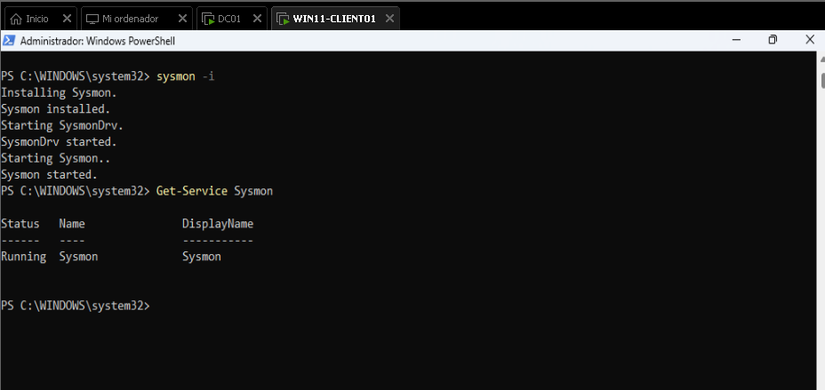

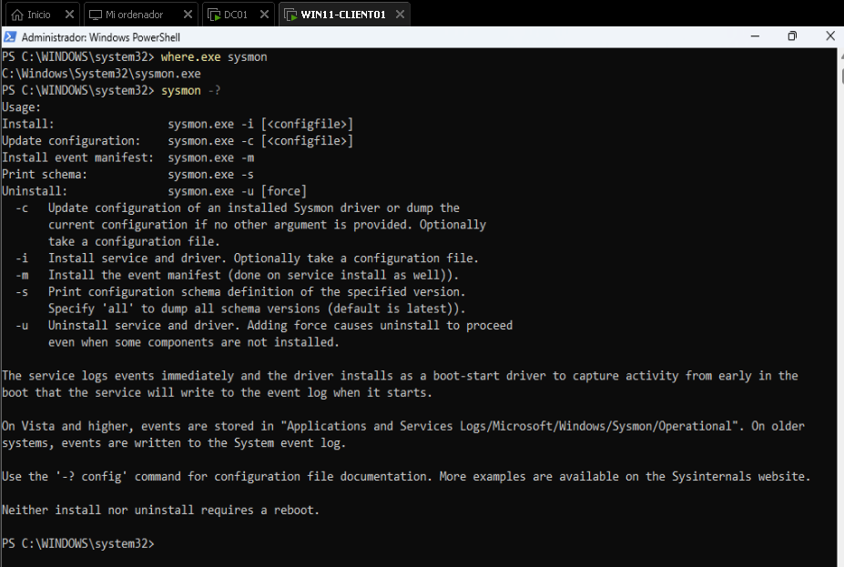

## Sysmon Configuration

A custom Sysmon XML configuration was created for the Windows 11 endpoint `WIN11-CLIENT01`.

The configuration used Sysmon schema version `4.91` and SHA256 as the hashing algorithm.

The configuration file was stored at:

`C:\Sysmon\SysmonConfig.xml`

The following Sysmon event categories were configured during the phase:

| Event Category | Configuration |
|---|---|
| Process Creation | Enabled |
| Network Connection | Enabled |
| Image Loading | Enabled |
| File Creation | Enabled |
| Registry Events | Configured |
| DNS Queries | Configured |
| Process Tampering | Enabled |
| File Deletion | Configured |

The configuration was applied using the following command:

`sysmon -c "C:\Sysmon\SysmonConfig.xml"`

Sysmon successfully validated and applied the configuration.

The active configuration was subsequently reviewed using `sysmon -c` to confirm that the expected rules were loaded by the Sysmon service.

### Evidence

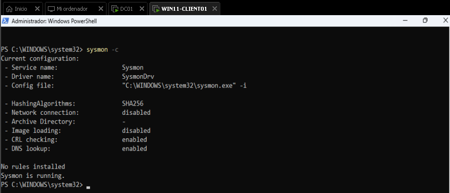

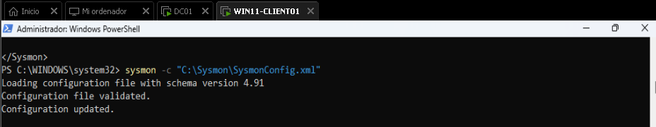

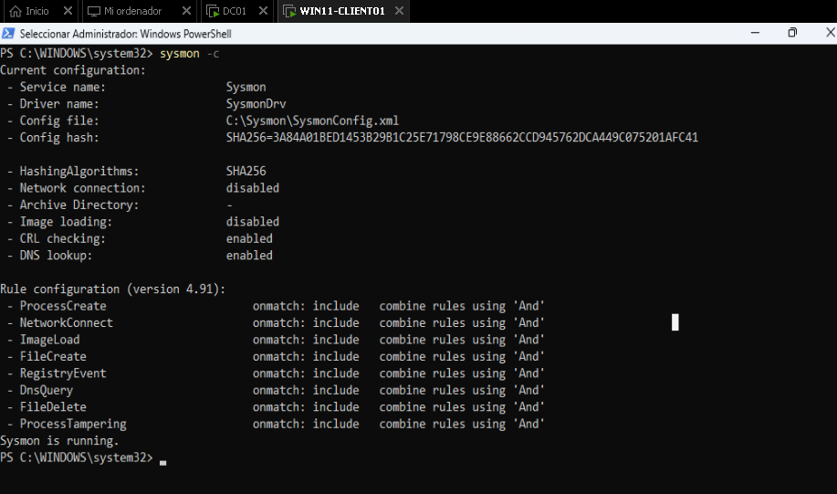

## Sysmon Service and Feature Validation

After applying the custom configuration, the Sysmon service was validated to confirm that the endpoint was operating with the expected security monitoring capabilities.

The active configuration was reviewed using the Sysmon command-line interface.

The validation confirmed that Sysmon was running with the following capabilities:

| Feature | Status |
|---|---|
| Sysmon Service | Running |
| Sysmon Driver | Running |
| Network Connection Monitoring | Enabled |
| DNS Lookup | Enabled |
| SHA256 Hashing | Enabled |
| Image Loading | Configured |
| Process Creation | Configured |
| File Creation | Configured |
| Registry Monitoring | Configured |
| File Deletion | Configured |
| Process Tampering | Configured |

Network monitoring was specifically verified as enabled before performing the controlled network connection tests.

The validation confirmed that the Sysmon service was successfully running with the custom laboratory configuration.

### Evidence

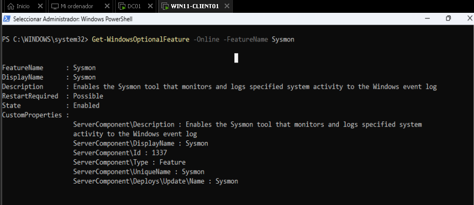

**Public evidence note:** The original screenshot was intentionally omitted from the public repository because it may contain internal laboratory network information, account identifiers, or sensitive security configuration details. The validation was performed as documented, but the screenshot is not included in the public version.
## Process Creation — Event ID 1

Sysmon Event ID `1` represents Process Creation telemetry.

This event provides visibility into processes created on the Windows endpoint and can contain information such as the process identifier, process GUID, executable image, user context, and other process-related information depending on the active configuration.

Event ID `1` was successfully observed in the Sysmon Operational log on `WIN11-CLIENT01`.

The event confirmed that Sysmon was successfully collecting process creation telemetry from the endpoint.

Process creation telemetry is particularly relevant for security operations because process execution can provide important context when investigating suspicious activity, including identifying which executable was launched, which user initiated the process, and when the activity occurred.

### Evidence

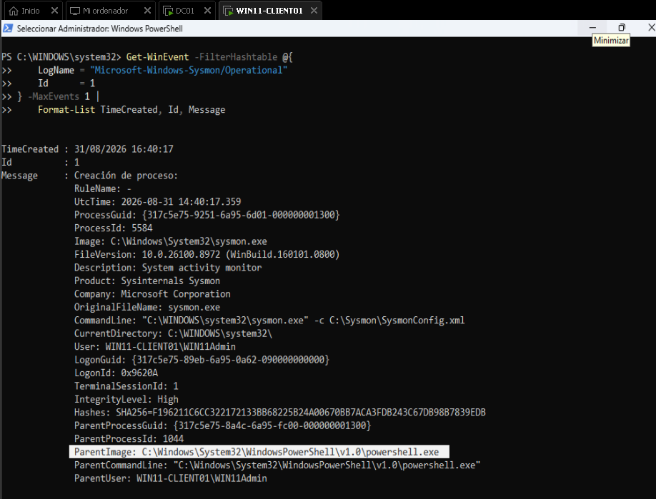

## Network Connection — Event ID 3

Sysmon Event ID `3` represents Network Connection telemetry.

The Sysmon configuration was designed to monitor network connections involving the following destination ports:

| Destination Port | Protocol Context |
|---:|---|
| `80` | HTTP |
| `443` | HTTPS |

A controlled network connection test was performed from `WIN11-CLIENT01` to validate that Sysmon was able to record network activity generated by processes on the endpoint.

The resulting telemetry provided visibility into the network connection and its associated process.

A PowerShell network activity test was also performed to demonstrate how Sysmon can associate network activity with the process responsible for generating the connection.

Network connection telemetry is particularly useful during security investigations because it can help identify processes communicating with external systems and provide additional context for potentially suspicious network activity.

### Evidence

**Public evidence note:** The original screenshot was intentionally omitted from the public repository because it may contain internal laboratory network information, account identifiers, or sensitive security configuration details. The validation was performed as documented, but the screenshot is not included in the public version.
**Public evidence note:** The original screenshot was intentionally omitted from the public repository because it may contain internal laboratory network information, account identifiers, or sensitive security configuration details. The validation was performed as documented, but the screenshot is not included in the public version.
## File Creation — Event ID 11

Sysmon Event ID `11` represents FileCreate telemetry.

A controlled file creation test was performed on `WIN11-CLIENT01` to validate that Sysmon could detect the creation of a file matching the configured laboratory rule.

The Sysmon configuration included a `FileCreate` rule targeting filenames containing:

`SOC-Test-File`

The test successfully generated the expected Sysmon telemetry.

The resulting event demonstrated that Sysmon was able to identify the file creation activity and associate it with the endpoint process responsible for the operation.

File creation telemetry is relevant to security operations because newly created files can provide important evidence during investigations involving downloaded payloads, scripts, temporary artifacts, or other suspicious activity.

### Evidence

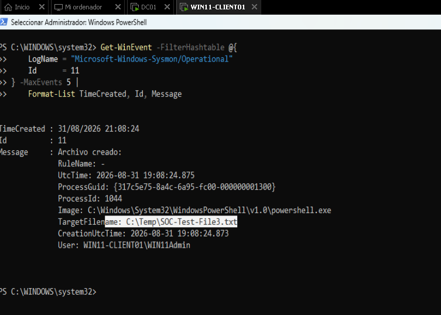

## Registry Key Creation — Event ID 12

Sysmon Event ID `12` represents Registry object creation and deletion activity.

A controlled Registry key creation test was performed on `WIN11-CLIENT01` using the current user's Registry hive.

The laboratory test used the following Registry path:

`HKCU:\Software\SOC-Lab12`

The test successfully generated Sysmon Event ID `12`.

The resulting event identified the Registry operation as `CreateKey` and provided information about the process and user associated with the activity.

Registry monitoring is relevant to security operations because Registry modifications can be associated with legitimate system configuration as well as suspicious activity such as persistence mechanisms, configuration changes, or attempts to modify security-related settings.

The event was therefore validated as part of the endpoint telemetry collection performed during this phase.

### Evidence

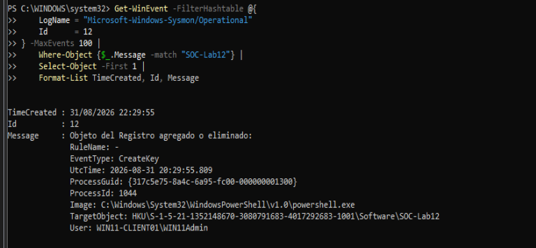

## Registry Value Set — Event ID 13

Sysmon Event ID `13` represents Registry value modification activity.

A controlled Registry value modification test was performed on `WIN11-CLIENT01` using the current user's Registry hive.

The laboratory test used the following Registry path:

`HKCU:\Software\SOC-Lab`

The Registry value was created with the following configuration:

| Field | Value |
|---|---|
| Value Name | `TestValue2` |
| Value Data | `LAB10-TEST` |
| Property Type | String |

The test successfully generated Sysmon Event ID `13`.

The resulting event identified the operation as `SetValue` and provided information about the process, Registry target, value data, and user associated with the modification.

The event identified `powershell.exe` as the process responsible for the Registry modification and associated the activity with the `WIN11Admin` account.

Registry value monitoring is relevant to security operations because modifications to Registry values can be associated with legitimate configuration changes as well as suspicious activity, including persistence mechanisms and changes to security-related settings.

### Evidence

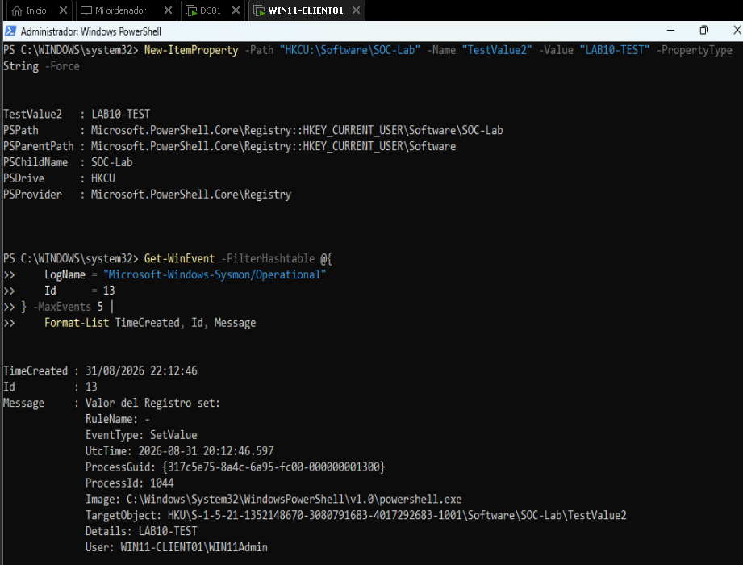

## Registry Rename — Event ID 14

Sysmon Event ID `14` represents Registry object rename activity.

The Sysmon schema was reviewed to confirm that Event ID `14` is supported by the installed Sysmon version.

The schema identified the following event:

`SYSMONEVENT_REG_NAME`

with event value:

`14`

A controlled Registry rename test was attempted on `WIN11-CLIENT01` to validate the generation of this telemetry.

However, the expected Event ID `14` was not observed in the Sysmon Operational log during the controlled test.

The event was therefore not considered validated in this laboratory environment.

The result was documented as a telemetry limitation rather than assuming that the event had been generated without corresponding evidence.

This distinction is important during security monitoring because the existence of an event in the Sysmon schema does not guarantee that every corresponding operation will generate an event under the current configuration and testing conditions.

### Result

| Event ID | Telemetry | Status |
|---:|---|---|
| `14` | Registry Rename | Not reproduced |

No evidence screenshot was created for this event because no corresponding Event ID `14` was successfully observed.

## DNS Query — Event ID 22

Sysmon Event ID `22` represents DNS Query telemetry.

A controlled DNS resolution test was performed on `WIN11-CLIENT01` using the domain:

`example.com`

The initial DNS test did not generate the expected Sysmon Event ID `22`. The Sysmon configuration was subsequently reviewed and the DNS rule was adjusted.

After applying the corrected configuration, the Sysmon service was updated and the DNS activity was tested again using:

`ping example.com -n 1`

The resulting Sysmon Event ID `22` successfully recorded the DNS query.

The event contained information including:

| Field | Value |
|---|---|
| Event ID | `22` |
| Query Name | `example.com` |
| Query Status | `0` |
| Image | `C:\Windows\System32\PING.EXE` |
| User | `WIN11-CLIENT01\WIN11Admin` |

The event also contained the DNS query results returned for the requested domain.

The successful generation of Event ID `22` confirmed that Sysmon was correctly collecting DNS query telemetry after the configuration was corrected.

DNS telemetry is relevant to security operations because DNS queries can provide valuable context when investigating applications communicating with external infrastructure, suspicious domains, or potential command-and-control activity.

### Evidence

**Public evidence note:** The original screenshot was intentionally omitted from the public repository because it may contain internal laboratory network information, account identifiers, or sensitive security configuration details. The validation was performed as documented, but the screenshot is not included in the public version.
## File Deletion — Event ID 23

Sysmon Event ID `23` represents archived file deletion activity.

The Sysmon schema was reviewed to confirm that Event ID `23` is supported by the installed Sysmon version.

A controlled file deletion test was performed on `WIN11-CLIENT01` using files created in:

`C:\Temp\`

The Sysmon configuration contained a `FileDelete` rule and the Sysmon service was confirmed to be running with the updated configuration.

The test demonstrated that Sysmon was generating Event ID `23` telemetry on the endpoint. However, the events observed during the test were associated with legitimate Windows activity rather than the specific laboratory test file.

The observed events included Windows Prefetch files being deleted by `svchost.exe`, with the events containing information such as the target filename, process image, user, SHA256 hash, and archive status.

A subsequent search specifically for the laboratory test file did not return a matching Event ID `23`.

The result was therefore documented according to the evidence actually obtained.

This demonstrates an important security monitoring principle: the presence of a telemetry event does not necessarily mean that every controlled operation will produce a directly matching event under the current configuration and test conditions.

### Result

| Event ID | Telemetry | Status |
|---:|---|---|
| `23` | File Delete | Sysmon telemetry confirmed; controlled test not directly associated |

No evidence screenshot was created for the laboratory file deletion because the specific test file was not successfully identified in the generated Event ID `23` telemetry.

## Process Tampering — Event ID 25

Sysmon Event ID `25` represents Process Tampering activity.

The Sysmon configuration included Process Tampering monitoring through the following rule:

`ProcessTampering onmatch: include`

The Sysmon Operational log was queried for Event ID `25` to determine whether any Process Tampering activity had been recorded on `WIN11-CLIENT01`.

No Event ID `25` events were identified during the laboratory validation.

A real Process Tampering technique was not intentionally executed solely to generate telemetry, as the purpose of this phase was to validate defensive monitoring through controlled and non-destructive tests.

The absence of Event ID `25` during the validation does not indicate that Sysmon was incorrectly installed. It indicates that no Process Tampering activity matching the configured detection criteria was observed during the testing period.

### Result

| Event ID | Telemetry | Status |
|---:|---|---|
| `25` | Process Tampering | Not reproduced |

No evidence screenshot was created for this event because no Event ID `25` was successfully observed.

## File Delete Detected — Event ID 26

Sysmon Event ID `26` represents File Delete Detected telemetry.

The Sysmon schema was reviewed to confirm that Event ID `26` is supported by the installed Sysmon version.

The schema identified the following event:

`SYSMONEVENT_FILE_DELETE_DETECTED`

with event value:

`26`

A dedicated `FileDeleteDetected` rule was temporarily configured to monitor file deletion activity under:

`C:\Temp\`

The configuration was successfully validated and the active Sysmon configuration confirmed:

| Configuration | Value |
|---|---|
| Event | `FileDeleteDetected` |
| Action | `include` |
| Filter | `TargetFilename` |
| Condition | `contains` |
| Target | `C:\Temp\` |

Controlled file deletion tests were then performed using both PowerShell and `cmd.exe`.

No Event ID `26` was generated for the controlled laboratory files.

The Sysmon schema and configuration were therefore confirmed to support Event ID `26`, but the event could not be reproduced under the laboratory testing conditions.

The temporary test configuration was subsequently removed and the Sysmon configuration was returned to the stable laboratory configuration.

### Result

| Event ID | Telemetry | Status |
|---:|---|---|
| `26` | File Delete Detected | Not reproduced |

No evidence screenshot was created for this event because no Event ID `26` was successfully observed.

## Troubleshooting and Configuration Validation

Several configuration and telemetry issues were encountered during the validation of Sysmon on `WIN11-CLIENT01`.

The troubleshooting process followed a structured approach based on controlled testing, configuration inspection, Sysmon schema validation, configuration modification, and subsequent retesting.

The general troubleshooting workflow used during the phase was:

```text
Test
 ↓
Review Sysmon Operational Log
 ↓
Inspect Active Sysmon Configuration
 ↓
Inspect Sysmon Schema
 ↓
Modify Configuration
 ↓
Validate XML
 ↓
Reload Sysmon
 ↓
Repeat Test
 ↓
Verify Result
DNS Query Troubleshooting

```


The initial DNS query test did not generate the expected Event ID 22.

The active Sysmon configuration was reviewed and the DNS rule was investigated.

The configuration was corrected and reloaded using:

sysmon -c "C:\Sysmon\SysmonConfig.xml"

After the configuration update, the DNS test was repeated using:

ping example.com -n 1

Event ID 22 was then successfully generated and validated.

This confirmed that the issue was related to the Sysmon rule configuration rather than the DNS resolution itself.

Registry Event Troubleshooting

During the validation of Registry telemetry, Event ID 13 initially failed to appear after a controlled Registry value modification.

The active Sysmon configuration was reviewed and the Registry rule was corrected.

The configuration was then reloaded and the Registry test was repeated.

The subsequent test successfully generated Event ID 13, identifying the Registry value modification performed through PowerShell.

This confirmed that the Sysmon configuration was responsible for the initial detection issue.

Registry Rename Troubleshooting

Event ID 14 was investigated by reviewing the Sysmon schema and attempting a controlled Registry rename operation.

The Sysmon schema confirmed that Event ID 14 was supported by the installed Sysmon version.

However, the controlled operation did not produce an Event ID 14 in the Sysmon Operational log.

The event was therefore documented as not reproduced rather than assuming that the operation had generated telemetry.

File Deletion Troubleshooting

File deletion telemetry required additional investigation because the controlled laboratory file was not associated with the expected Event ID 23.

The Sysmon schema was reviewed and confirmed that both Event ID 23 and Event ID 26 were available.

Event ID 23 was observed on the endpoint for legitimate Windows activity, confirming that Sysmon was capable of generating file deletion telemetry.

A separate FileDeleteDetected rule was also temporarily tested for Event ID 26 using the C:\Temp\ path.

The configuration was successfully validated, but controlled deletion tests performed using both PowerShell and cmd.exe did not generate Event ID 26.

The temporary test configuration was subsequently removed and the stable Sysmon configuration was restored.

Configuration Validation

During the troubleshooting process, an invalid placement of the FileDeleteDetected configuration element caused Sysmon to reject the XML configuration.

The error indicated that the element had been placed outside the EventFiltering section.

The XML structure was corrected and the configuration was successfully validated and applied.

The final configuration was confirmed using:

sysmon -c

The troubleshooting performed during this phase demonstrated the importance of validating the active configuration and Sysmon schema when expected telemetry is not generated.

## Detection Coverage

The following table summarizes the Sysmon telemetry investigated and validated during LAB 10.

| Event ID | Telemetry | Result |
|---:|---|---|
| `1` | Process Creation | ✅ Validated |
| `3` | Network Connection | ✅ Validated |
| `11` | File Creation | ✅ Validated |
| `12` | Registry Key Creation / Deletion | ✅ Validated |
| `13` | Registry Value Set | ✅ Validated |
| `14` | Registry Rename | ⚠️ Not reproduced |
| `22` | DNS Query | ✅ Validated |
| `23` | File Delete | ⚠️ Sysmon telemetry confirmed; controlled test not directly associated |
| `25` | Process Tampering | ⚠️ Not reproduced |
| `26` | File Delete Detected | ⚠️ Not reproduced |

The validated events demonstrate that the Windows 11 endpoint is successfully generating a broad range of security telemetry through Sysmon.

The events that could not be reproduced were explicitly documented as laboratory testing limitations.

No event was marked as validated without corresponding evidence from the Sysmon Operational log.

This approach provides a realistic representation of the endpoint's current telemetry coverage and establishes a clear baseline for future monitoring and detection development.

## Evidence Summary

The following screenshots were collected during LAB 10 to document the Sysmon installation, configuration, feature validation, and successfully reproduced security events.

| Evidence | Description |
|---|---|
| `phase-10-sysmon-installed.png` | Sysmon installation |
| `phase-10-sysmon-executable.png` | Sysmon executable validation |
| `phase-10-sysmon-default-configuration.png` | Default Sysmon configuration |
| `phase-10-sysmon-configuration-applied.png` | Custom configuration successfully applied |
| `phase-10-sysmon-active-configuration.png` | Active Sysmon configuration |
| `phase-10-sysmon-feature-enabled.png` | Sysmon features enabled |
| `phase-10-sysmon-network-enabled.png` | Network monitoring enabled |
| `phase-10-sysmon-process-create.png` | Event ID 1 — Process Creation |
| `phase-10-sysmon-network-connection.png` | Event ID 3 — Network Connection |
| `phase-10-sysmon-powershell-network.png` | PowerShell network activity |
| `phase-10-sysmon-file-creation.png` | Event ID 11 — File Creation |
| `phase-10-sysmon-event-12-registry-key.png` | Event ID 12 — Registry Key |
| `phase-10-sysmon-event-13-registry-value-set.png` | Event ID 13 — Registry Value Set |
| `phase-10-sysmon-event-22-dns-query.png` | Event ID 22 — DNS Query |

These screenshots provide visual evidence of the Sysmon deployment and the main telemetry successfully validated during the phase.

Events that were not reproduced during controlled testing were intentionally not represented by screenshots and are documented separately in the corresponding sections of this README.

## Lessons Learned

LAB 10 demonstrated that endpoint telemetry collection requires continuous validation between the configured rules, the Sysmon schema, and the events actually generated by the operating system.

One of the main lessons from this phase was the importance of validating the active Sysmon configuration instead of relying only on the XML configuration file.

The DNS Query and Registry Value Set investigations showed how a small configuration change can determine whether the expected security telemetry is generated.

The troubleshooting process also reinforced the importance of using the Sysmon schema when an expected event does not appear. This allowed the supported event types and configuration elements to be verified before making additional changes.

Another important lesson was the difference between an event being supported by Sysmon and an event being generated during a specific test. Events such as Registry Rename, Process Tampering, and File Delete Detected were confirmed as supported by the Sysmon schema but could not be reproduced under the laboratory conditions.

The File Delete investigation also demonstrated that legitimate Windows activity can generate security telemetry that is unrelated to the controlled test being performed. For this reason, events must always be correlated using fields such as the timestamp, process, user, and target object.

The phase therefore reinforced the following SOC principles:

1. Validate the active configuration before troubleshooting the telemetry.
2. Use the Sysmon schema to confirm supported event types and configuration elements.
3. Perform controlled tests whenever possible.
4. Correlate events with the responsible process, user, timestamp, and target.
5. Do not assume that an action occurred simply because its corresponding event exists in the Sysmon schema.
6. Do not mark an event as validated without supporting evidence.
7. Document detection limitations instead of creating artificial evidence.
8. Troubleshoot systematically before making additional configuration changes.

These lessons provide a practical foundation for the next phase, where the endpoint telemetry generated by Sysmon will be integrated into a centralized security monitoring platform.

## Final Security Assessment

The implementation of Sysmon on `WIN11-CLIENT01` successfully established an enhanced endpoint telemetry layer for the laboratory environment.

The phase validated multiple security-relevant telemetry categories, including Process Creation, Network Connection, File Creation, Registry activity, and DNS Query monitoring.

The troubleshooting performed during the phase also demonstrated that Sysmon configuration must be continuously validated against the telemetry actually generated by the operating system.

The successful validation of Event IDs `1`, `3`, `11`, `12`, `13`, and `22` confirms that the endpoint is producing useful security telemetry that can be leveraged for future detection and investigation activities.

Event IDs `14`, `25`, and `26` were investigated but could not be reproduced under the laboratory testing conditions. Event ID `23` was confirmed to generate telemetry on the endpoint, although the observed events could not be directly associated with the controlled laboratory file deletion.

These results do not prevent the completion of the phase. Instead, they provide a realistic representation of the telemetry currently observed in the laboratory environment.

From a SOC perspective, the most important outcome is that `WIN11-CLIENT01` now provides significantly greater visibility into endpoint activity than standard Windows logging alone.

This telemetry will provide the foundation for centralized security monitoring and detection in the next phase of the laboratory.

### Security Monitoring Capabilities Established

| Capability | Status |
|---|---|
| Process Monitoring | ✅ |
| Network Monitoring | ✅ |
| File Creation Monitoring | ✅ |
| Registry Monitoring | ✅ |
| DNS Monitoring | ✅ |
| File Deletion Monitoring | ⚠️ Partial validation |
| Process Tampering Monitoring | ⚠️ Not reproduced |

## Final Status

The Sysmon deployment and endpoint security telemetry validation were successfully completed on `WIN11-CLIENT01`.

The following objectives were achieved during this phase:

- Sysmon was successfully installed.
- The Sysmon service and driver were validated.
- A custom Sysmon XML configuration was created and applied.
- The active Sysmon configuration was verified.
- Process Creation telemetry was validated.
- Network Connection telemetry was validated.
- File Creation telemetry was validated.
- Registry Key telemetry was validated.
- Registry Value Set telemetry was validated.
- DNS Query telemetry was validated.
- Sysmon schema validation was performed during troubleshooting.
- Configuration issues were identified and corrected.
- Telemetry limitations were documented where controlled events could not be reproduced.

The endpoint is now configured with enhanced security telemetry and is prepared for integration with the centralized security monitoring infrastructure introduced in the next phase.

## Conclusion

LAB 10 successfully established Sysmon as an enhanced endpoint telemetry source on the Windows 11 client `WIN11-CLIENT01`.

Throughout the phase, Sysmon was installed, configured, validated, and tested against multiple security-relevant activities.

The laboratory successfully demonstrated telemetry for Process Creation, Network Connections, File Creation, Registry activity, and DNS Queries.

The troubleshooting performed during the phase also provided practical experience in validating Sysmon configurations, reviewing the Sysmon schema, identifying configuration issues, reloading the service, and verifying the resulting telemetry.

Not every event could be reproduced under the controlled laboratory conditions. Registry Rename, Process Tampering, and File Delete Detected were investigated but did not produce the expected events, while File Delete telemetry was confirmed through legitimate system activity. These results were documented transparently as part of the laboratory findings.

The completed Sysmon deployment provides `WIN11-CLIENT01` with a significantly richer endpoint telemetry layer and establishes the foundation required for centralized security monitoring.

The next phase will build on this endpoint telemetry by introducing Wazuh and moving from local endpoint monitoring toward centralized security analysis and detection.

**LAB 10 — WINDOWS SECURITY & SYSMON: COMPLETED ✅**

⬆️ [Back to Roadmap](#lab-roadmap)


<a id="lab-11"></a>
# LAB 11 — Wazuh SIEM, Detection Engineering & Security Monitoring

## Introduction

This phase focuses on centralized security monitoring and detection engineering using Wazuh.

The objective of this phase was to deploy a centralized Wazuh security monitoring platform, integrate the Windows 11 endpoint `WIN11-CLIENT01`, collect Windows security telemetry, validate security events, and develop a custom detection rule for repeated authentication failures.

The phase moved the laboratory from endpoint-level security monitoring toward centralized Security Information and Event Management (SIEM) capabilities.

The implementation included the deployment and hardening of a dedicated Ubuntu Server 24.04.4 LTS system, installation of the Wazuh Manager, Wazuh Indexer, and Wazuh Dashboard, integration of the Windows 11 endpoint, validation of Windows security telemetry, threat hunting, and Detection Engineering.

Security events including successful authentication (`4624`), failed authentication (`4625`), special privileges assigned to a new logon (`4672`), and process creation (`4688`) were investigated during the phase.

A custom Wazuh correlation rule was also developed to identify three failed Windows authentication events for the same account within a 120-second window.

The detection was validated through a controlled laboratory scenario using the `taylor.user` account on `WIN11-CLIENT01`.

The investigation process included alert analysis, event correlation, timestamp analysis, account and endpoint identification, source address analysis, logon type analysis, process identification, and interpretation of Windows authentication status codes.

All testing was performed within the controlled laboratory environment.

The results documented in this phase are based on the telemetry actually observed during the laboratory exercises. Events and behaviors that were not directly validated were not treated as confirmed findings.

## Objectives

The main objectives of LAB 11 were:

- Deploy a dedicated Wazuh SIEM environment.
- Prepare and harden the Ubuntu Server hosting Wazuh.
- Configure a static network identity for the Wazuh server.
- Configure internal DNS resolution through `DC01`.
- Configure time synchronization with the laboratory domain controller.
- Validate network and HTTPS connectivity required by the Wazuh installation.
- Install the Wazuh Manager, Wazuh Indexer, and Wazuh Dashboard.
- Integrate `WIN11-CLIENT01` as a Wazuh agent.
- Validate the collection of Windows security telemetry.
- Investigate authentication and process-related security events.
- Perform basic threat hunting using Wazuh Dashboard.
- Develop a custom Wazuh detection rule.
- Correlate repeated Windows authentication failures.
- Generate and validate a Level 12 detection alert.
- Investigate the technical context of the generated alert.
- Apply a SOC-oriented analysis methodology without automatically classifying activity as malicious.
- Validate the final operational state of the Wazuh Manager.
- Establish a centralized security monitoring foundation for future Detection Engineering and Security Operations activities.

## Lab Environment

The centralized security monitoring platform was deployed on a dedicated Ubuntu Server virtual machine within the `lab.local` laboratory environment.

The main laboratory components used during the phase were:

| Component | Configuration |
|---|---|
| Domain Controller | `DC01` |
| Domain | `lab.local` |
| DC01 IP Address | `10.10.10.10` |
| Windows Endpoint | `WIN11-CLIENT01` |
| Windows Endpoint IP | `10.10.10.20` |
| Wazuh Server | `WAZUH-SERVER` |
| Operating System | Ubuntu Server 24.04.4 LTS |
| Wazuh Server IP | `10.10.10.30` |
| Wazuh Hostname | `wazuhserver` |
| Wazuh Server CPU | 4 vCPU |
| Wazuh Server Memory | 8 GB RAM |
| Wazuh Server Disk | 80 GB |
| Virtualization Platform | VMware Workstation |
| Network Mode | NAT |
| Network | `10.10.10.0/24` |
| Gateway | `10.10.10.1` |
| DNS Server | `10.10.10.10` |
| Time Source | `10.10.10.10` |
| Wazuh Components | Manager, Indexer, Dashboard |

`DC01` provided the Active Directory and DNS infrastructure used by the laboratory.

`WIN11-CLIENT01` acted as the primary Windows security telemetry source and was previously configured with Sysmon as part of the preceding phase.

`WAZUH-SERVER` provided the centralized Wazuh security monitoring infrastructure.

The environment was intentionally maintained as an isolated laboratory network to allow controlled security testing, event generation, detection validation, and investigation without affecting production systems.

PowerShell was used extensively for Windows endpoint administration and validation, while SSH was used to administer the Ubuntu-based Wazuh server.

The Wazuh Dashboard was used as the primary interface for security event analysis, threat hunting, alert investigation, and validation of the custom Detection Engineering rule.

## Architecture & Security Monitoring

LAB 11 extends the existing Active Directory infrastructure with a centralized security monitoring and detection layer based on Wazuh.

The laboratory architecture consists of the following systems:

| System | IP Address | Main Role |
|---|---:|---|
| DC01 | `10.10.10.10` | Active Directory Domain Services and DNS |
| WIN11-CLIENT01 | `10.10.10.20` | Domain-joined Windows endpoint and Wazuh Agent |
| WAZUH-SERVER | `10.10.10.30` | Wazuh Manager, Indexer and Dashboard |
| Gateway | `10.10.10.1` | Network gateway |

The systems communicate through the `10.10.10.0/24` laboratory network.

```text
                    LAB NETWORK
                 10.10.10.0/24
                         │
             ┌───────────┼───────────┐
             │           │           │
             ▼           ▼           ▼
           DC01       WIN11-01    WAZUH-SERVER
       10.10.10.10  .129          .130
             │           │           │
        AD DS + DNS   Wazuh Agent   SIEM
             │           │        Manager
             │           │        Indexer
             │           │        Dashboard
             │           │
             └─────┬─────┘
                   │
             Security Events
                   │
                   ▼
              WAZUH-SERVER
                   │
                   ▼
          Event Analysis & Rules
                   │
                   ▼
              Alert & Detection
                   │
                   ▼
            SOC Investigation
```

The monitoring workflow implemented during the laboratory was:
Windows activity → Windows Security Event → Wazuh Agent → Wazuh Manager → Rule Matching → Alert → Investigation
Representative Windows security events collected during the lab included:

- 4624 — Successful logon
- 4625 — Failed logon
- 4672 — Special privileges assigned to a new logon
- 4688 — Process creation

Connectivity between the Wazuh server and the Windows environment was validated before the SIEM integration.

### Evidence

**Public evidence note:** The original screenshot was intentionally omitted from the public repository because it may contain internal laboratory network information, account identifiers, or sensitive security configuration details. The validation was performed as documented, but the screenshot is not included in the public version.
Internal DNS resolution through DC01 was also validated.

### Evidence

**Public evidence note:** The original screenshot was intentionally omitted from the public repository because it may contain internal laboratory network information, account identifiers, or sensitive security configuration details. The validation was performed as documented, but the screenshot is not included in the public version.
Administrative access to the Linux server was performed remotely from WIN11-CLIENT01 using SSH public-key authentication.

### Evidence

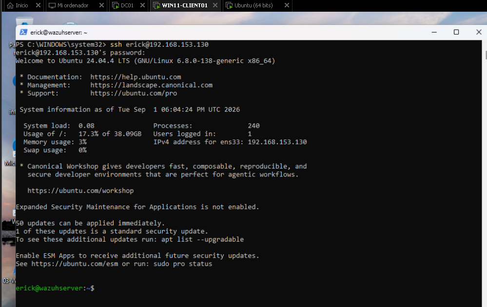

SSH was subsequently hardened by disabling password-based authentication, disabling root login, disabling X11 forwarding and limiting authentication attempts.

### Evidence

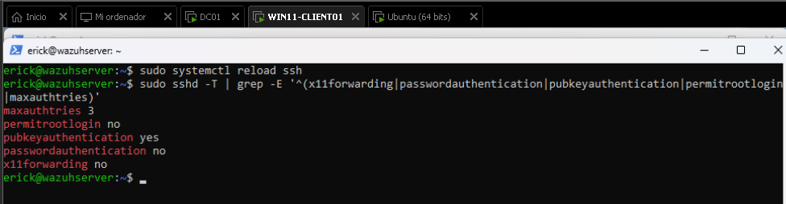 

This architecture provides the foundation for centralized event collection, threat hunting, detection engineering, alert investigation and controlled security validation throughout LAB 11.

## WAZUH-SERVER Preparation & Hardening

The WAZUH-SERVER was deployed using Ubuntu Server 24.04.4 LTS without a graphical desktop environment. The system was configured with a static IP address and hardened before the Wazuh installation.

| Resource | Configuration |
|---|---|
| Operating System | Ubuntu Server 24.04.4 LTS |
| CPU | 4 vCPU |
| RAM | 8 GB |
| Disk | 80 GB |
| Network | VMware NAT |
| IP Address | `10.10.10.30/24` |
| Gateway | `10.10.10.1` |
| DNS Server | `10.10.10.10` |
| Hostname | `wazuhserver` |

### System Updates

The operating system was updated before deploying the Wazuh platform.

```bash
sudo apt update
sudo apt upgrade
```

This ensured that the base operating system was updated before the Wazuh components were installed.

### Firewall Configuration

UFW was enabled with a default-deny policy for incoming connections. SSH was explicitly allowed for remote administration.

This configuration reduced unnecessary inbound network exposure while maintaining administrative access to the server.

### SSH Hardening

SSH was hardened to reduce the attack surface of the Linux server.

The following controls were applied:

Password-based SSH authentication disabled.
Root login disabled.
X11 forwarding disabled.
Maximum authentication attempts reduced to 3.
Public-key authentication used for administrative access.

The effective SSH configuration was validated after applying the changes.

### Service and Security Review

Before installing Wazuh, the server services were reviewed to identify unnecessary components and reduce the attack surface.

Services that were not required in the laboratory environment were disabled, while required operating-system and virtualization services were retained.

AppArmor was also verified as active, providing an additional security control at the operating-system level.

### Network, DNS and Time Synchronization

The Wazuh server was configured with a persistent static IP address:

10.10.10.30/24

The default gateway was configured as:

10.10.10.1

Internal DNS resolution was configured to use DC01:

10.10.10.10

Time synchronization was configured against the domain controller. Accurate time synchronization is important for security monitoring because event correlation and investigation rely on reliable timestamps.

Persistent DNS configuration was validated to ensure that the network configuration remained available after system restarts.

External HTTPS connectivity was also validated to confirm that the server could reach the Wazuh package infrastructure required during installation.

### Post-Reboot Validation

After rebooting the server, the network configuration and relevant security controls were revalidated.

The static IP address remained correctly configured after the reboot.

Internal DNS resolution through DC01 remained operational.

External HTTPS connectivity was also successfully validated after the reboot.

The completed preparation and hardening stage established a stable and restricted Ubuntu Server foundation before deploying the Wazuh platform.

## Wazuh Installation & Initial Configuration

The Wazuh platform was deployed on the hardened Ubuntu Server using the all-in-one installation method.

The installation included the three main Wazuh components required for the laboratory:

| Component | Function |
|---|---|
| Wazuh Manager | Receives, analyzes and correlates security events |
| Wazuh Indexer | Stores and indexes security event data |
| Wazuh Dashboard | Provides the web interface for monitoring, threat hunting and investigation |

The installation was performed directly on `WAZUH-SERVER` using the official Wazuh installation script.

```bash
curl -sO https://packages.wazuh.com/4.14/wazuh-install.sh
sudo bash ./wazuh-install.sh -a
```

The -a option was used to deploy the complete Wazuh stack on the same server, which is appropriate for the isolated Home Lab environment.

After installation, the Wazuh services were verified to ensure that the platform was operational.

The Wazuh Dashboard was made available through HTTPS at:

https://wazuhserver.lab.local

The initial administrative access was performed through the Wazuh Dashboard using the credentials generated during the installation process.

The installation established the centralized SIEM platform that would later receive telemetry from WIN11-CLIENT01, process Windows security events and provide the interface used for threat hunting and detection engineering.

No custom detection rules were modified during the initial installation stage. Custom detection logic was implemented later in a dedicated local rule file to keep laboratory-specific detections separated from the default Wazuh ruleset.

The Wazuh installation was subsequently validated through service checks and event ingestion tests before proceeding with endpoint integration.

## Windows Endpoint Integration & Security Telemetry

`WIN11-CLIENT01` was integrated with the Wazuh platform as the primary monitored Windows endpoint.

The Wazuh Agent was deployed on the Windows 11 system and configured to communicate with `WAZUH-SERVER` at `10.10.10.30`.

The objective of this integration was to provide centralized visibility into security-relevant activity occurring on the Windows endpoint.

### Wazuh Agent Deployment

The Wazuh Agent was installed and configured on `WIN11-CLIENT01`.

The agent was successfully registered with the Wazuh Manager and appeared in the Wazuh Dashboard with the expected endpoint information.

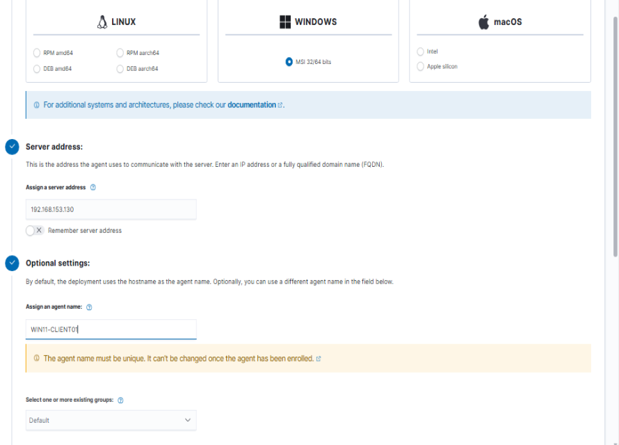

The agent overview confirmed the endpoint identity and its integration with the Wazuh Manager.

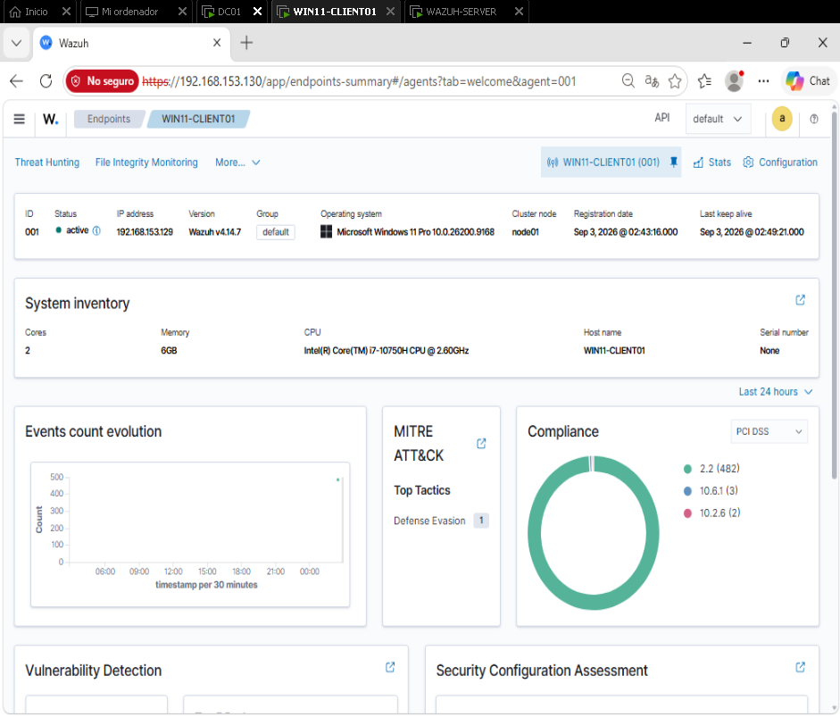

### Agent Connectivity

After configuration, the Wazuh Agent established communication with the Wazuh Manager.

The Dashboard reported the agent as connected, confirming that the endpoint was actively communicating with the centralized monitoring infrastructure.

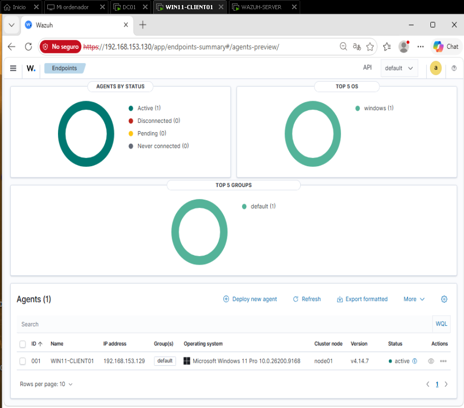

This established the communication path:

```text
WIN11-CLIENT01
      │
      │ Wazuh Agent
      ▼
WAZUH-SERVER
      │
      ▼
Wazuh Manager
      │
      ▼
Wazuh Dashboard
```

### Security Event Collection

Once the agent was operational, Windows security telemetry began appearing in the Wazuh Dashboard.

The collected telemetry included representative Windows Security events such as authentication activity, privileged logons and process creation.

The successful reception of these events confirmed that Wazuh was not only communicating with the endpoint but also receiving and processing security-relevant Windows telemetry.

### Initial Threat Hunting Visibility

The Wazuh Dashboard was used to search and filter events generated by WIN11-CLIENT01.

This provided the basis for investigating authentication activity and identifying security-relevant patterns within the endpoint telemetry.

The collected events were subsequently used for the threat hunting and detection engineering activities documented in the following sections.


## Threat Hunting & Windows Security Event Analysis

Once `WIN11-CLIENT01` was successfully integrated with Wazuh, the Dashboard was used to perform threat hunting and investigate security-relevant Windows events.

The objective of this stage was not to treat every event as malicious, but to understand the available telemetry, identify relevant security events, examine their technical fields and establish the context required for a correct security assessment.

### Threat Hunting Overview

The Wazuh Dashboard provided centralized visibility into the events generated by `WIN11-CLIENT01`.

Threat hunting was performed by filtering and investigating security events generated by the Windows endpoint.

The investigation focused on representative Windows Security events rather than attempting to document every event generated by the operating system.

### Windows Authentication Failures — Event ID 4625

Event ID `4625` represents a failed Windows logon attempt.

The event was investigated through Wazuh to identify the affected account, workstation, authentication information and other technical fields relevant to the investigation.

**Public evidence note:** The original screenshot was intentionally omitted from the public repository because it may contain internal laboratory network information, account identifiers, or sensitive security configuration details. The validation was performed as documented, but the screenshot is not included in the public version.
The technical event information provided additional context for the failed authentication attempt.

**Public evidence note:** The original screenshot was intentionally omitted from the public repository because it may contain internal laboratory network information, account identifiers, or sensitive security configuration details. The validation was performed as documented, but the screenshot is not included in the public version.
The target account and domain information were also reviewed to determine which identity was involved in the authentication failure.

**Public evidence note:** The original screenshot was intentionally omitted from the public repository because it may contain internal laboratory network information, account identifiers, or sensitive security configuration details. The validation was performed as documented, but the screenshot is not included in the public version.
A controlled authentication-failure scenario was subsequently generated to provide telemetry for the detection engineering exercise.

The investigation included the analysis of an incorrect-password authentication failure. The Wazuh event data provided both contextual and technical information about the failed authentication attempt.

**Public evidence note:** The original screenshot was intentionally omitted from the public repository because it may contain internal laboratory network information, account identifiers, or sensitive security configuration details. The validation was performed as documented, but the screenshot is not included in the public version.
**Public evidence note:** The original screenshot was intentionally omitted from the public repository because it may contain internal laboratory network information, account identifiers, or sensitive security configuration details. The validation was performed as documented, but the screenshot is not included in the public version.
The observed authentication failures demonstrated how Wazuh exposes the account, workstation, authentication status and contextual information required for further investigation.

### Process Creation — Event ID 4688

Windows Process Creation auditing was enabled on `WIN11-CLIENT01` to provide additional endpoint telemetry.

A controlled execution of `notepad.exe` was used to verify that process creation events were being collected by Wazuh.

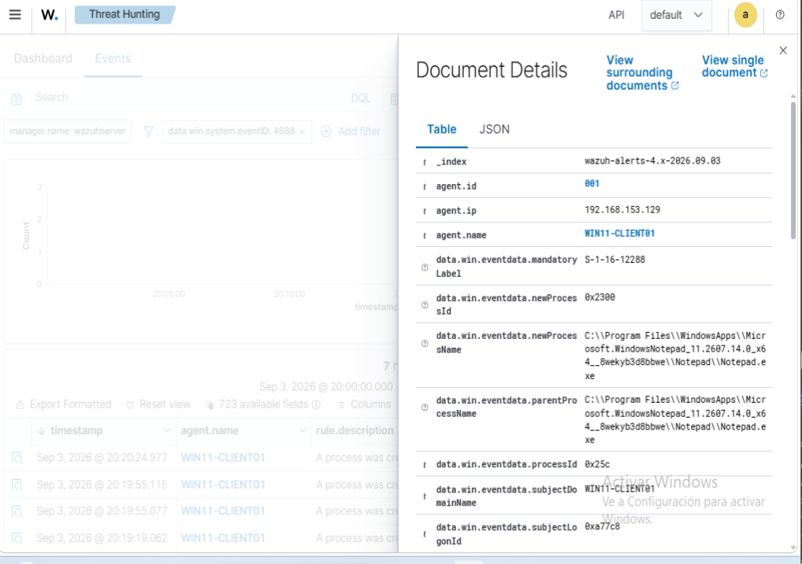

The event provided information about the newly created process, the associated user and the recorded process execution context.

This demonstrates how process creation telemetry can complement authentication events during endpoint investigations.

### Special Privileges — Event ID 4672

Event ID `4672` was also observed in the Wazuh telemetry.

This event indicates that special privileges were assigned to a new logon session. The presence of this event alone does not establish malicious activity, as administrative sessions can legitimately generate this type of telemetry.

The event was investigated through its administrative logon context and technical privilege information.

**Public evidence note:** The original screenshot was intentionally omitted from the public repository because it may contain internal laboratory network information, account identifiers, or sensitive security configuration details. The validation was performed as documented, but the screenshot is not included in the public version.
**Public evidence note:** The original screenshot was intentionally omitted from the public repository because it may contain internal laboratory network information, account identifiers, or sensitive security configuration details. The validation was performed as documented, but the screenshot is not included in the public version.
**Public evidence note:** The original screenshot was intentionally omitted from the public repository because it may contain internal laboratory network information, account identifiers, or sensitive security configuration details. The validation was performed as documented, but the screenshot is not included in the public version.
The investigation reinforced the importance of correlating privileged events with account, host, process and authentication context rather than automatically classifying them as security incidents.

### Threat Hunting Approach

The threat hunting process used in this phase followed a structured approach:

1. Identify relevant security telemetry.
2. Filter events by event ID, account or endpoint.
3. Review the technical fields of the event.
4. Establish the user, host and authentication context.
5. Correlate related events where appropriate.
6. Determine whether the observed activity is expected, suspicious or requires further investigation.

This approach was later applied to the controlled authentication-failure scenario used to validate the custom Wazuh detection rule.

The evidence collected during this section demonstrates that `WIN11-CLIENT01` was successfully generating security telemetry and that the Wazuh platform provided sufficient visibility to perform endpoint-focused threat hunting and investigation.

## Detection Engineering & Custom Wazuh Rule

The Detection Engineering stage focused on transforming individual Windows authentication failures into a higher-confidence security detection through event correlation.

The objective was to create a custom Wazuh rule capable of identifying a repeated authentication-failure pattern rather than relying only on individual `4625` events.

The detection logic implemented in this laboratory was:

**Three Event ID 4625 events for the same target account within 120 seconds → Level 12 alert**

This scenario was designed to represent a possible brute-force authentication pattern while maintaining the distinction between a suspicious pattern and confirmed malicious activity.

### Detection Logic

The existing Wazuh rule `60122` was used as the base event for the custom detection.

Rule `60122` identifies Windows authentication failures associated with Event ID `4625`.

The custom detection was configured using the following logic:

| Parameter | Value | Purpose |
|---|---:|---|
| Custom Rule ID | `100501` | Unique identifier for the laboratory detection |
| Base Rule | `60122` | Windows authentication failure |
| Frequency | `3` | Requires three matching events |
| Timeframe | `120 seconds` | Maximum correlation window |
| Correlation Field | `win.eventdata.targetUserName` | Same target account |
| Alert Level | `12` | High-severity Wazuh alert |

The rule was implemented as a local custom rule rather than modifying the default Wazuh ruleset.

### Custom Rule Implementation

The custom rule was created in:

```text
/var/ossec/etc/rules/100500-lab-authentication-rules.xml 

The final rule configuration was:

<group name="local,windows,authentication,">
    <rule id="100501" level="12" frequency="3" timeframe="120">
        <if_matched_sid>60122</if_matched_sid>
        <same_field>win.eventdata.targetUserName</same_field>
        <description>LAB: Multiple Windows authentication failures for the same account - possible brute force</description>
    </rule>
</group>
```

The rule uses <if_matched_sid> to correlate events already identified by rule 60122.

The <same_field> condition ensures that the correlated events involve the same value in win.eventdata.targetUserName.

The frequency="3" parameter requires three matching events, while timeframe="120" defines the maximum period in which those events must occur for the correlation to trigger.

This approach allows the detection to focus on repeated authentication failures against the same account instead of treating each failed authentication as an independent alert.

### Rule Validation

Before restarting the Wazuh Manager, the custom ruleset was validated using the Wazuh analysis engine.
```
sudo /var/ossec/bin/wazuh-analysisd -t
```
The validation completed without configuration errors.

The Wazuh Manager was then restarted and verified as operational before generating the controlled test events.

### Controlled Detection Scenario

A dedicated existing domain account, taylor.user, was selected for the controlled authentication-failure scenario.

Before generating the events, the domain password policy was reviewed to verify the account lockout configuration.

The domain policy reported:
```
LockoutThreshold          0
LockoutDuration           00:10:00
LockoutObservationWindow  00:10:00
```
A LockoutThreshold value of 0 indicated that automatic account lockout was disabled in the laboratory domain.

Controlled incorrect-password authentication attempts were then generated against taylor.user from WIN11-CLIENT01.

The purpose of the test was to generate three Event ID 4625 events for the same account within the configured 120-second correlation window.

### Detection Trigger

The controlled test successfully triggered custom rule 100501.

The Wazuh Dashboard displayed the sequence of events leading to the detection:
```
01:55:47.254  → Event ID 4625 → Level 5
01:55:50.078  → Event ID 4625 → Level 5
01:55:52.074  → Rule 100501  → Level 12
01:56:03.654  → Event ID 4625 → Level 5
```
The custom rule triggered after the third matching authentication failure.

The observed interval between the first and third relevant events was approximately 4.8 seconds. This is the observed event interval and should not be confused with the configured 120-second correlation window.

### Evidence

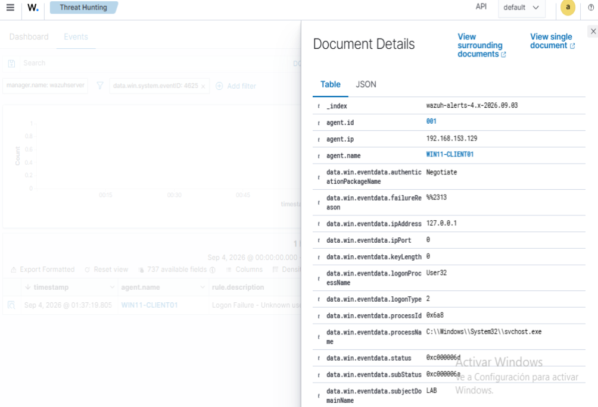 

### Technical Event Analysis

The underlying authentication event was examined to determine the technical context of the detection.

The event contained the following relevant information:
```
Field	Observed Value
Event ID	4625
Target Account	taylor.user
Target Domain	lab.local
Workstation	WIN11-CLIENT01
Logon Type	2
Source IP	127.0.0.1
Status	0xc000006d
SubStatus	0xc000006a
Authentication Package	Negotiate
Logon Process	User32
```
The 0xc000006a substatus is consistent with an incorrect password, while 0xc000006d represents the broader authentication failure condition.

The 127.0.0.1 source address represents the local loopback interface of WIN11-CLIENT01. Therefore, the observed activity originated locally from the endpoint rather than from a remote network address.

The target account, domain, workstation and Windows Security event context were also reviewed.

### Evidence
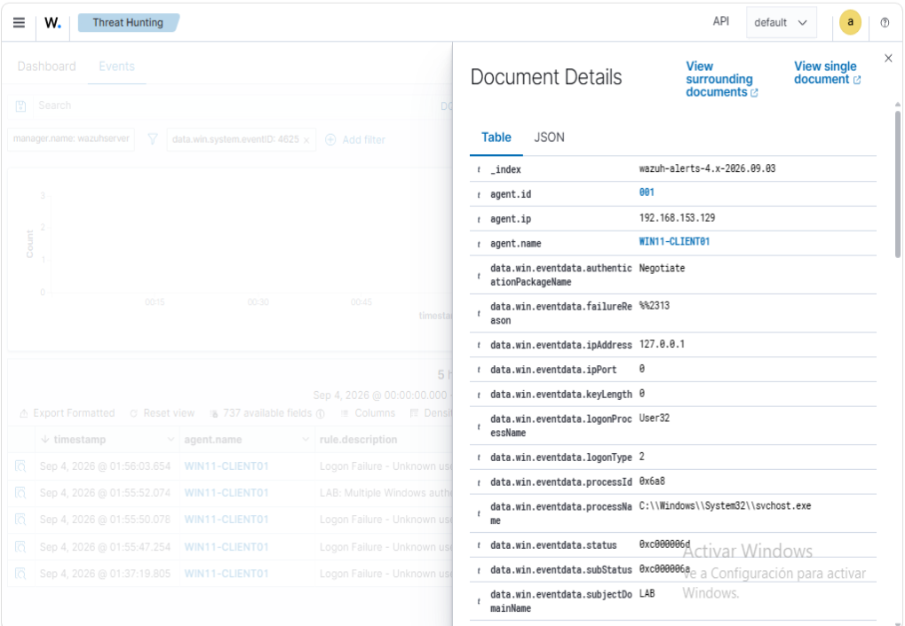 

**Public evidence note:** The original screenshot was intentionally omitted from the public repository because it may contain internal laboratory network information, account identifiers, or sensitive security configuration details. The validation was performed as documented, but the screenshot is not included in the public version.
### Rule Correlation Details

The generated Level 12 alert was examined in the Wazuh Dashboard to verify that the custom rule had performed the expected correlation.

The alert reported:
```
Rule ID: 100501
Rule Level: 12
Frequency: 3
Description: LAB: Multiple Windows authentication failures for the same account - possible brute force
Groups: local, windows, authentication
Mail: true
```
The alert also contained the previous matching events, providing evidence that the detection was based on three authentication failures associated with the same target account.

### Evidence

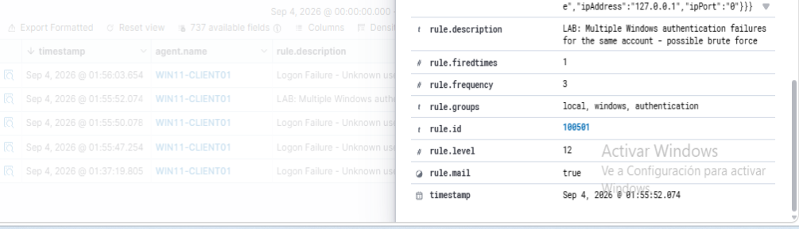


### Detection Dashboard Validation

The Wazuh Dashboard overview was used to validate the resulting alert distribution.

The controlled scenario produced:

5 total displayed events.
1 Level 12 or higher alert.
4 authentication failures.
0 authentication successes within the selected dashboard view.

The Level 12 alert represented the successful execution of the custom correlation rule.

The successful execution of rule 100501 demonstrates that the laboratory Wazuh deployment can correlate multiple Windows authentication failures for the same account and escalate the resulting pattern to a higher-severity detection.

The detection should be interpreted as a possible brute-force pattern, not as definitive proof of a malicious attack. In this laboratory, the events were intentionally generated as a controlled security test and originated locally from WIN11-CLIENT01.

### Evidence
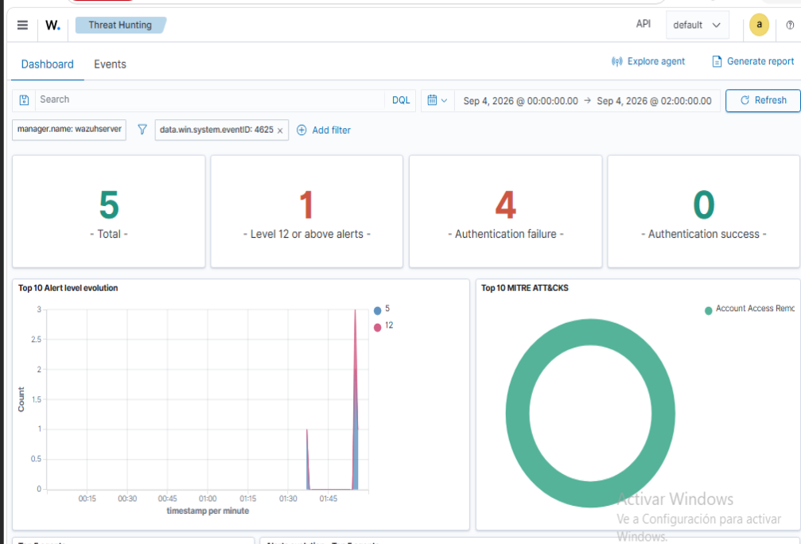


### Security Investigation & Incident Analysis

The detection generated by custom rule `100501` was investigated as a security event to determine whether the observed authentication failures represented normal activity, suspicious behavior or a confirmed security incident.

The investigation followed a structured approach based on the available Wazuh telemetry and Windows event fields.

### Alert Investigation

The Level 12 alert generated by rule `100501` was selected for investigation in the Wazuh Dashboard.

The alert was associated with repeated Event ID `4625` authentication failures involving the same target account, `taylor.user`.

The investigation confirmed that the alert was generated after three matching authentication failures occurred within the configured correlation window.

### Evidence


### Authentication Context

The underlying Windows authentication events were examined to establish the identity, endpoint and authentication context associated with the alert.

The relevant information identified during the investigation included:

| Investigation Field | Observed Value |
|---|---|
| Account | `taylor.user` |
| Domain | `lab.local` |
| Endpoint | `WIN11-CLIENT01` |
| Event ID | `4625` |
| Logon Type | `2` |
| Source IP | `127.0.0.1` |
| Status | `0xc000006d` |
| SubStatus | `0xc000006a` |
| Authentication Package | `Negotiate` |
| Logon Process | `User32` |

The `127.0.0.1` address indicates that the authentication activity was observed through the local loopback interface of the Windows endpoint.

Logon Type `2` represents an interactive logon. Combined with the local loopback address and the controlled nature of the test, the evidence indicates that the authentication failures were generated locally on `WIN11-CLIENT01`.

### Evidence


**Public evidence note:** The original screenshot was intentionally omitted from the public repository because it may contain internal laboratory network information, account identifiers, or sensitive security configuration details. The validation was performed as documented, but the screenshot is not included in the public version.
### Timeline Analysis

The event sequence was reviewed to establish the chronology of the authentication failures and the resulting detection.

```text
01:55:47.254  → Event ID 4625 → Level 5
01:55:50.078  → Event ID 4625 → Level 5
01:55:52.074  → Rule 100501  → Level 12
01:56:03.654  → Event ID 4625 → Level 5
```
The first three relevant authentication failures occurred within approximately 4.8 seconds, which satisfied the custom rule requirement of three matching events within a maximum timeframe of 120 seconds.

The fourth authentication failure occurred after the Level 12 detection had already been generated.

### Root Cause and Security Assessment

The authentication failures were intentionally generated during a controlled laboratory scenario using an incorrect password for the selected test account.

The Windows event data included substatus 0xc000006a, which is consistent with an incorrect password.

The activity therefore reproduced the same telemetry pattern that a repeated authentication attempt could generate in a real environment, allowing the custom detection rule to be tested without relying on an uncontrolled security event.

The observed pattern is compatible with a possible brute-force authentication pattern, but the evidence does not by itself prove malicious activity.

Several contextual factors reduce the likelihood of interpreting this particular laboratory event as a real attack:

The activity was intentionally generated as part of the laboratory.
The affected account was the dedicated test account taylor.user.

The source address was 127.0.0.1.
The activity used an interactive logon context.
No successful authentication was observed within the selected Dashboard view.

The purpose of the scenario was to validate the custom Wazuh detection.
10.5 Detection Engineering Outcome

The investigation demonstrated the complete detection lifecycle implemented in this laboratory:
```
Authentication Failure
        │
        ▼
Windows Event ID 4625
        │
        ▼
Wazuh Rule 60122
        │
        ▼
Repeated Events for Same Account
        │
        ▼
Custom Rule 100501
        │
        ▼
Level 12 Alert
        │
        ▼
Security Investigation
        │
        ▼
Contextual Assessment
```
The result demonstrates that the Wazuh deployment can move beyond individual event monitoring and apply custom correlation logic to identify potentially suspicious authentication patterns.

The laboratory scenario successfully validated the detection and investigation workflow while maintaining an important security principle: a detection is an indication requiring investigation, not automatically proof of compromise.

## Validation, Results & Evidence

The final validation stage was performed to confirm that the Wazuh platform, Windows endpoint integration and custom detection remained operational after completing the laboratory activities.

The validation focused on the core components required for LAB 11: Wazuh Manager operation, Windows endpoint telemetry, event analysis and successful execution of the custom detection rule.

### Wazuh Manager Validation

The Wazuh analysis engine was tested to verify that the current configuration and ruleset contained no configuration errors.

```bash
sudo /var/ossec/bin/wazuh-analysisd -t
```

The command completed without reporting configuration errors.

The Wazuh Manager service was then checked to confirm that it was active and running correctly.

The final validation confirmed an operational Wazuh Manager with the expected analysis and monitoring components running.

### Evidence

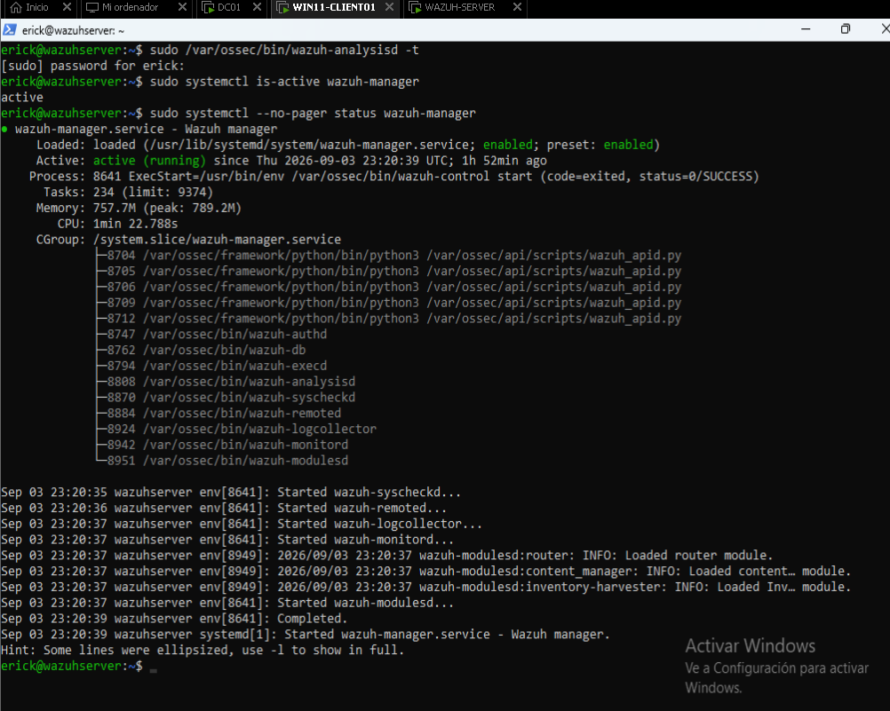

### 11.2 Windows Endpoint Validation

`WIN11-CLIENT01` remained integrated with the Wazuh platform and continued to provide Windows security telemetry to the Wazuh Manager.

The endpoint generated and transmitted representative Windows security events, confirming that the Wazuh Agent remained connected and operational.

### Evidence


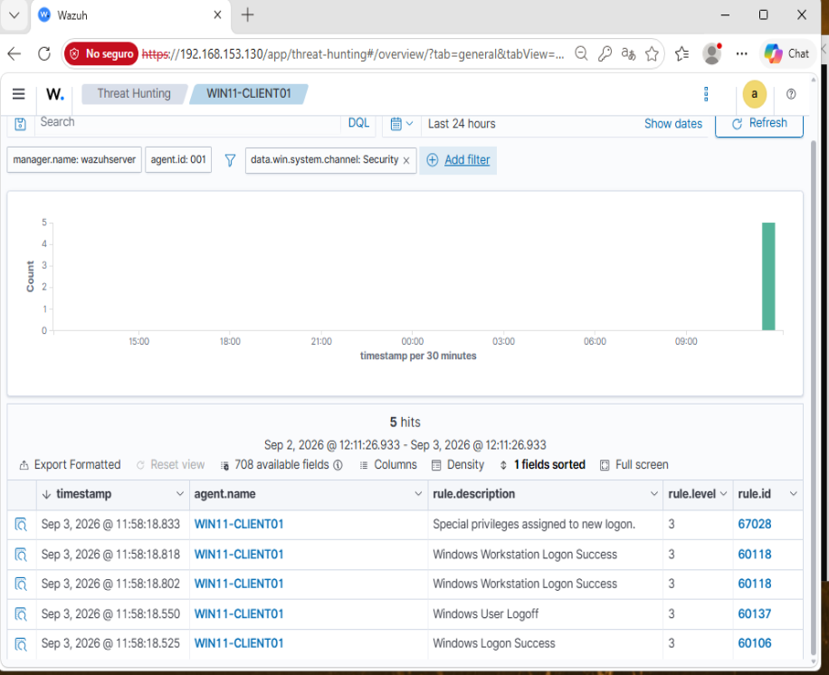

### Windows Security Event Validation

Representative Windows Security events were validated to confirm that the endpoint was generating and Wazuh was receiving relevant security telemetry.

The validated events included:

- Event ID `4624` — Successful logon
- Event ID `4625` — Failed logon
- Event ID `4672` — Special privileges assigned to a new logon
- Event ID `4688` — Process creation

### Evidence

**Public evidence note:** The original screenshot was intentionally omitted from the public repository because it may contain internal laboratory network information, account identifiers, or sensitive security configuration details. The validation was performed as documented, but the screenshot is not included in the public version.


**Public evidence note:** The original screenshot was intentionally omitted from the public repository because it may contain internal laboratory network information, account identifiers, or sensitive security configuration details. The validation was performed as documented, but the screenshot is not included in the public version.
### Custom Detection Validation

The custom detection rule `100501` was successfully validated using a controlled authentication-failure scenario.

Three Event ID `4625` events associated with the same target account were generated within the configured 120-second correlation window.

The custom rule subsequently generated a Level 12 alert.

### Evidence


### Detection Correlation Validation

The Level 12 alert generated by rule `100501` was inspected to confirm that the correlation logic operated as designed.

The alert showed:

- Rule ID `100501`
- Level `12`
- Frequency `3`
- Correlation based on the same target account
- Previous matching authentication-failure events

### Evidence


### Detection Dashboard Validation

The Wazuh Dashboard was reviewed to confirm the final alert state generated during the controlled detection scenario.

The dashboard showed the Level 12 detection together with the authentication-failure events generated during the test.

### Evidence


### Final Validation Results

| Validation | Result |
|---|---|
| Ubuntu Server operational | Passed |
| Wazuh Manager operational | Passed |
| Wazuh analysis configuration validation | Passed |
| WIN11-CLIENT01 Wazuh Agent connected | Passed |
| Windows security telemetry received | Passed |
| Event ID 4624 observed | Passed |
| Event ID 4625 observed | Passed |
| Event ID 4672 observed | Passed |
| Event ID 4688 observed | Passed |
| Custom rule `100501` loaded | Passed |
| Three-event authentication correlation | Passed |
| Level 12 detection generated | Passed |
| Detection investigation completed | Passed |

The final validation confirmed that the principal objectives of LAB 11 were successfully achieved.

The laboratory demonstrated a complete monitoring and detection workflow, from Windows endpoint telemetry collection through event analysis, custom rule correlation, alert generation and security investigation.

## Security Assessment

The security assessment was performed to evaluate the effectiveness of the monitoring, telemetry collection and detection capabilities implemented during LAB 11.

The assessment focused on whether the environment was able to collect relevant Windows security events, correlate repeated authentication failures and generate a meaningful alert for further investigation.

### Monitoring Capability

The Wazuh platform successfully provided centralized visibility into security events generated by `WIN11-CLIENT01`.

The Wazuh Agent collected Windows Security telemetry and transmitted the events to the Wazuh Manager for analysis.

Representative events validated during the laboratory included successful authentication, failed authentication, special privilege assignment and process creation.

This demonstrated that the monitoring architecture was capable of providing centralized security visibility over the Windows endpoint.

**Assessment:** Passed

### Authentication Monitoring

Windows authentication activity was successfully monitored through Event IDs `4624` and `4625`.

Event ID `4625` provided relevant information for investigating failed authentication attempts, including:

- Target account
- Target domain
- Workstation
- Logon type
- Authentication package
- Status and sub-status codes
- Process information
- Event timestamp

The collected telemetry provided sufficient context to investigate authentication failures and distinguish individual events from repeated authentication activity.

**Assessment:** Passed

### Evidence

**Public evidence note:** The original screenshot was intentionally omitted from the public repository because it may contain internal laboratory network information, account identifiers, or sensitive security configuration details. The validation was performed as documented, but the screenshot is not included in the public version.


**Public evidence note:** The original screenshot was intentionally omitted from the public repository because it may contain internal laboratory network information, account identifiers, or sensitive security configuration details. The validation was performed as documented, but the screenshot is not included in the public version.
### Endpoint Activity Monitoring

The laboratory also validated endpoint activity monitoring through Windows process creation and privileged logon telemetry.

Event ID `4688` demonstrated that process creation events could be collected and investigated through Wazuh.

Event ID `4672` provided visibility into logons associated with special administrative privileges.

These events can provide additional context during security investigations by helping analysts understand what activity occurred on an endpoint and under which security context.

**Assessment:** Passed

### Evidence


**Public evidence note:** The original screenshot was intentionally omitted from the public repository because it may contain internal laboratory network information, account identifiers, or sensitive security configuration details. The validation was performed as documented, but the screenshot is not included in the public version.
### Detection Engineering Capability

A custom Wazuh detection rule was implemented to identify repeated Windows authentication failures for the same target account.

Rule `100501` was configured with:

- `frequency="3"`
- `timeframe="120"`
- Correlation based on `win.eventdata.targetUserName`
- Level `12`
- Dependency on Wazuh rule `60122`

The rule was tested using a controlled laboratory scenario and successfully generated a Level 12 alert after three matching authentication failures.

**Assessment:** Passed

### Evidence


### Security Investigation Capability

The generated alert was investigated using the Wazuh Dashboard.

The investigation correlated the repeated authentication failures with the affected account, endpoint and authentication context.

The observed scenario involved:

- Account: `taylor.user`
- Domain: `lab.local`
- Endpoint: `WIN11-CLIENT01`
- Event ID: `4625`
- Logon Type: `2`
- Source address: `127.0.0.1`
- Status: `0xc000006d`
- Sub-status: `0xc000006a`

The timestamps demonstrated that the three relevant authentication failures occurred within the configured correlation window.

The investigation also established an important security principle: **a detection alert indicates suspicious activity requiring investigation, but does not by itself prove that a compromise occurred.**

The scenario was intentionally generated as a controlled laboratory test and therefore should not be classified as a confirmed malicious attack.

**Assessment:** Passed

### Evidence


### Detection Limitations

The implemented detection rule is intentionally focused on repeated authentication failures for the same account.

Although this provides useful visibility into brute-force-like authentication patterns, the detection does not independently establish malicious intent.

The observed test activity originated from `127.0.0.1` on the Windows endpoint and used an interactive logon type.

Additional contextual information would be required in a real production investigation to determine whether the activity originated from a legitimate user, a misconfiguration, a compromised process or an actual attack.

The current laboratory implementation therefore demonstrates the detection and investigation capability while maintaining an appropriate distinction between **observed evidence**, **security hypothesis** and **confirmed compromise**.

### Overall Security Assessment

The LAB 11 implementation successfully established a functional security monitoring and detection capability.

The assessment confirmed that:

| Security Capability | Result |
|---|---|
| Centralized Wazuh monitoring | Passed |
| Windows endpoint telemetry | Passed |
| Authentication event monitoring | Passed |
| Process creation monitoring | Passed |
| Privileged logon monitoring | Passed |
| Authentication failure investigation | Passed |
| Custom detection rule | Passed |
| Multi-event correlation | Passed |
| Level 12 alert generation | Passed |
| Security investigation | Passed |
| Detection limitations identified | Passed |

The overall assessment is that LAB 11 successfully demonstrates a functional SIEM-based security monitoring workflow.

The environment is capable of collecting endpoint telemetry, identifying relevant security events, correlating repeated authentication failures, generating a high-severity detection and providing sufficient contextual information for an analyst to investigate the alert.

No containment or destructive response action was performed as part of this phase. Response automation, account containment, endpoint isolation and recovery procedures are reserved for future controlled security-testing activities.

## Conclusion

LAB 11 established a complete SIEM-based security monitoring and detection workflow using Wazuh and a Windows endpoint.

Throughout the laboratory, `WAZUH-SERVER` was prepared as a hardened Ubuntu Server 24.04.4 LTS system and configured with a static network configuration, internal DNS resolution, time synchronization, firewall protection and SSH hardening.

Wazuh was then deployed as the central security monitoring platform, providing the Manager, Indexer and Dashboard components required to collect, process and investigate security telemetry.

Integration with `WIN11-CLIENT01` successfully enabled centralized collection of Windows security events. Representative telemetry included successful logons (`4624`), failed logons (`4625`), special privileges (`4672`) and process creation (`4688`).

A custom detection rule was also developed to identify repeated authentication failures for the same account. Rule `100501` successfully correlated three Event ID `4625` events within a 120-second window and generated a Level 12 alert.

Investigation of the generated alert demonstrated how an analyst can move from an individual security event to a correlated detection, examine technical event fields, identify the affected account and endpoint, and assess the surrounding authentication context.

One of the main outcomes of this laboratory was understanding the difference between **telemetry, detection and confirmed compromise**. A high-severity alert can identify a suspicious pattern, but additional investigation is required before classifying an event as malicious.

For this reason, the authentication-failure scenario involving `taylor.user` was correctly treated as a controlled laboratory simulation rather than a confirmed brute-force attack. Its purpose was to validate the detection engineering and investigation workflow under controlled conditions.

From a defensive security perspective, LAB 11 demonstrates the complete workflow:

```text
Endpoint Activity
       ↓
Windows Security Telemetry
       ↓
Wazuh Agent
       ↓
Wazuh Manager
       ↓
Event Analysis
       ↓
Custom Detection Rule
       ↓
Correlation
       ↓
Level 12 Alert
       ↓
Security Investigation
       ↓
Assessment & Decision
```

This implementation provides a practical foundation for future security operations activities, including additional detection scenarios, threat hunting, containment, endpoint isolation, remediation and recovery testing.

Overall, LAB 11 demonstrates the ability to deploy, harden, integrate, monitor and investigate a functional SIEM environment while applying a structured approach to security detection and analysis.

## Final Status

All planned activities for the Wazuh-based SIEM implementation were performed and validated, including server preparation, security hardening, Wazuh deployment, Windows endpoint integration, security telemetry collection, threat hunting, detection engineering and incident investigation.

| LAB 11 Component | Status |
|---|---|
| Ubuntu Server 24.04.4 LTS deployment | ✅ Completed |
| Static network configuration | ✅ Completed |
| Internal DNS resolution | ✅ Completed |
| NTP time synchronization | ✅ Completed |
| UFW firewall configuration | ✅ Completed |
| SSH hardening | ✅ Completed |
| Service and security review | ✅ Completed |
| Wazuh Manager deployment | ✅ Completed |
| Wazuh Indexer deployment | ✅ Completed |
| Wazuh Dashboard deployment | ✅ Completed |
| WIN11-CLIENT01 agent integration | ✅ Completed |
| Windows security telemetry collection | ✅ Completed |
| Event ID 4624 analysis | ✅ Completed |
| Event ID 4625 analysis | ✅ Completed |
| Event ID 4672 analysis | ✅ Completed |
| Event ID 4688 analysis | ✅ Completed |
| Threat hunting workflow | ✅ Completed |
| Custom Wazuh rule `100501` | ✅ Completed |
| Authentication failure correlation | ✅ Completed |
| Level 12 detection validation | ✅ Completed |
| Security alert investigation | ✅ Completed |
| Final system validation | ✅ Completed |
| Security assessment | ✅ Completed |
| LAB 11 documentation | ✅ Completed |

The laboratory successfully demonstrates a functional SIEM implementation capable of collecting endpoint security telemetry, analyzing Windows security events, correlating repeated authentication failures and generating actionable security alerts.

All core objectives defined for LAB 11 were achieved and validated through controlled testing and documented evidence.

Future activities such as automated containment, endpoint isolation, account blocking, remediation and recovery testing will be developed as separate security-testing extensions rather than being required for completion of this laboratory phase.

⬆️ [Back to Roadmap](#lab-roadmap)


<a id="lab-12"></a>
# LAB 12 — Vulnerability Management

## Objective

The objective of this phase was to establish and execute a practical vulnerability management workflow across the Home Lab environment.

The phase focused on identifying exposed services, assessing software and operating system versions, identifying potential vulnerabilities, evaluating CVEs and CVSS-based risk, prioritizing findings, and performing controlled remediation activities.

The vulnerability management process followed a structured lifecycle:

1. Asset inventory and preparation.
2. Service enumeration and version assessment.
3. Vulnerability identification.
4. CVE and CVSS analysis.
5. Risk prioritization.
6. Remediation.
7. Re-scan and validation.
8. Security assessment.
9. Documentation and evidence collection.

The goal was not only to identify vulnerabilities, but also to demonstrate a complete security workflow from discovery through remediation and validation.

## Environment

The vulnerability management activities were performed against the main infrastructure components of the Home Lab.

| Asset | Operating System | IPv4 Address | Primary Role |
|---|---|---|---|
| DC01 | Windows Server 2025 Standard Evaluation | `10.10.10.10` | Domain Controller / DNS / Active Directory |
| WIN11-CLIENT01 | Windows 11 | `10.10.10.20` | Domain-joined workstation |
| WAZUH-SERVER | Ubuntu Server 24.04.4 LTS | `10.10.10.30` | Wazuh Manager / Indexer / Dashboard |

The laboratory network used the `10.10.10.0/24` network through VMware Workstation.

The Active Directory domain was:

`lab.local`

The default gateway was:

`10.10.10.1`

The Windows 11 client used `10.10.10.10` as its primary DNS server.

## Vulnerability Management Methodology

The assessment followed a controlled and repeatable methodology.

### Asset Identification

Each relevant laboratory system was identified by hostname, IP address, operating system, and security role.

This established the scope of the assessment and prevented vulnerability scanning from being performed against unidentified or unintended systems.

### Service Enumeration

Nmap was used to identify exposed TCP services and determine the software associated with each listening port.

Service enumeration provided the foundation for subsequent vulnerability identification and version assessment.

### Vulnerability Identification

Nmap NSE vulnerability scripts were used as an initial vulnerability discovery mechanism.

The results were treated as indicators requiring validation rather than automatically accepted as confirmed vulnerabilities.

### Vulnerability Analysis

Potential findings were correlated with:

- affected software;
- operating system versions;
- exposed services;
- CVE identifiers;
- CVSS severity;
- exploitability;
- business/security impact;
- likelihood of exploitation.

### Risk Prioritization

Findings were prioritized according to their potential impact and likelihood within the laboratory environment.

This allowed remediation activities to focus on the findings with the greatest security relevance.

### Remediation

Remediation actions were performed in a controlled manner.

Snapshots were used before significant changes where appropriate, allowing the laboratory environment to be restored if a remediation caused an unexpected problem.


## Asset Inventory and Preparation

The initial preparation phase established the systems included in the vulnerability management assessment.

The main assets were:

| Asset | IP Address | Function |
|---|---|---|
| `DC01` | `10.10.10.10` | Active Directory Domain Controller |
| `WIN11-CLIENT01` | `10.10.10.20` | Windows endpoint |
| `WAZUH-SERVER` | `10.10.10.30` | SIEM / security monitoring |

Connectivity between the systems had already been validated through the previous networking and security phases.

The vulnerability assessment therefore focused on service exposure, software versions, configuration weaknesses, and known vulnerabilities rather than basic network connectivity.

## Network Service Enumeration

Nmap was used to enumerate exposed TCP services across the laboratory systems.

### DC01 Service Enumeration

The initial assessment of `DC01` identified the following open TCP services:

| Port | Service | Role |
|---:|---|---|
| `53` | DNS | Active Directory-integrated DNS |
| `88` | Kerberos | Domain authentication |
| `135` | MSRPC | Windows RPC |
| `139` | NetBIOS | Legacy Windows networking |
| `389` | LDAP | Active Directory directory services |
| `445` | SMB | Windows file/service sharing |
| `464` | Kerberos Password Change | Domain password operations |
| `593` | RPC over HTTP | Windows RPC |
| `636` | LDAPS | LDAP over SSL/TLS |
| `3268` | Global Catalog LDAP | Active Directory Global Catalog |
| `3269` | Global Catalog LDAPS | Secure Global Catalog |
| `5985` | WinRM HTTP | Windows remote management |

The exposed services were consistent with the expected functionality of a Windows Server domain controller.

### Evidence

**Public evidence note:** The original screenshot was intentionally omitted from the public repository because it may contain internal laboratory network information, account identifiers, or sensitive security configuration details. The validation was performed as documented, but the screenshot is not included in the public version.
**Public evidence note:** The original screenshot was intentionally omitted from the public repository because it may contain internal laboratory network information, account identifiers, or sensitive security configuration details. The validation was performed as documented, but the screenshot is not included in the public version.
### WIN11-CLIENT01 Service Enumeration

The Windows 11 endpoint exposed the following primary TCP services during enumeration:

| Port | Service |
|---:|---|
| `135` | MSRPC |
| `139` | NetBIOS |
| `445` | SMB |

The exposed services were consistent with a Windows domain-joined workstation.

### Evidence

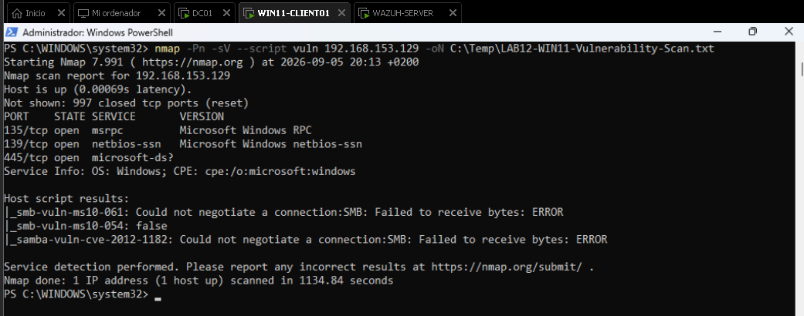

### WAZUH-SERVER Service Enumeration

The Wazuh server was assessed using targeted service enumeration because host discovery was restricted by the server firewall.

The assessment identified:

| Port | Service |
|---:|---|
| `22` | OpenSSH |
| `443` | Wazuh Dashboard / HTTPS |

The HTTPS service exposed the Wazuh Dashboard login interface and required authentication.

No vulnerability was inferred solely from the presence of these services.

### Evidence

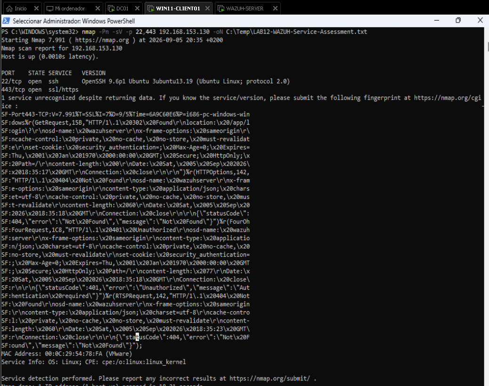

## Vulnerability Scanning

Nmap vulnerability scripts were executed against the laboratory assets to identify potential weaknesses.

The scans were performed with:

```powershell
nmap -Pn -sV --script vuln <target>
```

The -Pn option was used where necessary because host discovery could be affected by firewall configuration.

The vulnerability scan results were interpreted carefully. Nmap script output was considered a detection or indicator and was not automatically treated as a confirmed vulnerability without additional validation.

## DC01 Vulnerability Scan

The DC01 vulnerability scan identified the expected Windows and Active Directory services.

The SMB vulnerability scripts did not establish a confirmed vulnerability. Some SMB checks returned negotiation errors, while other checks returned negative results.

HTTP vulnerability checks did not identify XSS or CSRF vulnerabilities.

At this stage, no confirmed critical network vulnerability was established solely from the Nmap scan.

## WIN11 Vulnerability Scan

The Windows 11 vulnerability scan did not identify a confirmed critical vulnerability through the selected Nmap NSE checks.

The endpoint remained consistent with the previously established Windows security baseline.

### Evidence


## WAZUH Vulnerability Assessment

The Wazuh server was assessed through service and software version enumeration.

The assessment identified OpenSSH and the Wazuh web interface but did not establish a confirmed vulnerability from exposed ports alone.

## Service Configuration Assessment

Network exposure was complemented by direct configuration review on the Windows Server domain controller.

## SMB Security Configuration

SMB configuration was reviewed on DC01.

The following configuration was observed:

SMBv1: Disabled
SMBv2/3: Enabled
SMB signing requirement: Enabled

SMBv1 was therefore not available on the domain controller, while SMB signing was required.

### Evidence

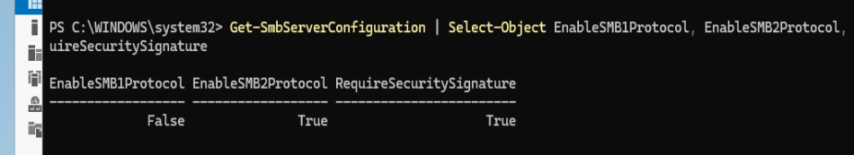


## WinRM Configuration

WinRM was found to be listening on TCP port 5985.

The listener used HTTP transport, while WinRM was configured with:

AllowUnencrypted = false
Kerberos authentication enabled
Negotiate authentication enabled
Basic authentication disabled on the service
Remote access enabled

The configuration was treated as an administrative exposure requiring contextual assessment rather than automatically classified as a vulnerability.

### Evidence

**Public evidence note:** The original screenshot was intentionally omitted from the public repository because it may contain internal laboratory network information, account identifiers, or sensitive security configuration details. The validation was performed as documented, but the screenshot is not included in the public version.
## LDAP Security Configuration

LDAP services were exposed through ports 389, 636, 3268, and 3269.

The LDAP security configuration was reviewed to determine whether LDAP signing/integrity protections were enforced.

The assessment identified LDAPServerIntegrity = 1, indicating that LDAP signing was not configured at the strongest mandatory enforcement level.

This was therefore recorded as a potential security hardening finding requiring risk assessment.

### Evidence
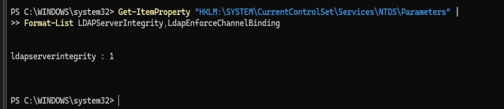


## LDAPS Certificate Assessment

TCP port 636 was reachable, but the LDAPS TLS handshake could not be completed successfully.

The investigation found that the LocalMachine certificate store did not contain an appropriate certificate for the domain controller.

Directory Service Event ID 1220 also indicated that SSL LDAP was unavailable because the server could not obtain a suitable certificate.

This was recorded as a configuration/security finding rather than treating TCP port 636 being open as proof that LDAPS was correctly configured.

### Evidence
**Public evidence note:** The original screenshot was intentionally omitted from the public repository because it may contain internal laboratory network information, account identifiers, or sensitive security configuration details. The validation was performed as documented, but the screenshot is not included in the public version.
## Software and Version Assessment

Software versions were reviewed to identify components that could be associated with known vulnerabilities.

## Wazuh Software Versions

The Wazuh components were reviewed individually.

The installed Wazuh packages were version:

4.14.7-1

The Wazuh Manager, Indexer, and Dashboard components were not identified as requiring an upgrade during the assessment.

The OpenSSH package was also reviewed.

The installed OpenSSH version was:

1:9.6p1-3ubuntu13.19

No immediate confirmed vulnerability was established from the installed OpenSSH version during the assessment.

### Evidence
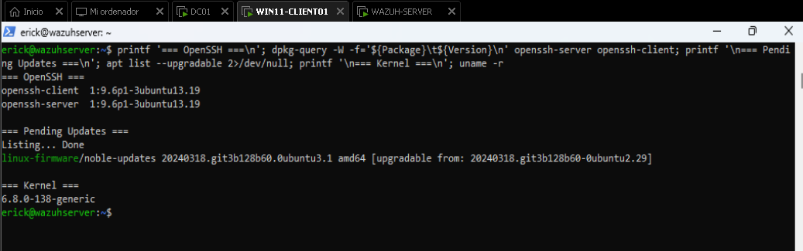

## Windows Server Patch Level

The Windows Server 2025 domain controller was identified as:

Windows Server 2025 Standard Evaluation
Version 24H2
Build 26100
UBR 32230

The installed update history was reviewed as part of the vulnerability assessment.

### Evidence
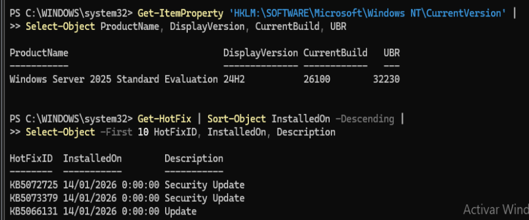

## Vulnerability Identification

The assessment produced several findings requiring further analysis.

## VM-01 — Windows Server Patch Gap

DC01 was running build 26100.32230 while the August 2026 cumulative security update KB5120233 targeted build 26100.33296.

The update was therefore identified as a patching gap and prioritized for remediation.

Status: Open at identification stage

Impact: High

Probability: High

Risk: High

Priority: P1

## VM-02 — LDAP Signing Not Mandatory

LDAP signing was not configured at mandatory enforcement level.

Because LDAP is a core Active Directory service, insufficient LDAP integrity enforcement can increase the risk of authentication/session manipulation in scenarios where an attacker can interfere with LDAP communications.

Status: Open

Impact: High

Probability: Medium

Risk: High/Medium

Priority: P2

## VM-03 — LDAPS Certificate Unavailable

The domain controller exposed TCP 636, but an appropriate certificate was not available for LDAPS.

This prevented the expected TLS-based LDAP service from functioning correctly.

Status: Open

Impact: Medium

Probability: Medium

Risk: Medium

Priority: P2

## VM-04 — Pending Linux Firmware Update

The Wazuh server had a linux-firmware package update available.

The presence of an available package update was recorded, but it was not automatically classified as a CVE without evidence linking the specific package version to a vulnerable condition.

Status: Pending assessment/update

Impact: Low

Probability: Low

Risk: Low

Priority: P3

## VM-05 — Historical DC01 I/O Error

A historical Active Directory database I/O error involving ntds.dit was identified during system event review.

Additional checks did not reproduce the condition at that time, and subsequent disk health and filesystem checks did not identify bad sectors or active filesystem corruption.

The finding was therefore treated as historical and informational rather than an active confirmed vulnerability.

Status: Informational

Impact: Medium

Probability: Low

Risk: Low / Informational

Priority: P4

## CVE and CVSS Analysis

The identified findings were evaluated according to their technical severity and relevance to the laboratory environment.

CVE identifiers were not assigned solely from Nmap output when the underlying condition had not been independently confirmed.

This distinction was particularly important for service-level findings where a scanner could identify a potentially vulnerable service without establishing that the specific implementation was actually exploitable.

The assessment therefore separated:

confirmed vulnerabilities;
configuration weaknesses;
patching gaps;
potential scanner findings;
informational conditions.

This approach reduced the risk of overstating scanner results.

## Risk Prioritization

Findings were prioritized based on their potential impact, likelihood, and relevance to the lab environment.

| ID | Finding | Impact | Probability | Risk | Priority | Status |
|---|---|---|---|---|---|---|
| VM-01 | DC01 Windows patching gap | High | High | High | P1 | Open / Deferred |
| VM-02 | LDAP signing not mandatory | High | Medium | High/Medium | P2 | Open |
| VM-03 | LDAPS certificate unavailable | Medium | Medium | Medium | P2 | Open |
| VM-04 | Wazuh Linux firmware update | Low | Low | Low | P3 | Remediated |
| VM-05 | Historical DC01 I/O error | Medium | Low | Low / Informational | P4 | Monitor |
| VM-06 | DC01 Slowloris WinRM/HTTP finding | Medium | Unknown | Medium | P2 | Requires Validation |

DC01 patching was given the highest priority because it affects a critical Active Directory infrastructure component.

LDAP signing and LDAPS were placed next in priority due to their impact on the security of directory communications.

Wazuh firmware was considered a lower-risk issue. No specific CVE was associated with the pending firmware package, and the update was successfully completed and validated.

The historical I/O condition remains documented for monitoring purposes, but it was not considered an active vulnerability based on the available evidence.

Nmap also reported a potential Slowloris condition on DC01. Since the result was classified as **LIKELY VULNERABLE** rather than independently confirmed, it remains under investigation instead of being treated as a confirmed exploitable vulnerability.

## Remediation

Remediation activities were performed using a controlled approach.

A VMware snapshot was created before making significant changes to the domain controller:

LAB12-DC01-BEFORE-REMEDIATION

This provided a recovery point before patch remediation.

## Windows Server Patch Remediation

The primary remediation target was KB5120233 for Windows Server 2025.

The update targeted build:

26100.33296

while the domain controller was running:

26100.32230

Multiple controlled installation methods were attempted.

### Evidence


## Windows Update Troubleshooting

The Windows Update subsystem was reviewed after the update repeatedly failed.

The update was observed entering a staged state but failing during servicing.

The Windows Update cache was reset by renaming the existing:

C:\Windows\SoftwareDistribution

to:

C:\Windows\SoftwareDistribution.old

A clean SoftwareDistribution directory was then recreated by Windows Update services.

The update was downloaded and attempted again.

The remediation did not resolve the installation failure.

## Servicing Stack and CBS Analysis

The Windows servicing logs were reviewed to determine the actual cause of the installation failure.

The component store was checked using DISM.

DISM /Online /Cleanup-Image /ScanHealth reported no component store corruption.

The KB5120233 package was found in a Staged state rather than Installed.

CBS identified the relevant failure during execution of the Software Protection Platform installer.

The decisive error sequence was:

SppInstaller
Binary Name: sppinst.dll
ErrorCode: 0xc004e01c

followed by:

CBS_E_INSTALLERS_FAILED
0x800f0922

CBS subsequently initiated a rollback transaction.

The same servicing failure was also observed during rollback processing, confirming that the SPP installer was directly involved in the failed cumulative update transaction.

## Staged Package Investigation

The KB5120233 rollup package:

```text
Package_for_RollupFix~31bf3856ad364e35~amd64~~26100.33296.1.21
```

was verified as applicable and present in a Staged state.

The package state was investigated as part of the servicing failure analysis. Because the update transaction was subsequently rolled back, the staged package state was treated as part of the Windows servicing problem rather than as evidence of a successfully installed update.

The system remained on build:

```text
26100.32230
```

Further servicing investigation was performed before attempting the update again.

## Software Protection Platform Repair

CBS logs identified SppInstaller as the installer responsible for the update failure. As a recovery step, the Windows Software Protection Platform licensing files were reinstalled using:

cscript.exe "$env:windir\system32\slmgr.vbs" /rilc

The command completed successfully and restored the ServerStandardEval licensing files.

The server remained configured as:

ServerStandardEval

No edition conversion or product key installation was performed.

## Final Patch Remediation Result

After investigating the servicing failure and repairing the SPP licensing files, KB5120233 was attempted again using the Microsoft Update package.

DISM initially reported a successful installation. After reboot, however, Windows failed to complete the update and rolled back the changes.

KB5120233 therefore remained unresolved on the domain controller.

Remediation status:

Remediation unsuccessful / deferred

No uncontrolled deletion of Windows servicing or licensing files was performed.

Given the repeated rollback, the issue was documented as a servicing limitation encountered during the lab. Vulnerability management activities continued with re-scan and validation.

Several controlled remediation steps were performed, including manual patch installation attempts, Windows servicing investigation, CBS log analysis, and Software Protection Platform license-file reinstallation.

Repeated validation confirmed that the Windows Server build remained unchanged after the rollback.

This phase highlighted an important part of vulnerability management: identifying a vulnerability is only the first step. Remediation also requires controlled changes, recovery points, post-change validation, and clear documentation when a fix cannot be completed successfully.

## Re-scan and Validation

After the remediation activities, the affected systems were scanned again to determine whether the changes had produced the expected results.

The validation phase was performed against DC01, WIN11-CLIENT01 and WAZUH-SERVER. In addition to the vulnerability scans, service status and system health were checked after the VMware incident to make sure that the laboratory environment remained operational.

### DC01 Re-scan

A second vulnerability scan was performed against DC01 using Nmap:

```powershell
nmap -Pn -sV --script vuln 10.10.10.10 -oN "$env:USERPROFILE\Desktop\LAB12-DC01-RESCAN.txt"
```

The scan completed successfully and identified the same exposed services previously observed on the domain controller.

Nmap reported the following result for the HTTP Slowloris check:

```text
http-slowloris-check: VULNERABLE
State: LIKELY VULNERABLE
CVE: CVE-2007-6750
```

No CSRF, stored XSS or DOM-based XSS findings were reported.

The Slowloris result was not treated as a confirmed vulnerability at this stage. Further investigation showed that TCP/5985 belongs to Windows Remote Management (WinRM), using HTTP.sys/HTTPAPI rather than a conventional web server. The WinRM configuration was also reviewed and showed that unencrypted communication was disabled and Basic authentication was disabled on the service.

This illustrates an important part of vulnerability management: an automated scanner result must be investigated before it is classified as a confirmed vulnerability.

### Evidence

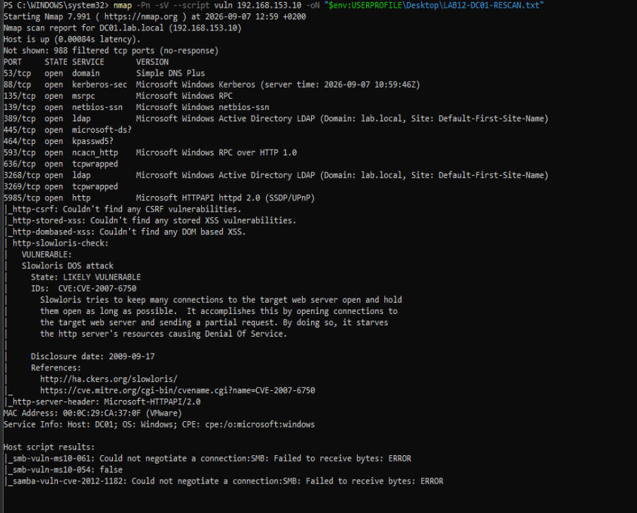

### WIN11 Re-scan

WIN11-CLIENT01 was scanned again after the previous vulnerability assessment.

No confirmed vulnerabilities were identified during the re-scan.

Some SMB vulnerability scripts were unable to complete SMB negotiation. These results were therefore not classified as proof that the system was vulnerable or secure. They were recorded as inconclusive scanner results.

### WAZUH Re-scan

WAZUH-SERVER was also scanned again.

The system exposed SSH on TCP/22 and the Wazuh Dashboard on TCP/443. The Dashboard correctly required authentication and redirected unauthenticated requests to the login page.

No confirmed CSRF, stored XSS or DOM-based XSS findings were identified.

Nmap/Vulners also associated several CVE candidates with the installed OpenSSH version. These candidates were manually checked against the Ubuntu package status rather than being accepted as confirmed vulnerabilities solely from the scanner output.

The installed OpenSSH package was found to include fixes for the relevant Ubuntu security advisories.

### WAZUH Firmware Validation

The previously identified `linux-firmware` update was checked again after the WAZUH virtual machine had been shut down and started again.

The installed version matched the current Ubuntu candidate version:

```text
Installed: 20240318.git3b128b60.0ubuntu3.1
Candidate: 20240318.git3b128b60.0ubuntu3.1
```

No packages were reported as pending upgrades.

The main Wazuh services were also checked:

```text
wazuh-manager    active
wazuh-indexer    active
wazuh-dashboard  active
filebeat         active
```

This confirmed that the firmware remediation remained in place after the VM restart and that the Wazuh platform was operational.

### Evidence 
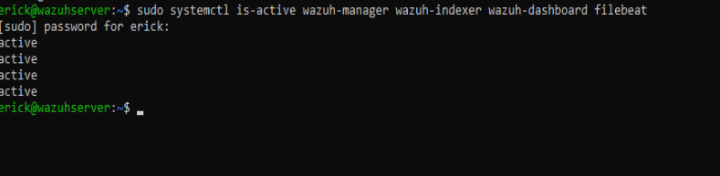 

### DC01 Post-Incident Validation

Because the VMware environment experienced an unexpected virtual machine crash during the validation phase, DC01 was checked again before continuing with the assessment.

The following services were running:

```text
DNS       Running
Netlogon  Running
NTDS      Running
W32Time   Running
```

`dcdiag` was also executed against the domain controller. Connectivity, Advertising, Services and DNS tests completed successfully, including the DNS test for `lab.local`.

This confirmed that the VMware incident did not leave the domain controller in an unusable state.

### Evidence 
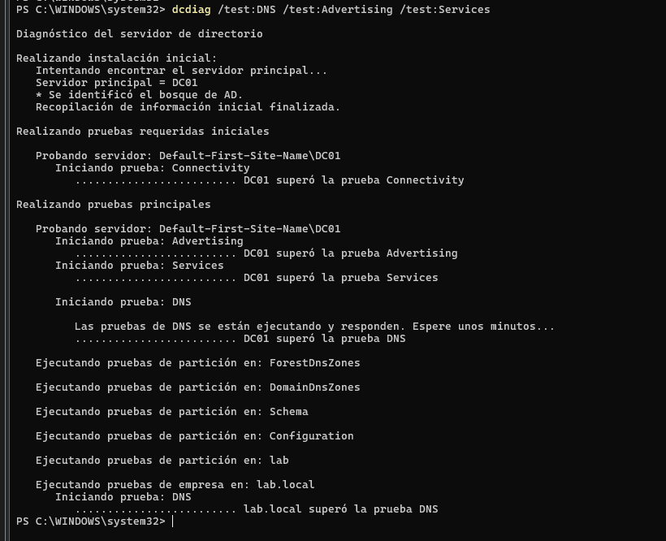

### DC01 Post-Incident Validation

Because the VMware environment experienced an unexpected virtual machine crash during the validation phase, DC01 was checked again before continuing with the assessment.

The following services were running:

```text
DNS       Running
Netlogon  Running
NTDS      Running
W32Time   Running
```

`dcdiag` was also executed against the domain controller. Connectivity, Advertising, Services and DNS tests completed successfully, including the DNS test for `lab.local`.

This confirmed that the VMware incident did not leave the domain controller in an unusable state.

### Validation Result

The re-scan and post-remediation checks produced the following overall result:

- WAZUH firmware remediation: **Validated**
- WAZUH security services: **Operational**
- WIN11: **No confirmed vulnerability identified**
- DC01: **Existing patching gap remains unresolved**
- WinRM Slowloris result: **Likely vulnerable — requires further validation**
- LDAP/LDAPS configuration issues: **Remain open for future hardening**
- DC01 Active Directory and DNS functionality: **Validated after recovery**

The validation phase therefore confirmed that successful remediation was achieved where possible, while unresolved findings were retained instead of being incorrectly marked as closed.

## Security Assessment

The final security assessment was based on the vulnerability scans, configuration reviews, remediation attempts and post-remediation validation.

Rather than treating every scanner output as a confirmed vulnerability, each finding was reviewed against the actual system configuration and, where applicable, the vendor or distribution package status.

### Final Risk Assessment

| ID | Asset | Finding | Impact | Likelihood | Priority | Final Status |
|---|---|---|---|---|---|---|
| VM-01 | DC01 | Windows patching gap — KB5120233 could not be completed successfully | High | High | P1 | Open / Deferred |
| VM-02 | DC01 | LDAP signing is not configured as mandatory | High | Medium | P2 | Open |
| VM-03 | DC01 | LDAPS certificate unavailable | Medium | Medium | P2 | Open |
| VM-04 | WAZUH | Outdated `linux-firmware` package | Low | Low | P3 | Remediated |
| VM-05 | DC01 | Historical NTDS storage/I/O error | Medium | Low | P4 | Informational / Monitor |
| VM-06 | DC01 | Nmap Slowloris result against WinRM/HTTP service | Medium | Unknown | P2 | Requires Validation |

### Windows Server Patching Gap

KB5120233 remained unresolved after several controlled installation attempts.

CBS analysis showed that the Windows Software Protection Platform installer was involved in the servicing failure, after which Windows rolled the update back.

The Software Protection Platform licensing files were repaired using the supported `slmgr.vbs /rilc` operation, but subsequent installation attempts still resulted in a rollback.

The system therefore remained on its previous Windows Server build.

This finding remains open and should be addressed when the servicing issue can be resolved safely.

### LDAP and LDAPS Security

LDAP security was also reviewed during the assessment.

LDAP signing was not configured as mandatory, representing a security hardening opportunity for the domain environment.

LDAPS was also investigated. TCP/636 was reachable, but the domain controller did not have an appropriate certificate available for LDAP over SSL/TLS.

A future remediation should deploy a certificate for DC01 from a trusted internal Certification Authority and then validate LDAPS connectivity and certificate trust.

This is intentionally documented as a future improvement rather than claiming that the remediation has already been completed.

### WinRM Slowloris Finding

Nmap reported a possible Slowloris condition associated with TCP/5985.

The result was investigated instead of being accepted automatically as a confirmed CVE.

WinRM was found to be using HTTP.sys/HTTPAPI, with `AllowUnencrypted` disabled and Basic authentication disabled on the service. Kerberos and Negotiate authentication remained enabled.

Based on the available evidence, the finding remains classified as:

**Likely vulnerable — requires further validation**

Additional testing would be required before making a security-impacting change to WinRM.

### WAZUH TLS Certificate

The Wazuh Dashboard is accessed through HTTPS on TCP/443. Depending on how the Dashboard certificate is trusted and which hostname is used to access the service, the browser may display a certificate warning.

This does not by itself mean that HTTPS encryption is absent. It indicates that the certificate is not fully trusted or does not match the hostname being used.

A future hardening task should replace or properly trust the Dashboard certificate and access the service through its FQDN:

```text
https://wazuhserver.lab.local
```

A certificate issued by an internal trusted CA would provide a cleaner enterprise-style configuration.

### Future Security Improvements

The following improvements were identified during LAB 12 but were intentionally left outside the current remediation scope:

- Deploy an internal Certification Authority for the lab.
- Issue a trusted certificate for DC01 and enable/validate LDAPS.
- Review and strengthen LDAP signing requirements.
- Validate the WinRM Slowloris finding with additional testing.
- Replace or properly trust the Wazuh Dashboard TLS certificate.
- Continue investigating the Windows Server servicing problem before attempting KB5120233 again.
- Continue monitoring the historical storage/I/O event associated with the domain controller.

These items demonstrate that vulnerability management is an ongoing process rather than a one-time scan.

### Security Assessment Conclusion

LAB 12 identified several real security improvement opportunities and one unresolved Windows patching issue. At the same time, automated scanner results were investigated rather than blindly accepted, and successful remediation was verified through post-change validation.

The final security posture of the lab is considered **Moderate Risk**.

The most significant remaining concern is the Windows Server patching gap on DC01. LDAP/LDAPS configuration also requires additional hardening, while the WinRM Slowloris result remains subject to further validation.

WAZUH and WIN11 did not present confirmed outstanding vulnerabilities during the final assessment, and the WAZUH firmware issue was successfully remediated and validated.

## Documentation and Evidence

All relevant findings, remediation attempts and validation results were recorded as part of the vulnerability management process.

Evidence collected during LAB 12 includes:

- Network service enumeration.
- Vulnerability scan results.
- SMB security configuration.
- WinRM configuration.
- LDAP security configuration.
- LDAPS certificate error.
- Wazuh software and service assessment.
- Windows Server patch assessment.
- DC01 re-scan and Slowloris investigation.
- Post-remediation WAZUH validation.
- Post-incident DC01 health validation.

Evidence was retained selectively to keep the documentation focused on meaningful security decisions rather than documenting every command executed during the investigation.

### Evidence Management

Screenshots and supporting output files are stored alongside the LAB 12 documentation using the project naming convention:

```text
Screenshots/
phase-12-...
```

The evidence supports the main stages of the vulnerability management lifecycle:

```text
Asset Identification
        ↓
Service Enumeration
        ↓
Vulnerability Scanning
        ↓
Investigation
        ↓
Risk Assessment
        ↓
Remediation
        ↓
Re-scan
        ↓
Validation
        ↓
Security Assessment
        ↓
Documentation
```

### Final Phase Status

LAB 12 — Vulnerability Management is considered **COMPLETED**.

The phase demonstrated the complete vulnerability management workflow, including vulnerability discovery, technical investigation, CVE validation, risk prioritization, controlled remediation, re-scanning and final security assessment.

Not every finding could be remediated during the lab. Instead, unresolved issues were documented with their current status and appropriate next steps.

This reflects a realistic security operations workflow where findings must be investigated, prioritized and tracked rather than simply removed from a report.

**LAB 12 — COMPLETED ✅**

⬆️ [Back to Roadmap](#lab-roadmap)

<a id="lab-13"></a>
# LAB 13 — Backup, Recovery & Security Testing

## Overview

This lab focuses on backup strategy, recovery procedures, validation, and security testing across the cybersecurity home lab.

The main objective was to build a practical recovery strategy for the most important systems and verify that the backups could actually be accessed, validated, and used to recover configuration data.

The lab covers:

- Backup planning and recovery objectives
- Windows Server System State backup
- Wazuh configuration and data backup
- Backup validation after system restart
- Controlled recovery of Wazuh configuration files
- SHA-256 integrity verification
- Backup repository access control
- Network exposure testing
- Post-recovery service validation
- Final security assessment
- Backup limitations and future improvements

## Lab Environment

| System | Role | IP Address | Backup Strategy |
|---|---|---|---|
| DC01 | Windows Server 2025 / Active Directory / DNS | 10.10.10.10 | System State backup |
| WIN11-CLIENT01 | Windows 11 domain client | 10.10.10.20 | Rebuild strategy |
| WAZUH-SERVER | Ubuntu Server 24.04.4 / Wazuh SIEM | 10.10.10.30 | Configuration and selected data backup |
| LAB13-Backup | Dedicated Lexar SL600 backup repository | USB-attached | Central backup storage |

The Lexar SL600 was reformatted as NTFS and assigned the label `LAB13-Backup`.

Backup storage was connected directly to the system being backed up or validated through VMware USB passthrough. Because the disk cannot be attached to several virtual machines simultaneously, backup operations were performed sequentially.

## Backup Strategy

### Recovery Objectives

Backup priorities were defined according to the importance of each system.

| System | Criticality | RPO | RTO | Strategy |
|---|---|---:|---:|---|
| DC01 | Critical | 24 hours | 4 hours | System State backup |
| WAZUH-SERVER | High | 24 hours | 4 hours | Configuration and selected operational data |
| WIN11-CLIENT01 | Medium | N/A | 8 hours | Rebuild and re-enrollment |

DC01 requires the strongest recovery capability because Active Directory, DNS, SYSVOL, and other domain services depend on it.

Wazuh requires preservation of its configuration, authentication material, custom detection content, and selected logs.

WIN11-CLIENT01 was treated as a rebuildable endpoint rather than a system requiring a complete image backup. Its recovery approach consists of reinstalling Windows, joining the domain again, reinstalling the required security tools, and restoring any required configuration from documentation.


## Backup Repository

A dedicated external SSD was prepared as the backup repository.

The disk was initialized with GPT and formatted as NTFS using the label:

```text
LAB13-Backup
```

The repository contains both the DC01 Windows Server Backup structure and the Wazuh backup structure.

### Repository Structure

```text
LAB13-Backup/
├── WindowsImageBackup/
├── WAZUH-SERVER/
├── Sysmon/
└── System Volume Information/
```

The backup repository was intentionally kept separate from the active VM storage.

### Evidence 
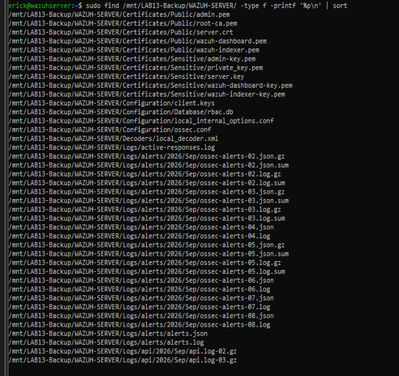 

## DC01 — Windows Server Backup

### System State Backup

A System State backup was created on DC01 using Windows Server Backup:

```powershell
wbadmin start systemstatebackup -backupTarget:E: -quiet
```

The operation completed successfully.

Backup time:

```text
08/09/2026 2:11
```

Version identifier:

```text
09/08/2026-00:11
```

Windows Server Backup reported that the backup could recover:

```text
Volumes
Files
Applications
System State
```

### Evidence 

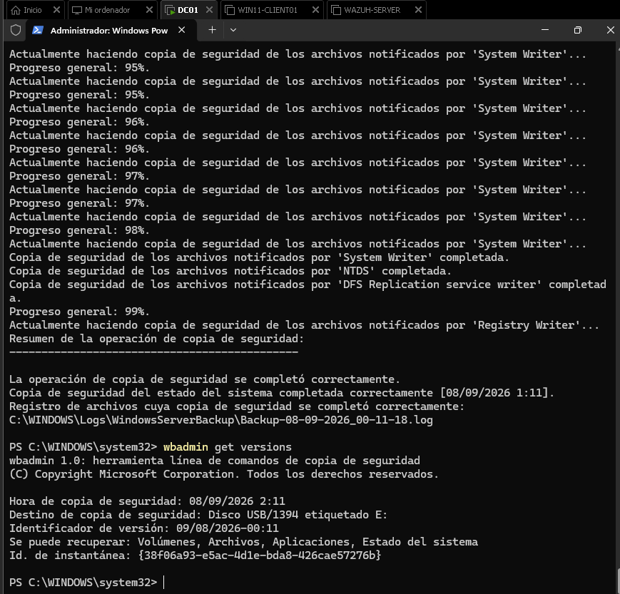

### Backup Contents

The backup was inspected with:

```powershell
wbadmin get items -version:09/08/2026-00:11
```

Critical Active Directory components were present, including:

- EFI system partition
- C: volume
- FRS / SYSVOL
- Active Directory NTDS database
- Registry

The presence of the NTDS component confirms that the System State backup contains the Active Directory database required for domain recovery.

### Evidence 

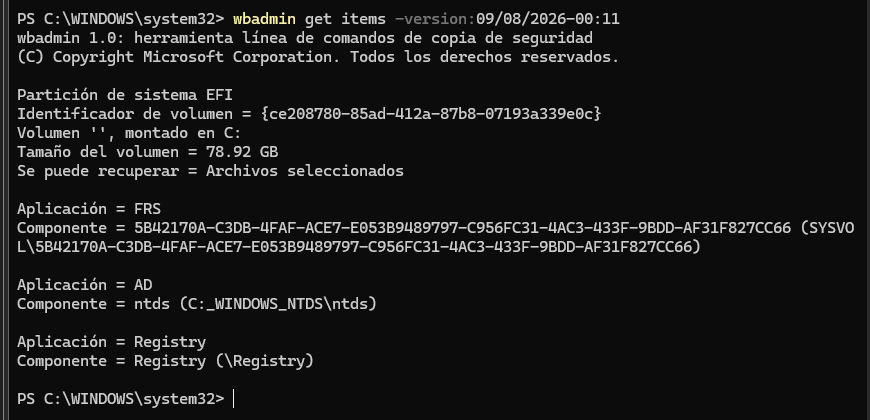

## WAZUH-SERVER — Backup

### Backup Scope

A complete copy of `/var/ossec` was intentionally avoided.

The directory occupied approximately 6.2 GB, with most of the space being used by operational queue data:

```text
/var/ossec/queue/vd        4.2 GB
/var/ossec/queue/indexer   1.1 GB
```

Those queues were not copied as part of the primary recovery set because they contain operational state that can be rebuilt and would unnecessarily increase the backup size.

Configuration and security-relevant data were backed up separately.

### Evidence 
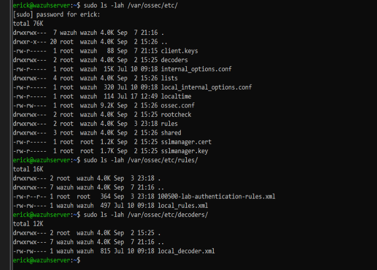 


## Configuration

The following Wazuh configuration files were backed up:

```text
ossec.conf
client.keys
local_internal_options.conf
```

They were stored under:

```text
WAZUH-SERVER/Configuration/
```

### Evidence 

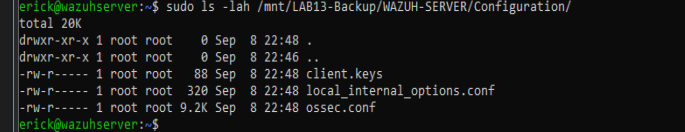

## RBAC Database

Wazuh's RBAC database was backed up separately:

```text
Configuration/Database/rbac.db
```
The backup file was approximately 100 KB.

### Evidence 
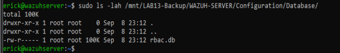


## Custom Rules

Custom Wazuh rules were preserved:

```text
100500-lab-authentication-rules.xml
local_rules.xml
```

These files contain the custom detection logic developed during the Wazuh lab.

### Evidence 

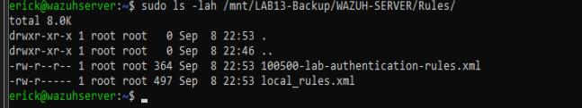

## Custom Decoders

The custom decoder was backed up:

```text
local_decoder.xml
```

### Evidence 

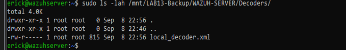

## Certificates and Sensitive Material

Wazuh certificate material was separated into two areas:

```text
Certificates/
├── Public/
└── Sensitive/
```

Public certificate material was kept separate from private keys.

Sensitive files included:

```text
admin-key.pem
private_key.pem
server.key
wazuh-dashboard-key.pem
wazuh-indexer-key.pem
```

Private keys and authentication material are intentionally excluded from the public GitHub repository.

### Evidence 
**Public evidence note:** The original screenshot was intentionally omitted from the public repository because it may contain internal laboratory network information, account identifiers, or sensitive security configuration details. The validation was performed as documented, but the screenshot is not included in the public version.
**Public evidence note:** The original screenshot was intentionally omitted from the public repository because it may contain internal laboratory network information, account identifiers, or sensitive security configuration details. The validation was performed as documented, but the screenshot is not included in the public version.
## Logs

Current Wazuh logs were copied into:

```text
WAZUH-SERVER/Logs/
```

The resulting backup occupied approximately 37 MB.

The log structure included alert, API, archive, firewall, and Wazuh service logs.

### Evidence 


### DC01 Post-Reboot Validation

After restarting the environment, the Lexar backup disk was reconnected to DC01.

Windows recognized the volume as:

```text
E:
LAB13-Backup
NTFS
Healthy
OK
```

`wbadmin get versions` successfully detected the previously created System State backup.

### Evidence 
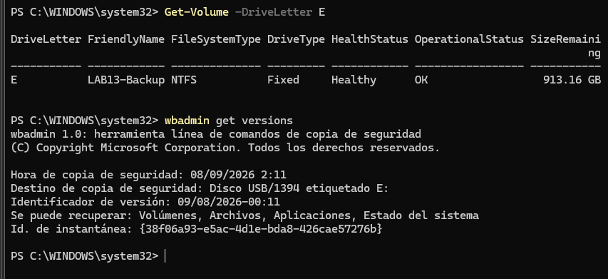

The backup contents were then queried again with `wbadmin get items`.

Active Directory, SYSVOL/FRS, Registry, EFI, and the C: volume remained identifiable.

### Evidence 

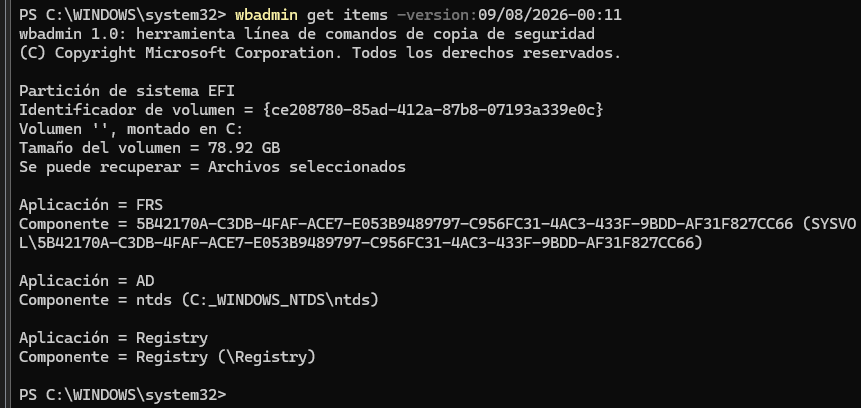

### Wazuh Repository Validation

After WAZUH-SERVER was restarted, the Lexar was connected to the Wazuh VM.

The backup partition was detected as:

```text
/dev/sdb2
933G
NTFS
LAB13-Backup
```

It was mounted at:

```text
/mnt/LAB13-Backup
```

The repository remained accessible and contained:

```text
WindowsImageBackup/
WAZUH-SERVER/
```

The Wazuh backup structure contained:

```text
Certificates/
Configuration/
Decoders/
Logs/
Rules/
```

### Evidence 

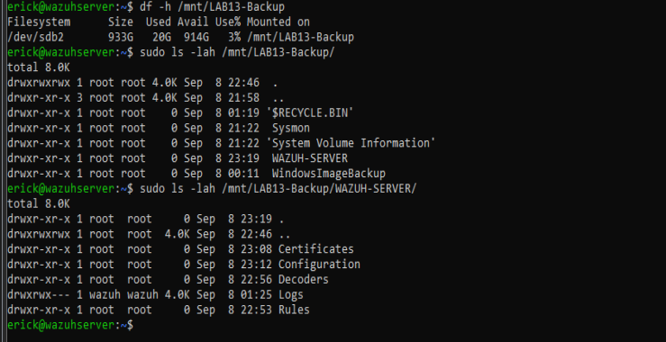

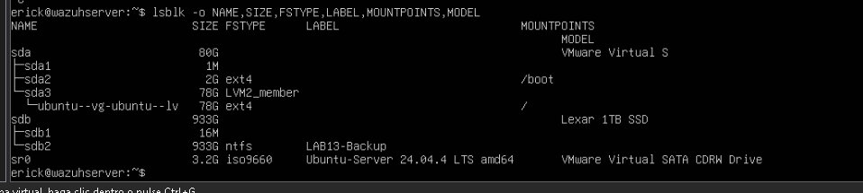

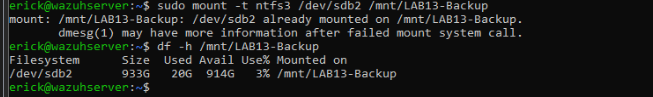

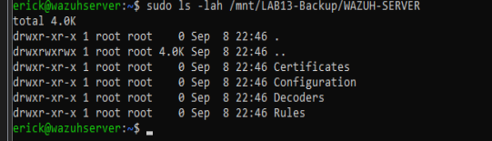

### Configuration and Certificate Validation

Configuration files, RBAC data, rules, and decoders were verified on the backup disk.

Certificate files were also verified in their respective Public and Sensitive directories.

### Evidence 

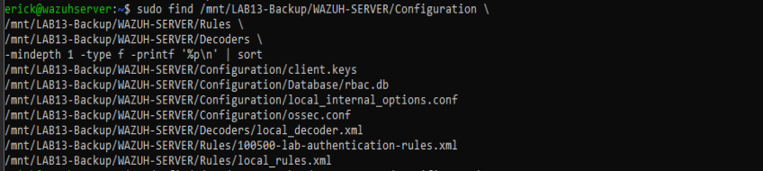

**Public evidence note:** The original screenshot was intentionally omitted from the public repository because it may contain internal laboratory network information, account identifiers, or sensitive security configuration details. The validation was performed as documented, but the screenshot is not included in the public version.
**Public evidence note:** The original screenshot was intentionally omitted from the public repository because it may contain internal laboratory network information, account identifiers, or sensitive security configuration details. The validation was performed as documented, but the screenshot is not included in the public version.
### SHA-256 Integrity Validation

SHA-256 hashes were calculated for critical Wazuh configuration files on the live system and compared with their backup copies.

The following files were checked:

```text
ossec.conf
client.keys
local_internal_options.conf
local_rules.xml
100500-lab-authentication-rules.xml
local_decoder.xml
rbac.db
```

All calculated hashes matched exactly.

This confirmed that the selected configuration data remained unchanged between the live system and the backup repository.

### Evidence 
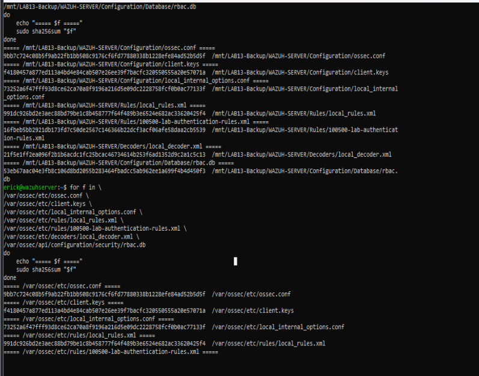

## Recovery / Restore

### Controlled Wazuh Recovery Test

A non-destructive recovery test was performed using a temporary directory:

```text
/tmp/LAB13-Recovery/WAZUH-SERVER/
```

The following files were recovered from the backup:

```text
ossec.conf
local_rules.xml
local_decoder.xml
```

No files in `/var/ossec` were replaced during the test.

This approach demonstrated the recovery process without risking the active Wazuh installation.

## Recovery Integrity Check

SHA-256 hashes were calculated for the recovered files and compared with the corresponding files on the backup repository.

All three hashes matched:

```text
ossec.conf
local_rules.xml
local_decoder.xml
```

This demonstrated:

```text
Backup
   ↓
Temporary recovery
   ↓
SHA-256 comparison
   ↓
Integrity confirmed
```

### Evidence 

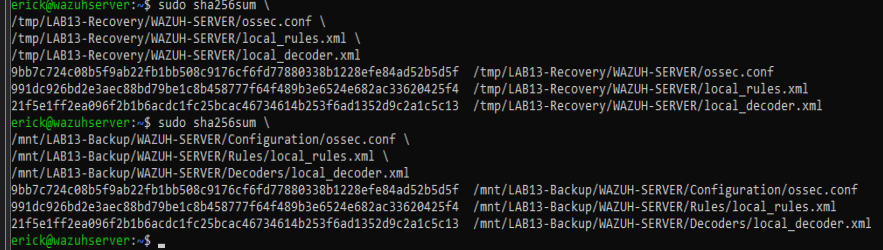

## Recovery Validation

Following the recovery test, Wazuh remained operational.

The following services were active:

```text
wazuh-manager
wazuh-indexer
wazuh-dashboard
filebeat
```

No failed systemd units were reported.

### Evidence 

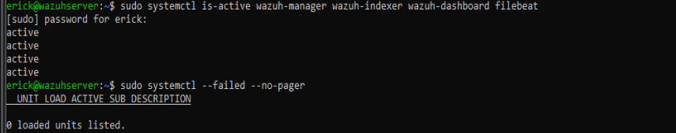

Wazuh's internal status was also checked.

Core modules including the following remained operational:

```text
wazuh-modulesd
wazuh-logcollector
wazuh-remoted
wazuh-syscheckd
wazuh-analysisd
wazuh-execd
wazuh-db
wazuh-authd
wazuh-apid
```

Modules that were not part of the active lab configuration remained stopped.

### Evidence 
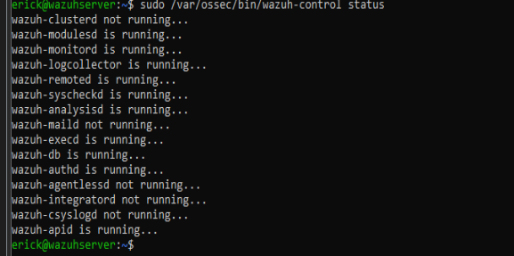

## Security Testing

### Sensitive Backup Access

Sensitive certificate and authentication material was stored separately under:

```text
Certificates/Sensitive/
```

The directory and files were owned by `root`.

Sensitive key files used restrictive read permissions.

A direct read-permission test was performed using the normal `erick` account.

Results:

```text
server.key → ACCESS DENIED
rbac.db    → ACCESS DENIED
```

Administrative access remains available through controlled privilege elevation using `sudo`.

This follows the principle of least privilege while still allowing authorized administration.

**Evidence:**

**Public evidence note:** The original screenshot was intentionally omitted from the public repository because it may contain internal laboratory network information, account identifiers, or sensitive security configuration details. The validation was performed as documented, but the screenshot is not included in the public version.
### Backup Network Exposure

WAZUH-SERVER was checked for listeners associated with common file-sharing protocols:

```text
445  SMB
139  NetBIOS/SMB
2049 NFS
111  RPC
```

No listeners were found on these ports.

WIN11 was then used to test network connectivity to WAZUH-SERVER on ports 445 and 2049.

Network connectivity to the host remained available, but TCP connections to those services failed.

This indicates that the backup repository was not exposed through SMB or NFS.

### Evidence 

**Public evidence note:** The original screenshot was intentionally omitted from the public repository because it may contain internal laboratory network information, account identifiers, or sensitive security configuration details. The validation was performed as documented, but the screenshot is not included in the public version.
**Public evidence note:** The original screenshot was intentionally omitted from the public repository because it may contain internal laboratory network information, account identifiers, or sensitive security configuration details. The validation was performed as documented, but the screenshot is not included in the public version.
## Security Assessment

The backup environment was reviewed from both a recovery and security perspective.

| Area | Result | Assessment |
|---|---|---|
| DC01 System State backup | Validated | Good |
| Active Directory / NTDS backup | Present | Good |
| SYSVOL backup | Present | Good |
| Wazuh configuration backup | Validated | Good |
| Wazuh RBAC backup | Validated | Good |
| Custom rules | Preserved | Good |
| Custom decoders | Preserved | Good |
| Certificates | Preserved and separated | Good |
| Sensitive key access | Restricted | Good |
| Backup integrity | SHA-256 verified | Good |
| Wazuh recovery test | Successful | Good |
| SMB/NFS exposure | Not detected | Good |
| Wazuh services after recovery | Operational | Good |
| WIN11 full backup | Not implemented | Accepted limitation |

A dedicated backup repository provides a clear separation between production VM storage and recovery data.

Separating sensitive certificates from public certificate material reduces the chance of accidentally publishing private authentication material.

SHA-256 verification provides additional confidence that critical configuration files were not altered during backup and recovery.

## WIN11 Backup Strategy

A complete image backup of WIN11-CLIENT01 was intentionally not created.

WIN11 is considered a rebuildable endpoint within this lab. Its recovery process would consist of:

1. Reinstall Windows 11.
2. Configure network settings.
3. Join `lab.local`.
4. Reapply required Group Policies.
5. Reinstall Wazuh Agent.
6. Reinstall Sysmon and other security tooling.
7. Restore any required endpoint-specific configuration.
8. Validate communication with DC01 and WAZUH-SERVER.

This approach reflects a common endpoint recovery strategy where rebuilding the operating system is more practical than maintaining a large system image.

## Limitations

Several limitations remain in the current backup design.

### Single Backup Repository

The Lexar SSD is currently the primary physical backup repository.

A second backup copy would improve resilience against disk failure, loss, or corruption.

### Manual USB Passthrough

VMware USB passthrough is used to move the backup disk between virtual machines.

This works for the home lab but is less convenient than a dedicated NAS or network backup server.

### WIN11 Rebuild Strategy

WIN11 does not currently have a full image backup.

Recovery therefore depends on successful rebuilding and reconfiguration.

### Sensitive Backup Material

Private keys and authentication files are stored on the backup repository because they are required for recovery.

They must remain outside the public GitHub repository and should eventually be protected with encryption and stronger access controls.

### No Full Wazuh Queue Backup

Large operational queue directories were intentionally excluded from the primary backup.

A future production-oriented design could evaluate which Wazuh operational databases or index data require dedicated retention and recovery procedures.

## Future Improvements

Future improvements identified during this lab include:

- Implementing a second backup destination.
- Introducing a dedicated NAS or backup server.
- Encrypting backup media with BitLocker or another appropriate encryption mechanism.
- Protecting recovery keys separately from the encrypted backup.
- Automating backup verification.
- Automating SHA-256 integrity checks.
- Testing scheduled backups instead of relying on manual operations.
- Creating documented disaster recovery procedures.
- Evaluating centralized backup monitoring.
- Adding a Linux endpoint/server to the backup strategy.
- Reviewing backup retention policies.
- Performing periodic restore drills.

Encryption will be practiced in a separate controlled lab rather than being applied immediately to the current recovery repository.

## Evidence Summary

The main evidence collected during LAB 13 includes:

```text
phase-13-Backup-Network-Access-Validation.png

phase-13-Backup-Network-Exposure-Test.png

phase-13-Backup-Sensitive-Access-Control.png

phase-13-DC01-Backup-Contents-Validation.png

phase-13-DC01-Backup-Post-Reboot-Validation.png

phase-13-DC01-SystemState-Backup-Contents.png

phase-13-DC01-SystemState-Backup-Validation.png

phase-13-WAZUH-Backup-Certificates-RBAC-Validation.png

phase-13-WAZUH-Backup-Certificates-Validation.png

phase-13-WAZUH-Backup-Certificates.png

phase-13-WAZUH-Backup-Configuration-Validation.png

phase-13-WAZUH-Backup-Configuration.png

phase-13-WAZUH-Backup-Decoders.png

phase-13-WAZUH-Backup-Disk-Detection.png

phase-13-WAZUH-Backup-Disk-Mounted.png

phase-13-WAZUH-Backup-Hash-Validation.png

phase-13-WAZUH-Backup-Logs.png

phase-13-WAZUH-Backup-RBAC-Database.png

phase-13-WAZUH-Backup-Repository-Post-Reboot-Validation.png

phase-13-WAZUH-Backup-Repository-Structure.png

phase-13-WAZUH-Backup-Rules.png

phase-13-WAZUH-Backup-Structure.png

phase-13-WAZUH-Configuration-Inventory.png

phase-13-WAZUH-Recovery-Functional-Validation.png

phase-13-WAZUH-Recovery-Hash-Validation.png

phase-13-WAZUH-Recovery-Post-Test-Validation.png

phase-13-WAZUH-Security-Assessment.png

phase-13-WAZUH-Services-Post-Reboot-Validation.png
```

Sensitive backup contents, private keys, authentication material, and other secrets must not be committed to the public repository.

Only sanitized screenshots and documentation should be published to GitHub.

## Final Assessment

LAB 13 successfully established and tested a practical backup and recovery strategy for the home lab.

DC01 received a validated System State backup containing the components required for Active Directory recovery.

Wazuh configuration, RBAC data, custom rules, decoders, certificates, and logs were preserved on a dedicated backup repository.

Recovery was tested using a non-destructive temporary restore. SHA-256 comparisons confirmed that recovered configuration files matched the original backup copies.

Security testing also confirmed that sensitive backup material was not directly readable by the normal user and that the backup repository was not exposed through SMB or NFS.

WIN11-CLIENT01 remains rebuildable rather than fully imaged, which is an intentional part of the backup strategy.

Overall, the lab demonstrated an important security principle: a backup is only useful when it can be **found, accessed, validated, recovered, and verified**.

**LAB 13 — Backup, Recovery & Security Testing: COMPLETED**

⬆️ [Back to Roadmap](#lab-roadmap)

<a id="lab-14"></a>
# LAB 14 — Windows Security & Hardening

## Overview

LAB 14 is focused on reviewing the security posture of the Windows environment built throughout the previous stages of the Home Lab.

At this point in the project, the goal was not simply to add more security settings. Instead, the focus was to step back and look at the environment as a whole: how the systems are configured, which security controls are active, what is being monitored, and whether the controls already implemented are working as expected.

The assessment covered the main Windows components involved in the lab, including Active Directory, Windows 11, Windows Server, Microsoft Defender, Windows Firewall, SMB, PowerShell security configuration, Windows services, authentication events and the Wazuh SIEM platform.

A particular focus was placed on validating the relationship between endpoint activity and centralized security monitoring. A controlled failed authentication was generated on `WIN11-CLIENT01` and then followed from the original Windows Security event through the Wazuh agent and manager until it appeared as a detected security alert.

The lab was also used to identify remaining security risks and hardening opportunities. These findings were documented rather than automatically changed, following a more realistic security assessment workflow where findings are first identified, evaluated and reported before remediation is performed.

The environment assessed in this phase consists of:

- `DC01` — Windows Server / Active Directory Domain Controller
- `WIN11-CLIENT01` — Windows 11 domain-joined endpoint
- `WAZUH-SERVER` — Ubuntu Server running the Wazuh SIEM platform
- `lab.local` — Active Directory domain

The final objective was to determine the current security posture of the environment, document the evidence supporting the assessment, and identify areas that could be improved during a future remediation and validation phase.


## Objectives

The main objectives of LAB 14 were:

- Review the current security architecture of the Windows lab.
- Assess Active Directory identity and access controls.
- Review Windows Server and Windows 11 security configuration.
- Validate Microsoft Defender and Windows Firewall status.
- Review exposed network services and associated security implications.
- Assess SMB security controls, including SMBv1 and SMB signing.
- Review PowerShell execution policy configuration.
- Validate the operation of Wazuh as the centralized monitoring platform.
- Generate and investigate a controlled Windows authentication failure.
- Confirm that Windows Security events are successfully collected by Wazuh.
- Correlate the original Windows event with the corresponding Wazuh detection.
- Identify security findings, residual risks and hardening opportunities.
- Produce a final security assessment supported by documented evidence.

The intention was to assess the environment as it existed at the time of the review rather than making unnecessary configuration changes simply to obtain a better assessment result.


## Lab Environment

The assessment was performed against the existing Home Lab infrastructure developed during the previous phases of the project.

### Systems

| System | Role | Operating System | IP Address |
|---|---|---|---|
| `DC01` | Domain Controller / DNS | Windows Server | Lab environment |
| `WIN11-CLIENT01` | Domain-joined endpoint | Windows 11 | `10.10.10.20` |
| `WAZUH-SERVER` | SIEM / Security Monitoring | Ubuntu Server 24.04.4 LTS | `10.10.10.30` |


### Domain
```
Domain: lab.local
```

## Security Components

The assessment included the following security components:

Active Directory Domain Services
DNS
Microsoft Defender
Windows Defender Firewall
Windows Security auditing
PowerShell
SMB / NetBIOS
Windows RPC services
Sysmon
Wazuh Agent
Wazuh Manager
Wazuh detection rules

The lab environment is isolated and controlled, allowing security configuration and detection tests to be performed without affecting production systems.

## Security Assessment Approach

The approach used in LAB 14 was based on reviewing the environment as a complete security system rather than looking at each configuration item in isolation.

The assessment followed the security controls already implemented during the previous labs and focused on answering a few practical questions:

- Is the control enabled?
- Is it configured as expected?
- Is the related service operational?
- Can the control be validated with an actual test?
- Does the available security telemetry support the expected result?
- If a risk is identified, is it a confirmed vulnerability or simply a hardening opportunity?

Where possible, configuration was validated directly using Windows tools, PowerShell, network testing and Wazuh.

The assessment also deliberately avoided making unnecessary configuration changes. A finding does not automatically mean that the configuration should be changed immediately. In a real environment, security findings would normally be documented, assigned an appropriate risk level, and then reviewed by the responsible administrator or security team before remediation.

This distinction was maintained throughout the lab:

```text
Security Assessment
        ↓
Evidence Collection
        ↓
Finding Identification
        ↓
Risk Assessment
        ↓
Recommendation
        ↓
Remediation
        ↓
Validation
```

For LAB 14, the main focus was the first five stages. Remediation of identified hardening opportunities can be performed later as a separate activity, followed by a new validation to determine whether the security posture has improved.

This approach also helped avoid treating every open port, Windows event or configuration difference as a vulnerability without first considering its purpose and context within the laboratory environment.

## Assessment Scope

The assessment covered the following areas:

| Area | Main Focus |
|---|---|
| Infrastructure & Architecture | System roles, communication and security boundaries |
| Identity & Access | Active Directory accounts, groups, privileges and password controls |
| Network Security | Network profile, exposed services, RPC, SMB and NetBIOS |
| Endpoint Security | Microsoft Defender, Firewall, services and system security |
| Server Security | DC01 security configuration and critical services |
| PowerShell Security | Execution Policy configuration |
| SIEM & Detection | Wazuh agent, manager and security event detection |
| Vulnerability & Risk | Identification and classification of security findings |
| Overall Assessment | Final security posture and residual risk |

The scope was intentionally limited to the systems and services belonging to the Home Lab. No production systems or external infrastructure were included in the assessment.

## Infrastructure & Architecture Review

Before reviewing individual security controls, the existing lab architecture was checked to make sure that the systems were communicating as expected.

The environment is built around three main systems:

- `DC01`, providing Active Directory and DNS services.
- `WIN11-CLIENT01`, acting as the domain-joined Windows endpoint.
- `WAZUH-SERVER`, providing centralized security monitoring and SIEM capabilities.

The purpose of this review was not to redesign the network, but to confirm that the relationships between these systems were still working correctly and that the security controls evaluated later in the lab were being applied to the expected hosts.

### Active Directory and DNS Connectivity

`WIN11-CLIENT01` was checked to confirm that it could discover and communicate with the Active Directory environment.

The endpoint remained joined to the `lab.local` domain and was able to resolve the domain controller through DNS.

This is an important baseline for the rest of the assessment because several of the security controls reviewed later depend on a functioning domain environment.

### Evidence
**Public evidence note:** The original screenshot was intentionally omitted from the public repository because it may contain internal laboratory network information, account identifiers, or sensitive security configuration details. The validation was performed as documented, but the screenshot is not included in the public version.
The corresponding DNS configuration on `DC01` was also reviewed to confirm that the domain controller was providing the expected DNS functionality.

### Evidence

**Public evidence note:** The original screenshot was intentionally omitted from the public repository because it may contain internal laboratory network information, account identifiers, or sensitive security configuration details. The validation was performed as documented, but the screenshot is not included in the public version.
### Network Communication

Network communication between the main Windows systems was reviewed as part of the architecture assessment.

The checks confirmed that the expected network connectivity was available while also identifying the services exposed by `WIN11-CLIENT01`.

A network scan against `WIN11-CLIENT01` identified TCP ports `135`, `139` and `445` as open.

These ports correspond to Windows RPC, NetBIOS and SMB functionality. Their presence was therefore not treated as a vulnerability by itself. Instead, the services were reviewed in the context of the role of the machine and the security controls protecting them.

### Evidence
**Public evidence note:** The original screenshot was intentionally omitted from the public repository because it may contain internal laboratory network information, account identifiers, or sensitive security configuration details. The validation was performed as documented, but the screenshot is not included in the public version.
### Network Profile

`WIN11-CLIENT01` was operating with the `DomainAuthenticated` network profile.

This is consistent with its role as a domain-joined endpoint and provides an important context for the firewall and network security assessment performed later in the lab.

The network authentication type was reported as `Ldap`.

### Architecture Assessment

The architecture was considered suitable for the current Home Lab objectives.

The main systems have clearly separated roles, while the endpoint, domain controller and SIEM platform can communicate using the services required by the environment.

The review also showed that the exposed Windows services are mainly related to legitimate operating system functionality rather than unnecessary third-party services.

No architectural issue requiring immediate remediation was identified during this stage.

Potential improvements identified during the security review are documented later as findings and hardening opportunities rather than being changed directly during the assessment.

## Identity & Access Security

Identity and access controls were reviewed to determine whether the Active Directory environment was following a reasonable security baseline for users, privileged accounts and authentication.

The assessment focused on password-related controls, account configuration, privileged group membership and the use of security-sensitive Active Directory groups.

The objective was not to make the domain unnecessarily restrictive, but to verify that the existing configuration provided a reasonable level of protection for the size and purpose of the laboratory environment.

### Password Policy

The domain password policy was reviewed to verify the current authentication requirements applied to domain users.

The assessment considered the configured password length, complexity requirements, password history and related settings.

The results were consistent with the security baseline established for the lab.

### Evidence

**Public evidence note:** The original screenshot was intentionally omitted from the public repository because it may contain internal laboratory network information, account identifiers, or sensitive security configuration details. The validation was performed as documented, but the screenshot is not included in the public version.
The password policy was therefore assessed as **Compliant** for the current laboratory environment.

### Password Expiration and Account Configuration

User account configuration was reviewed to identify accounts with password settings that could reduce the effectiveness of the domain password policy.

The assessment included checking password expiration-related settings and identifying whether any accounts were configured with exceptions that required additional consideration.

### Evidence

**Public evidence note:** The original screenshot was intentionally omitted from the public repository because it may contain internal laboratory network information, account identifiers, or sensitive security configuration details. The validation was performed as documented, but the screenshot is not included in the public version.
The results did not identify a critical configuration issue requiring immediate remediation.

Any exceptions identified during the review should be considered in the context of the account's purpose rather than automatically treated as a vulnerability.

### Protected Users

The Active Directory `Protected Users` security group was reviewed as part of the privileged identity assessment.

This group provides additional protections for highly sensitive accounts and is particularly relevant when reviewing administrative identities.

### Evidence

**Public evidence note:** The original screenshot was intentionally omitted from the public repository because it may contain internal laboratory network information, account identifiers, or sensitive security configuration details. The validation was performed as documented, but the screenshot is not included in the public version.
The configuration was documented as part of the identity security review.

The assessment also considered whether the current use of protected identities was appropriate for the size and purpose of the laboratory.

### Administrator Privileges

Privileged access was reviewed to determine which accounts were members of highly privileged Active Directory groups.

The purpose of this check was to verify that administrative privileges were not being granted unnecessarily.

### Evidence

**Public evidence note:** The original screenshot was intentionally omitted from the public repository because it may contain internal laboratory network information, account identifiers, or sensitive security configuration details. The validation was performed as documented, but the screenshot is not included in the public version.
The privileged account configuration was considered acceptable for the current lab environment.

The review also reinforces the principle of least privilege: administrative permissions should only be assigned where they are actually required.

### Active Directory Roles and Groups

Active Directory security groups and role assignments were reviewed to confirm that the expected groups existed and that their membership was consistent with the intended lab architecture.

### Evidence

**Public evidence note:** The original screenshot was intentionally omitted from the public repository because it may contain internal laboratory network information, account identifiers, or sensitive security configuration details. The validation was performed as documented, but the screenshot is not included in the public version.
This review provided an additional check that identity management remained aligned with the domain structure established in the previous labs.

### Identity & Access Assessment

Overall, the Active Directory identity and access configuration was considered **Good / Controlled** for the current laboratory environment.

The main authentication and privilege controls were present and functioning as expected.

No critical identity or access issue was identified during this assessment.

As with the other areas reviewed in LAB 14, potential improvements are treated as hardening opportunities and can be addressed separately during a future remediation phase.

## Network Security

The network security review focused on the controls protecting communication between the Windows systems and on the services exposed by the environment.

The assessment covered the Windows Firewall profile, NetBIOS configuration, SMB security and remote management-related services. The objective was to determine whether the network configuration was appropriate for the current lab and whether any exposed services represented an unnecessary or uncontrolled risk.

### Windows Firewall

The Windows Firewall configuration on `WIN11-CLIENT01` was reviewed to confirm that the appropriate firewall profile was active.

The endpoint was operating with the domain-authenticated network profile, and Windows Defender Firewall was active.

This provides an important layer of protection for inbound and outbound network communication while allowing the services required by the Active Directory environment to operate.

### Evidence

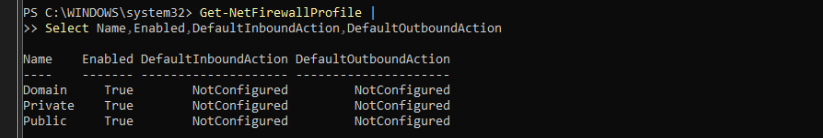

The firewall configuration was considered **Compliant** for the current laboratory environment.

### NetBIOS Configuration

NetBIOS-related configuration was reviewed because TCP port `139` was identified during the network service assessment.

NetBIOS Session Service is associated with legacy Windows networking and SMB-related functionality. Its presence was therefore reviewed as part of the overall network exposure rather than automatically classified as a vulnerability.

### Evidence

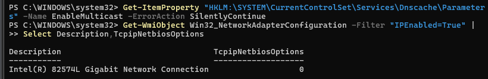

The configuration was documented as part of the network security assessment.

The presence of NetBIOS represents a potential hardening consideration, particularly in environments where legacy SMB or NetBIOS functionality is no longer required.

### SMB Security

SMB security was reviewed on `DC01` because SMB is an important part of the file-sharing functionality implemented during the previous phases.

The assessment considered the security configuration associated with SMB communication, including SMB signing and related protection mechanisms.

### Evidence

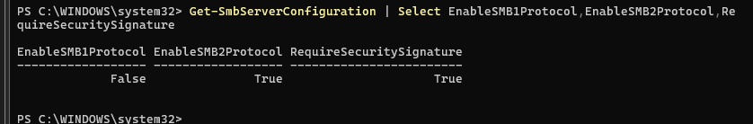

The SMB configuration was considered **Good / Controlled** for the current laboratory environment.

SMBv1 was disabled and SMB signing was required. These controls reduce exposure to legacy SMB attacks and help protect the integrity of SMB communication.

### Remote Management and Secure Communication

Remote management and secure directory communication were also reviewed to determine whether unnecessary management services were exposed between `WIN11-CLIENT01` and `DC01`.

The validation included Windows Remote Management (WinRM) and LDAPS-related connectivity.

### Evidence

**Public evidence note:** The original screenshot was intentionally omitted from the public repository because it may contain internal laboratory network information, account identifiers, or sensitive security configuration details. The validation was performed as documented, but the screenshot is not included in the public version.
The assessment did not identify an unnecessary remote management service requiring immediate remediation.

The results were considered acceptable for the current laboratory architecture, while the exposure of management protocols remains an area that should be restricted appropriately in a production environment.

### Network Security Assessment

Overall, the network security posture was considered **Good / Controlled**.

The Windows Firewall was active, the network profile was appropriate for the domain environment, and the main exposed Windows services were associated with legitimate functionality.

SMB security controls were also reviewed, with SMBv1 disabled and SMB signing required.

The main residual consideration identified during the network review is the exposure of legitimate Windows networking services such as RPC, SMB and NetBIOS. These services are required by parts of the current lab architecture, but in a production environment they should be restricted through network segmentation, firewall rules and service-specific access controls where appropriate.

No critical network security issue requiring immediate remediation was identified during this assessment.

## Endpoint & Server Security

The endpoint and server security review focused on the protections that were active on `WIN11-CLIENT01` and `DC01`.

The assessment covered Microsoft Defender, security-related services, malware protection signatures and the current patch status of both systems. The objective was to confirm that the main endpoint and server security controls were operational and that no obvious protection gap was present at the time of the assessment.

### Microsoft Defender — WIN11-CLIENT01

Microsoft Defender was reviewed on `WIN11-CLIENT01` to confirm that the endpoint protection platform was operational.

The security status showed that Microsoft Defender was active and providing protection on the Windows 11 endpoint.

### Evidence

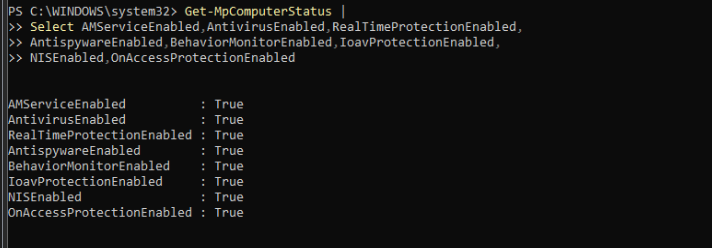

The Defender configuration was considered **Compliant** for the current laboratory environment.

### Defender Security Services

The Windows security services associated with Microsoft Defender were also reviewed to confirm that the required protection components were running.

The validation confirmed that the relevant Defender services were operational on the endpoint.

### Evidence

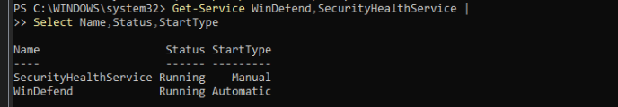

Maintaining these services in an operational state is important because disabling or stopping security components could significantly reduce endpoint protection.

### Defender Security Signatures

The Defender security intelligence configuration was reviewed to confirm that the endpoint had current malware protection signatures available.

### Evidence

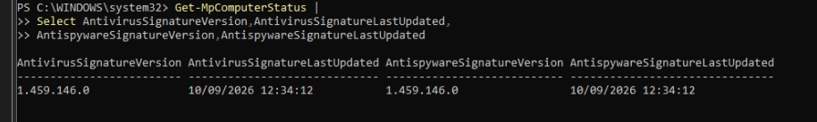

The result was considered acceptable for the assessment.

Keeping security intelligence up to date is an important part of maintaining effective malware detection, although signature status alone does not provide complete protection against modern threats.

### Windows 11 Patch Status

The operating system patch status of `WIN11-CLIENT01` was reviewed as part of the vulnerability and endpoint security assessment.

The purpose was to identify whether the system presented an obvious patching gap that would require immediate attention.

### Evidence

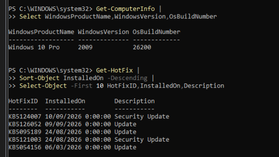

No critical patching issue requiring immediate remediation was identified during this review.

The system should continue to receive regular security updates as part of normal maintenance.

### Microsoft Defender — DC01

Microsoft Defender was also reviewed on the domain controller to verify that server-side endpoint protection remained operational.

### Evidence

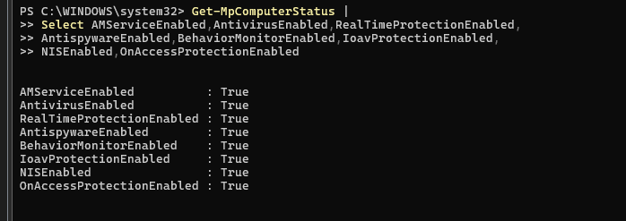

The Defender protection status on `DC01` was considered **Compliant** for the current laboratory environment.

Because `DC01` provides Active Directory and DNS services, maintaining its security controls is particularly important. A compromise of the domain controller could affect the entire laboratory domain.

### Defender Security Intelligence — DC01

The security intelligence status on `DC01` was reviewed to verify that the server had current Defender protection data available.

### Evidence

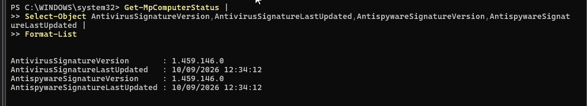

The result was considered acceptable for the current assessment.

### DC01 Patch Status

The operating system patch status of `DC01` was also reviewed.

The assessment focused on identifying any obvious update or patching condition that could represent an immediate security concern.

### Evidence
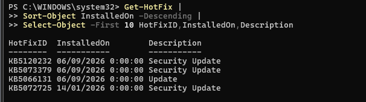

No critical patching issue requiring immediate remediation was identified during the assessment.

Regular Windows Server security updates should continue to be applied as part of normal maintenance.

### Critical Security Services

The main security-related services running on the Windows systems were reviewed as part of the overall endpoint and server assessment.

The review included:

- Microsoft Defender
- Windows Defender Firewall
- Wazuh Agent
- Sysmon
- Windows security-related services

The presence of these controls provides multiple layers of protection and monitoring across the environment.

The combination of endpoint protection, host firewalling, system monitoring and centralized SIEM collection provides a stronger security posture than relying on a single security control.

### Endpoint & Server Security Assessment

Overall, the endpoint and server security posture was considered **Good / Controlled**.

Microsoft Defender was operational on both Windows systems, the associated security services were running, security intelligence was available, and the reviewed patch status did not reveal a critical issue requiring immediate remediation.

The environment also benefits from Sysmon and Wazuh, providing additional visibility beyond the native Windows security controls.

No critical endpoint or server security issue was identified during this stage of the assessment.

As with the other areas reviewed in LAB 14, any future hardening or maintenance improvements can be addressed during a separate remediation and validation phase.

## PowerShell Security Assessment

PowerShell was reviewed as part of the Windows security assessment because it is a powerful administrative tool that can also be abused by attackers after gaining access to a system.

The objective of this review was to determine the current PowerShell execution policy and assess whether the configuration was appropriate for the laboratory environment.

### PowerShell Execution Policy

The PowerShell execution policy on `DC01` was reviewed to determine which script execution restrictions were currently applied.

The configuration was checked using the standard PowerShell security configuration commands.

### Evidence

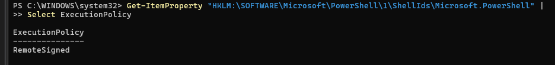

The execution policy was considered acceptable for the current laboratory environment.

Execution Policy should not be considered a complete security boundary by itself. It can help reduce accidental execution of untrusted scripts, but it does not provide sufficient protection against a determined attacker.

For this reason, PowerShell security should be considered together with other controls such as endpoint protection, logging, Sysmon, Windows security auditing and centralized monitoring through Wazuh.

### PowerShell Security Assessment

Overall, the PowerShell configuration was considered **Good / Controlled** for the current laboratory environment.

No critical PowerShell security issue requiring immediate remediation was identified during the assessment.

Future hardening could include more advanced PowerShell logging and monitoring, such as Script Block Logging and additional centralized detection rules, depending on the requirements of the environment.

These improvements can be evaluated during a future remediation and validation phase.

## SIEM & Detection Assessment

The SIEM and detection assessment focused on validating whether security events generated on the Windows endpoint were successfully collected, processed and detected by the centralized Wazuh monitoring platform.

The objective was to verify the complete detection chain rather than simply confirming that the Wazuh agent and manager services were running.

The validation followed this process:

```text
Windows Security Event
        ↓
Wazuh Agent
        ↓
Wazuh Manager
        ↓
Detection Rule
        ↓
Wazuh Alert
```

### Wazuh Infrastructure Validation

The Wazuh infrastructure was first checked to confirm that the Wazuh Manager was operational and that WIN11-CLIENT01 was connected as an active agent.

The Wazuh Manager service was running on WAZUH-SERVER, while the Windows endpoint was registered as agent 001.

This provided the required baseline before performing the detection test.

### Controlled Authentication Failure

A controlled failed authentication was generated on WIN11-CLIENT01 using an invalid password for an existing domain account.

The purpose of the test was to generate a genuine Windows Security authentication failure without affecting the availability or configuration of the system.

Windows generated Security Event ID 4625, which represents a failed account logon.

### Evidence
**Public evidence note:** The original screenshot was intentionally omitted from the public repository because it may contain internal laboratory network information, account identifiers, or sensitive security configuration details. The validation was performed as documented, but the screenshot is not included in the public version.
The event contained the expected authentication failure information, including:

Event ID: 4625
Target account: carlos
Target domain: LAB
Workstation: WIN11-CLIENT01
Logon Type: 2
Status: 0xC000006D
Substatus: 0xC0000064

This confirmed that the Windows endpoint generated the expected security telemetry.

### Wazuh Detection

The Windows Security event was subsequently collected by the Wazuh agent and processed by the Wazuh Manager.

Wazuh identified the event using rule 60122, with the description:

Logon Failure - Unknown user or bad password

The alert was classified as Level 5 and associated with the Windows authentication failure event.

### Evidence

**Public evidence note:** The original screenshot was intentionally omitted from the public repository because it may contain internal laboratory network information, account identifiers, or sensitive security configuration details. The validation was performed as documented, but the screenshot is not included in the public version.
The Wazuh alert contained the expected endpoint and event information, including agent 001, WIN11-CLIENT01, Event ID 4625 and the affected account.

### Detection Correlation

The most important result of this test was the successful correlation between the original Windows event and the centralized Wazuh detection.

The complete chain was successfully validated:

Invalid Authentication Attempt
            ↓
Windows Security Event ID 4625
            ↓
Wazuh Agent 001
            ↓
Wazuh Manager
            ↓
Rule 60122 — Level 5
            ↓
Wazuh Security Alert

This demonstrates that the lab is capable of collecting endpoint authentication telemetry and turning it into a centrally visible security detection.

The test therefore validated both event collection and security detection, rather than only the availability of the SIEM platform.

### SIEM & Detection Assessment

Overall, the SIEM and detection capabilities were considered Good / Controlled.

The Wazuh Manager and agent were operational, Windows Security events were successfully collected, and a controlled authentication failure was correctly detected by Wazuh.

This provides a functional foundation for further security monitoring and detection engineering.

Future improvements could include additional correlation rules, monitoring for repeated authentication failures, privilege escalation indicators, suspicious PowerShell activity and other endpoint security events.

No critical SIEM or detection issue was identified during this assessment.

## Vulnerability & Risk Assessment

The vulnerability and risk assessment was performed to identify exposed services, security weaknesses and remaining hardening opportunities within the Windows environment.

The assessment combined network discovery, Windows configuration checks, service enumeration and security control validation.

The objective was not to identify as many findings as possible, but to distinguish between genuine security issues, legitimate services and configuration improvements that could reduce the overall attack surface.

### Network Service Exposure

A network scan was performed against `WIN11-CLIENT01` to identify listening TCP services.

The scan identified three open ports:

| Port | Service | Assessment |
|---|---|---|
| `135/tcp` | Microsoft RPC | Legitimate Windows functionality |
| `139/tcp` | NetBIOS Session Service | Legacy Windows networking |
| `445/tcp` | Microsoft SMB | Legitimate Windows file-sharing functionality |

The presence of these ports was not considered a vulnerability by itself. They are associated with legitimate Windows functionality and are protected by the host firewall and the existing network configuration.

**Finding: VR-01 — RPC/SMB Exposure**

**Risk:** Medium  
**Status:** Accepted Risk / Hardening Opportunity

RPC and SMB services increase the network attack surface of the Windows endpoint. However, these services are required by parts of the current laboratory architecture.

The main recommendation is to restrict access to these services to trusted hosts and networks where possible. In a production environment, network segmentation and firewall rules should be used to limit unnecessary exposure.

### SMBv1

SMBv1 was reviewed because legacy SMB protocols can introduce significant security risks.

The assessment confirmed that SMBv1 was disabled on the Windows endpoint.

**Finding: VR-02 — SMBv1**

**Risk:** Low  
**Status:** Compliant

No remediation was required.

Keeping SMBv1 disabled is considered an important baseline security control because it removes an obsolete SMB protocol from the environment.

### SMB Signing

SMB signing configuration was reviewed to determine whether SMB communication integrity protections were enabled.

The assessment confirmed that SMB signing was required.

**Finding: VR-03 — SMB Signing**

**Risk:** Low  
**Status:** Compliant

The configuration was considered acceptable for the current laboratory environment.

Requiring SMB signing helps protect the integrity of SMB communication and reduces the risk associated with certain network-based attacks against SMB traffic.

### SMB Encryption

SMB encryption configuration was also reviewed.

The environment was configured to reject unencrypted SMB access, but SMB encryption was not globally enabled.

**Finding: VR-04 — SMB Encryption**

**Risk:** Medium  
**Status:** Hardening Opportunity

The current configuration provides a degree of protection by rejecting unencrypted access, but enabling SMB encryption can provide additional confidentiality for sensitive SMB traffic.

The recommended approach is to evaluate whether SMB encryption should be enabled for sensitive file-sharing traffic, taking compatibility and performance requirements into account.

No immediate remediation was performed during this assessment.

### Remote Access Services

Windows services were reviewed to identify potentially unnecessary remote access or remote management services.

The assessment did not identify active services corresponding to commonly used remote access mechanisms such as:

- Remote Desktop Services
- WinRM
- SSH
- SSHD

**Finding: VR-05 — Remote Access Services**

**Risk:** Low  
**Status:** No Immediate Issue Identified

No unnecessary remote access service requiring immediate remediation was identified.

Remote management services should nevertheless be enabled only when required and restricted to trusted administrative sources.

### Endpoint Protection Controls

The main endpoint protection controls were reviewed as part of the overall risk assessment.

The environment had the following security controls active:

- Microsoft Defender
- Windows Defender Firewall
- Sysmon
- Wazuh Agent
- Wazuh Manager

**Finding: VR-06 — Endpoint Protection**

**Risk:** Low  
**Status:** Positive Security Control

The combination of endpoint protection, host firewalling, system monitoring and centralized SIEM collection provides multiple layers of security visibility and protection.

No critical weakness was identified in these controls during the assessment.

### Risk Summary

The main findings identified during the assessment can be summarized as follows:

| ID | Finding | Risk | Status |
|---|---|---|---|
| VR-01 | RPC/SMB Exposure | Medium | Accepted Risk / Hardening Opportunity |
| VR-02 | SMBv1 Disabled | Low | Compliant |
| VR-03 | SMB Signing Required | Low | Compliant |
| VR-04 | SMB Encryption Not Globally Enabled | Medium | Hardening Opportunity |
| VR-05 | Remote Access Services | Low | No Immediate Issue |
| VR-06 | Endpoint Protection Controls | Low | Positive Security Control |

### Vulnerability & Risk Assessment Conclusion

The assessment did not identify a critical exploitable vulnerability within the scope of the laboratory.

The main residual risks are associated with legitimate Windows networking services and SMB encryption configuration.

These findings should be viewed in the context of the laboratory architecture. The presence of RPC and SMB does not automatically represent a vulnerability when the services are required and appropriately protected.

The identified medium-risk findings therefore represent areas for future hardening rather than immediate security incidents.

A future remediation phase can address these findings and repeat the assessment to validate whether the residual risk has been reduced.

## Evidence Summary

The following evidence was collected during the assessment to support the security findings and conclusions documented in this lab.

| Area | Evidence | Purpose |
|---|---|---|
| Active Directory & DNS | `phase-14-WIN11-AD-DNS-Discovery-Validation.png` | Validate domain and DNS discovery from WIN11 |
| Active Directory & DNS | `phase-14-DC01-AD-DNS-Validation.png` | Validate AD/DNS configuration on DC01 |
| Identity & Access | `phase-14-AD-Password-Policy-Assessment.png` | Review domain password policy |
| Identity & Access | `phase-14-AD-Administrator-Privilege-Assessment.png` | Review privileged account configuration |
| Identity & Access | `phase-14-AD-Protected-Users-Assessment.png` | Review Protected Users configuration |
| Network Security | `phase-14-WIN11-Firewall-Profile-Assessment.png` | Validate Windows Firewall profile |
| Network Security | `phase-14-WIN11-NetBIOS-Configuration-Assessment.png` | Review NetBIOS configuration |
| Network Security | `phase-14-DC01-SMB-Security-Assessment.png` | Review SMB security controls |
| Network Security | `phase-14-WIN11-DC01-WinRM-LDAPS-Validation.png` | Validate remote management and secure directory communication |
| Endpoint Security | `phase-14-WIN11-Defender-Security-Status.png` | Validate Microsoft Defender on WIN11 |
| Endpoint Security | `phase-14-DC01-Defender-Security-Status.png` | Validate Microsoft Defender on DC01 |
| Endpoint Security | `phase-14-WIN11-OS-Patch-Assessment.png` | Review WIN11 patch status |
| Endpoint Security | `phase-14-DC01-OS-Patch-Assessment.png` | Review DC01 patch status |
| PowerShell Security | `phase-14-DC01-PowerShell-Execution-Policy.png` | Review PowerShell execution policy |
| SIEM & Detection | `phase-14-WIN11-Failed-Logon-4625.png` | Demonstrate controlled authentication failure |
| SIEM & Detection | `phase-14-Wazuh-Detection-Rule-4625-60122.png` | Demonstrate Wazuh detection of Event ID 4625 |

The evidence was selected to provide representative proof of the security controls and findings assessed during LAB 14.

Not every command or configuration check required a separate screenshot. Evidence was collected selectively to demonstrate the most relevant security controls, assessment results and detection workflow.

## Overall Security Assessment

The overall security assessment was based on the results obtained across the different areas reviewed during LAB 14.

The objective was to determine the current security posture of the laboratory environment and identify the main residual risks that remain after the security controls implemented throughout the previous phases.

### Overall Security Rating

**Overall Security Posture: GOOD / CONTROLLED**

**Residual Risk: MODERATE**

The environment was considered to have a good and controlled security posture for the scope and purpose of the Home Lab.

The assessment did not identify a critical exploitable vulnerability requiring immediate remediation.

### Security Strengths

Several security controls were found to be operational and providing effective protection or visibility across the environment:

- Windows Defender was active on both Windows systems.
- Windows Defender Firewall was enabled.
- Sysmon was providing additional system visibility.
- Wazuh Agent and Wazuh Manager were operational.
- Windows Security events were successfully collected by Wazuh.
- A controlled authentication failure was successfully detected by Wazuh.
- SMBv1 was disabled.
- SMB signing was required.
- `WIN11-CLIENT01` was operating under the `DomainAuthenticated` network profile.
- Active Directory and DNS functionality were operational.
- No unnecessary remote access service requiring immediate remediation was identified.

Together, these controls provide multiple layers of endpoint protection, network security, monitoring and centralized detection.

### Residual Risks

Although the overall security posture was considered good, some residual risks and hardening opportunities remain.

The main areas identified were:

**RPC / SMB Exposure**

TCP ports `135`, `139` and `445` were exposed on `WIN11-CLIENT01`.

These services are associated with legitimate Windows functionality and are required by parts of the current laboratory architecture. However, they increase the attack surface and should be appropriately restricted in a production environment.

**SMB Encryption**

SMB encryption was not globally enabled, although unencrypted SMB access was rejected.

Enabling SMB encryption for sensitive file-sharing traffic could provide additional confidentiality and should be evaluated according to operational and compatibility requirements.

### Assessment Conclusion

LAB 14 successfully demonstrated the implementation and validation of multiple security controls across the Windows laboratory environment.

Endpoint protection, firewall controls, SMB hardening, system monitoring, PowerShell configuration and SIEM integration were assessed as part of the security review.

The controlled failed authentication test was particularly important because it demonstrated the complete detection workflow from the original Windows Security Event ID `4625` through the Wazuh agent and manager to the corresponding detection rule.

No critical exploitable vulnerability was identified during the assessment.

The remaining risks are primarily associated with legitimate RPC/SMB exposure and SMB encryption configuration. These findings represent defined hardening opportunities rather than immediate security incidents.

Overall, the environment presents a **Good / Controlled security posture with Moderate residual risk**.

The identified hardening opportunities can be addressed during a future remediation phase and subsequently re-tested to validate the effectiveness of the changes.

## Portfolio Preparation

LAB 14 was designed not only as a practical security exercise, but also as a documented security assessment that can be presented as part of a cybersecurity portfolio.

The documentation focuses on demonstrating the reasoning behind the assessment, the evidence collected, the findings identified and the validation of the security controls.

The most relevant portfolio outcomes from this lab are:

- Security assessment of a Windows and Active Directory environment.
- Review of identity and access security controls.
- Assessment of Windows Firewall and network exposure.
- Review of SMB security configuration.
- Validation of Microsoft Defender and system security services.
- PowerShell security configuration assessment.
- Integration of Windows endpoint telemetry with Wazuh.
- Generation of a controlled authentication failure.
- Detection and correlation of Windows Event ID `4625`.
- Identification and classification of residual security risks.
- Documentation of hardening recommendations without unnecessarily modifying the assessed environment.

The assessment demonstrates a practical security workflow:

```text
Assess
  ↓
Collect Evidence
  ↓
Identify Findings
  ↓
Evaluate Risk
  ↓
Document Recommendations
  ↓
Remediate
  ↓
Re-test
```

The current lab represents the assessment stage of this workflow. The identified hardening opportunities can be implemented and validated separately during a future iteration of the environment.

This separation makes the project more representative of a real security assessment, where findings are documented before remediation and changes are subsequently validated.

## Portfolio Evidence

The most relevant evidence from this lab includes:

Active Directory and DNS validation
Password and privileged account assessment
Windows Firewall and network configuration
SMB security validation
Microsoft Defender status
PowerShell security configuration
Controlled Windows authentication failure
Wazuh detection and correlation

All screenshots and supporting documentation are organized within the LAB 14 project structure to make the assessment reproducible and easy to review.

## Conclusion

LAB 14 provided a complete security assessment of the Windows laboratory environment developed throughout the previous phases of the project.

The assessment covered identity and access security, network exposure, Windows endpoint and server protection, PowerShell configuration, SMB security, system services, vulnerability and risk assessment, and centralized security monitoring through Wazuh.

One of the most important outcomes of the lab was the validation of the complete security detection workflow.

A controlled authentication failure was generated on `WIN11-CLIENT01`, producing Windows Security Event ID `4625`. The event was successfully collected by the Wazuh Agent, processed by the Wazuh Manager and identified by detection rule `60122`.

This demonstrated that the monitoring infrastructure was not only installed and operational, but capable of detecting a real security event generated within the environment.

The assessment also identified residual risks and hardening opportunities, particularly around RPC/SMB exposure and SMB encryption configuration. These findings were documented without making unnecessary changes to the assessed environment.

Overall, the laboratory achieved a **Good / Controlled security posture with Moderate residual risk**.

The next logical step is to address the identified hardening opportunities during a separate remediation phase and then repeat the relevant tests to validate the effectiveness of the changes.

This completes LAB 14 — Windows Security & Hardening.

⬆️ [Back to Roadmap](#lab-roadmap)

